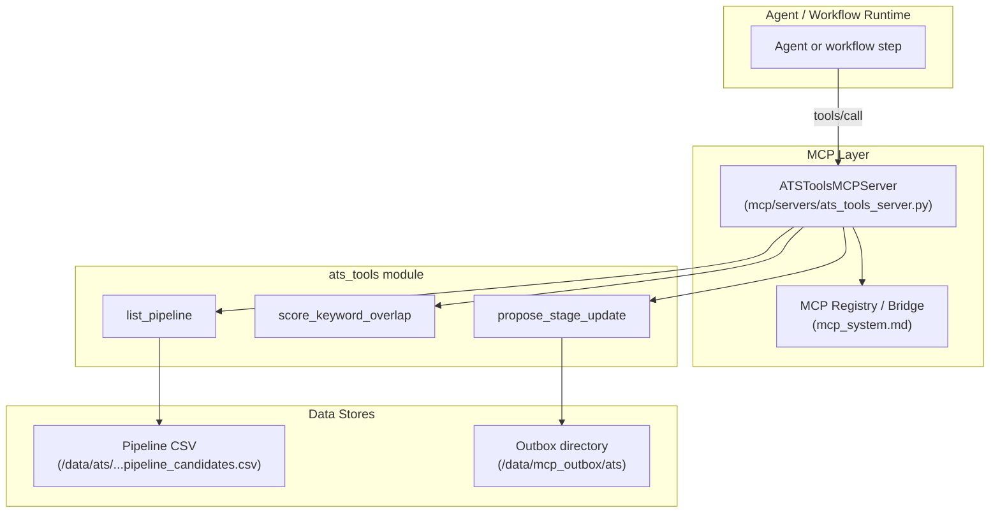
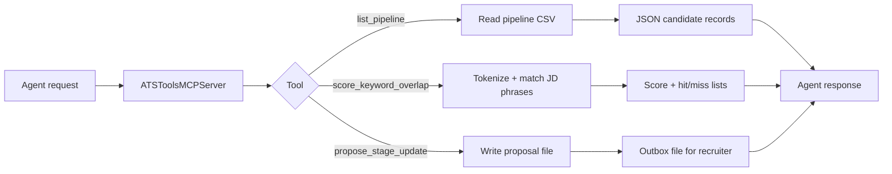
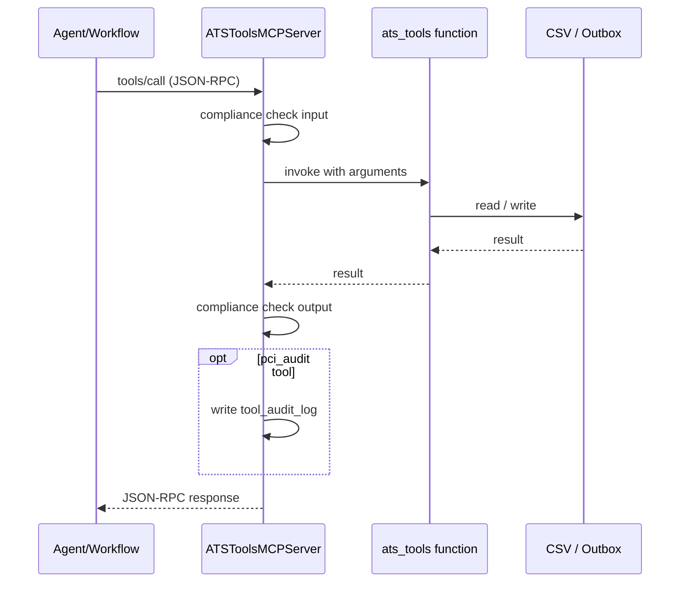

# ats_tools

## Overview

`ats_tools` is a small, deterministic toolset that exposes Applicant Tracking System (ATS) operations to the NPCI Agentic Platform. It lives under [`shared_integrations`](shared_integrations.md) and provides read-only pipeline inspection, reproducible resume-to-JD keyword scoring, and a safe, human-in-the-loop stage-change proposal mechanism.

The tools are intentionally narrow: they give agents quantitative signals and a controlled write path, while the nuanced fit narrative and final decisions remain the agent's responsibility. All three functions are wrapped by the [`ATSToolsMCPServer`](mcp_servers.md) and registered into the platform's [MCP system](mcp_system.md) so that agents, workflows, and chat interfaces can call them through the standard Model Context Protocol.

---

## Core Functionality

| Function | Purpose | Write semantics |
|----------|---------|-----------------|
| `list_pipeline` | List candidates from the configured requisition pipeline CSV, optionally filtered by stage. | Read-only |
| `score_keyword_overlap` | Compute a deterministic 0-100 keyword-coverage score of a resume against JD "must-have" and "nice-to-have" phrases. | Read-only |
| `propose_stage_update` | Write a proposed candidate stage change to an outbox file for recruiter confirmation. | Proposed / outbox only |

These functions support three documented use cases:

- **UC-62** — resume-to-JD matching (`score_keyword_overlap`)
- **UC-63** — interview scheduling (`list_pipeline` + `propose_stage_update`)
- **UC-64** — candidate follow-up sequences (`list_pipeline` + `propose_stage_update`)

---

## Architecture

### Component diagram



### Data flow



### Tool call sequence



---

## Tool Reference

### `list_pipeline(stage: str = "") -> List[dict]`

Reads the configured pipeline CSV and returns candidate records. When `stage` is provided, the result is filtered to candidates in that stage.

**Data source**
- File: `${ATS_TOOLS_DATA_DIR}/${ATS_TOOLS_PIPELINE_CSV}`
- Default: `/data/ats/uc64_candidate_followups/pipeline_candidates.csv`

**Returns**
A list of dictionaries, one per candidate row.

---

### `score_keyword_overlap(resume_text, jd_must_have, jd_nice_to_have) -> dict`

Scores a resume against a job description using deterministic keyword matching.

**Scoring formula**

```text
score = round(
    70 * (matched_must_have / total_must_have)
  + 30 * (matched_nice_to_have / total_nice_to_have)
)
```

A requirement phrase is considered matched if any word of four or more characters in the phrase appears in the lower-cased resume text. This is intentionally simple and reproducible; it is meant to complement, not replace, an agent's qualitative assessment.

**Returns**

```json
{
  "score": 87,
  "must_have_hits": ["python", "distributed systems"],
  "must_have_misses": ["kubernetes"],
  "nice_to_have_hits": ["fastapi"]
}
```

---

### `propose_stage_update(candidate_id, new_stage, rationale) -> dict`

Writes a proposed stage change to the configured outbox directory. The function does **not** modify the ATS directly; it creates a text file that a recruiter or downstream process can review and confirm.

**Output file**
- Path: `${ATS_TOOLS_OUTBOX_DIR}/proposed_{candidate_id}_{new_stage}.txt`
- Default base: `/data/mcp_outbox/ats`

**Returns**

```json
{
  "status": "proposal_created",
  "file": "/data/mcp_outbox/ats/proposed_C123_interview.txt"
}
```

This tool is marked with `pci_audit=True` in the MCP server, so every invocation is recorded in the platform's `tool_audit_log`.

---

## Configuration

| Environment variable | Default | Description |
|----------------------|---------|-------------|
| `ATS_TOOLS_DATA_DIR` | `/data/ats` | Root directory for pipeline data. |
| `ATS_TOOLS_PIPELINE_CSV` | `uc64_candidate_followups/pipeline_candidates.csv` | Relative path to the pipeline CSV. |
| `ATS_TOOLS_OUTBOX_DIR` | `/data/mcp_outbox/ats` | Directory where stage-change proposals are written. |

---

## Dependencies

- **pandas** — CSV loading and filtering.
- **Python standard library** — `os`, `re`, `typing`.
- **MCP server base** — [`BaseMCPServer`](mcp_servers.md) provides JSON-RPC dispatch, compliance gating, and audit logging.
- **MCP registry** — the server is registered through the platform's [MCP registry](mcp_system.md).

---

## How It Fits into the System

`ats_tools` is one of many integration toolsets under [`shared_integrations`](shared_integrations.md). It follows the same pattern as [`calendar_tools`](shared_integrations.md#calendar_tools), [`jira_tools`](shared_integrations.md#jira_tools), and [`task_tracker_tools`](shared_integrations.md#task_tracker_tools):

1. Pure Python functions live in `tools/ats_tools_tools.py`.
2. An MCP server class (`ATSToolsMCPServer`) exposes them with JSON schemas.
3. The server is registered in the central [MCP registry](mcp_system.md), making the tools available to agents, workflows, and chat runtimes.
4. Agents in [`agent_factory_pipeline`](agent_factory_pipeline.md) or [`agent_system`](shared_core.md#agent_system) can compose these tools into larger recruiting workflows.

Because `propose_stage_update` writes to an outbox rather than the ATS, the module respects the platform's human-in-the-loop governance model. For more on how compliance and audit gates are applied to MCP tool calls, see [`mcp_servers`](mcp_servers.md) and the platform guardrails in [`shared_core`](shared_core.md).

---

## Security & Compliance Notes

- `propose_stage_update` is the only tool with side effects, and it is restricted to outbox writes.
- The MCP server runs input and output through the shared compliance gate before returning results.
- `propose_stage_update` is audited to `tool_audit_log` because it is flagged with `pci_audit=True`.
- No credentials or ATS API keys are required; the module operates on local CSV and outbox files.

---

## Related Modules

- [`shared_integrations`](shared_integrations.md) — parent module containing all tool integrations.
- [`mcp_servers`](mcp_servers.md) — MCP server implementations, including `ATSToolsMCPServer`.
- [`mcp_system`](mcp_system.md) — MCP registry, bridge, and client infrastructure.
- [`agent_factory_pipeline`](agent_factory_pipeline.md) — agent assembly that may bind these tools.
- [`shared_core`](shared_core.md) — compliance, audit, and guardrail primitives used by the MCP server base.
