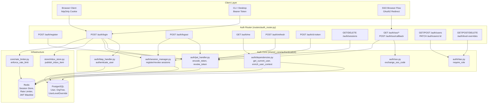
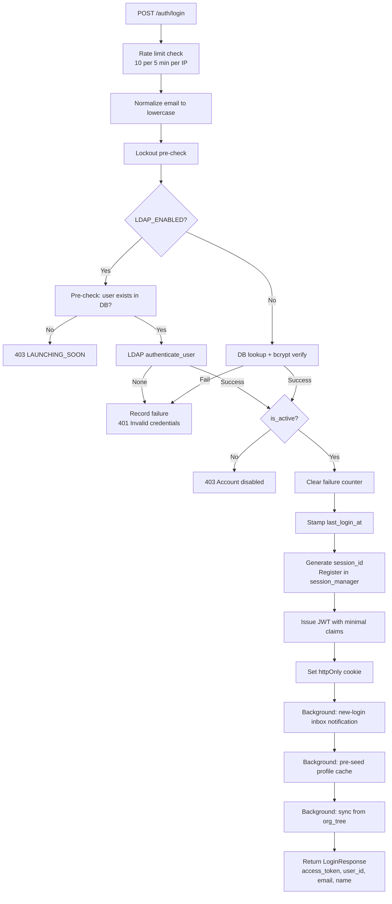
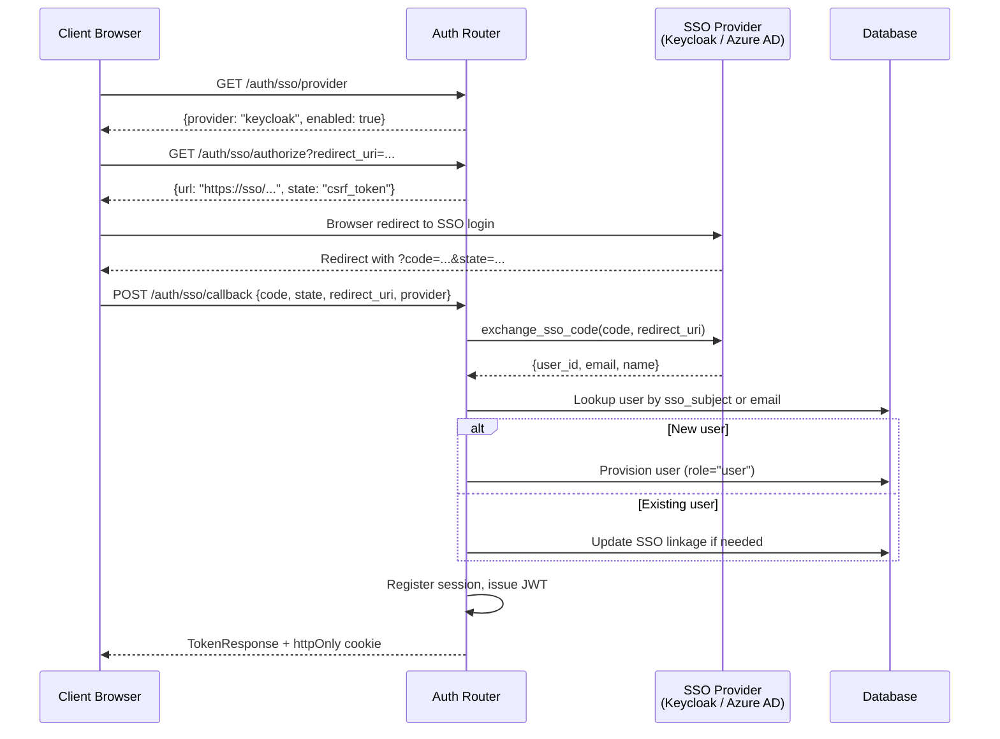
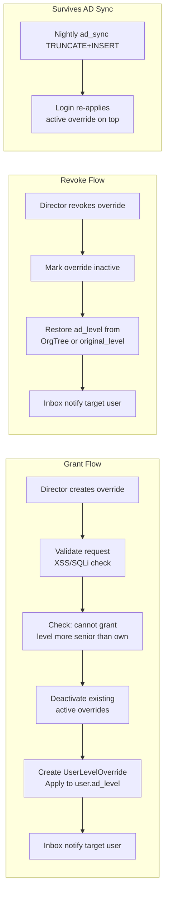
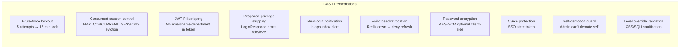

# Auth Router Module

## Overview

The **Auth Router** (`routers/auth_router.py`) is the central authentication and authorization gateway for the platform. It exposes a FastAPI `APIRouter` mounted at the `/auth` prefix and handles the full lifecycle of user identity: registration, login (local + LDAP + SSO), JWT issuance and refresh, session management, user administration, and temporary access-level overrides.

The module is designed with a **defense-in-depth** security posture, implementing multiple DAST (Dynamic Application Security Testing) remediations including brute-force lockout, concurrent session control, JWT PII stripping, response-body privilege-escalation prevention, and new-login notifications.

---

## Architecture

### Module Boundaries

The auth router is a **thin orchestration layer** — it delegates all cryptographic, persistence, and session-tracking concerns to the [authentication](authentication.md) module in `shared_core`. The router itself contains no token-signing logic, no Redis client management, and no LDAP protocol handling; it wires these dependencies together per-request.

---

## Core Components

### Request / Response Models

| Model | Purpose |
|---|---|
| `RegisterRequest` | Registration payload (email, password, name, role, org_id) |
| `LoginRequest` | Login payload (email, password) |
| `TokenResponse` | Full token response with privilege claims — used by register & SSO callback |
| `LoginResponse` | **Privilege-stripped** login response — intentionally omits `role`, `ad_level`, `can_approve` to prevent client-side privilege escalation via response manipulation |
| `RefreshRequest` | Token refresh payload (optional `refresh_token` body field) |
| `SSOCallbackRequest` | OAuth2 callback payload (code, state, redirect_uri, provider) |
| `CreateUserRequest` | Admin user-creation payload |
| `UpdateUserRequest` | Admin user-update payload (role, is_active) |
| `LevelOverrideCreate` | Temporary access-level override grant (user_id, ad_level_override, reason, expires_at) |

### Authentication Endpoints

#### `register` — `POST /auth/register`

Creates a new user account with bcrypt-hashed password, issues a JWT, and sets the httpOnly auth cookie. Pre-seeds the Redis profile cache via `enrich_user_context()` so the first authenticated request after registration is a cache hit.

- **Rate limited**: 5 registrations per 10 minutes per IP (`AUTH_REGISTER`)
- **Email normalization**: always lowercased before storage
- **DAST fix**: PII (email, name) is accepted by `encode_token` for backward compatibility but silently ignored — not embedded in the JWT
- **DAST fix — unrestricted admin self-registration**: `role` is always forced to `user` — any other value (`admin`, or anything else) is rejected with 400 before touching the DB. Self-registration can never create an admin account; admin accounts are provisioned only via the seed script (`scripts/seed.py`) or by an existing admin through `POST /auth/users`. Self-registration as a whole remains gated by `ENABLE_SELF_REGISTRATION`.

#### `login` — `POST /auth/login`

The primary authentication endpoint supporting two credential paths:

**Security features**:
- **Brute-force lockout**: After `_MAX_FAILED_ATTEMPTS` (default 5) failed logins, the account is locked for `_LOCKOUT_SECONDS` (default 900s / 15 min). Uses Redis as primary store with DB-column fallback.
- **Concurrent session control**: Each login generates a `session_id` embedded in the JWT (`sid` claim) and registered in the session registry. The session manager enforces `MAX_CONCURRENT_SESSIONS` by evicting the oldest session.
- **New-login notification**: A background thread publishes an in-app inbox item (`security_alert` type) with IP, device hint, and timestamp.
- **Privilege-stripped response**: `LoginResponse` intentionally excludes `role`, `ad_level`, and `can_approve` — these are only obtainable from the server-authoritative `GET /auth/me` endpoint (derived from the validated JWT).

#### `logout` — `POST /auth/logout`

Revokes the current JWT (adds `jti` to Redis blacklist) and clears the httpOnly cookie. Also removes the session from the session registry to free the concurrent-session slot. Supports both cookie-based and Bearer-header token extraction.

#### `get_me` — `GET /auth/me`

Returns the authenticated user's full profile, including:
- Core identity (id, email, name, role, org_id)
- ABAC claims (ad_level, department, can_approve)
- HOD status (is_hod, hod_departments) — from enriched JWT payload
- Reporting-manager flag — queried from `hierarchy_service.has_direct_reports()`

This is the **only** endpoint that returns privilege fields in the response body. All privilege data is derived from the validated JWT + DB lookup, never from client-supplied values.

#### `refresh_token` — `POST /auth/refresh`

Issues a fresh JWT with a new expiry while preserving all existing claims. Key behaviors:

- Accepts token via `Authorization: Bearer` header or `refresh_token` body field
- Allows refresh within a **1-hour grace window** past JWT expiry
- **Fail-closed revocation check**: if Redis (KV store) is unavailable, the refresh is denied (HTTP 503) rather than allowing potentially revoked tokens to be refreshed
- Reuses the caller's existing `session_id` so the refreshed token continues to pass `is_session_active()` — only the `jti` rotates
- Old token is revoked after the new one is issued (replay prevention)
- **Rate limited**: 30 refresh calls per minute per IP (`AUTH_REFRESH`)

#### `cli_token` — `POST /auth/cli-token`

Mints a fresh JWT for the local CLI / Cowork desktop agent from the caller's existing authenticated session. This enables the desktop app to reuse the web-app login (httpOnly cookie) without forcing a second sign-in. Reuses the caller's registered `session_id` so the minted token passes session validation.

---

### Session Management Endpoints

These endpoints implement the DAST fix for **concurrent session control** — users can monitor and terminate active sessions across devices.

| Endpoint | Method | Function | Description |
|---|---|---|---|
| `/auth/sessions` | GET | `list_sessions` | List all active sessions with IP, device, timestamp, and `is_current` flag |
| `/auth/sessions` | DELETE | `revoke_other_sessions` | Revoke all sessions except the current one ("sign out everywhere else") |
| `/auth/sessions/{session_id}` | DELETE | `revoke_specific_session` | Revoke a specific session by ID (fine-grained termination) |

> **Note**: The [session_router](session_router.md) module exposes duplicate session endpoints at a different mount path. Both delegate to `auth.session_manager` for the underlying operations.

---

### SSO Endpoints

| Endpoint | Method | Function | Description |
|---|---|---|---|
| `/auth/sso/provider` | GET | `sso_provider_info` | Returns configured SSO provider name and enabled status |
| `/auth/sso/authorize` | GET | `sso_authorize` | Generates OAuth2 authorization URL with CSRF state token |
| `/auth/sso/callback` | POST | `sso_callback` | Exchanges authorization code for platform JWT |

The SSO callback supports **Keycloak** and **Azure AD** providers via `auth.sso.exchange_sso_code()`. New SSO users are auto-provisioned with `role="user"`.

---

### User Management Endpoints

| Endpoint | Method | Function | Auth Required | Description |
|---|---|---|---|---|
| `/auth/users` | GET | `list_users` | admin, security, or ad_level ≤ 2 | Paginated user list with search |
| `/auth/users` | POST | `create_user` | admin | Create user with specified role |
| `/auth/users/{user_id}` | PATCH | `update_user` | admin | Update role or active status |

**Valid roles**: `viewer`, `developer`, `operator`, `security`, `admin`

**Self-demotion guard**: An admin cannot demote their own account (prevents accidental lockout).

---

### Level Override Endpoints

Temporary access-level elevation system allowing directors (ad_level ≤ 2) to grant time-limited privilege promotions to other users.

| Endpoint | Method | Function | Description |
|---|---|---|---|
| `/auth/level-overrides` | GET | `list_level_overrides` | List all active overrides with grantor/target details |
| `/auth/level-overrides/user/{target_user_id}` | GET | `get_user_override_history` | Full override history for a user (including revoked) |
| `/auth/level-overrides` | POST | `create_level_override` | Grant a temporary level override |
| `/auth/level-overrides/{override_id}` | DELETE | `revoke_level_override` | Revoke an override and restore original AD level |

**Authorization**: `_require_director` dependency — requires `ad_level ≤ 2` or `admin` role.

**Key constraints**:
- Granters cannot grant a level more senior (lower number) than their own
- `ad_level_override` must be in range 0–6
- Request validation via `core.security_validation.validate_level_override_request()` (XSS/SQLi protection)
- Overrides survive nightly AD sync — the login flow's `_sync_user_from_org_tree()` re-applies active overrides after the AD data refresh

---

## Internal Helpers

### `_decrypt_password(value)`
AES-GCM decrypts login passwords when `LOGIN_ENCRYPT_KEY` is set. Payload format: `base64(iv[12] || ciphertext)`. Falls back to plaintext if the key is absent or decryption fails.

### `_sync_user_from_org_tree(user_id, email)`
Background-thread helper that syncs `ad_level`, `department`, `ad_title`, and `manager_dn` from the `OrgTree` table on login. After the AD sync, it re-applies any active `UserLevelOverride` so nightly TRUNCATE+INSERT operations don't strip manually granted temporary promotions. Non-blocking — never fails login due to sync errors.

### `_parse_device_hint(user_agent)`
Extracts a human-readable device/browser label (e.g., "Chrome / Windows") from the User-Agent string for session metadata.

### `_notify_new_login(user_id, ip, device, user_agent)`
Fire-and-forget background thread that publishes a `security_alert` inbox item alerting the user about a new login. Includes timestamp, device, and IP address.

### `_set_auth_cookie(response, token)`
Attaches the JWT as an httpOnly, `SameSite=Lax` cookie with 24-hour max age. `Secure` flag is enabled only in production deployment mode.

### Brute-Force Protection Helpers
- `_redis_rate_limiter()` — Returns a Redis client on DB 6 for login rate-limiting
- `_check_and_record_failure(email, db, User)` — Increments failed-login counter (Redis primary, DB fallback); raises HTTP 429 when ceiling reached
- `_check_lockout(email, db, User)` — Pre-checks if account is currently locked before credential verification
- `_clear_failure_counter(email, db, User)` — Resets failure counter on successful authentication

---

## Security Design

### JWT Claims Architecture

The JWT carries **only authorization claims** — no PII:

| Claim | Purpose | PII? |
|---|---|---|
| `sub` | User ID | No |
| `role` | RBAC role | No |
| `org_id` | Organization ID | No |
| `is_security_team` | Security team flag | No |
| `ad_level` | ABAC access level (0-6) | No |
| `can_approve` | Derived from ad_level | No |
| `jti` | JWT ID (for revocation) | No |
| `sid` | Session ID (for session control) | No |
| `iat` / `exp` | Issued-at / expiry timestamps | No |

PII (email, name, department) is fetched on-demand via `enrich_user_context()` — a Redis-cached DB lookup triggered by `get_current_user()` on every authenticated request.

---

## Dependencies

### Internal Modules

| Dependency | Module Reference | Purpose |
|---|---|---|
| `auth.dependencies` | [authentication](authentication.md) | `get_current_user`, `enrich_user_context` |
| `auth.jwt_handler` | [authentication](authentication.md) | `encode_token`, `revoke_token`, `_SECRET_KEY`, `ALGORITHM`, `EXPIRE_HOURS` |
| `auth.rbac` | [authentication](authentication.md) | `require_role` dependency factory |
| `auth.session_manager` | [authentication](authentication.md) | `register_session`, `get_active_sessions`, `revoke_session`, `revoke_all_sessions` |
| `auth.ldap_handler` | [authentication](authentication.md) | `authenticate_user` (LDAP bind-validate) |
| `auth.sso` | [authentication](authentication.md) | `get_sso_provider`, `get_sso_login_url`, `exchange_sso_code` |
| `core.rate_limiter` | [core_infrastructure](../core/core_infrastructure.md) | `enforce_rate_limit`, rate-limit configs |
| `core.logger` | [core_infrastructure](../core/core_infrastructure.md) | Structured logging |
| `core.security_validation` | [core_infrastructure](../core/core_infrastructure.md) | `validate_level_override_request` |
| `core.config` | [core_infrastructure](../core/core_infrastructure.md) | `LDAP_ENABLED`, `redis_client`, `RDB_QUEUE` |
| `core.kv` | [kv_store](../storage/kv_store.md) | `get_kv` (Redis abstraction for JWT blacklist) |
| `db.database` | [database](../storage/database.md) | `SessionLocal` |
| `db.models` | [database](../storage/database.md) | `User`, `OrgTree`, `UserLevelOverride` |
| `store.inbox_store` | [store_layer](../storage/store_layer.md) | `publish_inbox_item` |
| `services.hierarchy_service` | [services](../workers/services.md) | `has_direct_reports` |

### External Libraries

| Library | Purpose |
|---|---|
| `fastapi` | APIRouter, HTTPException, Depends, Request, Response |
| `pydantic` | Request/response model validation |
| `passlib` | bcrypt password hashing |
| `cryptography` | AES-GCM password decryption |
| `jwt` (PyJWT) | JWT decode for session extraction |
| `redis` | Session store, rate limiter, JWT blacklist |

---

## Rate Limiting Configuration

| Endpoint | Config Key | Limit | Window |
|---|---|---|---|
| `POST /auth/register` | `AUTH_REGISTER` | 5 | 10 minutes |
| `POST /auth/login` | `AUTH_LOGIN` | 10 | 5 minutes |
| `POST /auth/refresh` | `AUTH_REFRESH` | 30 | 1 minute |
| `POST /auth/sso/callback` | `SSO_CALLBACK` | Configured in rate_limiter | — |

Rate limiting is enforced via `core.rate_limiter.enforce_rate_limit()` which uses Redis as the primary counter store with an in-memory fallback. Exceeding the limit raises HTTP 429 with `Retry-After` headers and emits a structured SIEM log event.

---

## Environment Variables

| Variable | Default | Purpose |
|---|---|---|
| `LOGIN_ENCRYPT_KEY` | _(empty)_ | Base64 AES-GCM key for client-side password encryption |
| `LOGIN_MAX_FAILED_ATTEMPTS` | `5` | Failed login attempts before account lockout |
| `LOGIN_LOCKOUT_SECONDS` | `900` | Lockout duration in seconds (15 min) |
| `MAX_CONCURRENT_SESSIONS` | `5` | Maximum active sessions per user |
| `DEPLOYMENT_MODE` | `local` | Set to `prod` to enable Secure cookie flag |
| `LDAP_ENABLED` | _(from config)_ | Enables LDAP/AD authentication path |
