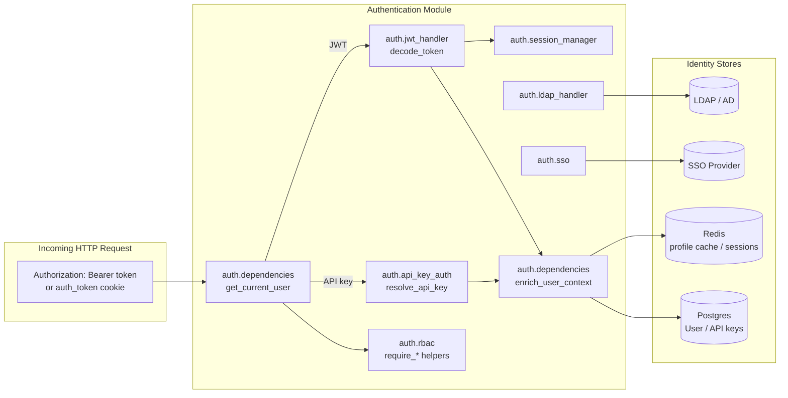
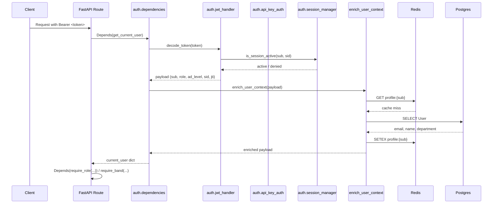
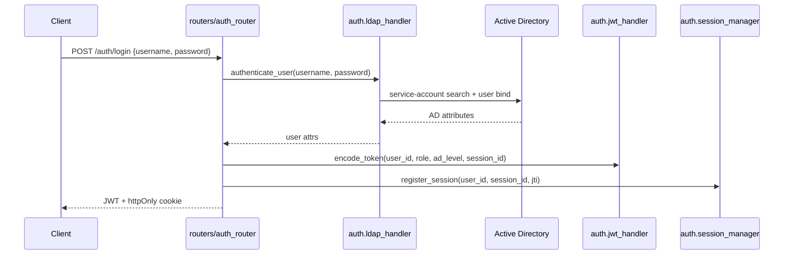
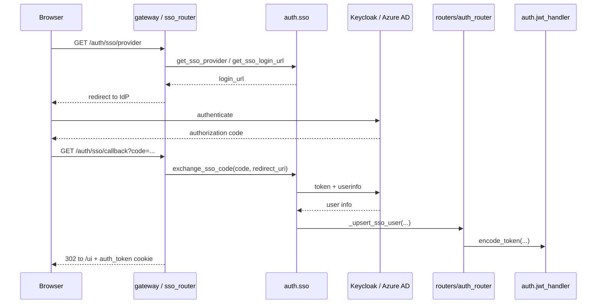

# Authentication Module

The **Authentication** module is the identity and access-control foundation of the platform. It is responsible for:

1. **Verifying who is calling the API** — extracting credentials from HTTP requests (JWT bearer tokens, API keys, or cookies) and turning them into a trusted, server-authoritative user context.
2. **Enforcing what callers are allowed to do** — providing role-based, band-based, seniority-level, product-membership, and Head-of-Department (HOD) access-control helpers.
3. **Integrating with enterprise identity providers** — supporting direct LDAP/Active Directory authentication and SSO via Keycloak or Azure AD, including Office add-in and desktop silent-relogin flows.

The module lives under `shared_core/authentication` and is consumed by FastAPI route handlers, gateway endpoints, factory pipelines, and background workers across the system.

---

## Architecture Overview

### Design Principles

- **Fail-closed security**: If a credential cannot be validated, the request is rejected. If revocation/session stores are unreachable, tokens are denied rather than accepted.
- **No PII in JWTs**: The JWT payload contains only authorization claims (`sub`, `role`, `ad_level`, `org_id`, `sid`, `jti`). Personally identifiable information (`email`, `name`, `department`) is fetched server-side and cached in Redis.
- **Concurrent session control**: Every JWT carries a session ID (`sid`) that is checked against a Redis-backed session registry on every request.
- **Pluggable identity sources**: Password/AD login, long-lived API keys for IDE integrations, and OIDC/OAuth2 SSO all resolve to the same in-memory user-context dict.

---

## Module Structure

The authentication module is split into four focused sub-modules:

| Sub-module | File | Responsibility |
|------------|------|----------------|
| [Authentication Dependencies](authentication_dependencies.md) | `auth/dependencies.py` | Request-level credential extraction, JWT/API-key resolution, profile enrichment, and admin gate. |
| [Authentication LDAP](authentication_ldap.md) | `auth/ldap_handler.py` | Direct Active Directory / LDAP bind authentication, attribute lookup, bulk sync, band resolution, and manager-chain walking. |
| [Authentication RBAC](authentication_rbac.md) | `auth/rbac.py` | Role hierarchy, permission checks, band/AD-level gates, product membership, HOD scope, and governance-approval helpers. |
| [Authentication SSO](authentication_sso.md) | `auth/sso.py` | Keycloak/Azure AD SSO discovery, OAuth2 callback, token validation, Office add-in OBO exchange, and desktop silent-relogin flows. |

---

## Core Data Flow

### Authenticated Request Flow

### Login Flow (Password / LDAP)

### SSO Login Flow

---

## Integration with the Rest of the System

The authentication module is a **cross-cutting dependency** used by nearly every other module. Key integration points:

- **FastAPI routes / Gateway**: Route handlers use `Depends(get_current_user)` and `Depends(require_role(...))` to identify and authorize callers. See the shared_api_routers auth_router for login, registration, token refresh, and session management endpoints.
- **API keys for IDE integrations**: The `auth.api_key_auth` resolver is invoked by `get_current_user` when the token is not a JWT, enabling tools such as Kilo Code and Cursor. See the API keys router for key lifecycle management.
- **User and session persistence**: The module reads from and writes to the `User`, `UserAPIKey`, and session tables in Postgres, and uses Redis for profile caching, session registries, and JWT revocation. See the database module for schema details.
- **Org-tree / band resolution**: LDAP title-to-band mapping and AD-level sync rely on `title_band_map` and `org_tree` data managed by the admin router.
- **Desktop and Office add-ins**: SSO flows mint long-lived API keys and store Entra OAuth tokens so the desktop app and Office add-in can call platform APIs and Microsoft 365 connectors. See the [desktop app](../cowork/desktop_app.md) and [office add-in](../documents/office_addin.md) modules.

---

## Security Highlights

| Concern | Mitigation |
|---------|------------|
| JWT tampering | Tokens are signed with `HS256`; the algorithm list is pinned. |
| Token replay after logout | Every JWT has a unique `jti` checked against a Redis revocation blacklist. |
| Stolen JWT reuse | Every JWT has a `sid` validated against the session registry; revoked/evicted sessions are denied. |
| PII leakage | `email`, `name`, and `department` are **not** embedded in the JWT; they are fetched server-side and Redis-cached. |
| LDAP connection staleness | Cached service connections are reused; `ECONNRESET`/`EPIPE` triggers a single transparent reconnect. |
| Fail-open auth | Redis/Postgres failures during credential validation or revocation checks result in denial, not access. |
| Privilege escalation | RBAC/ABAC helpers are fail-closed; admin and governance-approval gates are explicit. |

---

## When to Extend This Module

- Add a new identity provider → extend `auth.sso` and register routes in `sso_router`.
- Add a new permission or role → update `auth.rbac` `ROLES` / `PERMISSIONS` maps.
- Change how profile data is enriched → update `auth.dependencies.enrich_user_context`.
- Add a new credential type (e.g., mTLS, service-account tokens) → extend `auth.dependencies.get_current_user` and add a matching resolver.
- Tune session concurrency or TTL → update `auth.session_manager` and `auth.jwt_handler` expiry settings.

For detailed component descriptions, data models, and per-file flow diagrams, see the sub-module documentation:

- [Authentication Dependencies](authentication_dependencies.md)
- [Authentication LDAP](authentication_ldap.md)
- [Authentication RBAC](authentication_rbac.md)
- [Authentication SSO](authentication_sso.md)
