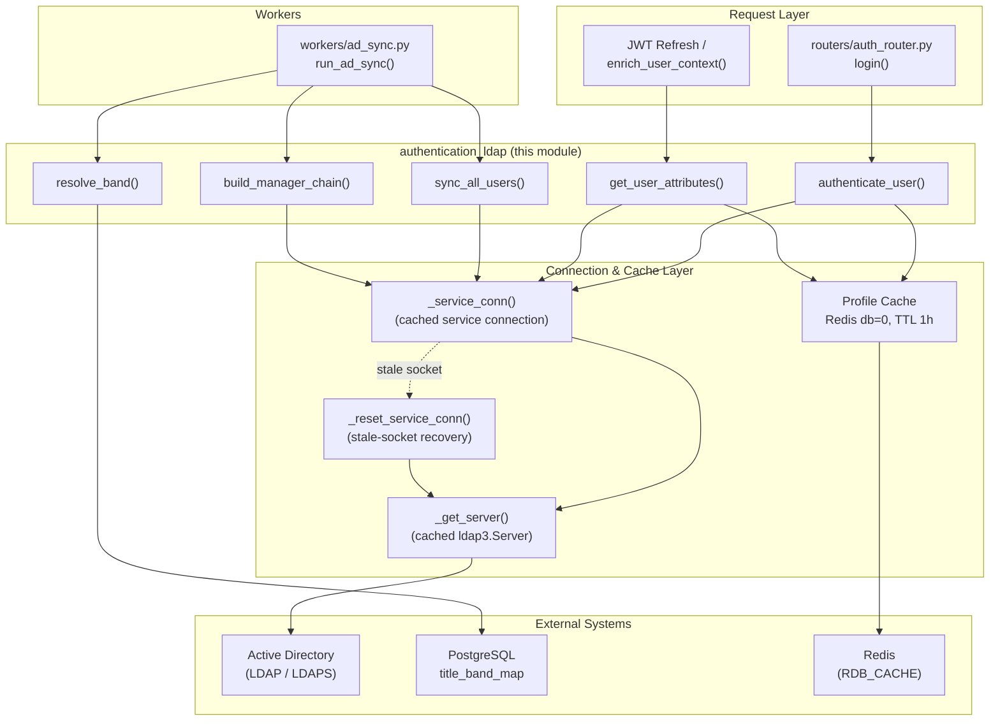
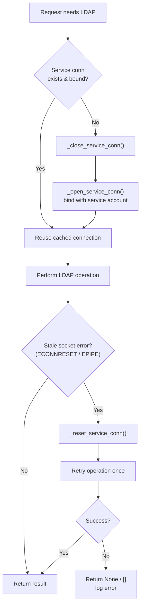
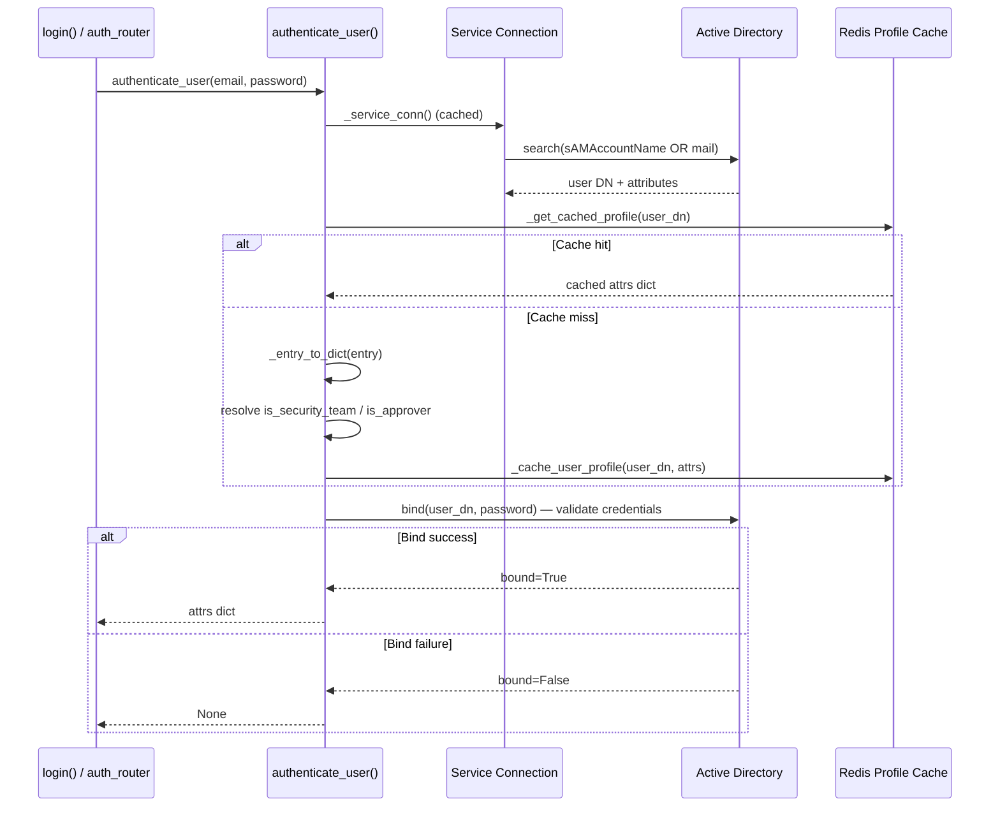
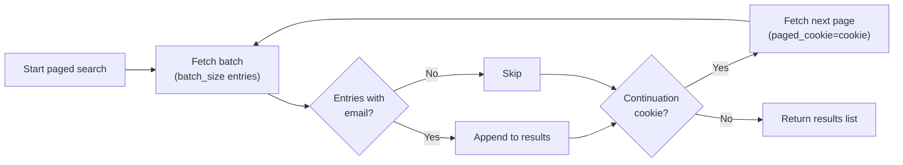
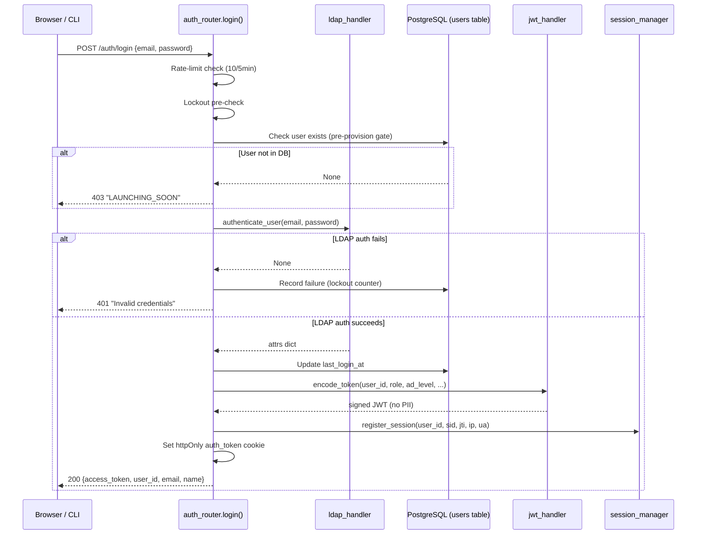
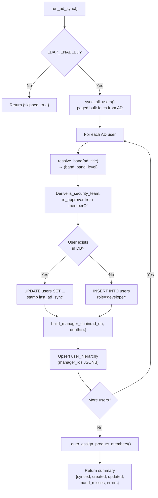
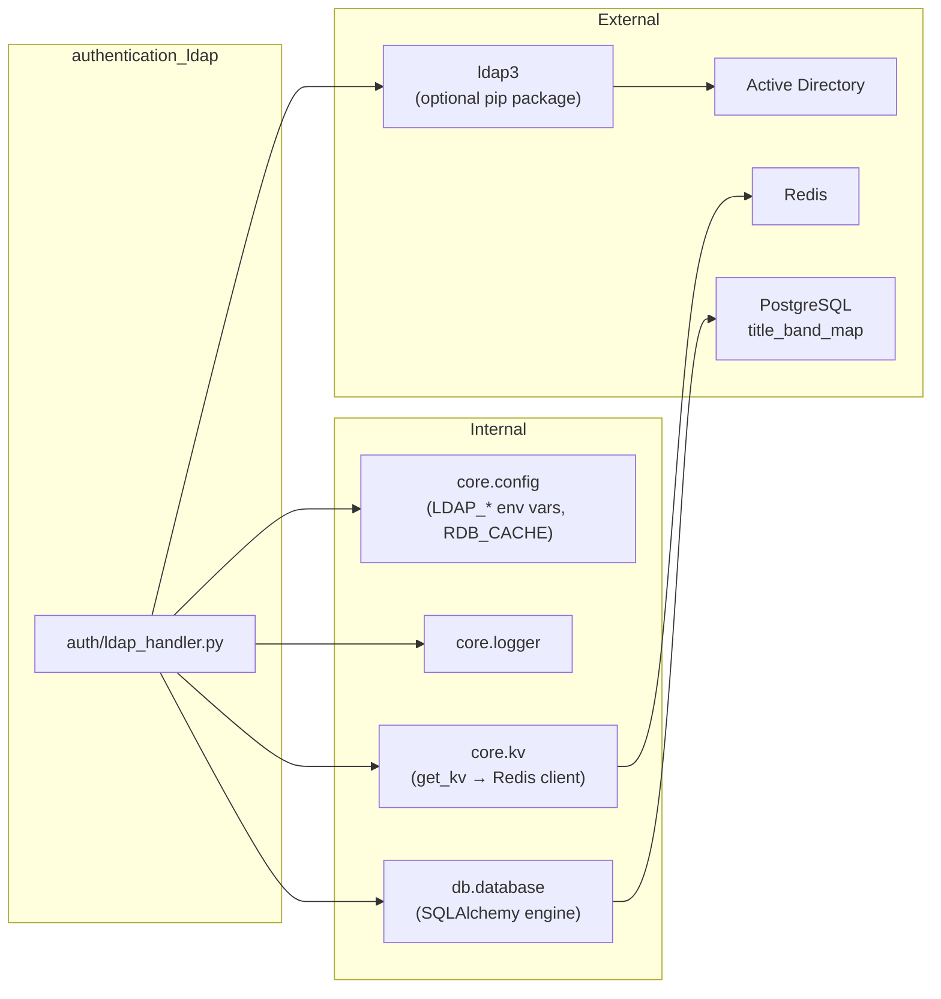

# Authentication — LDAP Handler

## Overview

The `authentication_ldap` module provides direct LDAP / Active Directory integration for the platform's identity layer. It is a **dependency-free alternative to Keycloak or Azure AD** — all configuration is driven by environment variables (`LDAP_URL`, `LDAP_BIND_DN`, `LDAP_BASE_DN`, etc.) and the optional `ldap3` Python package.

The module sits inside the broader [authentication](authentication.md) subsystem alongside three sibling modules:

| Sibling Module | Responsibility |
|---|---|
| [authentication_dependencies](authentication_dependencies.md) | JWT extraction, API-key resolution, profile enrichment, request-scoped user context |
| [authentication_rbac](authentication_rbac.md) | Role-based and attribute-based access control (band/level/permission enforcement) |
| [authentication_sso](authentication_sso.md) | OAuth2 / SSO callback handling for Keycloak and Azure AD providers |
| **authentication_ldap** (this module) | LDAP bind-validate authentication, AD attribute retrieval, nightly bulk sync, band resolution, manager-chain traversal |

---

## Core Responsibilities

The module exposes five public functions, each addressing a distinct concern in the AD integration lifecycle:

| Function | Purpose | Called By |
|---|---|---|
| `authenticate_user(username, password)` | Bind-validate user credentials against AD at login time | `routers/auth_router.py::login` |
| `get_user_attributes(identifier)` | Fetch AD profile (attributes + group membership) by email or sAMAccountName | JWT refresh, profile sync, `enrich_user_context` |
| `sync_all_users(batch_size)` | Paged bulk fetch of all AD users for nightly reconciliation | `workers/ad_sync.py::run_ad_sync` |
| `resolve_band(title)` | Map an AD `title` string to a `(band, band_level)` tuple via Postgres `title_band_map` | `ad_sync` worker, RBAC enrichment |
| `build_manager_chain(user_dn, depth)` | Walk the AD `manager` attribute up to N levels to build a reporting chain | `ad_sync` worker (product auto-membership) |

---

## Architecture



### Connection Management Strategy

The module employs a **persistent service-connection** pattern to eliminate the 1–3 second TCP+TLS+bind overhead that would otherwise be incurred on every login request:



Key design decisions:

- **`get_info=NONE`**: The `ldap3.Server` is created with `get_info=ldap3.NONE` to avoid fetching the AD schema on connect (which previously caused 30–50 second delays).
- **Thread safety**: A module-level `threading.Lock` (`_ldap_conn_lock`) guards all connection creation, reuse, and reset operations.
- **Aggressive timeouts**: `_CONNECT_TIMEOUT = 3s`, `_RECEIVE_TIMEOUT = 5s` — if AD cannot respond within these windows, the operation fails fast.
- **Stale-socket detection**: Socket errors with `errno 104` (ECONNRESET) or `errno 32` (EPIPE) trigger a single transparent reconnect-and-retry before giving up.

### Profile Caching

To avoid repeated group-membership and attribute round-trips on every request, the module caches user profiles in Redis:

| Aspect | Detail |
|---|---|
| Store | Redis (`RDB_CACHE` database) |
| Key format | `ldap_profile:{sha256(user_dn)[:32]}` |
| TTL | 3600 seconds (1 hour) |
| Value | JSON-serialised attribute dict including `is_security_team` and `is_approver` flags |

The cache is checked **before** the user-bind step in `authenticate_user()`, so repeat logins skip the slow group-lookup phase entirely.

---

## Component Reference

### `authenticate_user(username, password)`

The primary login entry point. Implements a **two-step bind-validate** pattern:



**Stale-connection handling**: If the cached service connection was silently dropped (ECONNRESET/EPIPE), the exception is caught, `_reset_service_conn()` is called, and the entire operation is retried once with a fresh connection. This is transparent to the caller.

**Return value**: A dict with canonical field names on success, `None` on failure:

```python
{
    "ad_username":      "jdoe",           # sAMAccountName
    "email":            "jdoe@org.com",
    "name":             "John Doe",       # cn or displayName
    "ad_title":         "Senior Engineer",
    "department":       "Platform Engineering",
    "manager_dn":       "CN=manager,DC=...",
    "ad_dn":            "CN=jdoe,DC=...",
    "upn":              "jdoe@org.com",
    "member_of":        ["CN=Group1,DC=...", ...],
    "is_security_team": True,             # derived from SECURITY_AD_GROUP
    "is_approver":      False,            # derived from APPROVER_AD_GROUP
}
```

### `get_user_attributes(identifier)`

Fetches AD attributes for a user by email or sAMAccountName without performing a password bind. Used during JWT refresh and profile enrichment. Follows the same cache-first pattern as `authenticate_user()`.

### `sync_all_users(batch_size=500)`

Performs a **paged bulk fetch** of all users matching `LDAP_USER_FILTER` from AD. Uses LDAP paged search (RFC 2696) with the AD-specific cookie control OID `1.2.840.113556.1.4.319`.



Called nightly by `workers/ad_sync.py::run_ad_sync()`. Entries without an email address are silently skipped.

### `resolve_band(title)`

Maps an AD `title` string to a `(band, band_level)` tuple by querying the Postgres `title_band_map` table using `ILIKE` pattern matching, ordered by `band_level DESC` (highest/most senior first).

| Input | SQL Match | Output |
|---|---|---|
| `"Senior Vice President"` | `WHERE 'Senior Vice President' ILIKE title_pattern` | `("A3", 3)` |
| `"Junior Associate"` | matching pattern | `("A1", 1)` |
| `""` or `None` | — | `("A1", 1)` (safe default) |
| Unrecognised title | No match | `("A1", 1)` (safe default) |

The band/level values feed directly into the ABAC system — see [authentication_rbac](authentication_rbac.md) for how `require_band()` and `require_level()` enforce access based on these values.

### `build_manager_chain(user_dn, depth=4)`

Walks the AD `manager` attribute recursively up to `depth` levels, returning a list of manager email addresses `[L1_manager, L2, L3, L4]`. This chain is used by the `ad_sync` worker to populate the `user_hierarchy` table, which in turn drives **product auto-membership** — users whose reporting chain contains a product owner are automatically assigned as members of that product.

---

## Integration with the Login Flow

The LDAP handler is invoked from the platform's login endpoint when `LDAP_ENABLED=true`:



> **Note**: When `LDAP_ENABLED=false`, the login flow falls back to local bcrypt password verification against the `users.hashed_password` column. See [authentication_dependencies](authentication_dependencies.md) for the full request-scoped user context pipeline.

---

## Integration with the AD Sync Worker

The nightly AD sync worker (`workers/ad_sync.py::run_ad_sync`) orchestrates all five LDAP functions to keep the local user database in sync with Active Directory:



The sync populates the following `users` table columns that feed the ABAC system:

| Column | Source | Used By |
|---|---|---|
| `ad_username` | `sAMAccountName` | Profile display |
| `ad_dn` | `distinguishedName` | Manager-chain traversal |
| `ad_title` | `title` | `resolve_band()` → band mapping |
| `department` | `department` | Department-scoped features |
| `manager_dn` | `manager` | Hierarchy cache |
| `band` / `band_level` | `resolve_band()` output | [authentication_rbac](authentication_rbac.md) `require_band()` |
| `is_security_team` | `memberOf` ∋ `SECURITY_AD_GROUP` | Security-gated endpoints |
| `is_approver` | `memberOf` ∋ `APPROVER_AD_GROUP` | Governance approval flows |
| `last_ad_sync` | `datetime.now(utc)` | Sync freshness monitoring |

---

## Configuration

All LDAP configuration is sourced from environment variables via `core.config`:

| Variable | Purpose | Example |
|---|---|---|
| `LDAP_ENABLED` | Master toggle for LDAP auth path | `true` |
| `LDAP_URL` | LDAP/LDAPS endpoint URL | `ldaps://dc01.corp.local:636` |
| `LDAP_BIND_DN` | Service account DN for searches | `CN=svc_ldap,OU=Service,DC=corp,DC=local` |
| `LDAP_BIND_PASSWORD` | Service account password | (secret) |
| `LDAP_BASE_DN` | Search base for user lookups | `DC=corp,DC=local` |
| `LDAP_USER_FILTER` | LDAP filter to scope user searches | `(objectClass=user)` |
| `SECURITY_AD_GROUP` | AD group DN for IS/security team flag | `CN=IS-Team,OU=Groups,DC=...` |
| `APPROVER_AD_GROUP` | AD group DN for approver flag | `CN=Approvers,OU=Groups,DC=...` |

The `ldap3` package is an **optional dependency** — if not installed, the module logs a warning and all functions return `None` / `[]` gracefully, allowing the platform to fall back to local password auth.

---

## Dependencies



### Downstream Consumers

| Consumer | Function Used | Context |
|---|---|---|
| `routers/auth_router.py::login` | `authenticate_user()` | Login credential validation |
| `auth/dependencies.py::enrich_user_context` | `get_user_attributes()` | Profile enrichment on JWT refresh |
| `workers/ad_sync.py::run_ad_sync` | `sync_all_users()`, `resolve_band()`, `build_manager_chain()` | Nightly full sync |
| `auth/rbac.py::require_band` | (indirect — reads `band_level` from JWT/DB) | ABAC enforcement — see [authentication_rbac](authentication_rbac.md) |

---

## Error Handling & Resilience

| Scenario | Behaviour |
|---|---|
| `ldap3` not installed | All functions return `None` / `[]`; warning logged at import time |
| `LDAP_ENABLED=false` | All functions return `None` / `[]` immediately (no connection attempt) |
| Stale service connection (ECONNRESET/EPIPE) | Connection is rebuilt once; operation retried transparently |
| Reconnect failure after stale-socket | `authenticate_user()` returns `None`; error logged |
| AD search returns no entries | `authenticate_user()` / `get_user_attributes()` return `None` |
| User bind fails (wrong password) | `authenticate_user()` returns `None`; info-level log |
| Redis unavailable for profile cache | Cache read/write silently fails (bare `except`); operation continues without cache |
| `title_band_map` DB lookup fails | `resolve_band()` returns safe default `("A1", 1)`; warning logged |
| `build_manager_chain` LDAP error | Returns partial chain (whatever was collected before the error); warning logged |
| `sync_all_users` LDAP error | Returns `[]`; error logged |

All public functions are designed to **never raise** — they return sentinel values (`None` or `[]`) on any failure, ensuring the calling login/sync flows can degrade gracefully.
