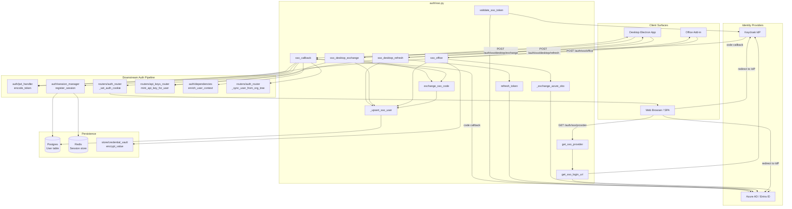
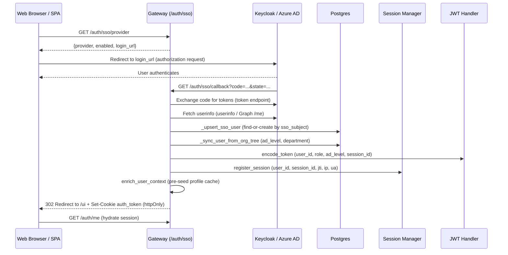
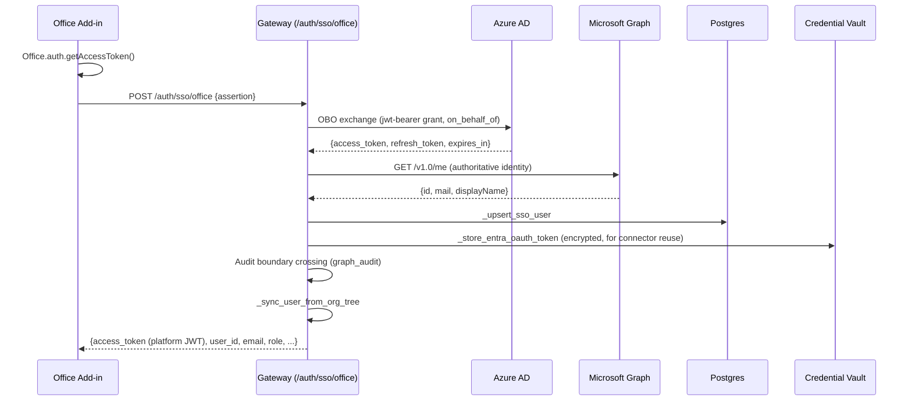
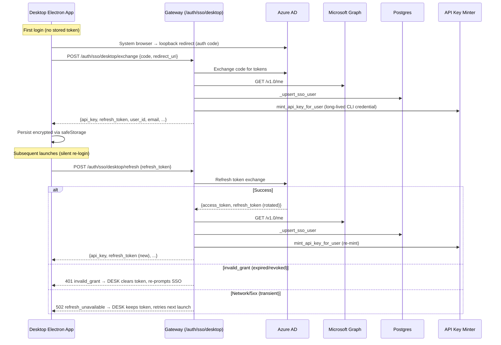
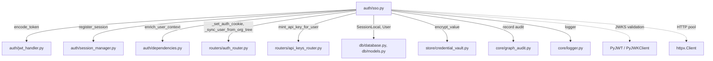

# Authentication SSO Module

## Introduction

The **authentication_sso** module (`auth/sso.py`) provides Single Sign-On (SSO) integration for the platform, supporting **Keycloak** and **Azure AD (Entra ID)** as identity providers. It implements three distinct authentication flows — **browser-based OAuth2**, **Office add-in On-Behalf-Of (OBO)**, and **desktop silent re-login** — all of which converge on the same user-upsert, session-registration, and JWT-issuance pipeline used by password login.

The module is part of the broader [authentication](authentication.md) subsystem, which also includes [authentication_dependencies](authentication_dependencies.md), [authentication_ldap](authentication_ldap.md), and [authentication_rbac](authentication_rbac.md).

---

## Architecture Overview



---

## Provider Detection

The module auto-detects the active SSO provider via `get_sso_provider()` using a resolution order:

1. **Explicit override** — `SSO_PROVIDER` env var (`"keycloak"` | `"azure_ad"` | `""`)
2. **Keycloak** — detected if `KEYCLOAK_URL` + `KEYCLOAK_CLIENT_ID` are set
3. **Azure AD** — detected if `AZURE_AD_TENANT_ID` + `AZURE_AD_CLIENT_ID` are set
4. **None** — SSO disabled (returns `"none"`)

When SSO is disabled, all SSO endpoints return appropriate errors and `validate_sso_token()` returns `None`.

---

## Core Components

### FastAPI Router (`sso_router`)

The module exports an `APIRouter` mounted at `/auth/sso` (included by the gateway). It exposes four endpoints:

| Endpoint | Method | Purpose |
|---|---|---|
| `/auth/sso/provider` | GET | Returns active provider name, enabled flag, and a ready-to-use login URL |
| `/auth/sso/callback` | GET | OAuth2 authorization-code callback (browser flow) |
| `/auth/sso/office` | POST | Office add-in SSO via On-Behalf-Of exchange |
| `/auth/sso/desktop/exchange` | POST | Desktop first-login: exchange auth code for API key + refresh token |
| `/auth/sso/desktop/refresh` | POST | Desktop silent re-login: rotate refresh token + re-mint API key |

### Request Models

| Model | Fields | Used By |
|---|---|---|
| `OfficeSSORequest` | `assertion: str` | `sso_office` — token from `Office.auth.getAccessToken()` |
| `DesktopExchangeRequest` | `code: str`, `redirect_uri: str` | `sso_desktop_exchange` — auth code from system-browser flow |
| `DesktopRefreshRequest` | `refresh_token: str` | `sso_desktop_refresh` — stored Entra refresh token |

### Public API Functions

| Function | Description |
|---|---|
| `get_sso_provider()` | Returns `"keycloak"`, `"azure_ad"`, or `"none"` |
| `validate_sso_token(token)` | Validates an SSO-issued JWT against the provider's JWKS endpoint; returns normalised `{user_id, email, name, role}` or `None` |
| `get_sso_login_url(redirect_uri)` | Builds the OAuth2 authorization URL for the active provider |
| `exchange_sso_code(code, redirect_uri)` | Exchanges an OAuth2 authorization code for normalised user info |
| `refresh_token(provider, refresh_token_value)` | Refreshes an access token using `grant_type=refresh_token` |

---

## Authentication Flows

### 1. Browser OAuth2 Flow



**Key design decisions:**
- The callback sets an **httpOnly, SameSite=Lax** cookie (`auth_token`) — the SPA never handles the token directly.
- A **session ID** is generated up-front and threaded into both the JWT (`sid` claim) and the session registry, so `decode_token()`'s `is_session_active()` check passes on the first request.
- PII (email, name, department) is **not** embedded in the JWT — it is fetched server-side via `enrich_user_context()` (Redis-cached DB lookup). See [authentication_dependencies](authentication_dependencies.md).

### 2. Office Add-in SSO (On-Behalf-Of)



**Key design decisions:**
- The add-in never holds a Graph token directly — the OBO exchange happens server-side.
- The Entra refresh token is persisted (encrypted) in `user_oauth_tokens` so the [connectors_integrations](../connectors/connectors_integrations.md) Microsoft 365 adapter can make delegated Graph calls for this user.
- Admin consent is centralized (§7.2) — no per-user consent UI is needed.
- The OBO assertion is audited via `graph_audit.record()` with only a hash, never the raw assertion.

### 3. Desktop Silent Re-login



**Key design decisions:**
- The desktop uses a **long-lived CLI API key** (no expiry) instead of a cookie — the Electron app persists it encrypted via `safeStorage`.
- The Entra **refresh token** is also persisted for silent re-login on every app launch (before the window is shown).
- Azure rotates refresh tokens — the new one is always returned and the desktop must persist it.
- Error handling distinguishes **terminal** failures (`invalid_grant` → clear token, re-prompt) from **transient** failures (`502` → keep token, retry next launch).
- API key minting uses **reuse-by-revoke**: same-label (device) keys are retired to avoid accumulation, and the global key cap is enforced.

---

## JWT & Session Model

All three SSO flows converge on the same JWT/session pipeline used by password login:

```mermaid
graph LR
    subgraph "JWT Claims (auth/jwt_handler)"
        J[sub, role, org_id,<br/>is_security_team, ad_level,<br/>can_approve, jti, sid, iat, exp]
    end

    subgraph "Session Registry (auth/session_manager)"
        S1[Redis sorted-set<br/>user:{id}:sessions]
        S2[Redis hash<br/>session:{sid}:meta]
        S3[Postgres<br/>session records]
    end

    subgraph "Profile Enrichment (auth/dependencies)"
        P1[Redis cache<br/>profile:{user_id}<br/>TTL 5 min]
        P2[Postgres<br/>User table]
    end

    J -->|sid validated on every request| S1
    S1 --> S2
    S2 --> S3
    P1 -->|cache miss| P2
    P2 -->|populate| P1
```

- **JWT carries only authorization claims** — no PII (DAST fix). Profile data is loaded server-side via `enrich_user_context()`.
- **Session ID (`sid`)** is validated against the session registry on every request, enabling concurrent-session control and revocation.
- **Profile cache** is pre-seeded during SSO callback so the first authenticated request hits Redis.

For details on JWT encoding, session management, and profile enrichment, see [authentication_dependencies](authentication_dependencies.md).

---

## Role Mapping

The module maps provider-specific roles to platform roles:

| Provider | Source | Mapping |
|---|---|---|
| Keycloak | `realm_access.roles[]` | `admin` → admin, `developer` → developer, `operator` → operator, `security` → security, default → viewer |
| Azure AD (token) | `roles[]` (app roles) | Same mapping as Keycloak |
| Azure AD (code exchange) | N/A | Defaults to `viewer` (new SSO users) |
| Azure AD (Office OBO) | N/A | Defaults to `viewer` |
| Azure AD (desktop) | N/A | Defaults to `user` |

> **Note:** `_upsert_sso_user()` never downgrades a manually-set role — it only upgrades from `viewer` to the SSO-provided role if the existing role is empty or `viewer`.

---

## User Upsert Logic

`_upsert_sso_user()` implements a find-or-create pattern:

1. **Lookup by `sso_subject` + `sso_provider`** — primary match (unique per IdP user).
2. **Fallback to email match** — if the SSO subject lookup misses (e.g., user existed before SSO was enabled).
3. **Update** — refreshes `sso_subject`, `sso_provider`, `email`, `name`; only upgrades role if current is empty/`viewer`.
4. **Create** — generates a new UUID, sets `is_active=True`, defaults role from SSO.

After upsert, `_sync_user_from_org_tree()` syncs `ad_level`, `department`, `ad_title`, and `manager_dn` from the org tree (populated by the AD sync worker). Active `UserLevelOverride` records are re-applied on top so nightly AD syncs don't strip temporary promotions.

---

## HTTP Infrastructure

All outbound HTTP calls use a **shared `httpx.Client`** connection pool:

```python
_http = _httpx.Client(
    timeout=15.0,
    limits=_httpx.Limits(max_connections=20, max_keepalive_connections=10),
    follow_redirects=True,
)
```

- **`_http_post_form(url, data)`** — POST `application/x-www-form-urlencoded`, returns parsed JSON.
- **`_http_get_bearer(url, access_token)`** — GET with `Authorization: Bearer`, returns parsed JSON.

Both helpers log HTTP status errors with truncated response bodies and raise `RuntimeError` on failure.

---

## Dependencies



### Internal Module References

| Dependency | Purpose | Documentation |
|---|---|---|
| `auth/jwt_handler` | `encode_token()` — mints signed JWT with authorization claims | [authentication](authentication.md) |
| `auth/session_manager` | `register_session()` — enforces concurrent-session limit, writes to Redis + Postgres | [authentication](authentication.md) |
| `auth/dependencies` | `enrich_user_context()` — Redis-cached DB lookup for PII profile data | [authentication_dependencies](authentication_dependencies.md) |
| `routers/auth_router` | `_set_auth_cookie()`, `_sync_user_from_org_tree()` | [auth_router](auth_router.md) |
| `routers/api_keys_router` | `mint_api_key_for_user()` — long-lived CLI API key for desktop | [api_keys_router](../products/api_keys_router.md) |
| `db/database`, `db/models` | `SessionLocal`, `User` model (sso_subject, sso_provider fields) | [database](../storage/database.md) |
| `store/credential_vault` | `encrypt_value()` — encrypts Entra OAuth tokens at rest | [store_layer](../storage/store_layer.md) |
| `core/graph_audit` | `record()` — audits OBO boundary crossings | [core_infrastructure](../core/core_infrastructure.md) |
| `core/logger` | Structured logging | [core_infrastructure](../core/core_infrastructure.md) |

### External Libraries

| Library | Usage |
|---|---|
| `httpx` | Pooled HTTP client for all IdP and Graph API calls |
| `PyJWT` / `PyJWKClient` | JWT signature validation against JWKS endpoints (RS256) |
| `fastapi` | APIRouter, HTTPException, Query, Request, RedirectResponse |
| `pydantic` | Request body validation (`BaseModel`) |

---

## Configuration

### Environment Variables

| Variable | Required | Description |
|---|---|---|
| `SSO_PROVIDER` | No | Explicit override: `"keycloak"`, `"azure_ad"`, or `""` (auto-detect) |
| **Keycloak** | | |
| `KEYCLOAK_URL` | For Keycloak | Realm URL, e.g. `https://keycloak.example.com/realms/your-realm` |
| `KEYCLOAK_CLIENT_ID` | For Keycloak | OAuth2 client ID (default: `codenxt`) |
| `KEYCLOAK_CLIENT_SECRET` | For Keycloak | OAuth2 client secret |
| **Azure AD** | | |
| `AZURE_AD_TENANT_ID` | For Azure AD | Azure tenant ID |
| `AZURE_AD_CLIENT_ID` | For Azure AD | Azure app registration client ID |
| `AZURE_AD_CLIENT_SECRET` | For Azure AD | Azure client secret |
| `AZURE_AD_OBO_SCOPES` | No | OBO scopes (default: `openid profile offline_access https://graph.microsoft.com/User.Read`) |
| **Platform** | | |
| `PLATFORM_BASE_URL` | No | Platform base URL for building redirect URIs (default: `http://localhost:8000`) |
| `SSO_REDIRECT_URI` | No | Override OAuth2 redirect URI (default: `{PLATFORM_BASE_URL}/auth/sso/callback`) |
| `SSO_POST_LOGIN_REDIRECT` | No | Post-login SPA redirect (default: `/ui`) |

### Provider Endpoints

| Provider | Authorization | Token | JWKS | UserInfo |
|---|---|---|---|---|
| Keycloak | `{KEYCLOAK_URL}/protocol/openid-connect/auth` | `{KEYCLOAK_URL}/protocol/openid-connect/token` | `{KEYCLOAK_URL}/protocol/openid-connect/certs` | `{KEYCLOAK_URL}/protocol/openid-connect/userinfo` |
| Azure AD | `https://login.microsoftonline.com/{tenant}/oauth2/v2.0/authorize` | `https://login.microsoftonline.com/{tenant}/oauth2/v2.0/token` | `https://login.microsoftonline.com/{tenant}/discovery/v2.0/keys` | `https://graph.microsoft.com/v1.0/me` |

---

## Security Considerations

1. **No PII in JWT** — Email, name, and department are never embedded in the JWT payload (DAST fix). They are fetched server-side via `enrich_user_context()`.

2. **Session validation** — Every request validates the JWT's `sid` claim against the session registry, enabling revocation and concurrent-session limits.

3. **OBO assertion auditing** — The Office SSO flow audits the boundary crossing via `graph_audit.record()` with only a hash of the assertion, never the raw token.

4. **Encrypted token storage** — Entra OAuth tokens (access + refresh) are encrypted via `store/credential_vault.encrypt_value()` before persistence in `user_oauth_tokens`.

5. **JWKS caching** — `PyJWKClient` caches JWK sets for 300 seconds, reducing latency and avoiding repeated fetches.

6. **Connection pooling** — A shared `httpx.Client` with 20 max connections and 10 keepalive connections avoids TCP handshake overhead at scale (~100ms savings per login at 2000 concurrent users).

7. **Role non-downgrade** — `_upsert_sso_user()` never downgrades a manually-set role; it only upgrades from `viewer` to the SSO-provided role.

8. **Desktop error handling** — Transient failures (network/5xx) are distinguished from terminal failures (`invalid_grant`) to avoid unnecessary re-authentication prompts.
