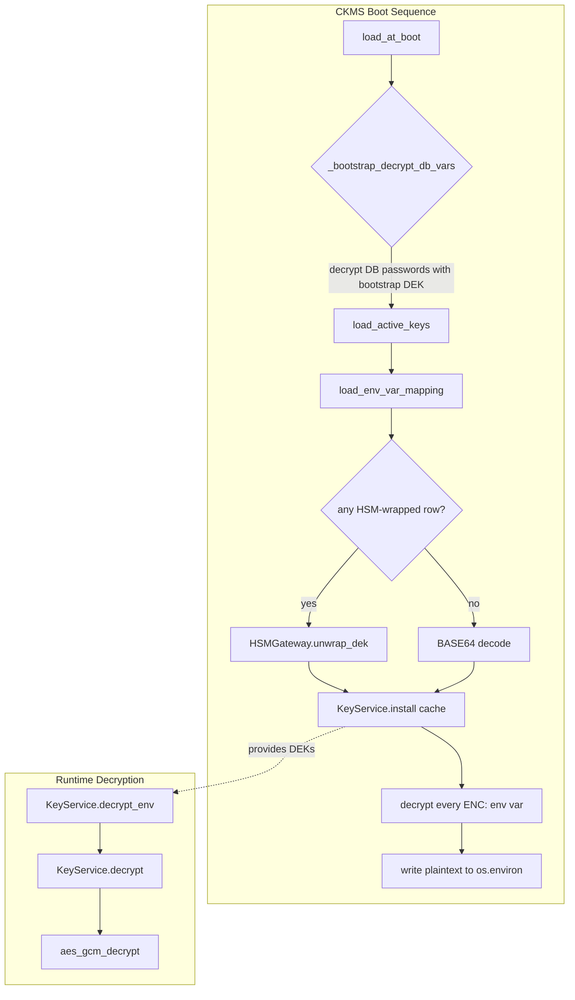
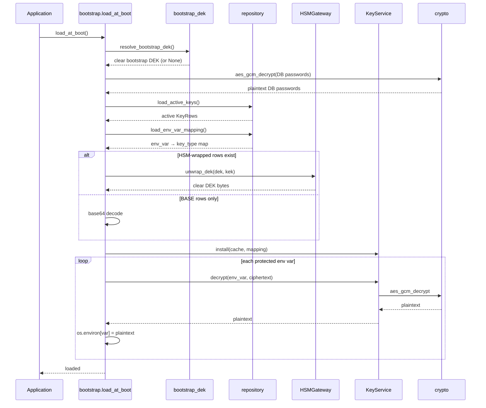
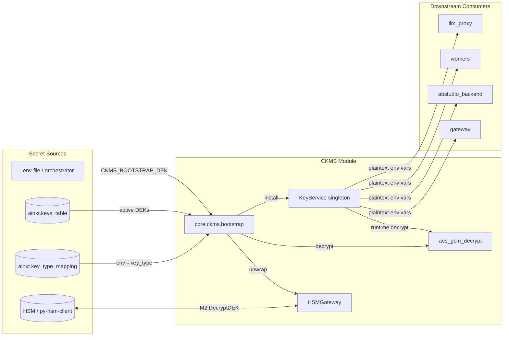

# CKMS — Centralized Key Management System

## Overview

The **Centralized Key Management System (CKMS)** is a small, fail-fast security module in `shared_core` that decrypts protected environment variables at process boot time. It sits at the root of the platform's trust chain: before any service opens a database connection, talks to an LLM provider, or signs a JWT, CKMS loads the necessary Data Encryption Keys (DEKs), unwraps them via a Hardware Security Module (HSM) when required, and writes the plaintext secrets back into `os.environ` so legacy `os.getenv()` consumers continue to work unchanged.

CKMS is intentionally narrow in scope:

- **In scope**: decrypt env vars at boot using AES-256-GCM; support both HSM-wrapped and BASE64-encoded DEKs; provide a process-memory singleton for runtime decryption.
- **Out of scope**: key generation, key rotation, encryption of new values, and HSM administration. Those are handled by ops tooling (e.g. `scripts/ckms_encrypt.py`) and external key ceremonies.

The module is used by the main gateway, ABStudio backend, workers, and any other process that needs to bootstrap from a ciphertext `.env`.

---

## Architecture



### Component Map

| File | Responsibility |
|------|----------------|
| `core/ckms/bootstrap.py` | Orchestrates the 5-step boot sequence; fail-fast on any error. |
| `core/ckms/key_service.py` | Process-memory singleton that holds clear DEKs and the env-var → key-type mapping. |
| `core/ckms/hsm_gateway.py` | Reusable wrapper around `py-hsm-client` for M2 `DecryptDEK` operations. |
| `core/ckms/crypto.py` | AES-256-GCM decryption with the wire format `<b64(iv)>:<b64(ct\|\|tag)>`. |
| `core/ckms/repository.py` | Read-only DB access to `ainxt.keys_table` and `ainxt.key_type_mapping`. |
| `core/ckms/bootstrap_dek.py` | Resolves the chicken-and-egg bootstrap DEK used to decrypt DB passwords before `keys_table` can be read. |

---

## Boot Sequence

`core.ckms.bootstrap.load_at_boot()` implements the following sequence exactly once per process:

1. **Bootstrap DB connectivity** — If any DB password env var is `ENC:`-prefixed, resolve `CKMS_BOOTSTRAP_DEK` (BASE64 or HSM-wrapped) and decrypt those vars. This breaks the chicken-and-egg problem of needing a DB password to read `keys_table`.
2. **Load active keys** — Query `ainxt.keys_table` for rows with `status='A'`.
3. **Load key-type mapping** — Query `ainxt.key_type_mapping` for the env-var → key-type map.
4. **Unwrap / decode DEKs** — For each active row, either base64-decode a `BASE:` value or call the HSM to unwrap `dek` with `kek`.
5. **Install and decrypt env vars** — Install the clear DEKs into `KeyService`, then decrypt every `ENC:`-prefixed protected env var and write the plaintext back to `os.environ`.

Any failure logs one structured line (without key material) and exits the process with `SystemExit(1)`. Subsequent calls to `load_at_boot()` are no-ops.



---

## Core Components

### `KeyService` (`core/ckms/key_service.py`)

The `KeyService` is a thread-safe singleton that stores the clear DEK cache and the env-var mapping after boot. It is the canonical runtime interface for decrypting values.

- **`instance()`** — Returns the singleton; lazy-initializes on first call.
- **`install(cache, mapping)`** — Atomically installs the clear-DEK cache and mapping. Idempotent once loaded.
- **`key_type_for(env_var)`** — Returns the configured key type for an env var, defaulting to `KEY_CREDS`.
- **`clear_dek(key_type)`** — Returns the clear DEK bytes for a key type.
- **`decrypt(env_var, ciphertext)`** — Decrypts a ciphertext string using the DEK mapped to the env var.
- **`decrypt_env(env_var)`** — Reads `os.environ[env_var]` and decrypts it; raises if missing.
- **`reset_for_tests()`** — Drops the singleton (tests only).

### `HSMGateway` (`core/ckms/hsm_gateway.py`)

A thin, reusable wrapper around `py-hsm-client` that performs the M2 `DecryptDEK` operation. It resolves `hsm-config.yml` (honoring `HSM_CONFIG_PATH`), opens a single TCP connection for the duration of a `with` block, and translates all library failures into `KeyServiceError`.

- **`__enter__ / __exit__`** — Context-manager lifecycle; opens and closes the HSM TCP connection.
- **`unwrap_dek(dek_kek_hex, kek_lmk_hex)`** — Sends `DecryptDEK` and returns the clear DEK bytes. The HSM is configured with `outputformat: "text"`, so the returned data is the 32-character ASCII alphanumeric DEK itself.

### `load_at_boot` (`core/ckms/bootstrap.py`)

The entry point that runs the full boot sequence. It is safe to call multiple times; only the first call performs work. It is responsible for:

- Decrypting DB connectivity env vars with the bootstrap DEK.
- Loading keys and mappings from the database.
- Unwrapping or decoding DEKs.
- Installing the cache into `KeyService`.
- Decrypting the full protected env-var inventory and mutating `os.environ`.

### `aes_gcm_decrypt` (`core/ckms/crypto.py`)

Low-level AES-256-GCM decryption. The ciphertext wire format is:

```
<base64(iv)>:<base64(ciphertext || gcm_tag)>
```

- 12-byte IV.
- Authentication tag appended to ciphertext (standard `cryptography` layout).
- Raises `CipherFormatError` for malformed input and `CipherAuthError` for tag verification failures.

### Repository helpers (`core/ckms/repository.py`)

- **`load_active_keys()`** — Returns all active rows from `ainxt.keys_table` as `KeyRow` dataclasses.
- **`load_env_var_mapping()`** — Returns `{env_var: key_type}` from `ainxt.key_type_mapping`.

### Bootstrap DEK resolver (`core/ckms/bootstrap_dek.py`)

- **`resolve_bootstrap_dek()`** — Resolves `CKMS_BOOTSTRAP_DEK` from the environment. Supports:
  - `BASE:<base64>` for dev / phased rollout.
  - HSM-wrapped hex form (requires `CKMS_BOOTSTRAP_KEK`).
  - Returns `None` when not configured (legacy plaintext deployments).

---

## Protected Environment Variable Inventory

`bootstrap.py` maintains `PROTECTED_ENV_VARS`, the canonical list of env vars that are decrypted at boot if they carry the `ENC:` prefix. The inventory covers:

- Master encryption/signing keys (`FERNET_KEY`, `JWT_SECRET`, `SECRET_KEY`, etc.)
- Database and vector-store passwords
- Directory / mail passwords (`LDAP_BIND_PASSWORD`, `SMTP_PASSWORD`)
- LLM / embedding provider API keys
- Source-control PATs
- Atlassian / OAuth client secrets
- Webhook signing secrets
- Chat-platform bot tokens
- Inter-service bearer tokens
- Object-store credentials
- Code-scan / automation tokens
- Admin-scoped provider keys for LLM spend tracking

Variables not present in the environment are skipped. Variables without the `ENC:` prefix are left untouched, providing backward compatibility for phased rollouts.

---

## Wire Formats

### Encrypted env value

```
ENC:<base64(iv)>:<base64(ciphertext||tag)>
```

Example: `ENC:YWJj:def...`

### keys_table.dek

- HSM-wrapped: `<DEK_KEK_hex>` (requires `keys_table.kek` = `KEK_LMK_hex`).
- BASE64 dev form: `BASE:<base64-of-32-char-DEK>`.

### Bootstrap DEK env vars

- `CKMS_BOOTSTRAP_DEK=BASE:<base64>` — dev / phased rollout.
- `CKMS_BOOTSTRAP_DEK=<DEK_KEK_hex>` + `CKMS_BOOTSTRAP_KEK=<KEK_LMK_hex>` — production HSM.

---

## Failure Policy

CKMS is designed to fail fast and loudly:

- Any `KeyServiceError` during boot is logged once (without key material) and the process exits with code `1`.
- Partial or degraded boot is not allowed.
- HSM transport failures, malformed BASE64, missing bootstrap DEK, and AES-GCM authentication failures all surface as `KeyServiceError`.

---

## Relationship to Other Modules

- **`shared_core`**: CKMS lives under `shared_core` and is imported early by the gateway, ABStudio backend, and workers. It depends on `db.database.SessionLocal` from the database layer and `core.logger` for structured logging.
- **`gateway`**: The gateway calls `load_at_boot()` during startup so that downstream routes can use plaintext env vars.
- **`scripts/ckms_encrypt.py`**: The ops-side companion script generates DEKs, wraps them in `BASE:` form, and produces `ENC:`-prefixed ciphertext. It is symmetric with `core.ckms.crypto.aes_gcm_decrypt`.
- **`llm_proxy` / `abstudio_backend` / `workers`**: These modules consume the plaintext env vars placed into `os.environ` by CKMS and may also call `KeyService.decrypt_env()` for runtime decryption.

---

## Mermaid Diagram: CKMS in the System



---

## Operational Notes

- **Phased rollout**: Ops can encrypt env vars one at a time. Unencrypted vars continue to work.
- **Dev environments**: Use `BASE:`-encoded DEKs to avoid needing an HSM.
- **Production**: Use HSM-wrapped DEKs and set `CKMS_BOOTSTRAP_DEK` / `CKMS_BOOTSTRAP_KEK` appropriately.
- **No runtime rotation**: Once loaded, the cache is read-only for the process lifetime. Rotation is deferred to future work.
- **Logging safety**: CKMS never logs key material, ciphertext, or decrypted values.
