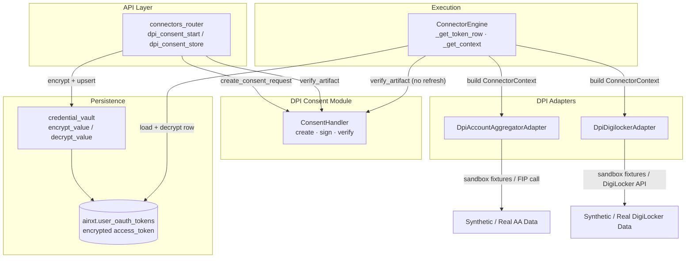
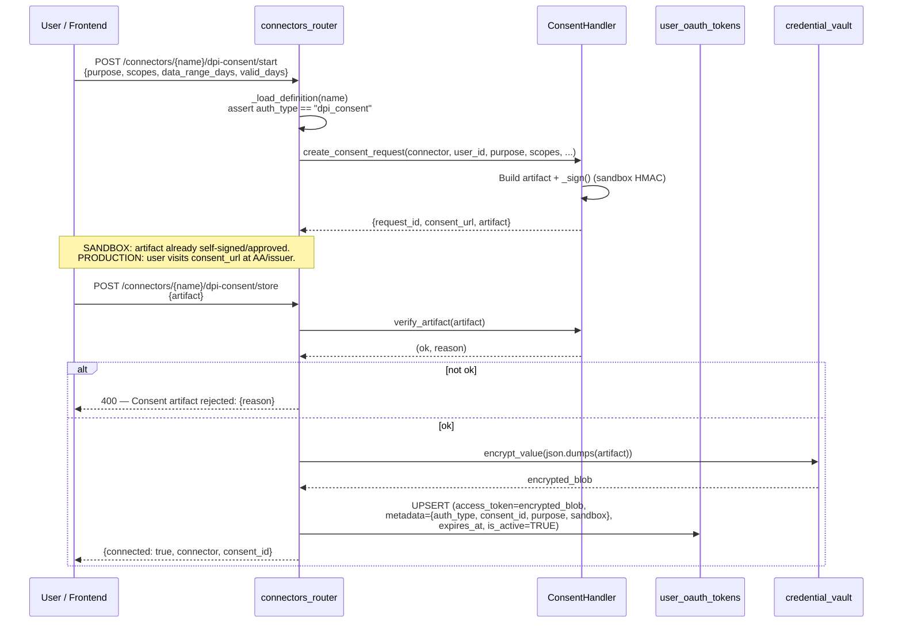
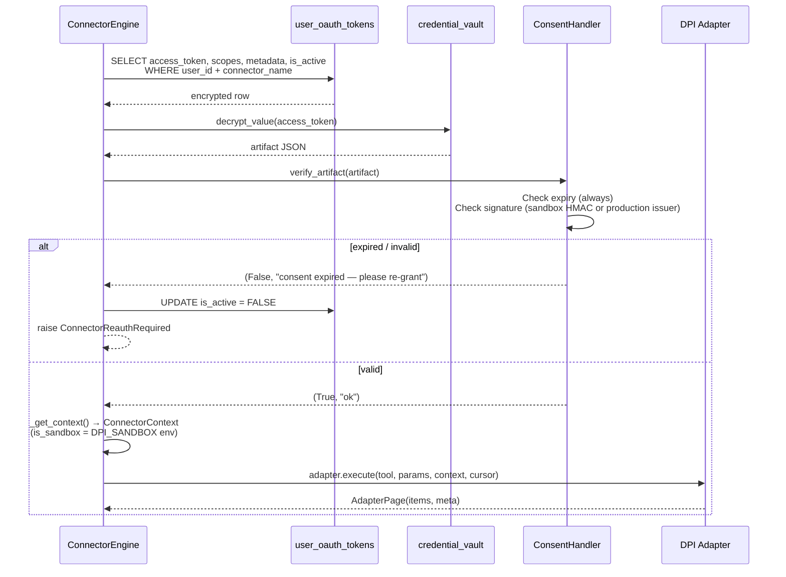
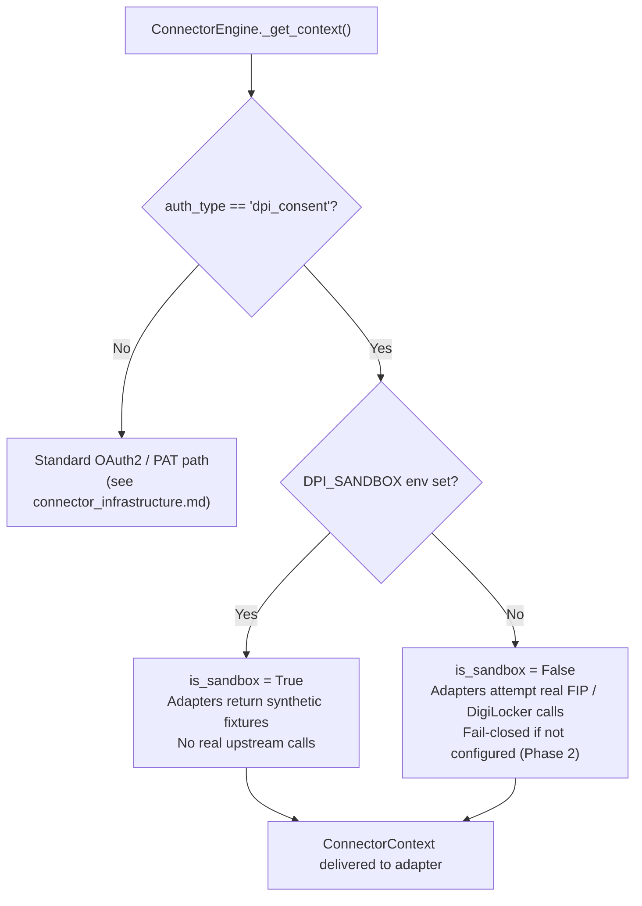
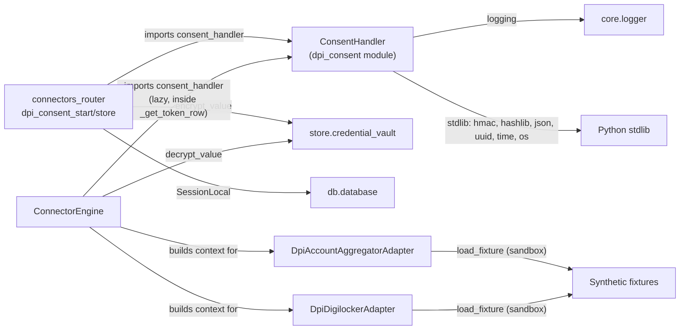

# DPI Consent Module

## Introduction

The **DPI Consent** module implements the Account-Aggregator / DEPA (Data Empowerment and Protection Architecture) consent model for agent-driven data access. Unlike the traditional OAuth2 bearer-token flow (see [connector_infrastructure.md](../connectors/connector_infrastructure.md)), a user grants a **signed consent artifact** that is scoped to a *purpose*, a *data range*, and an *expiry*. The agent acts strictly within that mandate — there is no refresh token and no implicit scope expansion.

The module is the single source of truth for creating, signing, verifying, and persisting DPI consent artifacts. It is consumed by the connector API layer, the connector execution engine, and the DPI-specific data adapters (Account Aggregator, DigiLocker).

> **Design note:** Verification is *pluggable*. In **SANDBOX** mode (`DPI_SANDBOX=true`) artifacts are self-signed with an HMAC key and verification checks shape + expiry only — fully offline and open-source-safe. In **PRODUCTION** mode the `verify_artifact` method is a deliberate fail-closed stub that will check the AA/issuer signature against a DPI public key once wired (Phase 2).

---

## Architecture



### Component Relationships

| Component | File | Role |
|---|---|---|
| `ConsentHandler` | `connectors/dpi/consent.py` | Creates, signs (sandbox), and verifies consent artifacts. Exposes a module-level singleton `consent_handler`. |
| `dpi_consent_start` / `dpi_consent_store` | `routers/connectors_router.py` | API endpoints that initiate a consent grant and persist the approved artifact. |
| `ConnectorEngine` | `connectors/engine.py` | At execution time, detects `auth_type == "dpi_consent"`, verifies the stored artifact (instead of refreshing a token), and builds a sandbox-aware `ConnectorContext`. |
| `DpiAccountAggregatorAdapter` | `connectors/adapters/dpi_account_aggregator.py` | Reads financial data via the AA/FIP; sandbox returns synthetic fixtures. |
| `DpiDigilockerAdapter` | `connectors/adapters/dpi_digilocker.py` | Reads government-issued documents from DigiLocker; sandbox returns synthetic fixtures. |

---

## Consent Artifact Structure

A consent artifact is a JSON dictionary with the following fields:

| Field | Type | Description |
|---|---|---|
| `consent_id` | `str` | Unique identifier (`consent-<16-hex-chars>`). |
| `connector` | `str` | Connector name (e.g. `dpi_account_aggregator`). |
| `user_id` | `str` | The granting user's ID. |
| `purpose` | `str` | Human-readable purpose (e.g. "Personal finance review"). Enforced by callers. |
| `scope` | `list[str]` | Granted data scopes. |
| `data_range_days` | `int` | Look-back window for historical data (default 180 days). |
| `issued_at` | `int` | Unix timestamp of issuance. |
| `expires_at` | `int` | Unix timestamp of expiry (`issued_at + valid_days * 86400`). |
| `sandbox` | `bool` | Whether the artifact was created in sandbox mode. |
| `signature` | `str` | HMAC-SHA256 hex digest (sandbox) or issuer signature (production). |

---

## Core Flows

### Consent Grant Flow



### Consent Verification at Execution Time

The `ConnectorEngine` treats DPI consent connectors differently from OAuth2 connectors: there is **no refresh token** and **no token refresh**. Instead, the stored artifact is verified on every call.



### Sandbox vs Production Decision Tree



---

## Sandbox Mode

Sandbox mode is controlled by the `DPI_SANDBOX` environment variable (accepts `1`, `true`, `yes`, `on`). When enabled:

1. **`create_consent_request`** returns an already-approved, self-signed artifact — no redirect to an external consent screen. The `consent_url` is a synthetic `about:dpi-sandbox-consent/{consent_id}` placeholder.
2. **`_sign`** computes an HMAC-SHA256 over the sorted, compact-JSON payload of the artifact (excluding the `signature` field itself) using `_SANDBOX_SIGNING_KEY` (env `DPI_SANDBOX_SIGNING_KEY`, default `ainxt-dpi-sandbox-dev-key`).
3. **`verify_artifact`** checks expiry and compares the stored signature against a recomputed HMAC using `hmac.compare_digest` (constant-time).
4. **DPI adapters** (`DpiAccountAggregatorAdapter`, `DpiDigilockerAdapter`) detect `context.is_sandbox == True` and return synthetic fixture data instead of making real upstream calls.

> ⚠️ The sandbox signing key is **not a security boundary** — sandbox data is synthetic. Production uses real DPI issuer signatures.

---

## Production Mode (Phase 2 Plug Point)

When `DPI_SANDBOX` is not set:

- **`create_consent_request`** returns a `consent_url` pointing to the real AA/issuer consent screen. The signed artifact is expected to arrive via a callback (not yet implemented).
- **`verify_artifact`** deliberately **fails closed**: it returns `(False, "production consent verification not configured...")` until real issuer-signature verification is wired.
- **DPI adapters** raise a `RuntimeError` instructing the operator to enable sandbox mode, since real AA access requires RBI licensing and a configured FIP/AA endpoint.

---

## Persistence & Reuse

The consent artifact is stored as the **encrypted `access_token`** in the `ainxt.user_oauth_tokens` table — the same table used by OAuth2 and PAT connectors. This design choice means:

- **Connection detection** (checking whether a user has an active row) works unchanged.
- **MCP tool exposure** (listing available connector tools) works unchanged.
- **Scope enforcement** in `ConnectorEngine._enforce_scopes` uses the artifact's `scope` list stored in the `scopes` column.
- The `metadata` JSONB column is stamped with `auth_type: "dpi_consent"`, `consent_id`, `purpose`, and `sandbox` flag, allowing the engine to branch on `auth_type` at execution time.

A dedicated consent registry could replace this storage in Phase 2 without touching callers, since all access flows through `ConsentHandler` and `ConnectorEngine`.

---

## Dependencies



### External Module References

| Module | Relationship |
|---|---|
| [connector_infrastructure.md](../connectors/connector_infrastructure.md) | `ConnectorEngine`, `ConnectorRegistry`, `OAuth2Handler` — the broader connector framework that DPI consent plugs into. |
| [connectors_router.md](../connectors/connectors_router.md) | API endpoints `dpi_consent_start` and `dpi_consent_store`, plus request models `DpiConsentStartRequest` and `DpiConsentStoreRequest`. |
| [connector_adapters.md](../connectors/connector_adapters.md) | `DpiAccountAggregatorAdapter` and `DpiDigilockerAdapter` — the data-fetching adapters that consume the verified consent context. |

---

## Environment Variables

| Variable | Default | Description |
|---|---|---|
| `DPI_SANDBOX` | *(unset)* | Enables sandbox mode (`1`/`true`/`yes`/`on`). When unset, production mode fails closed. |
| `DPI_SANDBOX_SIGNING_KEY` | `ainxt-dpi-sandbox-dev-key` | HMAC key for self-signing sandbox artifacts. Not a security boundary. |

---

## API Surface

### `ConsentHandler.create_consent_request(...)`

Builds a consent artifact. In sandbox, the artifact is returned already self-signed/approved. In production, returns the issuer consent URL for user redirect.

**Parameters:** `connector_name`, `user_id`, `purpose`, `scopes` (optional), `data_range_days` (default 180), `valid_days` (default 30).

**Returns:** `{request_id, consent_url, artifact}`.

### `ConsentHandler.verify_artifact(artifact)`

Validates a consent artifact. Always honours expiry. Signature check is sandbox-HMAC or production-issuer (fail-closed).

**Returns:** `tuple[bool, str]` — `(ok, reason)`.

### `ConsentHandler._sign(artifact)`

Sandbox-only HMAC-SHA256 signing over the sorted, compact-JSON payload (excluding the `signature` field). Returns a hex digest string.

### Module Singleton

```python
from connectors.dpi.consent import consent_handler
```

A ready-to-use `ConsentHandler` instance, imported lazily by both the connectors router and the `ConnectorEngine`.

---

## Key Design Decisions

1. **No refresh tokens.** DPI consent artifacts expire and must be re-granted. The `ConnectorEngine` never calls `_refresh_token` for `auth_type == "dpi_consent"` — it verifies and either proceeds or deactivates the row and raises `ConnectorReauthRequired`.

2. **Fail-closed production.** Until real issuer-signature verification is implemented, production mode rejects all artifacts. This prevents unverified consent from being used in a real data-access path.

3. **Purpose limitation enforced by callers.** The artifact carries `purpose` and `scope`, but `ConsentHandler` does not police how the data is used — that is the responsibility of the adapter and the compliance layer (`ConnectorEngine._compliance_check`).

4. **Storage reuse.** By persisting the artifact as an encrypted `access_token` in the existing `user_oauth_tokens` table, the module avoids introducing a new persistence layer while keeping the door open for a dedicated consent registry in Phase 2.
