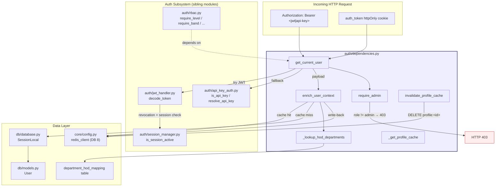
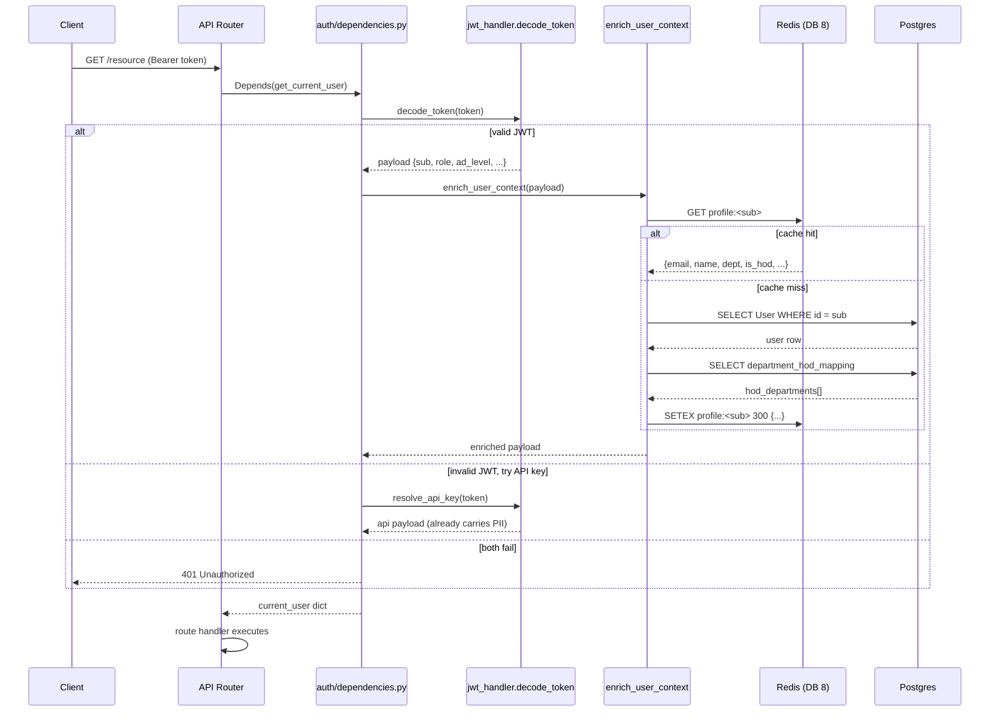
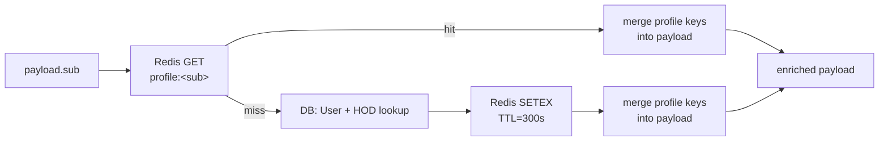
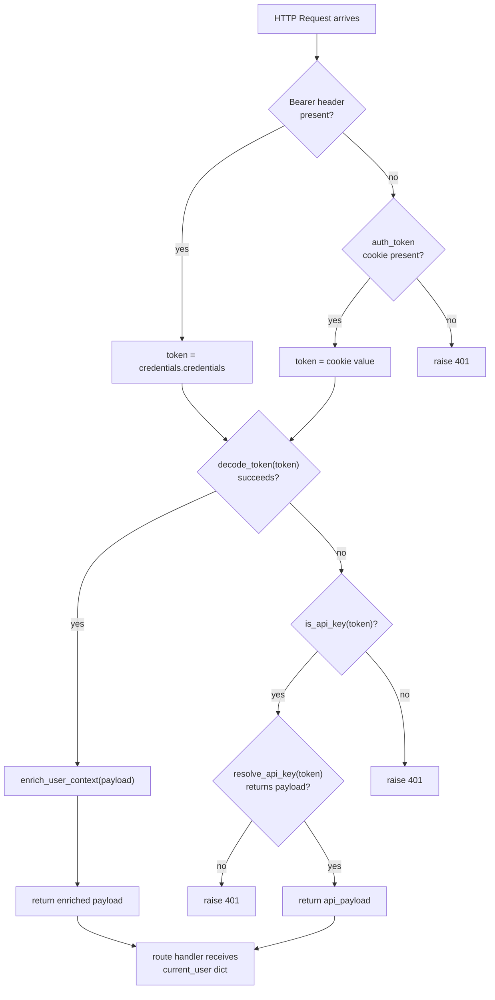
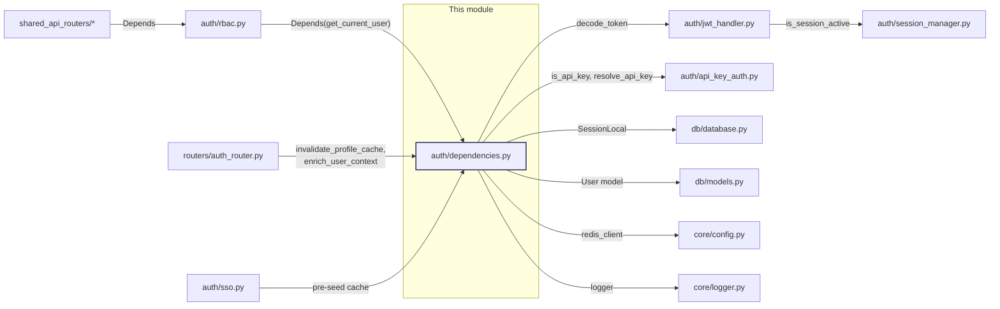

# Authentication Dependencies

## Introduction

The `authentication_dependencies` module (`auth/dependencies.py`) is the **request-level authentication gateway** for the entire platform. It is the single FastAPI dependency that every protected route depends on to resolve the identity of the caller.

Its core responsibilities are:

1. **Token extraction** — pull a credential from the `Authorization: Bearer` header or the `auth_token` httpOnly cookie.
2. **Credential resolution** — distinguish a JWT (browser/CLI sessions) from an IDE API key and validate it through the appropriate path.
3. **Profile enrichment** — merge server-authoritative PII (email, name, department, HOD status) into the in-memory payload dict via a Redis-cached DB lookup, so that PII is **never** stored inside the base64-encoded JWT.
4. **Role enforcement** — provide a thin `require_admin` wrapper that raises `403` for non-admin callers.
5. **Cache invalidation** — expose `invalidate_profile_cache` so profile updates are reflected immediately rather than waiting for the 5-minute TTL.

This module is the foundation of the broader [authentication](#related-modules) subsystem and is consumed transitively by the RBAC layer (`auth/rbac.py`) and by every API router.

---

## Architecture Overview



### Where it sits in the request lifecycle



---

## Core Components

### `get_current_user`

The primary FastAPI dependency. It is the entry point for identity resolution on every protected endpoint.

**Signature**
```python
def get_current_user(
    request: Request,
    credentials: Optional[HTTPAuthorizationCredentials] = Depends(_bearer),
) -> dict
```

**Resolution order**

| Priority | Source | Mechanism |
|----------|--------|-----------|
| 1 | `Authorization: Bearer <jwt>` | `decode_token()` from [authentication_dependencies](#) → [jwt_handler](#related-modules) |
| 2 | `Authorization: Bearer <api-key>` | `is_api_key()` + `resolve_api_key()` from `auth/api_key_auth.py` |
| 3 | `auth_token` httpOnly cookie | Falls back when no Bearer header is present |

**Behaviour**
- A valid JWT payload is **enriched** via `enrich_user_context` before being returned — route handlers always receive a dict containing `email`, `name`, `department`, `is_hod`, and `hod_departments`.
- API-key payloads already carry PII from their own store (see `resolve_api_key`), so they are returned as-is.
- If no credential is found, or both JWT and API-key resolution fail, an `HTTP 401` is raised.

> **Security note:** The JWT itself contains only minimal authorization claims (`sub`, `role`, `org_id`, `ad_level`, `jti`, `sid`). PII is deliberately excluded from the token (a DAST finding) and is instead injected server-side. See [jwt_handler](#related-modules) for the token's revocation-blacklist and concurrent-session checks.

---

### `enrich_user_context`

Merges server-authoritative profile data into a JWT payload dict. This is the mechanism that keeps PII out of the JWT while preserving a transparent `current_user["email"]` contract for all route handlers.

**Signature**
```python
def enrich_user_context(payload: dict) -> dict
```

**Lookup strategy (cache-aside)**



**Profile fields injected**

| Field | Source | Default on failure |
|-------|--------|--------------------|
| `email` | `User.email` | `""` |
| `name` | `User.name` | `""` |
| `department` | `User.department` | `""` |
| `is_hod` | derived from HOD lookup | `False` |
| `hod_departments` | `department_hod_mapping` table | `[]` |

**Resilience guarantees**
- All DB/Redis errors are caught and swallowed — profile enrichment **never** fails authentication. If the lookup fails, the keys are still seeded with safe defaults (`is_hod=False`, `hod_departments=[]`).
- The cache TTL is **5 minutes** (`_PROFILE_CACHE_TTL = 300`), short enough to pick up role/department changes reasonably quickly.
- Cache lives in a **dedicated Redis DB** (`_PROFILE_CACHE_REDIS_DB = 8`) to isolate it from other Redis usage.

---

### `require_admin`

A thin wrapper around `get_current_user` that additionally enforces the `admin` role.

```python
def require_admin(current_user: dict = Depends(get_current_user)) -> dict
```

- Returns the enriched `current_user` dict if `role == "admin"`.
- Raises `HTTP 403` ("Admin access required") for any non-admin caller.
- Distinct from the `401` raised by `get_current_user` for missing/invalid credentials.

> **Note:** This is the simplest RBAC guard. For finer-grained access control (seniority levels, bands, product membership, approval rights), use the dependency factories in [authentication_rbac](authentication_rbac.md) (`require_level`, `require_band`, `require_permission`, `require_approval`, etc.), all of which build on `get_current_user`.

---

### `invalidate_profile_cache`

Explicitly evicts a user's profile cache entry so that an updated email/name/department is served immediately rather than after the TTL window.

```python
def invalidate_profile_cache(user_id: str) -> None
```

- Issues `DEL profile:<user_id>` against Redis DB 8.
- Best-effort: Redis errors are swallowed (the TTL will eventually expire the stale entry anyway).
- **Call sites:** profile-update endpoints, admin user-edit operations, and the SSO callback (which pre-seeds the cache after upserting the user).

---

### Internal Helpers

#### `_lookup_hod_departments(email)`

Resolves the list of `department_name` values a given email heads, by querying the `ainxt.department_hod_mapping` table.

- Returns `[]` if the email is empty, the table is missing/malformed, or no rows match.
- **Fail-soft with log throttling:** On the first `UndefinedTable`/`ProgrammingError`, a single warning is logged and the module-level flag `_HOD_TABLE_MISSING_WARNED` is set. Subsequent requests short-circuit to `[]` without hitting Postgres, preventing log spam and unnecessary DB load when the optional manual table doesn't exist.
- Column references are double-quoted to prevent Postgres lowercasing (the manual table uses snake_case with spaces).

#### `_get_profile_cache()`

Returns a Redis client for DB 8 (with `decode_responses=True`), or `None` if Redis is unavailable. Used by both `enrich_user_context` (read/write) and `invalidate_profile_cache` (delete).

---

## Data Flow: Credential → Enriched Payload



---

## Dependency Graph



---

## Integration with the Wider System

### Downstream consumers

Every protected API router ultimately depends on `get_current_user` — either directly or through the RBAC dependency factories in [authentication_rbac](authentication_rbac.md). Examples from the router layer:

- **Auth router** (`routers/auth_router.py`) — calls `invalidate_profile_cache` after profile updates and `enrich_user_context` to pre-seed the cache during SSO login.
- **Budget / governance / admin routers** — use `require_admin` or RBAC level guards that chain back to `get_current_user`.
- **ABStudio backend** (`ABStudio/backend/app/api/deps.py`) — wraps the gateway-auth result into an `AuthenticatedUser` dataclass, reading `department`, `ad_level`, `is_hod`, and `is_security_team` from the enriched payload. These fields drive pgvector PRIVATE-document ACL filtering and workflow KB retrieval.

### Upstream auth subsystem

The module is the **consumer** side of the auth lifecycle. The **producer** side is documented in:

- [authentication_sso](authentication_sso.md) — `sso_callback` issues JWTs via `encode_token`, registers sessions, and pre-seeds the profile cache by calling `enrich_user_context`.
- [authentication_ldap](authentication_ldap.md) — `authenticate_user` validates credentials against Active Directory; the resulting attributes feed the `User` row that this module reads.
- [authentication_rbac](authentication_rbac.md) — builds authorization guards (`require_level`, `require_band`, `require_permission`, `require_approval`, `check_product_membership`) on top of `get_current_user`.

### Session & revocation model

`get_current_user` delegates token validation to `decode_token`, which enforces:

1. **Signature & expiry** — HS256-pinned, `exp` always checked.
2. **Revocation blacklist** — `jti` checked against Redis; **fail-closed** (denies if Redis is unreachable).
3. **Concurrent session control** — `sid` checked via `is_session_active`; evicted/revoked sessions are denied even before JWT expiry.

See [authentication_sso](authentication_sso.md) and the session manager for the session-registration side of this contract.

---

## Security Considerations

| Concern | Mitigation in this module |
|---------|---------------------------|
| PII in JWT (DAST finding) | PII is fetched server-side via `enrich_user_context`; the JWT carries only `sub`, `role`, `org_id`, `ad_level`, `jti`, `sid`. |
| Stale profile after admin edit | `invalidate_profile_cache` provides immediate eviction; 5-min TTL is the fallback. |
| HOD table missing | `_HOD_TABLE_MISSING_WARNED` flag ensures a single log warning and zero DB hits on subsequent requests. |
| Redis outage during enrichment | Cache miss falls through to DB; if DB also fails, safe defaults are seeded — auth never fails. |
| Token revocation / session eviction | Handled upstream in `decode_token` (fail-closed on Redis unavailability). |
| API-key vs JWT disambiguation | `is_api_key` uses structural heuristics (dot-count / hyphen presence) — no ambiguity in resolution path. |

---

## Related Modules

| Module | Relationship |
|--------|-------------|
| [authentication_rbac](authentication_rbac.md) | Builds all fine-grained authorization guards on top of `get_current_user`. |
| [authentication_sso](authentication_sso.md) | Produces JWTs and pre-seeds the profile cache via `enrich_user_context`. |
| [authentication_ldap](authentication_ldap.md) | Validates credentials against AD; populates the `User` rows this module reads. |
| [core_infrastructure](core_infrastructure.md) | Provides `redis_client` (config) and `logger` used by this module. |
| [database](database.md) | Provides `SessionLocal` and the `User` / `department_hod_mapping` models. |
