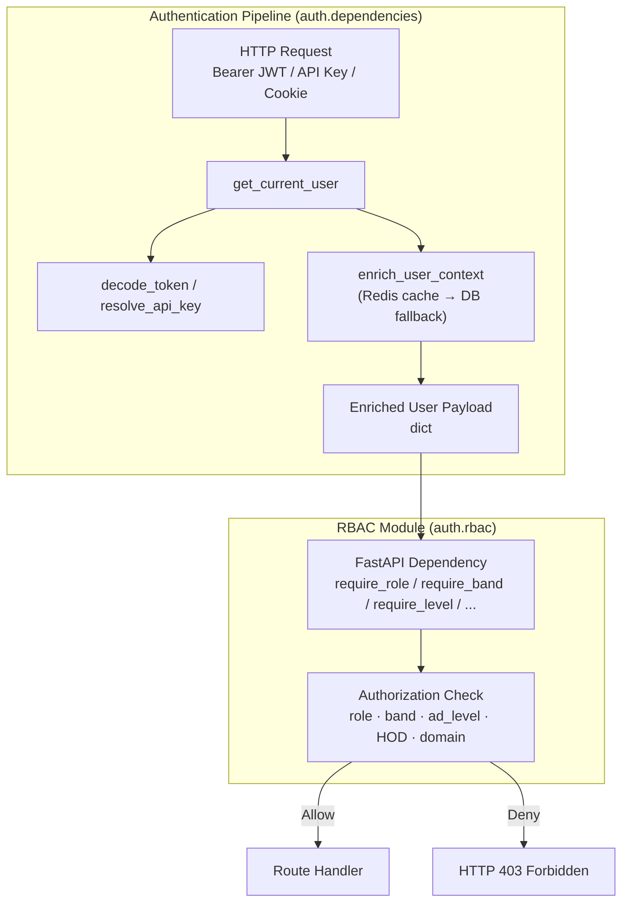
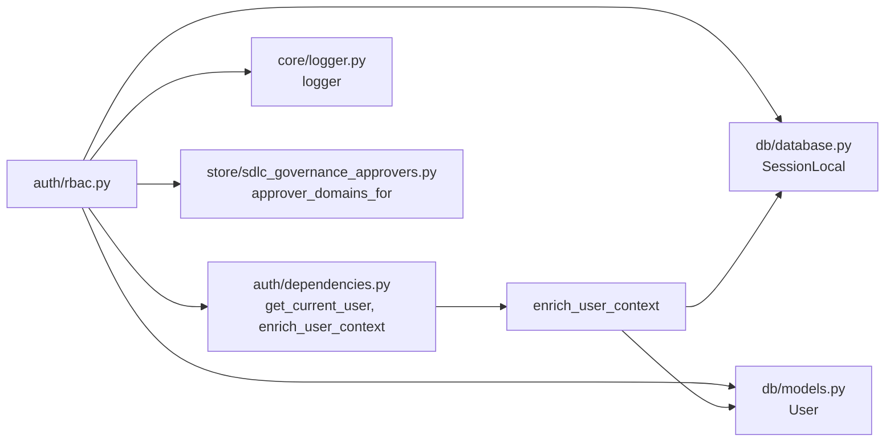
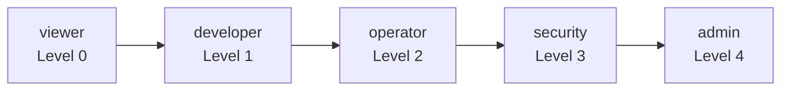
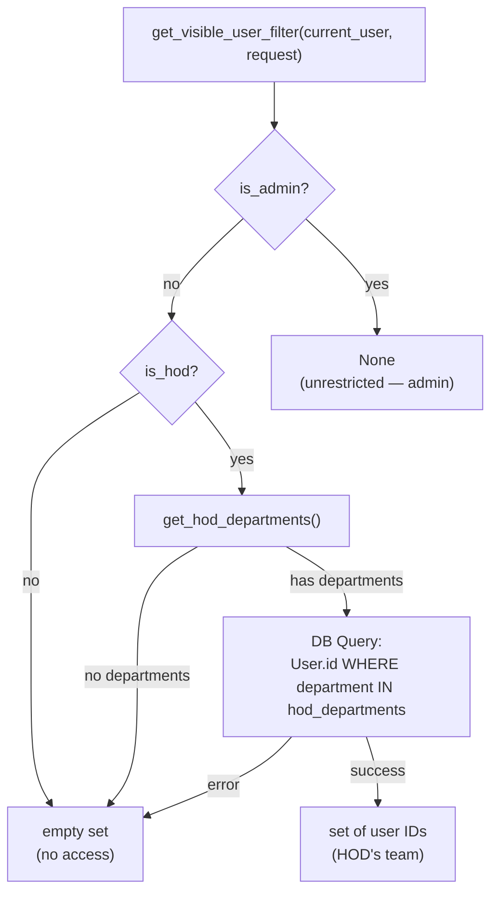
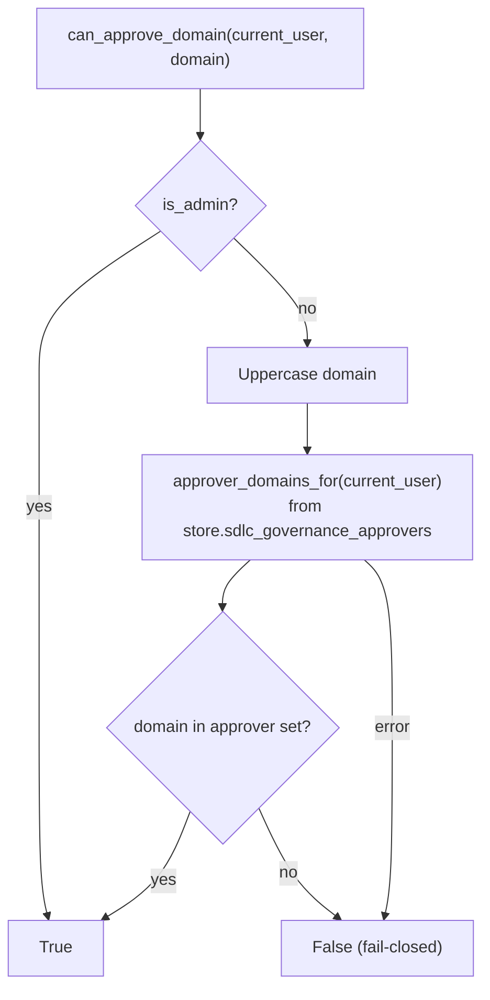
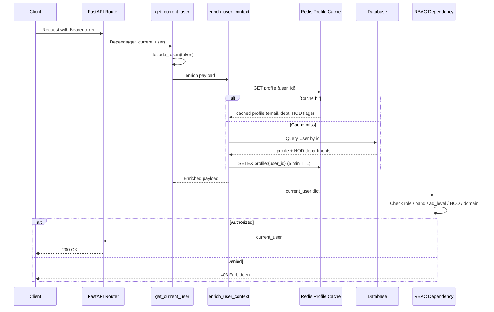

# Authentication RBAC Module

## Overview

The `authentication_rbac` module (`auth/rbac.py`) is the **central authorization layer** for the platform. It combines multiple access-control paradigms into a single set of FastAPI dependency factories and non-raising helper functions:

| Paradigm | Purpose | Key Functions |
|---|---|---|
| **RBAC** (Role-Based Access Control) | Enforce a five-tier role hierarchy with inherited permissions | `require_role`, `require_permission` |
| **ABAC** (Attribute-Based Access Control) | Enforce minimum corporate band levels (A1–E) | `require_band`, `require_c1_plus` |
| **AD Seniority Levels** | Gate actions by Active Directory org-tree seniority | `require_level`, `require_approval` |
| **Product Membership** | Restrict access to product-scoped resources | `check_product_membership`, `require_product_member` |
| **HOD Department Scoping** | Limit visible users to a Head of Department's teams | `get_visible_user_filter`, `is_hod` |
| **Governance Domain Approval** | Segregation-of-duties gate for SDLC governance findings | `can_approve_domain`, `is_governance_lead` |

All authorization checks operate on the **enriched user payload** produced by [`authentication_dependencies`](authentication_dependencies.md) (`get_current_user` → `enrich_user_context`). The JWT itself carries only minimal authorization claims (`sub`, `role`, `org_id`, `ad_level`); PII and HOD flags are injected server-side from a Redis-cached DB lookup.

---

## Architecture



### Module Dependencies



| Dependency | Role | Documentation |
|---|---|---|
| `auth.dependencies.get_current_user` | Extracts and validates identity from JWT/API key/cookie; returns enriched payload | [authentication_dependencies](authentication_dependencies.md) |
| `auth.dependencies.enrich_user_context` | Injects PII, HOD flags, and department info from Redis/DB | [authentication_dependencies](authentication_dependencies.md) |
| `core.logger` | Structured logging for denied access and errors | [core_logger](core_logger.md) |
| `db.database.SessionLocal` | SQLAlchemy session factory for HOD user-scope queries | [database](database.md) |
| `db.models.User` | User ORM model (department, id) used for HOD scoping | [database](database.md) |
| `store.sdlc_governance_approvers.approver_domains_for` | Returns active governance domains a user may approve | [store_layer](store_layer.md) |

---

## Role Hierarchy and Permissions

### Role Tiers

Roles are ordered from least to most privileged. Each role inherits all permissions from every lower tier.



| Role | Level | Description |
|---|---|---|
| `viewer` | 0 | Read-only: view chats, agents, skills, workflows, projects, threads, inbox, metrics, health |
| `developer` | 1 | Viewer + write access to chats, agents, skills, workflows, threads |
| `operator` | 2 | Developer + project/codebase management, MCP read, budget read |
| `security` | 3 | Operator + audit logs, compliance logs, user list |
| `admin` | 4 | Full access: user management, budget write, MCP governance, `admin:all` |

> **Legacy alias:** The role string `"user"` is mapped to level 1 (developer) so older tokens work without DB migration.

### Permission Catalogue

Permissions are string keys organized by role. `get_all_permissions(role)` returns the full inherited set; `has_permission(role, permission)` checks membership.

| Role | Permissions Added |
|---|---|
| `viewer` | `chat:read`, `agent:read`, `skill:read`, `workflow:read`, `project:read`, `thread:read`, `inbox:read`, `metrics:read`, `health:read` |
| `developer` | `chat:write`, `agent:write`, `skill:write`, `workflow:write`, `thread:write` |
| `operator` | `project:write`, `codebase:write`, `mcp:read`, `budget:read` |
| `security` | `audit:read`, `compliance:read`, `user:read` |
| `admin` | `user:write`, `budget:write`, `mcp:write`, `mcp:approve`, `admin:all` |

### RBAC Dependency Functions

| Function | Type | Description |
|---|---|---|
| `require_role(minimum_role)` | Factory | Returns a FastAPI dependency that enforces a minimum role level |
| `require_permission(permission)` | Factory | Returns a FastAPI dependency that checks for a specific permission string |
| `require_viewer` | Dependency | Alias for `require_role("viewer")` |
| `require_developer` | Dependency | Alias for `require_role("developer")` |
| `require_operator` | Dependency | Alias for `require_role("operator")` |
| `require_security` | Dependency | Alias for `require_role("security")` |
| `require_admin` | Dependency | Alias for `require_role("admin")` |
| `get_all_permissions(role)` | Helper | Returns all inherited permissions for a role |
| `has_permission(role, permission)` | Helper | Non-raising permission check |
| `_role_level(role)` | Helper (private) | Returns numeric level for a role string; `-1` if unknown |

**Usage example:**

```python
from auth.rbac import require_role, require_permission

@router.get("/admin/users")
def list_users(user=Depends(require_role("admin"))):
    ...

@router.post("/mcp/tools/{tool_id}/approve")
def approve_tool(user=Depends(require_permission("mcp:approve"))):
    ...
```

---

## ABAC Band Levels

Corporate band levels provide an attribute-based gate independent of role. The hierarchy maps bands to integers 1–9.

| Band | Level | | Band | Level |
|---|---|---|---|---|
| A1 | 1 | | C1 | 5 |
| A2 | 2 | | C2 | 6 |
| B1 | 3 | | D1 | 7 |
| B2 | 4 | | D2 | 8 |
| | | | E | 9 |

| Function | Type | Description |
|---|---|---|
| `require_band(min_band_level)` | Factory | Enforces minimum band level from JWT `band_level` claim; **admins bypass** |
| `is_c1_plus(current_user)` | Helper | Non-raising check: `band_level >= 5` or admin |
| `require_c1_plus` | Dependency | Direct dependency requiring C1 band or above; used for product creation |

```python
from auth.rbac import require_band, require_c1_plus

@router.post("/products")
def create_product(user=Depends(require_c1_plus)):
    ...

@router.post("/budget/increase")
def request_increase(user=Depends(require_band(5))):  # C1+
    ...
```

---

## AD Seniority Levels

Active Directory org-tree levels provide a seniority-based gate. The `ad_level` field is populated by a nightly org-tree sync (see [authentication_ldap](authentication_ldap.md)).

| `ad_level` | Meaning |
|---|---|
| 0 | Most senior executive |
| 3 | Senior management threshold (can approve) |
| 6 | Junior engineer (default) |

| Function | Type | Description |
|---|---|---|
| `require_level(max_level)` | Factory | Passes if `ad_level <= max_level`; **admins bypass** |
| `require_approval` | Dependency | Requires `ad_level <= 3` (senior management+); admins bypass |
| `can_approve(current_user)` | Helper | Non-raising check for approval authority |

```python
from auth.rbac import require_approval, require_level

@router.post("/sdlc/runs/{run_id}/approve")
def approve_run(user=Depends(require_approval)):
    ...

@router.get("/director/dashboard")
def director_dashboard(user=Depends(require_level(2))):
    ...
```

---

## Product Membership

Product-scoped endpoints restrict access to users who are members of the target product. Because `product_id` is extracted from path/query parameters inside the route handler, the dependency is a pass-through and the actual check is performed by `check_product_membership()`.

| Function | Type | Description |
|---|---|---|
| `require_product_member(product_id_param)` | Factory | Pass-through dependency; route handler must call `check_product_membership` |
| `check_product_membership(current_user, product_id)` | Helper | Raises HTTP 403 if user is not admin, product owner, or product member |

```python
from auth.rbac import require_product_member, check_product_membership

@router.delete("/products/{product_id}")
def delete_product(
    product_id: str,
    user=Depends(require_product_member("product_id")),
):
    check_product_membership(user, product_id)
    ...
```

---

## HOD Department Scoping

Head of Department (HOD) flags are injected by `enrich_user_context()` during authentication. The RBAC module provides helpers to determine the set of users a caller is allowed to see.



| Function | Type | Description |
|---|---|---|
| `is_hod(current_user)` | Helper | Returns `True` if `is_hod` flag is set on the payload |
| `get_hod_departments(current_user)` | Helper | Returns a defensive copy of `hod_departments` list |
| `get_visible_user_filter(current_user, request)` | Helper | Returns `None` (admin, unrestricted), `set[str]` (HOD's team), or empty set (everyone else) |

**Key behaviours:**

- **Memoization:** Results are cached on `request.state.hod_user_ids` so the DB query runs at most once per request.
- **Fail-closed:** On any DB error, the HOD sees an empty set rather than all users.
- **Admin precedence:** Admins always return `None` (unrestricted), even if they are also an HOD. The `is_hod` flag is preserved so the UI can show both Admin and Team views.

---

## Governance Domain Approval

These helpers enforce **segregation of duties** in the SDLC governance pipeline. They ensure only designated domain approvers (or admins) can approve security findings for a specific governance domain.



| Function | Type | Description |
|---|---|---|
| `can_approve_domain(current_user, domain, db)` | Helper | Non-raising check: admin or active approver for the domain |
| `is_governance_lead(current_user, db)` | Helper | Non-raising check: admin or active approver for ≥1 domain |
| `can_manage_suppression(current_user, db)` | Helper | Non-raising check for unrestricted suppression management; delegates to `is_governance_lead` |

**Security notes:**

- All three helpers are **fail-closed** — any lookup error returns `False`.
- `can_approve_domain` uppercases the domain before lookup and matches by `email` or `sub`/`user_id`.
- `can_manage_suppression` is the "unrestricted" gate only. Ordinary authors may still create suppressions for their own repo/product; that scope check is enforced at the router level, not here.

---

## User Payload Contract

All RBAC functions expect the enriched `current_user` dict produced by `get_current_user`. The following fields are consumed:

| Field | Source | Used By |
|---|---|---|
| `role` | JWT claim | `require_role`, `require_permission`, `require_band`, `require_level`, `require_approval`, `require_admin_flag`, `is_admin`, all governance helpers |
| `band_level` | JWT claim / DB | `require_band`, `is_c1_plus`, `require_c1_plus` |
| `ad_level` | DB (AD sync) | `require_level`, `require_approval`, `can_approve` |
| `product_ids` | DB / enrichment | `check_product_membership` |
| `is_hod` | `enrich_user_context` | `is_hod`, `get_visible_user_filter` |
| `hod_departments` | `enrich_user_context` | `get_hod_departments`, `get_visible_user_filter` |
| `email` | `enrich_user_context` | `can_approve_domain` |
| `sub` / `id` / `user_id` | JWT claim | `can_approve_domain` |

---

## Request Authorization Flow



---

## Admin Helpers

Several functions provide non-raising admin checks used throughout the codebase:

| Function | Type | Description |
|---|---|---|
| `is_admin(current_user)` | Helper | Returns `True` if `role == "admin"` |
| `require_admin_flag` | Dependency | Direct dependency requiring `role == "admin"`; raises HTTP 403 |
| `require_admin` | Dependency | Alias from `require_role("admin")` — same effect as `require_admin_flag` |

> **Note:** `auth.dependencies.require_admin` is a separate function in [authentication_dependencies](authentication_dependencies.md) that also enforces the admin role. The RBAC module's `require_admin` and `require_admin_flag` are equivalent alternatives.

---

## Integration Points

The RBAC module is consumed across the platform:

| Consumer | Example | Documentation |
|---|---|---|
| **Shared API Routers** | `_require_director`, `_require_admin_or_operator`, `_require_admin`, `require_broadcast_user` | [shared_api_routers](shared_api_routers.md) |
| **ABStudio Backend API** | `_wrapped_gateway_auth`, `require_admin` in `app/api/deps.py` | [api_deps](api_deps.md) |
| **Gateway** | Route-level authorization for agent, workflow, chat endpoints | [gateway](gateway.md) |
| **SDLC Governance Router** | Governance domain approval, suppression management | [sdlc_router](sdlc_router.md) |
| **Budget Router** | Admin/operator gates for budget management | [budget_router](budget_router.md) |
| **Auth Router** | Level overrides, user management | [auth_router](auth_router.md) |

---

## Security Considerations

1. **Fail-closed design:** All HOD scoping and governance approval helpers default to denial on errors. A DB failure never grants broader access.

2. **Admin bypass:** Admins bypass band, AD-level, and approval gates. This is intentional but means admin role assignment must be tightly controlled.

3. **PII not in JWT:** The JWT contains only minimal claims. Email, name, department, and HOD flags are injected server-side by `enrich_user_context` with a 5-minute Redis cache TTL. See [authentication_dependencies](authentication_dependencies.md).

4. **Cache invalidation:** When a user's profile changes, call `invalidate_profile_cache(user_id)` from [authentication_dependencies](authentication_dependencies.md) to evict the stale entry.

5. **Segregation of duties:** `can_approve_domain` is the critical gate preventing one team from approving another team's security findings. Any bug here has high-severity impact.

6. **HOD scope memoization:** `get_visible_user_filter` caches results on `request.state` to avoid repeated DB queries within a single request lifecycle.

7. **Lazy imports:** DB and store imports inside functions (`get_visible_user_filter`, `can_approve_domain`, `is_governance_lead`) prevent circular import issues and ensure the module loads even if optional dependencies are unavailable.
