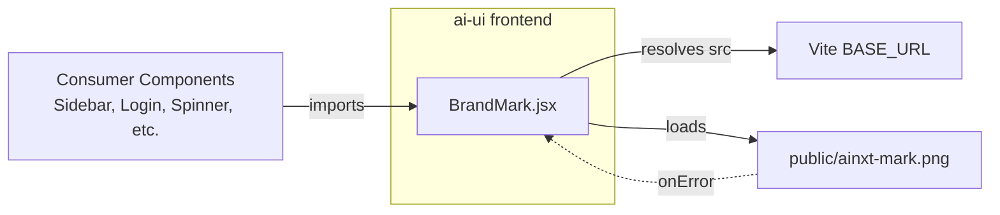
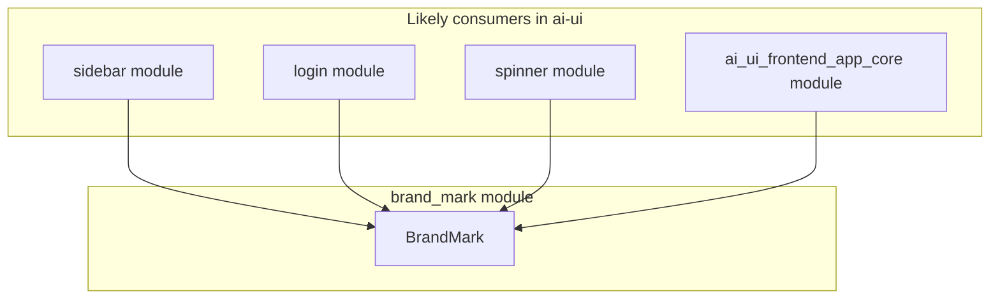
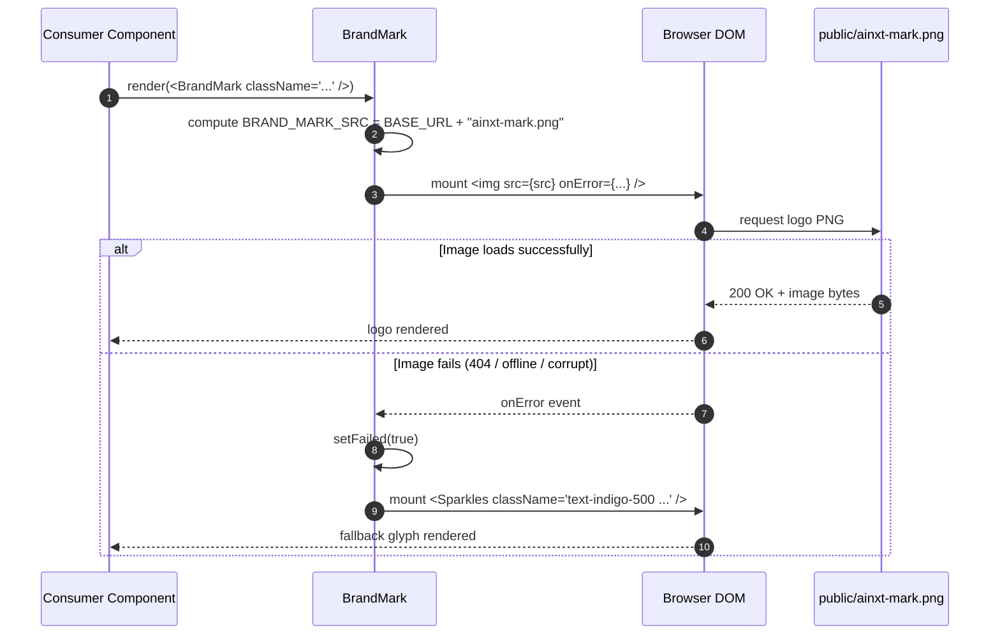

# Brand Mark Module

## Introduction

The `brand_mark` module provides the official **AiNxt logo mark** as a single, reusable React component. It is the single source of truth for the brand logo across the `ai-ui` frontend, ensuring consistent sizing, accessibility, and resilient rendering regardless of deployment environment or image availability.

The component is intentionally lightweight: it renders a transparent PNG served from the public assets folder, resolves the URL against Vite's `BASE_URL` so it works under both development (`/`) and production (`/portal/`) mounts, and falls back gracefully to a Lucide `Sparkles` glyph if the image fails to load.

---

## Core Component

### `BrandMark`

Located in `ai-ui/src/components/BrandMark.jsx`.

| Prop        | Type     | Default     | Description |
|-------------|----------|-------------|-------------|
| `className` | `string` | `"w-7 h-7"` | Tailwind sizing / animation classes applied to the rendered element. |
| `alt`       | `string` | `"AiNxt"`   | Accessible label for the logo. |
| `...rest`   | object   | —           | Any additional props are spread onto the underlying `` or fallback `<Sparkles>` element. |

#### Behavior

1. **Primary render**: an `` tag pointing to `${import.meta.env.BASE_URL}ainxt-mark.png`.
2. **Environment-aware URL**: Vite's `BASE_URL` is prepended so the asset resolves correctly when the SPA is mounted under `/portal/` in production.
3. **Graceful fallback**: if the PNG triggers an `onError` event (404, offline, corrupt file), the component re-renders using a `Sparkles` icon in the brand indigo color.
4. **Non-draggable**: the logo image is marked `draggable={false}` to avoid accidental drag interactions in the UI.

---

## Architecture

The component sits at the presentation layer of the `ai-ui` React application. It has no business logic, no external dependencies beyond `lucide-react`, and no state other than the local `failed` flag used to toggle the fallback glyph.

---

## Component Relationships

`BrandMark` is a shared presentational primitive. Other modules import it to display the AiNxt identity in navigation, authentication, loading, and layout shells. For details on those consuming modules, see:

- [ai_ui_frontend_app_core.md](ai_ui_frontend_app_core.md)
- [sidebar.md](sidebar.md)
- [login.md](login.md)
- [spinner.md](spinner.md)

---

## Data / Render Flow

---

## How It Fits into the System

The `brand_mark` module is part of the `ai_ui_frontend` subsystem. It supports the product's visual identity by centralizing the logo asset and its loading behavior. Because the component handles its own fallback, consumers do not need to guard against missing assets or environment-specific base paths.

Key integration points:

- **Vite build system**: relies on `import.meta.env.BASE_URL` to produce correct asset URLs in both dev and production builds.
- **Lucide icons**: uses `Sparkles` from `lucide-react` as the fallback glyph, keeping the dependency footprint minimal and consistent with the rest of the UI iconography.
- **Accessibility**: supports custom `alt` text and spreads ARIA-friendly props via `...rest`.

---

## Resilience & Edge Cases

| Scenario | Handling |
|----------|----------|
| Production mount under `/portal/` | `BASE_URL` is prepended to the PNG path. |
| Image 404 or offline | `onError` triggers state change; `Sparkles` glyph is rendered instead. |
| Corrupt image file | Same fallback path as 404. |
| Missing `className` | Defaults to `w-7 h-7`. |
| Missing `alt` | Defaults to `"AiNxt"`. |

---

## References

- [ai_ui_frontend.md](ai_ui_frontend.md) — parent frontend subsystem overview.
- [ai_ui_frontend_app_core.md](ai_ui_frontend_app_core.md) — top-level application shell that may render the brand mark.
- [sidebar.md](sidebar.md) — primary navigation consumer.
- [login.md](login.md) — authentication screen consumer.
- [spinner.md](spinner.md) — loading state consumer.
