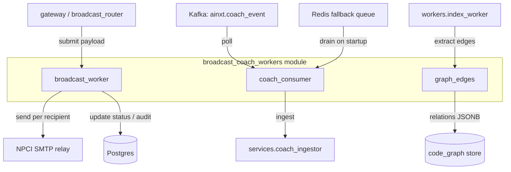
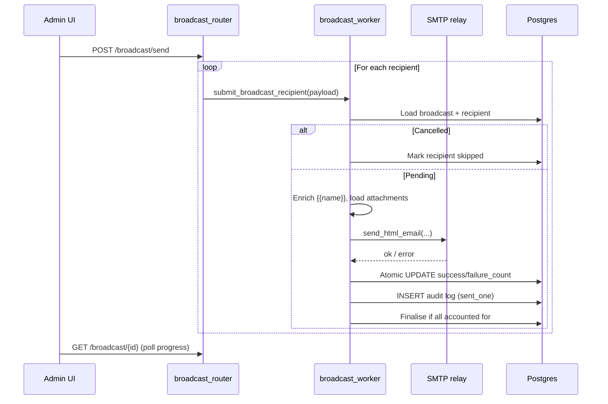
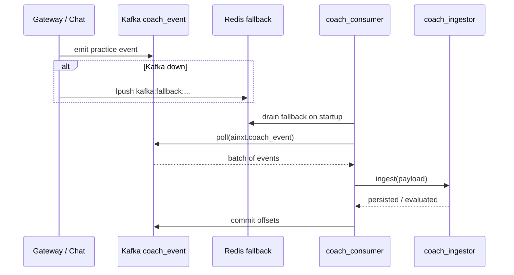
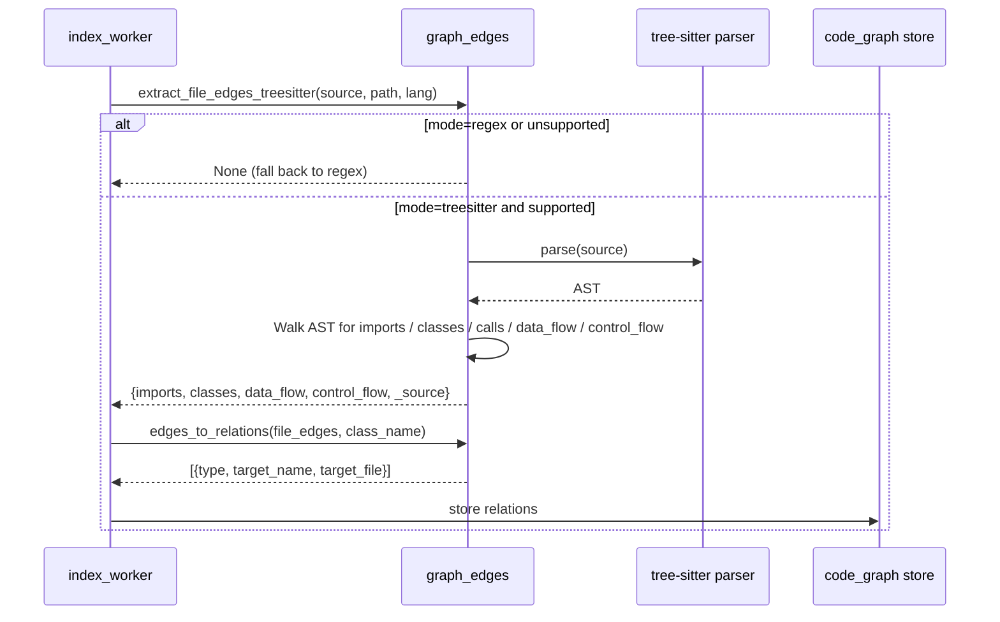

# broadcast_coach_workers

The `broadcast_coach_workers` module is a small, focused collection of background workers and utilities inside the larger `workers` package. It groups three independent capabilities that support the AiNxt / ABStudio platform:

1. **Admin email broadcast dispatch** — sends individual broadcast emails through the internal NPCI SMTP relay, tracks per-recipient status, and finalises the broadcast atomically.
2. **AI Coach event ingestion** — consumes the `ainxt.coach_event` Kafka topic (plus a Redis fallback queue) and feeds each event into the coach ingestion pipeline.
3. **AST-based code-graph edge extraction** — an optional tree-sitter extractor that produces `code_graph` relations (`imports`, `extends`, `implements`, `calls`, `data_flow`, `control_flow`) for repository indexing.

These components are deliberately lightweight: broadcast dispatch runs inside the gateway process on a bounded thread pool, the coach consumer is a standalone Kafka consumer, and the graph-edge helper is a pure utility invoked by the indexing worker.

---

## Architecture Overview

### Component Responsibilities

| Sub-module | File | Primary Role | Triggered By |
|------------|------|--------------|--------------|
| `broadcast_worker` | `workers/broadcast_worker.py` | Thread-safe, per-recipient email send with atomic counters and finalisation. | `gateway.py` / `broadcast_router.py` via `submit_broadcast_recipient()` |
| `coach_consumer` | `workers/coach_consumer.py` | Kafka consumer for coach practice events; drains Redis fallback on startup. | `workers/start_workers.py` or run standalone |
| `graph_edges` | `workers/graph_edges.py` | Tree-sitter AST extractor for code-graph relations; falls back to regex when disabled or unsupported. | `workers/index_worker.py` |

---

## Sub-module Documentation

- **[broadcast_coach_workers_broadcast](broadcast_coach_workers_broadcast.md)** — Email broadcast worker: thread-pool dispatch, name enrichment, attachment handling, atomic counters, and race-safe finalisation.
- **[broadcast_coach_workers_coach](broadcast_coach_workers_coach.md)** — Coach Kafka consumer: topic polling, batch handling, Redis fallback drain, idempotent ingestion, and graceful shutdown.
- **[broadcast_coach_workers_graph_edges](broadcast_coach_workers_graph_edges.md)** — AST graph-edge extractor: import / inheritance / call edges, plus optional data-flow and control-flow edges, with regex fallback.

---

## Data Flows

### Broadcast Dispatch Flow

### Coach Event Ingestion Flow

### Code-Graph Edge Extraction Flow

---

## Integration with the Overall System

- **Gateway / Broadcast Router**: When an admin sends a broadcast, the router resolves recipients and calls `submit_broadcast_recipient()` for each one. The router returns immediately; the UI polls the broadcast status endpoint for progress. See [gateway](gateway.md) and [shared_api_routers broadcast_router](shared_api_routers.md) for the API surface.
- **Worker Orchestration**: `workers/start_workers.py` can launch the coach consumer as part of the worker fleet. See [workers](workers.md) for the broader worker orchestration model.
- **Indexing Pipeline**: `workers/index_worker.py` calls `extract_file_edges_treesitter()` when `SDLC_GRAPH_EDGE_MODE=treesitter` to improve code-graph accuracy over the legacy regex extractor. The resulting relations are stored in the same `code_graph` JSONB shape, so downstream consumers (e.g., [shared_core models/graph_resolver](shared_core.md)) require no changes.
- **Shared Services**: The broadcast worker depends on [shared_core database](shared_core.md) models (`EmailBroadcast`, `EmailBroadcastRecipient`, `EmailBroadcastAttachment`, `EmailBroadcastAuditLog`) and the SMTP service. The coach consumer depends on [shared_core config/kv](shared_core.md) and the coach ingestor service.

---

## Operational Notes

- **Broadcast thread pool size** is controlled by `BROADCAST_THREADS` (default `8`) to stay below the internal SMTP relay saturation point.
- **Coach consumer** uses `COACH_CONSUMER_BATCH`, `COACH_CONSUMER_POLL_SECS`, and `COACH_CONSUMER_GROUP` for tuning. In dev, `COACH_DIRECT_INGEST=true` makes the consumer a safe no-op second path because ingestion is idempotent.
- **Graph edge mode** defaults to `regex`; set `SDLC_GRAPH_EDGE_MODE=treesitter` to enable AST extraction. The AST path only *adds* coverage and never strands a language because the caller falls back to regex on `None`.
