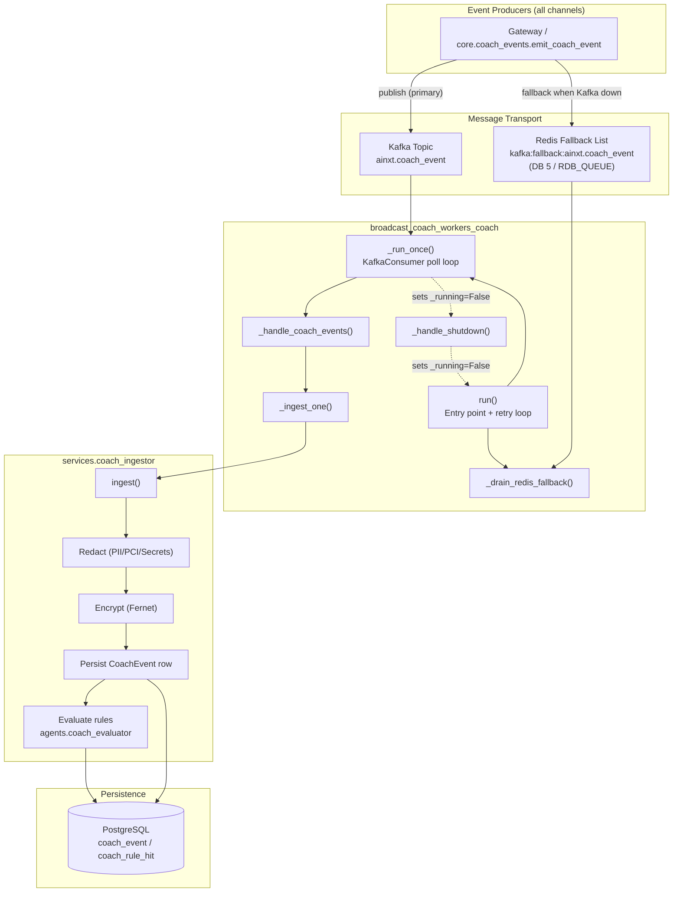
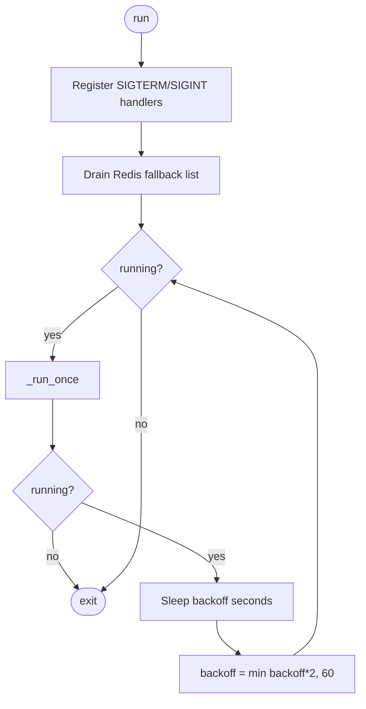
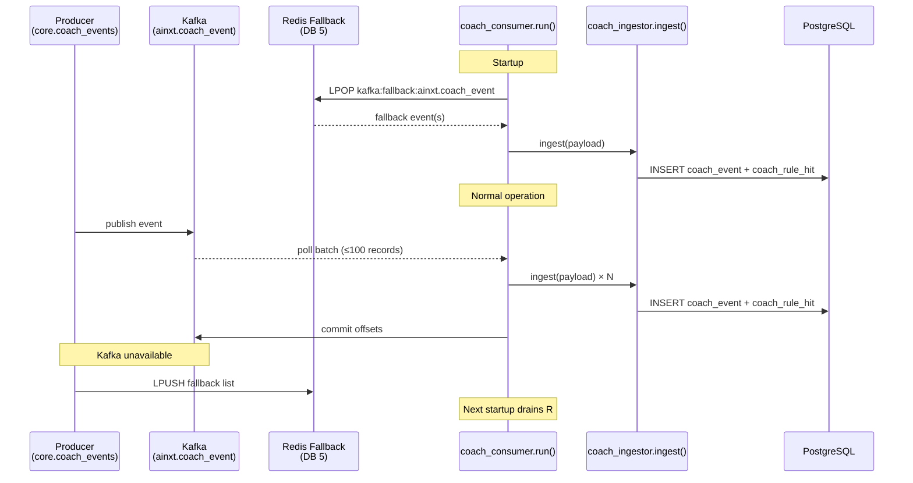
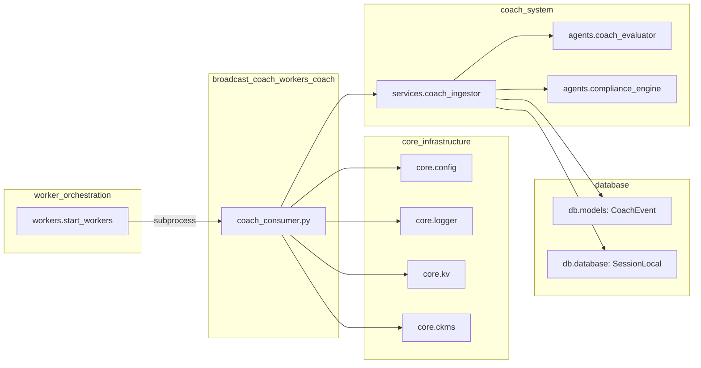
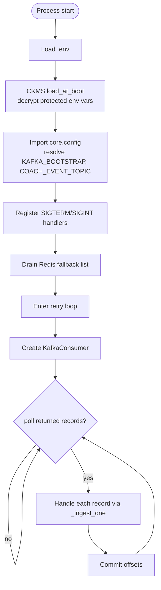
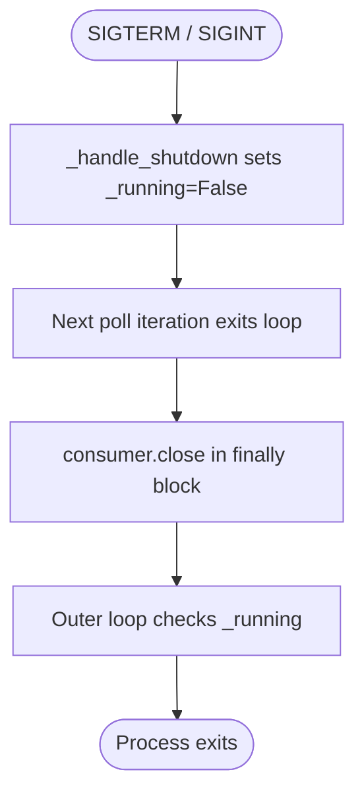

# broadcast_coach_workers_coach

## Introduction

The `broadcast_coach_workers_coach` module is the **Kafka consumer** for the AiNxt Coach pipeline. It is the production ingestion path for normalized per-interaction "practice events" — every LLM interaction across web, CLI, API, Teams, Slack, MCP/IDE, voice, workflow, and agent channels is emitted to the `ainxt.coach_event` Kafka topic, and this consumer drains that topic, handing each event to the [Coach ingestor](#ingestion-pipeline) for redaction, encryption, persistence, and rule evaluation.

In development (`COACH_DIRECT_INGEST=true`, the default), the gateway ingests events synchronously via a bounded thread pool, so this consumer is an optional second path. In production (`COACH_DIRECT_INGEST=false`), this consumer is the **sole ingestion path** and owns the `ainxt-coach-consumer` Kafka consumer group.

This module is a child of the [broadcast_coach_workers](broadcast_coach_workers.md) parent module, which groups three functionally independent worker components:

| Child module | File | Purpose |
|---|---|---|
| [broadcast_coach_workers_broadcast](broadcast_coach_workers_broadcast.md) | `workers/broadcast_worker.py` | Email broadcast recipient dispatch |
| **broadcast_coach_workers_coach** (this module) | `workers/coach_consumer.py` | Coach event Kafka consumer |
| [broadcast_coach_workers_graph_edges](broadcast_coach_workers_graph_edges.md) | `workers/graph_edges.py` | Code-graph relation extraction |

---

## Architecture Overview

---

## Core Components

### `run()`

The module entry point and top-level supervisor. Responsibilities:

1. Registers `SIGTERM` and `SIGINT` handlers via `_handle_shutdown()`.
2. Drains the Redis fallback list (`_drain_redis_fallback()`) so no event emitted while Kafka was unavailable is lost.
3. Enters an outer retry loop that calls `_run_once()`. If the consumer disconnects or crashes, it reconnects with exponential backoff (starting at 5 s, doubling up to a 60 s cap).
4. Exits cleanly when `_running` is set to `False` by the shutdown handler.

### `_handle_shutdown(sig, frame)`

Signal handler that sets the module-level `_running` flag to `False`. This allows the poll loop inside `_run_once()` to break out on the next iteration and the outer loop in `run()` to stop retrying. The consumer then closes the Kafka consumer cleanly in the `finally` block of `_run_once()`.

### `_run_once()`

Connects to the Kafka broker and consumes events until shutdown or a fatal connection error. Key characteristics:

| Setting | Value | Source |
|---|---|---|
| Topic | `COACH_EVENT_TOPIC` (default `ainxt.coach_event`) | `core.config` |
| Consumer group | `COACH_CONSUMER_GROUP` (default `ainxt-coach-consumer`) | env var |
| Auto offset reset | `earliest` | hard-coded |
| Auto commit | Disabled (manual commit after batch) | hard-coded |
| Max poll records | `COACH_CONSUMER_BATCH` (default `100`) | env var |
| Poll timeout | `COACH_CONSUMER_POLL_SECS` (default `1.0` s) | env var |
| Session timeout | 30 000 ms | hard-coded |
| Heartbeat interval | 10 000 ms | hard-coded |

The poll loop:
1. Calls `consumer.poll()` with the configured timeout.
2. For each topic-partition batch, deserializes message values (JSON dicts) and passes them to `_handle_coach_events()`.
3. Commits offsets manually after the entire batch is processed.
4. On shutdown or error, closes the consumer in a `finally` block.

### `_handle_coach_events(records)`

Iterates a list of deserialized event dicts and calls `_ingest_one()` for each. This is a thin dispatcher — all error handling lives in `_ingest_one()`.

### `_ingest_one(payload)`

Runs the Coach ingestor on a single event payload. **Swallows all exceptions** so one bad event cannot crash the consumer or poison subsequent events. Logs the user, channel, model, request ID, thread ID, and prompt length before ingesting.

Delegates to `services.coach_ingestor.ingest()`, which performs the full pipeline described in [Ingestion Pipeline](#ingestion-pipeline).

### `_drain_redis_fallback()`

On startup, drains events that were written to the Redis fallback list while Kafka was down. The Kafka producer in `core.coach_events` writes to `kafka:fallback:{COACH_EVENT_TOPIC}` on Redis DB 5 (`RDB_QUEUE`) when it cannot reach a broker. This function:

1. Acquires a KV client for `RDB_QUEUE` via `core.kv.get_kv()`.
2. Repeatedly `LPOP`s from the fallback key until empty.
3. Passes each JSON-decoded record to `_ingest_one()`.
4. Logs the total number of drained events.

Failures during draining are logged as warnings and do not prevent the Kafka consumer from starting.

---

## Ingestion Pipeline

The consumer delegates all processing to `services.coach_ingestor.ingest()`. The pipeline is documented in detail in the [Coach System](coach_system.md) module; a summary is provided here for context:

```mermaid
flowchart LR
    PAYLOAD[Raw event payload] --> NORM[Normalise fields]
    NORM --> REDACT[Redact PII/PCI/Secrets<br/>compliance_engine]
    REDACT --> HASH[SHA-256 hash<br/>pre-redaction prompt]
    HASH --> ENCRYPT[Fernet encrypt<br/>redacted prompt]
    ENCRYPT --> PERSIST[Persist CoachEvent row]
    PERSIST --> CTX[Build evaluator context<br/>recent user events]
    CTX --> EVAL[Evaluate rules<br/>coach_evaluator]
    EVAL --> HITS[Write coach_rule_hit rows]
    HITS --> BACKFILL[Back-fill event.rule_hits]
```

**Key safety properties:**
- Raw prompts **never** touch the database — redaction happens before persistence.
- The pre-redaction prompt is SHA-256 hashed for dedup/correlation without storing the original.
- The redacted prompt is encrypted at rest with Fernet (`COACH_FERNET_KEY`).
- Evaluation failures do not lose the event — the persisted row survives even if rule evaluation fails.
- `ingest()` never raises into the caller (fire-and-forget consumer context).

For details on the rule predicates and evaluation logic, see [Coach System](coach_system.md).

---

## Data Flow

---

## Dependencies

### External library dependencies

| Dependency | Purpose |
|---|---|
| `kafka-python` | Kafka consumer client (`KafkaConsumer`) |
| `python-dotenv` | `.env` loading before config imports |
| `redis` / `core.kv` | Redis fallback list drain |
| `sqlalchemy` | Used transitively via the ingestor for DB persistence |

### Internal module dependencies

| Module | Reference | Role |
|---|---|---|
| `core_infrastructure` | [Core Infrastructure](core_infrastructure.md) | `core.config` (Kafka/Redis/Coach settings), `core.logger`, `core.kv.get_kv`, `core.ckms.load_at_boot` |
| `coach_system` | [Coach System](coach_system.md) | `services.coach_ingestor.ingest()`, `agents.coach_evaluator` rule engine, `agents.compliance_engine` redaction |
| `database` | [Database](database.md) | `db.models.CoachEvent`, `db.database.SessionLocal` |
| `kv_store` | [KV Store](kv_store.md) | Redis DB allocation (`RDB_QUEUE` = DB 5) and `get_kv()` abstraction |
| `ckms` | [CKMS](ckms.md) | Decrypts protected env vars at boot before config import |
| `worker_orchestration` | [Worker Orchestration](worker_orchestration.md) | `start_workers.py` launches this consumer as a subprocess when `--coach` is passed and `ENABLE_COACH=true` / `COACH_DIRECT_INGEST=false` |

---

## Configuration

All configuration is environment-variable driven. See [Core Infrastructure](core_infrastructure.md) for the central config module.

### Coach consumer settings

| Env var | Default | Description |
|---|---|---|
| `KAFKA_BOOTSTRAP` | `localhost:9092` | Comma-separated Kafka broker addresses |
| `COACH_EVENT_TOPIC` | `ainxt.coach_event` | Kafka topic to consume |
| `COACH_CONSUMER_GROUP` | `ainxt-coach-consumer` | Kafka consumer group ID |
| `COACH_CONSUMER_BATCH` | `100` | Max records per poll (`max_poll_records`) |
| `COACH_CONSUMER_POLL_SECS` | `1.0` | Poll timeout in seconds |
| `ENABLE_COACH` | `false` | Master feature flag — when false, Coach is entirely disabled |
| `COACH_DIRECT_INGEST` | `true` | When true, gateway ingests synchronously (dev). When false, this consumer is the sole ingestion path (prod). |
| `COACH_FERNET_KEY` | falls back to `FERNET_KEY` | Fernet key for encrypting redacted prompts at rest |

### Redis fallback

| Env var / constant | Value | Description |
|---|---|---|
| `RDB_QUEUE` | `5` | Redis DB number for job queues and Kafka fallback lists |
| Fallback key | `kafka:fallback:{COACH_EVENT_TOPIC}` | List key where the producer writes events when Kafka is unreachable |

---

## Process Lifecycle

### Startup

### Shutdown

### Error handling and resilience

| Failure scenario | Behaviour |
|---|---|
| `kafka-python` not installed | Logs error and returns from `_run_once()`; outer loop retries (will keep failing until installed) |
| Broker connection failure | Logs error, returns from `_run_once()`, outer loop retries with exponential backoff (5 s → 60 s cap) |
| `_run_once()` crashes unexpectedly | Caught by outer `try/except` in `run()`, logged, and retried after backoff |
| Single event ingest failure | `_ingest_one()` swallows the exception and logs it; batch processing continues |
| Handler error in `_handle_coach_events()` | Logged; batch is still committed to avoid poison-pill stalls |
| Commit failure | Logged; consumer continues polling (offsets may be reprocessed on next commit) |
| Redis fallback drain failure | Logged as warning; does not block Kafka consumer startup |

---

## Orchestration

This consumer is launched by the [Worker Orchestration](worker_orchestration.md) module (`workers/start_workers.py`). When started with `--coach`:

1. `start_workers.main()` checks `ENABLE_COACH` and `COACH_DIRECT_INGEST`.
2. If `ENABLE_COACH=true` **and** `COACH_DIRECT_INGEST=false` (production), it spawns `coach_consumer.py` as a subprocess via `_run_coach_consumer()`.
3. If `COACH_DIRECT_INGEST=true` (dev), the consumer is **not** started to avoid double-consumption — the gateway's direct-ingest thread pool handles all events.

The consumer process has its own internal retry loop for broker reconnection, so `start_workers` does not respawn it. PM2 or `start_all.sh` supervises the parent worker process.

---

## Relationship to Sibling Modules

The three children of [broadcast_coach_workers](broadcast_coach_workers.md) are **functionally independent** — they share a parent grouping but have no runtime dependencies on each other:

- **[broadcast_coach_workers_broadcast](broadcast_coach_workers_broadcast.md)** — Dispatches email broadcast recipients via a thread pool (`_run_one_safe` → `send_broadcast_recipient`).
- **This module** — Consumes Kafka coach events and ingests them for evaluation.
- **[broadcast_coach_workers_graph_edges](broadcast_coach_workers_graph_edges.md)** — Converts structured code-extractor output into `code_graph` relation JSONB entries.

---

## Key Design Decisions

1. **Observational, never blocking** — Coach is strictly observational. The consumer and ingestor never raise into callers and never block the request path. Events are fire-and-forget.

2. **Dual ingestion paths** — In dev, `COACH_DIRECT_INGEST=true` lets the gateway ingest inline without Kafka. In prod, this consumer is the sole path. The ingestor is idempotent at the row level (fresh `event_id` per emit), so even if both paths run temporarily, duplicate processing is safe.

3. **Redis fallback for zero event loss** — When Kafka is unavailable, the producer writes to a Redis fallback list. This consumer drains that list on every startup, ensuring events emitted during Kafka outages are eventually ingested.

4. **Manual offset commit** — Offsets are committed only after a batch is fully processed, preventing skipped events on consumer crash. Handler errors are swallowed and the batch is still committed to avoid poison-pill stalls.

5. **CKMS before config** — Protected env vars are decrypted via `core.ckms.load_at_boot()` before `core.config` is imported, ensuring all secrets are available at import time.

6. **Exponential backoff reconnection** — Broker disconnections trigger exponential backoff (5 s → 60 s cap), allowing the consumer to survive transient Kafka outages without manual intervention.
