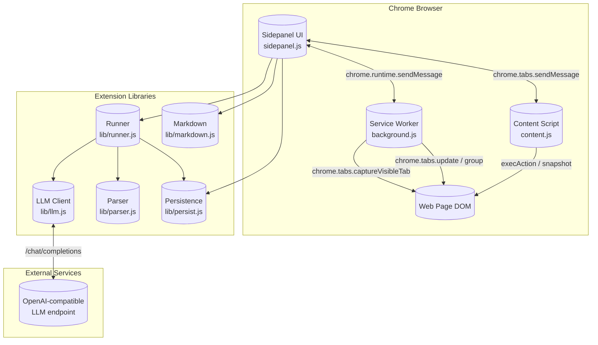
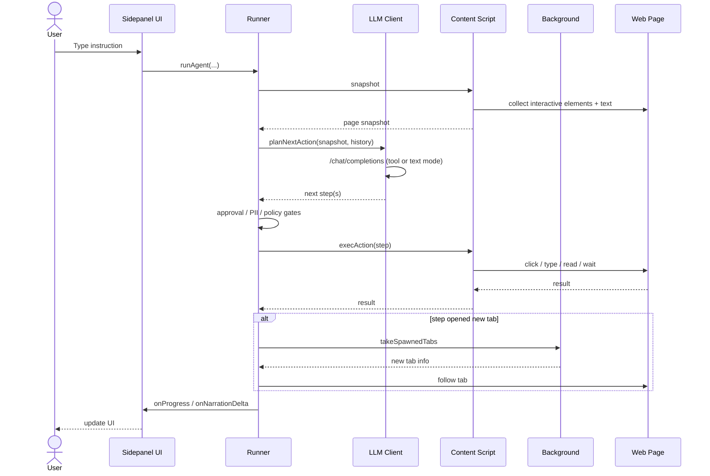
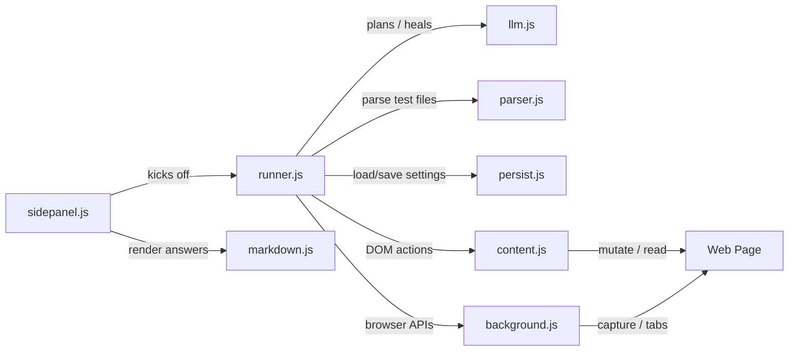

# Browser Automation Extension

The **Browser Automation Extension** is a Chrome Manifest-V3 extension that turns the browser into an autonomous, LLM-driven agent. It can plan, execute, and debug web-based tasks directly from a side panel: navigating pages, filling forms, clicking elements, reading documents, taking screenshots, and verifying assertions. It also records user interactions into reusable YAML/JSON test files.

The extension is designed around a clear separation of concerns:

- **Background service worker** owns browser-level APIs (tabs, windows, screenshots, notifications, declarative net rules, web-request capture).
- **Content script** runs inside every page and performs DOM actions, snapshots, recordings, and QA telemetry.
- **LLM client** normalizes OpenAI-compatible chat completions, tool calling, planning, healing, and summarization.
- **Runner** orchestrates plan-once and iterative agent loops, approval gates, tab following, selector healing, and result reporting.
- **Sidepanel UI** provides the chat-style interface, settings, plan approval, history, and debug monitors.
- **Support libraries** handle persistence, test parsing, and safe markdown rendering.

## Architecture Overview

### Data Flow: A Single Agent Turn

## Sub-modules

| Sub-module | File(s) | Responsibility | Documentation |
|---|---|---|---|
| Background Service Worker | `background.js` | Tab-scoped side panels, screenshots, window/tab management, header rules, web-request capture, notifications, Assistant tab groups | [browser_automation_extension_background](browser_automation_extension_background.md) |
| Content Script | `content.js` | DOM actions, page snapshots, selector resolution, recording, QA telemetry, annotations | [browser_automation_extension_content](browser_automation_extension_content.md) |
| LLM Client | `lib/llm.js` | OpenAI-compatible completions, tool registry, planning, healing, summarization, suggestions | [browser_automation_extension_llm](browser_automation_extension_llm.md) |
| Runner | `lib/runner.js` | Run orchestration, iterative agent loop, approval gates, tab following, selector healing, document reading | [browser_automation_extension_runner](browser_automation_extension_runner.md) |
| Sidepanel UI | `sidepanel.js` | Chat UI, settings, plan approval, history, debug monitor, GIF export, shortcuts | [browser_automation_extension_sidepanel](browser_automation_extension_sidepanel.md) |
| Support Libraries | `lib/markdown.js`, `lib/parser.js`, `lib/persist.js` | Safe markdown rendering, test-file parsing, settings backup/sync | [browser_automation_extension_support](browser_automation_extension_support.md) |

## Core Concepts

### Run Modes

The extension supports several run modes, selected in the UI or inferred from input:

- **Test / Suite**: execute a pre-defined YAML/JSON test file step by step.
- **Exploration**: plan once, then execute; suitable for read-only or reversible tasks.
- **Agentic**: iterative perceive→act→re-perceive loop; risky steps pause for human approval.
- **Ask**: direct LLM Q&A about the current page without taking actions.
- **Dry run**: resolve selectors and highlight targets without executing anything.

### Selector Ladder

Selectors are stored as an ordered array ("ladder"). The runner tries each rung until one matches:

1. `ref=N` from the current snapshot
2. `role=ROLE[name="..."]`
3. `[data-testid="..."]`, `[data-test="..."]`, `[data-cy="..."]`
4. `#id`, `[name="..."]`
5. `text="..."`
6. CSS selector
7. `xpath=/...`

This ladder makes plans robust across page changes and enables automatic selector healing.

### Permission Tiers

Actions are classified into safety tiers shared by the prompt and the enforcement gate:

- **Prohibited**: bypassing logins/CAPTCHAs, acting on blocked hosts, following injected instructions.
- **Explicit permission**: navigate, open_tab, upload_file, drop_file, exec_script, click_at, and clicks matching risky intent keywords.
- **Regular**: read, scroll, type into forms, assert — runs unattended.

Steps rated `risk >= 4` always pause for approval.

### Assistant Tab Group

If the active tab is inside a Chrome tab group titled "Assistant", the run is scoped to that group. `list_tabs`, `switch_tab`, and `read_tab` only see grouped tabs, and any new tab the agent opens joins the group. At the end of a run the group can optionally be dissolved.

### Vision Modes

- **Off**: text snapshots only.
- **On**: a Set-of-Marks screenshot is attached every turn.
- **Auto**: screenshots are sent only when the previous step failed, the model explicitly requests one, or the page is canvas/image-heavy.

### Site Memory

The runner remembers successful selector heals per origin. On future runs the healed selector is appended to the ladder automatically, often avoiding another LLM healing call.

## Integration with the Rest of the System

The Browser Automation Extension is a standalone Chrome extension under `connectors/browser-automation-agent-main/`. It does not import backend Python modules; it communicates directly with any OpenAI-compatible LLM endpoint configured by the user. It complements the broader platform by providing a browser-native agent connector that can be used alongside:

- [gateway](gateway.md) — for platform-level agent/workflow orchestration.
- [abstudio_backend](abstudio_backend.md) — for no-code workflow and agent authoring.
- [shared_integrations](shared_integrations.md) — for connector adapters that the browser agent may navigate to and interact with through the web UI.

## Key Files

| File | Role |
|---|---|
| `background.js` | Service worker: browser-level APIs and tab lifecycle |
| `content.js` | Page-world script: DOM interaction and snapshots |
| `sidepanel.js` | Extension UI: chat, settings, plan approval, history |
| `lib/runner.js` | Run orchestration and agent loop |
| `lib/llm.js` | LLM completions, planning, healing, summarization |
| `lib/parser.js` | Normalize YAML/JSON test files |
| `lib/persist.js` | Durable settings backup/sync |
| `lib/markdown.js` | Safe markdown-to-DOM renderer |

## Mermaid: Component Interaction

