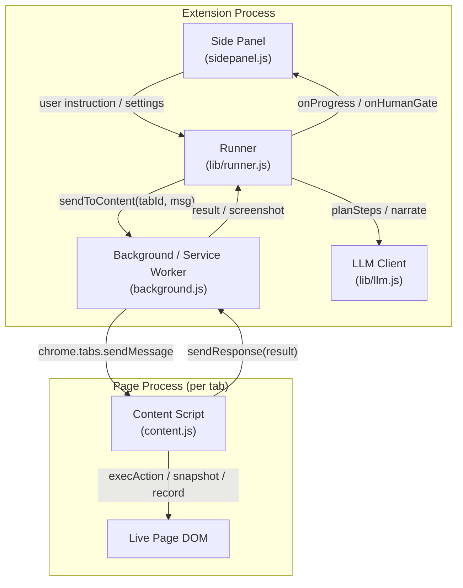
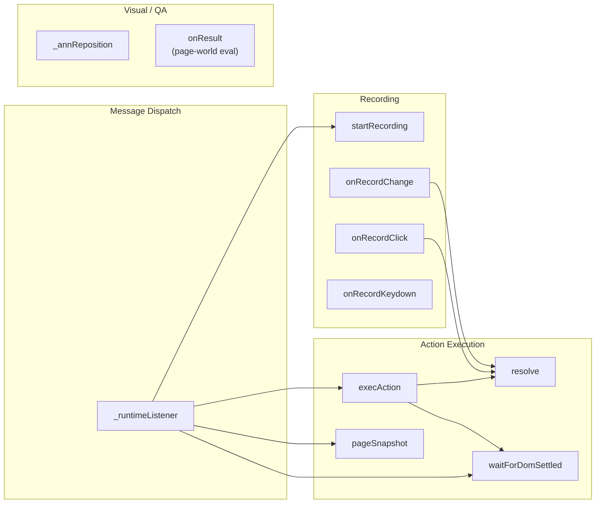
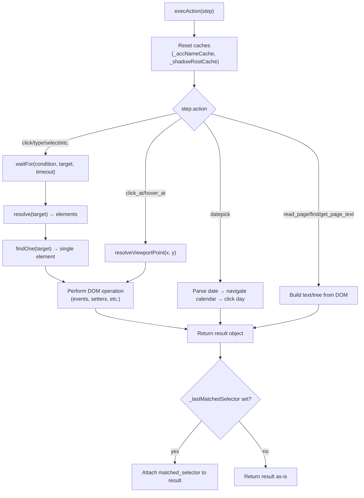
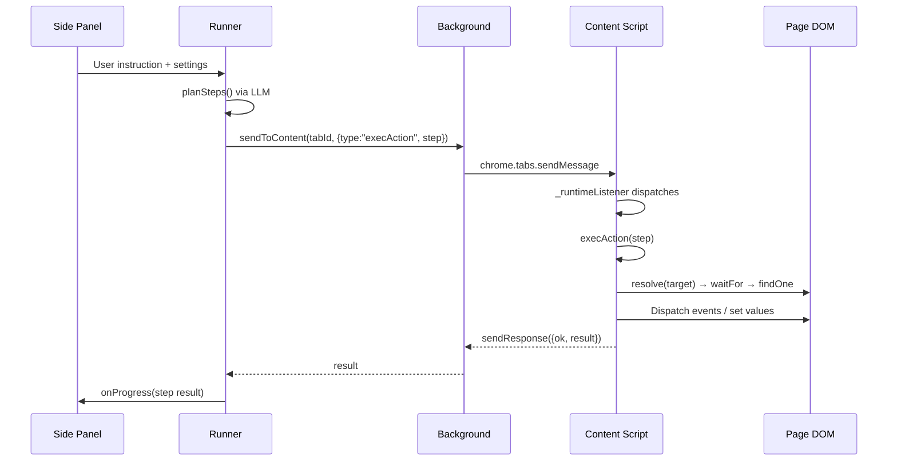
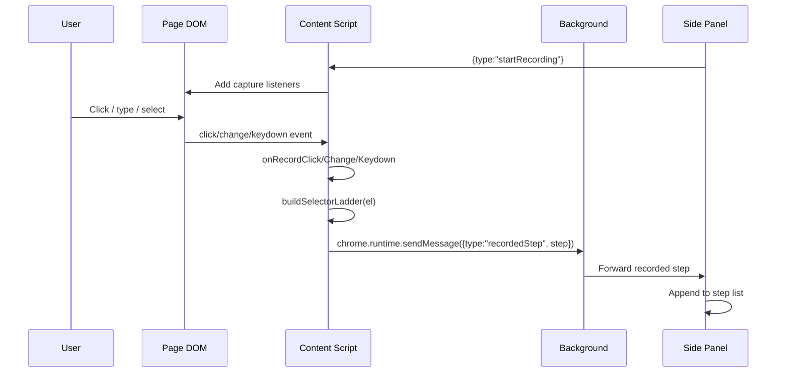
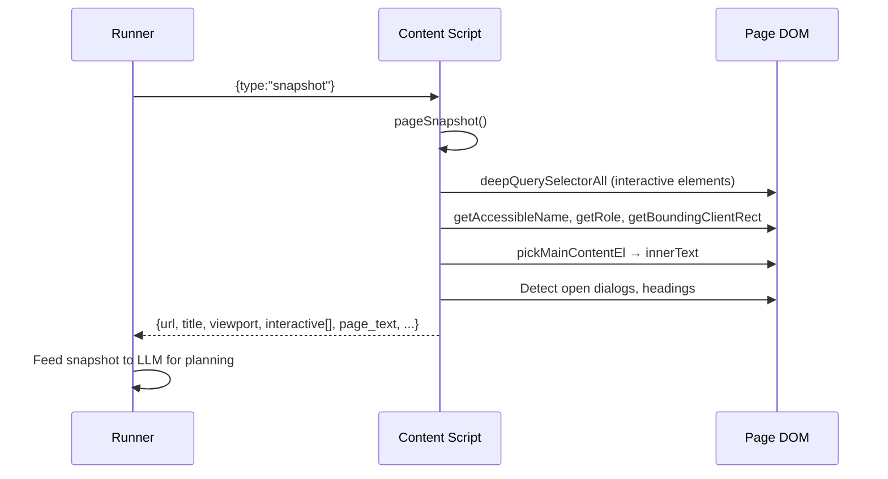
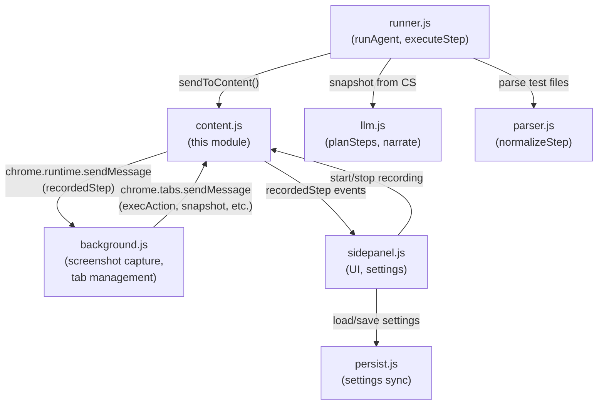

# Browser Automation Extension — Content Script (`content.js`)

> **Module ID:** `browser_automation_extension_content`
> **File:** `connectors/browser-automation-agent-main/content.js`
> **Role:** Chrome MV3 content script injected into every page — the in-page execution engine and interaction recorder for the browser-automation agent.

---

## 1. Introduction

The content script is the "hands and eyes" of the browser-automation extension. It runs inside each web page's DOM and serves two primary purposes:

1. **Action Execution** — receives structured action steps (click, type, select, drag, upload, assert, etc.) from the side panel / runner and performs them against the live page DOM, including complex widget interactions (React Select, jQuery UI datepickers, custom dropdowns, shadow-DOM piercing).
2. **Interaction Recording** — listens to native DOM events (click, change, keydown) to capture user actions and translate them into replayable step definitions.

It also provides page-snapshot generation (for LLM perception), selector resolution via a multi-rung "ladder," DOM-settled detection, visual annotations, QA debug capture (console + network), and accessibility auditing.

### Where it fits

The content script is one of several cooperating modules in the `browser_automation_extension` subtree:

| Sibling module | File | Responsibility |
|---|---|---|
| [`browser_automation_extension_background`](browser_automation_extension_background.md) | `background.js` | Service worker — tab management, screenshot capture, notifications, tab-group scoping |
| [`browser_automation_extension_runner`](browser_automation_extension_runner.md) | `lib/runner.js` | Orchestrates the agent run loop — planning, step execution, human gates, tab following |
| [`browser_automation_extension_sidepanel`](browser_automation_extension_sidepanel.md) | `sidepanel.js` | UI — chat, plan approval, settings, history, debug monitor |
| [`browser_automation_extension_llm`](browser_automation_extension_llm.md) | `lib/llm.js` | LLM communication — planning, narration, root-cause analysis |
| [`browser_automation_extension_support`](browser_automation_extension_support.md) | `lib/*.js` | Parser, markdown, persistence utilities |

---

## 2. Architecture Overview



The content script is injected by the extension manifest into every frame. It registers a single `chrome.runtime.onMessage` listener (`_runtimeListener`) that dispatches incoming messages to the appropriate handler. All communication is asynchronous — the listener returns `true` to keep the message port open until `sendResponse` is called.

---

## 3. Core Components

### 3.1 Component Map



### 3.2 `_runtimeListener`

**Purpose:** The single message-router entry point. Every `chrome.tabs.sendMessage` from the background/runner arrives here.

**Handled message types:**

| Message type | Handler | Description |
|---|---|---|
| `snapshot` | `pageSnapshot()` | Returns a structured page snapshot for LLM perception |
| `waitForDomSettled` | `waitForDomSettled()` | Polls until DOM mutations quiet down |
| `execAction` | `execAction(step)` | Executes a single action step |
| `startRecording` | `startRecording()` | Arms DOM event listeners for recording |
| `stopRecording` | `stopRecording()` | Returns recorded steps and disarms listeners |
| `resetFrame` | — | Resets `_currentDoc` back to top-level document |
| `getViewportSize` | — | Returns `innerWidth`, `innerHeight`, `devicePixelRatio` |
| `highlight` / `clearHighlight` | `drawHighlight` / `clearHighlight` | Visual annotation for dry-run / debug |
| `showSoM` / `hideSoM` | — | Set-of-Marks labeling for vision mode |
| `resolveProbe` | `resolve()` | Side-effect-free selector check (dry-run / pre-run scan) |
| `startQACapture` / `stopQACapture` / `getQACapture` | — | Console + network capture for QA debug mode |
| `getQANetworkEvents` | — | In-page fetch/XHR entries |
| `collectFormState` | — | Reads form field values for approval-gate context |
| `annotate` / `clearAnnotations` | — | Custom visual annotations |

**Key design decisions:**
- Each message resets `_shadowRootCache` to `null` so stale shadow-root lists from a prior message never leak into the current `resolve()` call.
- The listener wraps all logic in an async IIFE with a try/catch that always calls `sendResponse`, ensuring the port never hangs.
- Returns `true` synchronously to signal Chrome that the response will be sent asynchronously.

### 3.3 `execAction(step)`

**Purpose:** The central action dispatcher. Given a step object `{ action, target, value, ... }`, performs the corresponding DOM operation and returns a result object.

This is the largest and most complex function in the module (~880 lines). It handles **25+ action types**, each with careful handling of real-world widget quirks.

#### Supported Actions

| Action | Description | Key complexity |
|---|---|---|
| `click` | Click an element | Full pointer+mouse event sequence for React/Angular/Radix; hidden radio/checkbox label-click fallback |
| `click_at` | Coordinate-based click | Resolves viewport point → element; visual-fallback primitive |
| `hover_at` | Coordinate-based hover | pointermove/mousemove for canvas/tooltip triggers |
| `dblclick` | Double-click | Standard `dblclick` event |
| `hover` | Element-targeted hover | mouseover + mouseenter |
| `type` | Type text into input | Uses `typeInto()` helper with native setter + input/change events |
| `clear` | Clear an input | Types empty string |
| `select` | Select an option | **Most complex** — handles native `<select>`, React Select v5+, Ant Design, Radix UI, portal-based dropdowns; full pointer sequence on options; keyboard fallback |
| `check` / `uncheck` | Toggle checkbox/radio | Label-click preference; native setter fallback |
| `press_key` | Keyboard shortcut | `pressKey()` helper |
| `scroll` / `scroll_to` | Scroll element or page | `scroll_to` reports settled rect for vision |
| `zoom_region` | Compute crop rect for screenshot | Returns rect + DPR; actual capture in background.js |
| `wait` | Wait for condition | Delegates to `waitFor()` |
| `extract` | Read element value/text/attr | Returns `{ variable, value }` |
| `summarize` | Extract page text (up to 15K chars) | Preserves line breaks; includes URL/title meta |
| `assert` | Assert element state | `compare()` with matchers (equals, contains, etc.) |
| `upload_file` | Set files on `<input type=file>` | DataTransfer + native `files` setter |
| `drop_file` | Drag-and-drop file upload | DragEvent sequence with DataTransfer |
| `drag` | Element-to-element drag | Full dragstart→dragenter→dragover→drop→dragend |
| `switch_frame` | Enter/exit iframe | Sets `_currentDoc` to iframe's contentDocument |
| `accessibility_audit` | Run a11y audit | Returns violations array |
| `assert_performance` | Check perf metric (LCP, etc.) | `getPerformanceMetrics()` |
| `mock_network` / `clear_network_mocks` | Intercept fetch/XHR | Monkey-patches `window.fetch` |
| `read_page` | Build DOM tree text | Ref-scoped or full-page; configurable depth/chars |
| `find` | Fuzzy-search interactive elements | `scoreFindCandidates()` with confidence scoring |
| `get_page_text` | Read main content text | Detects canvas/image-rendered pages |
| `read_console_messages` | Read captured console logs | Filtered by level/text |
| `datepick` | Pick a date in a calendar widget | **Highly complex** — jQuery UI, Flatpickr, React DatePicker, Ant Design; month navigation; day-cell matching |

#### Action Execution Flow



#### Selector Fallback & Healing

Several actions support a `selectorFallback` field. If the primary target fails to resolve or isn't visible, the fallback selector is tried. The `matched_selector` field in the result tells the runner which selector actually worked, enabling the runner to persist healed selectors for future runs.

### 3.4 `resolve(target)`

**Purpose:** The selector resolution engine. Given a target string (or array of targets), returns an array of matched DOM elements. This is the foundation that `execAction`, `pageSnapshot`, and recording all depend on.

#### Resolution Ladder

The function implements a **multi-rung ladder** — it tries each resolution strategy in order and returns results from the first rung that matches anything:

```mermaid
flowchart TD
    T["target (string or array)"] --> A{"Array?"}
    A -->|"yes"| B["Try each element;<br/>return first non-empty"]
    A -->|"no"| C{"ref=N?"}
    C -->|"yes"| D["Look up _snapshotRegistry[N-1]<br/>Validate connected + visible"]
    C -->|"no"| E{"role=ROLE[name=...]?"}
    E -->|"yes"| F["deepQuerySelectorAll(ROLE_SELECTOR)<br/>Filter by role + accessible name"]
    E -->|"no"| G{'text="..."?'}
    G -->|"yes"| H["TreeWalker over text nodes<br/>(doc + shadow roots)<br/>Match own text content"]
    G -->|"no"| I{"xpath=...?"}
    I -->|"yes"| J["doc.evaluate()"]
    I -->|"no"| K["deepQuerySelectorAll(target)<br/>(CSS, pierces shadow roots)"]
```

**Rung details:**

1. **`ref=N`** — 1-based index into the last `pageSnapshot()`'s interactive elements registry (`_snapshotRegistry`). Validates the element is still connected and visible (hidden radios/checkboxes are allowed). A stale ref returns `[]`, causing the ladder to advance or heal.

2. **`role=ROLE[name="..."]`** — Uses ARIA role + accessible name matching. Queries all elements with a role via `deepQuerySelectorAll(ROLE_SELECTOR)`, then filters by role and accessible name (exact or substring match).

3. **`text="..."`** — Walks text nodes using `TreeWalker` (over the document and all open shadow roots) to find elements whose own text content matches. This is O(N) rather than O(N²) because it walks text nodes directly instead of reading `textContent` on every element.

4. **`xpath=...`** — Standard XPath evaluation via `doc.evaluate()`.

5. **CSS selector** — `deepQuerySelectorAll()` pierces shadow DOM boundaries by recursively querying each shadow root.

**Performance note:** The `text=` rung was optimized from O(N²) to O(N) by switching from per-element `textContent` reads to a `TreeWalker` over text nodes. This matters because `resolve()` runs inside `waitFor()`'s poll loop.

### 3.5 `pageSnapshot()`

**Purpose:** Generates a structured representation of the current page state for LLM perception. This is what the LLM "sees" when planning actions.

**Returns an object with:**

| Field | Description |
|---|---|
| `url` | Current page URL |
| `title` | Document title |
| `viewport` | `{ w, h }` — inner dimensions |
| `dpr` | Device pixel ratio |
| `open_dialogs` | Visible modal/dialog elements with titles |
| `headings` | Up to 12 visible h1/h2/h3 headings |
| `interactive` | Up to 150 interactive elements with ref, rect, tag, role, name, id, testid, type, value, href, placeholder |
| `page_text` | Up to 8000 chars of visible body text |
| `visual_content` | Flag indicating canvas/image-rendered content |

**Element collection strategy:**
1. Always include all radio/checkbox inputs (even hidden ones — quiz sites hide them with CSS).
2. Visible form controls (`input`, `textarea`, `select`, `button`).
3. Other interactive elements (`a`, `[role]`, `[data-testid]`, `[data-test]`, `[data-cy]`).
4. Cap at 150 elements to bound cost on heavy pages.
5. The `_snapshotRegistry` array is refreshed so `ref=N` selectors reference current elements.

### 3.6 `waitForDomSettled({ quietMs, maxMs })`

**Purpose:** Polls until the DOM stops mutating, indicating async rendering is complete.

- Uses a mutation observer tracker (`ensureMutationTracker()` / `domLooksSettled()`).
- Default: wait for 500ms of quiet, max 4000ms total.
- Returns `{ settled: boolean, elapsedMs: number }`.

### 3.7 Recording Components

#### `startRecording()`

Arms three capture-phase event listeners on `document`:
- `click` → `onRecordClick` (capture phase)
- `change` → `onRecordChange` (capture phase)
- `keydown` → `onRecordKeydown` (capture phase)

Records a leading `navigate` step for the starting URL so recordings are self-contained.

#### `onRecordClick(e)`

The most sophisticated recorder. Handles:

- **SVG retargeting** — clicks on inner `<svg>`/`<path>` nodes are retargeted to the clickable ancestor (button, link, etc.).
- **React Select detection** — if the click target is a `role="combobox"` input, arms `_pendingSelectControl` with the wrapper selector so the next option-click collapses into a `select` action.
- **Date picker suppression** — clicks inside a date picker container are suppressed; a post-click scan detects the value change and emits a single `datepick` step.
- **Option/menuitem collapsing** — clicks on `[role="option"]` / `[role="menuitem"]` are collapsed into `select` actions when a pending control is armed, or resolved via ARIA `aria-controls`/`aria-owns` to find the owning trigger.
- **Post-click value scan** — after a 500ms delay, scans text/date inputs for programmatic value changes (e.g., from date picker widgets) and emits `type` or `datepick` steps accordingly.
- **Navigation detection** — if the URL changed since the last recorded step, emits a `navigate` step.

#### `onRecordChange(e)`

Captures form field changes:
- `INPUT[type=file]` → reads file as data URL, emits `upload_file` step.
- `SELECT` → emits `select` step with `el.value`.
- `checkbox`/`radio` → emits `check`/`uncheck` step.
- Other inputs → emits `type` step with `el.value`.

Marks the element in `_recentlyChangedByEvent` so the post-click scan in `onRecordClick` doesn't double-record it.

#### `onRecordKeydown(e)`

Captures only special key combinations:
- `Enter`, `Escape` (always)
- Any key with `Ctrl`, `Meta`, `Alt`, or `Shift` modifiers

Builds a `press_key` step with the combination string (e.g., `"Ctrl+Enter"`).

### 3.8 `_annReposition()`

**Purpose:** Repositions visual annotation overlays (badges, highlight boxes) during scroll/resize. Called via `requestAnimationFrame` to batch updates.

For each annotated element:
- Checks if still connected and has dimensions.
- Hides badge/box if element is hidden.
- Updates `left`/`top`/`width`/`height` to match the element's current `getBoundingClientRect()`.

### 3.9 `onResult(e)`

**Purpose:** Callback for the page-world eval mechanism. The content script can't use `eval()` directly due to MV3 CSP restrictions, so it injects a `<script>` tag that evaluates expressions in the page's main world and communicates results back via a custom DOM event. `onResult` is the listener that resolves/rejects the promise based on `e.detail.ok`.

---

## 4. Data Flow

### 4.1 Action Execution Flow (Runner → Content Script)



### 4.2 Recording Flow (User → Content Script → Side Panel)



### 4.3 Page Snapshot Flow (LLM Perception)



---

## 5. Key Design Patterns

### 5.1 Selector Ladder with Healing

The `resolve()` function implements a priority-ordered ladder of selector strategies. When the primary target fails, the runner can try a `selectorFallback`. The `matched_selector` field in the result tells the runner which rung actually matched, enabling persistent selector healing across runs.

### 5.2 Full Event Sequence Simulation

Modern JavaScript frameworks (React, Angular, Radix UI, Headless UI) gate interactions on specific event sequences. A bare `el.click()` often fails. The content script dispatches the complete sequence:

```
pointerdown → mousedown → mouseup → pointerup → click
```

For option-like elements, `mousemove` is fired first to register hover/focus state.

### 5.3 Native Setter Bypass

React and other frameworks maintain internal value trackers that revert programmatic changes. The content script uses `Object.getOwnPropertyDescriptor(HTMLInputElement.prototype, "value")?.set` to call the native setter directly, then dispatches `input` and `change` events to notify the framework.

### 5.4 Shadow DOM Piercing

`deepQuerySelectorAll()` recursively queries into open shadow roots, enabling interaction with web components. The `_shadowRootCache` is populated lazily and invalidated per-message/per-action.

### 5.5 Widget-Specific Handling

The `select` and `datepick` actions contain extensive framework-specific logic:

- **React Select v5+**: Detects `role="combobox"` inputs, walks up to control wrapper, prefers clicking the dropdown indicator, uses `onMouseMove` to set `highlightedIndex`, falls back to keyboard `ArrowDown` + `Enter`.
- **jQuery UI Datepicker**: Uses native `FocusEvent` to trigger the focus handler (jQuery-version-agnostic), navigates months via next/prev buttons, matches day cells excluding "other month" overflow.
- **Flatpickr**: Syncs internal `selectedDates` via `_flatpickr.setDate()`.
- **React DatePicker / Ant Design**: Detects via class name patterns, navigates month/year headers.

### 5.6 Stale Element Guards

After async polling (e.g., waiting for dropdown options to appear), the content script checks `target.isConnected` before clicking. If the element was detached by React reconciliation, it re-queries candidates.

---

## 6. State Management

The content script maintains module-level state within an IIFE:

| Variable | Type | Purpose |
|---|---|---|
| `_currentDoc` | `Document` | Current document context (switched by `switch_frame`) |
| `_recording` | `boolean` | Whether recording is active |
| `_recordedSteps` | `Array` | Accumulated recorded steps |
| `_lastRecordedUrl` | `string\|null` | Last URL for navigation detection |
| `_recentlyChangedByEvent` | `Set<Element>` | Elements captured by `onRecordChange` (prevents double-recording) |
| `_suppressDatePickerClicks` | `Element\|null` | Active date picker container being suppressed |
| `_pendingSelectControl` | `Array\|null` | Armed react-select control selector |
| `_snapshotRegistry` | `Array<Element>` | Elements from last `pageSnapshot()` (for `ref=N`) |
| `_accNameCache` | `WeakMap` | Accessible name cache (per-action) |
| `_shadowRootCache` | `Array\|null` | Collected shadow roots (per-action) |
| `_lastMatchedSelector` | `string\|null` | Which ladder rung matched (for healing) |
| `_networkMocks` | `Array` | Active network mock configurations |
| `_qaCapturing` | `boolean` | QA debug capture active |
| `_qaConsoleLogs` | `Array` | Captured console messages |
| `_qaNetworkEvents` | `Array` | Captured in-page fetch/XHR entries |

**Re-installation guard:** The script checks `window.__bAA_installed` on load and calls the previous instance's teardown function if present. This handles extension service-worker restarts that invalidate the old content-script context.

---

## 7. Dependencies & Interactions



### Key interaction points:

- **Runner → Content Script**: The runner's `executeStepAndFollowTabs()` function sends `execAction` messages via the background's `sendToContent()` helper. See [`browser_automation_extension_runner`](browser_automation_extension_runner.md).
- **Content Script → Background**: Recorded steps are forwarded via `chrome.runtime.sendMessage({ type: "recordedStep", step })`. The background relays them to the side panel. See [`browser_automation_extension_background`](browser_automation_extension_background.md).
- **Snapshot → LLM**: The runner calls `snapshotPageReady()` which sends a `snapshot` message to the content script, then passes the result to `planSteps()` in the LLM client. See [`browser_automation_extension_llm`](browser_automation_extension_llm.md).
- **Screenshot capture**: The `zoom_region` action only computes the crop rect; actual `chrome.tabs.captureVisibleTab` happens in the background script (only the service worker has that API).

---

## 8. Action Reference Summary

| Action | Target | Value | Returns | Notes |
|---|---|---|---|---|
| `click` | selector ladder | — | `{}` | Full pointer sequence; hidden toggle fallback |
| `click_at` | — | `x`, `y` | `{ actual }` | Coordinate click |
| `hover_at` | — | `x`, `y` | `{ actual }` | Coordinate hover |
| `dblclick` | selector | — | `{}` | |
| `hover` | selector | — | `{}` | |
| `type` | selector | text | `{}` | Native setter + events |
| `clear` | selector | — | `{}` | |
| `select` | selector | option text/value | `{}` | Native + custom dropdowns |
| `check`/`uncheck` | selector | — | `{}` | Label-click preference |
| `press_key` | — | key combo | `{}` | e.g. `"Ctrl+Enter"` |
| `scroll` | selector? | `"bottom"`/pixels | `{}` | |
| `scroll_to` | selector | — | `{ actual, rect }` | Reports settled position |
| `zoom_region` | selector | padding | `{ rect, dpr }` | For screenshot crop |
| `wait` | selector | condition | `{}` | |
| `extract` | selector | variable name | `{ variable, value }` | attr/value/text |
| `summarize` | selector? | variable name | `{ variable, value }` | Up to 15K chars |
| `assert` | selector | expected | `{ actual, passed, reason }` | |
| `upload_file` | selector | data URL | `{}` | |
| `drop_file` | selector? | data URL | `{ actual }` | Drag-and-drop upload |
| `drag` | selector | destination | `{}` | |
| `switch_frame` | iframe sel/"top" | — | `{}` | Changes `_currentDoc` |
| `accessibility_audit` | selector? | variable | `{ violations, passed }` | |
| `assert_performance` | — | metric, max_ms | `{ value, passed }` | LCP, FCP, etc. |
| `mock_network` | URL | response | `{}` | |
| `clear_network_mocks` | — | — | `{}` | |
| `read_page` | ref? | filter, max_chars | `{ value, actual }` | DOM tree text |
| `find` | — | query | `{ value, matches, confident }` | Fuzzy search |
| `get_page_text` | selector? | max_chars | `{ value, actual }` | Main content text |
| `read_console_messages` | — | level, filter | `{ value, actual }` | QA debug |
| `datepick` | container | date string | `{}` | Multi-framework |

---

## 9. Error Handling

- **`execAction`** wraps all action logic in the switch cases; errors propagate to `_runtimeListener`'s try/catch, which sends `{ ok: false, error: message }`.
- **`resolve()`** returns `[]` on failure (no throw), allowing the ladder to advance gracefully.
- **`waitFor()`** throws on timeout; `execAction` catches visibility errors and tries fallbacks before re-throwing.
- **Stale refs** return `[]` from `resolve()`, behaving like any other failed selector.
- **Cross-origin iframes** throw an explicit error from `switch_frame` when `contentDocument` is inaccessible.

---

## 10. Security Considerations

- **Page-world eval**: `evalInPageWorld()` injects a `<script>` tag to bypass MV3 CSP restrictions on `eval()`. The expression is passed via a custom DOM event with a random ID to prevent collision.
- **Network mocking**: `installNetworkMock()` monkey-patches `window.fetch` to intercept and respond to matched requests. Original fetch is preserved for restoration.
- **PII handling**: The runner (not the content script) scans typed values for PII before execution. The content script itself does not perform PII detection.
- **Host policy**: The runner enforces `sitePolicy` (allow/block list) before sending actions to the content script; the content script trusts that the runner has already validated the host.

---

*See also: [`browser_automation_extension_background`](browser_automation_extension_background.md) · [`browser_automation_extension_runner`](browser_automation_extension_runner.md) · [`browser_automation_extension_sidepanel`](browser_automation_extension_sidepanel.md) · [`browser_automation_extension_llm`](browser_automation_extension_llm.md) · [`browser_automation_extension_support`](browser_automation_extension_support.md)*
