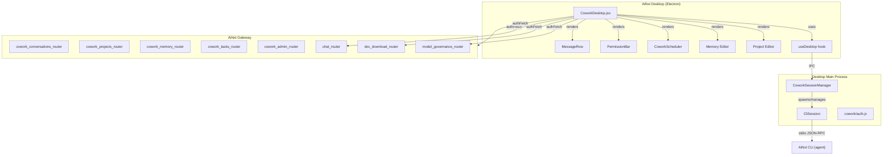
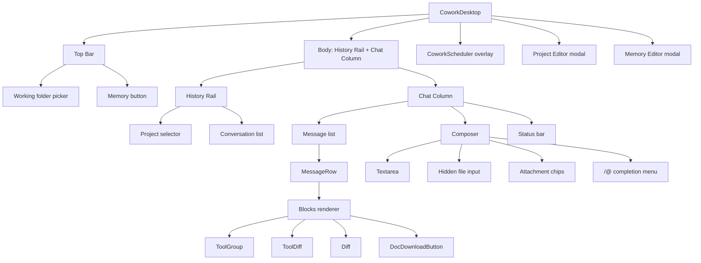
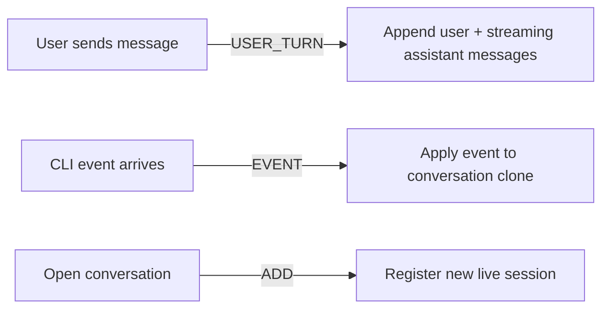
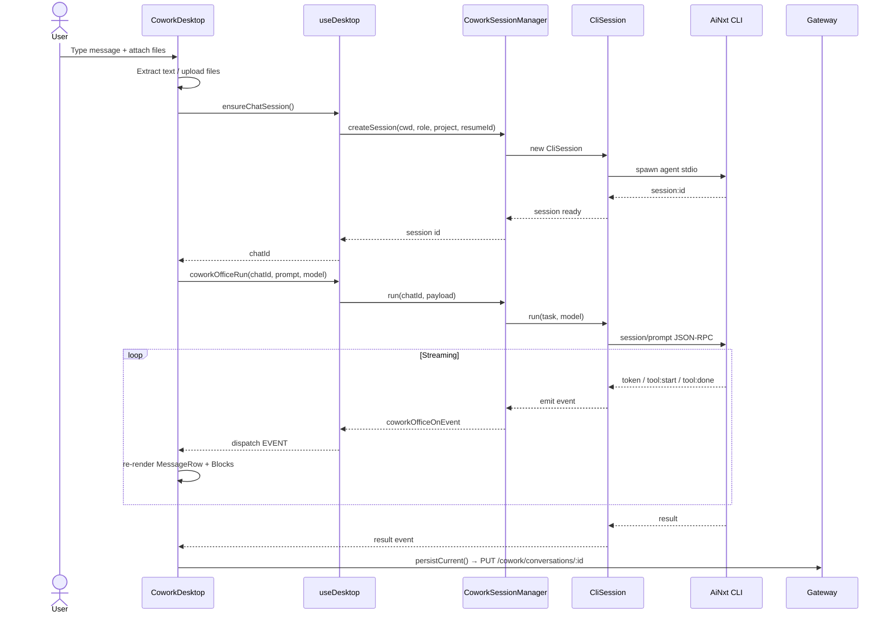
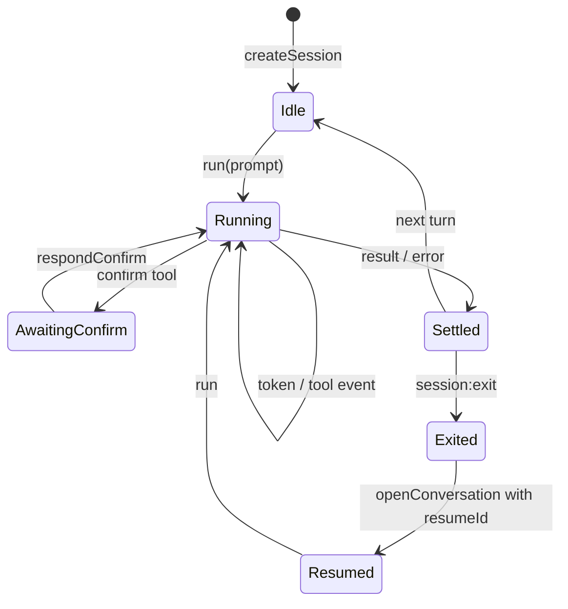
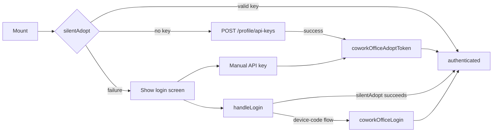
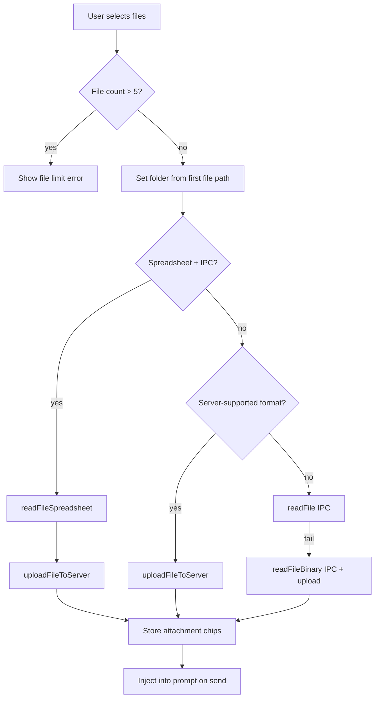
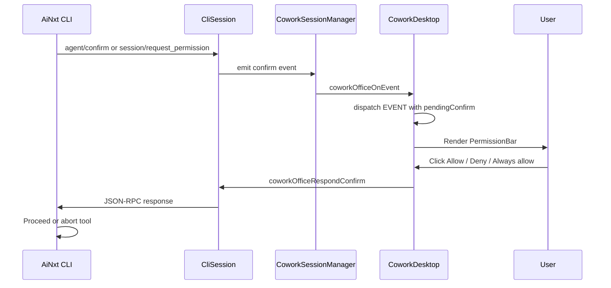
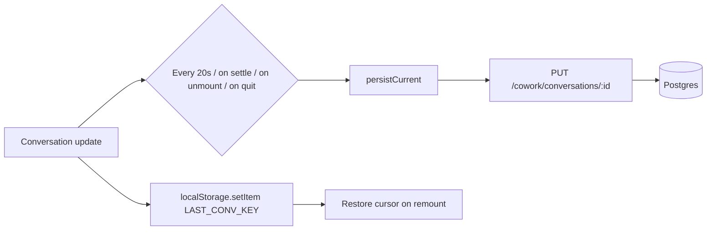
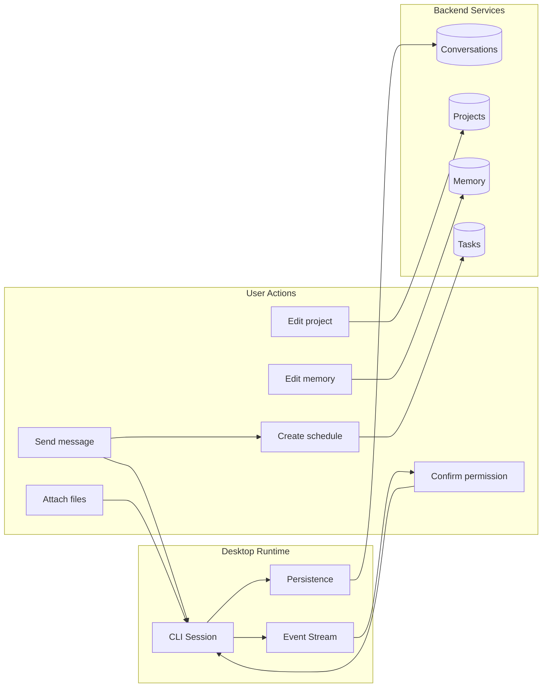

# Cowork Desktop (Buddy)

## Brief Introduction

`CoworkDesktop` is the React frontend component that powers **Buddy**, the local office AI assistant in the AiNxt Desktop application. Unlike the browser-based office assistant, Buddy runs a headless agent process on the user's machine via the Electron desktop shell, giving it direct access to local files, connectors (Outlook, Teams, Jira, Confluence), and document-generation tools while keeping all conversation history, projects, and memory server-persisted.

The module lives in `ai-ui/src/components/CoworkDesktop.jsx` and is part of the `ai_ui_frontend` package. It orchestrates user input, agent streaming, tool-call visualization, permission gating, file attachment, project/memory management, and scheduled-task creation.

---

## Core Functionality

### 1. Local Office Agent Chat
Buddy provides a chat interface where users can ask the agent to read documents, draft content, build Word/Excel/PowerPoint/PDF files, and interact with connected enterprise apps. Messages are streamed token-by-token from a local CLI agent process.

### 2. Session Management
Each conversation maps to a live CLI session managed by the desktop main process. Sessions can be:
- **Reattached** when the user returns to a still-live conversation.
- **Resumed** after app restart using a persisted agent `session_id`.
- **Freshly created** when no prior session exists.

### 3. File Attachments & Folder Workspaces
Users can attach local files (up to 5 at a time). The component extracts text through a tiered strategy:
- Spreadsheet IPC for Excel files.
- Server upload (`/chat/upload`) for parseable documents.
- `readFile` IPC for newer EXE builds.
- `readFileBinary` IPC + server upload as a fallback.

An optional working folder can be selected, enabling `@`-file mentions and automatic upload of referenced files when the user asks to send/share them.

### 4. Permission Gating
All connector writes, email sends, Teams posts, and document modifications require explicit user confirmation via an in-chat permission bar. Permission modes include:
- `default` — ask each time.
- `acceptEdits` — auto-accept local file edits.
- `plan` — plan mode.

### 5. Projects & Persistent Memory
- **Projects** group tasks with shared instructions, persistent memory, and an optional document folder. Projects are server-persisted (`/cowork/projects`).
- **Memory** stores user preferences (role, tone, default document format, email signature) and agent-saved facts (`/cowork/prefs`, `/cowork/memory/note`).

### 6. Scheduling
The `/schedule` slash command opens `CoworkScheduler`, allowing users to turn a request into a recurring task (`/cowork/tasks`).

### 7. Model Governance
Model selection is ops-configurable via `/cowork/model-config`. When locked, the UI hides the model picker and forces a specific model. Local/in-house models prefixed with `local:` are fetched from `/model-governance/my-models`.

---

## Architecture

### High-Level Component Architecture

### Component Hierarchy

---

## State Management

`CoworkDesktop` uses a combination of:
- **React `useReducer`** for conversation state (`state.convs` keyed by live session id).
- **Local React state** for UI concerns (folder, model, permissions, projects, memory, auth).
- **`useRef` bridges** to avoid stale closures in event handlers and effects.
- **`localStorage`** only for the `LAST_CONV_KEY` cursor (not conversation data).
- **Server persistence** for all durable data (conversations, projects, memory).

### Reducer Actions

---

## Data Flow: Sending a Message

---

## Session Lifecycle

---

## Authentication Flow

Buddy reuses the existing web-app session. On mount it attempts **silent adoption** of a long-lived API key:

---

## File Attachment Flow

---

## Permission Gating Flow

---

## Persistence Flow

---

## Key Components

### `CoworkDesktop`
The main container component. Manages auth, sessions, conversations, projects, memory, model/permission settings, and renders the full UI.

### `reducer`
Pure state reducer handling `ADD`, `USER_TURN`, and `EVENT` actions. Ensures immutable conversation updates.

### `MessageRow`
Renders a single chat message (user or assistant). Provides copy, text-to-speech, and regenerate actions for assistant messages.

### `Blocks`
Renders the heterogeneous content inside an assistant message: text (Markdown), tool calls, diffs, commands, notices, and document download cards. Coalesces read-only tool calls into collapsible `ToolGroup`s.

### `ToolGroup` / `ToolChip`
Visualizes a group of tool calls with running/done/fail status.

### `Diff` / `ToolDiff`
Renders unified diff blocks for file edits produced by the agent.

### `PermissionBar`
Renders the confirmation prompt when the agent requests permission for a gated action.

### `saveProject` / `openMemory`
Helper functions for persisting project metadata and opening the durable memory editor.

---

## Integration with the Broader System

| Concern | Integration Point | Module Reference |
|---|---|---|
| Desktop IPC | `useDesktop.js` hook | [ai_ui_frontend_hooks](../ui/ai_ui_frontend_hooks.md) |
| Scheduled tasks | `CoworkScheduler.jsx` | [cowork_scheduler](../workers/cowork_scheduler.md) |
| Document generation cards | `DocDownloadButton` in `Message.jsx` | [message](../chat/message.md) |
| Cost/token meta | `MessageMeta.jsx` | [message_meta](../chat/message_meta.md) |
| Dialogs/toasts | `DialogProvider.jsx` | [ui_dialog](../ui/ui_dialog.md) |
| Conversation API | `/cowork/conversations` | [cowork_conversations_router](../api/cowork_conversations_router.md) |
| Project API | `/cowork/projects` | [cowork_projects_router](../api/cowork_projects_router.md) |
| Memory API | `/cowork/prefs`, `/cowork/memory/note` | [cowork_admin_router](../api/cowork_admin_router.md) |
| Task API | `/cowork/tasks` | [cowork_tasks_router](../api/cowork_tasks_router.md) |
| File upload | `/chat/upload` | [chat_router](../api/chat_router.md) |
| Document fallback | `/docs/generate` | [doc_download_router](../api/doc_download_router.md) |
| Model governance | `/model-governance/my-models`, `/cowork/model-config` | [model_governance_router](../api/model_governance_router.md) |
| Desktop main process | `CoworkSessionManager`, `CliSession` | [desktop_app](../clients/desktop_app.md) |

---

## Security & Governance Notes

- **No auto-execution**: connector sends, email dispatches, and document writes always require user confirmation.
- **API key durability**: Buddy uses long-lived API keys stored in the desktop's encrypted storage, avoiding repeated interactive login.
- **Model lock**: Operations can pin the model via gateway environment variables (`COWORK_FORCED_MODEL`, `COWORK_MODEL_LOCKED`).
- **File upload limits**: Maximum 5 files per attachment batch; unsupported or blocked files surface explicit errors.
- **No localStorage for data**: Conversation content, projects, and memory are persisted server-side; only the last-open conversation id is stored locally.

---

## Process Flow Summary

---

## Related Documentation

- [ai_ui_frontend_app_core](../ui/ai_ui_frontend_app_core.md) — top-level app shell and navigation.
- [cowork_scheduler](../workers/cowork_scheduler.md) — recurring task scheduling UI.
- [cowork_canvas](../ui/cowork_canvas.md) — document preview and AI editing canvas.
- [cowork_settings](cowork_settings.md) — role and permission configuration.
- [desktop_app](../clients/desktop_app.md) — Electron main process and CLI session management.
- [chat_router](../api/chat_router.md) — chat/file upload backend endpoints.
- [doc_download_router](../api/doc_download_router.md) — document generation fallback endpoints.
- [model_governance_router](../api/model_governance_router.md) — model allow-list and lock configuration.
