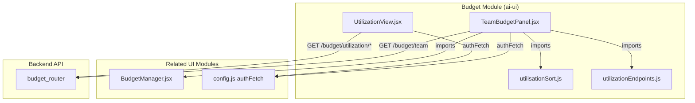
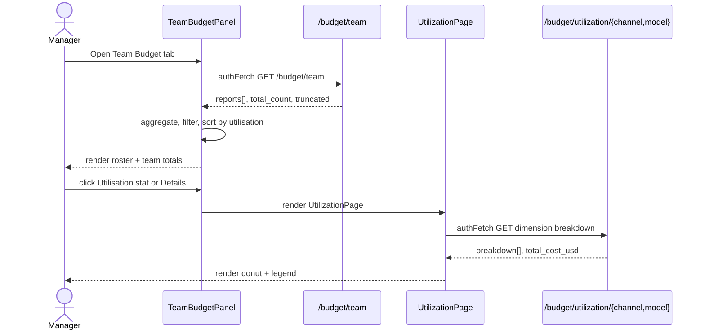

# Budget Module

The **Budget** module is a React-based frontend subsystem in `ai-ui` that surfaces LLM usage budgets, team spending, and utilization breakdowns to end users. It provides read-only reporting views for managers and self-service budget analytics for individual users, consuming the backend [`budget_router`](shared_api_routers_budget_router.md) API.

## Purpose

- Visualize per-user and team-wide LLM spend against allocated budgets.
- Enable reporting managers to inspect direct and indirect reports' utilization.
- Provide channel-wise and model-wise cost breakdowns via lightweight inline SVG charts.
- Reuse budget detail components from the related [`budget_manager`](budget_manager.md) module for consistent UX.

## Architecture Overview

The module is intentionally lightweight: it contains only presentation components and small helper utilities. All budget logic, allocation rules, approval workflows, and data persistence live in the backend [`budget_router`](shared_api_routers_budget_router.md) and the shared [`budget_manager`](budget_manager.md) component.

## Sub-modules

| Sub-module | File | Responsibility |
|------------|------|----------------|
| [Team Budget Panel](budget_team_panel.md) | `TeamBudgetPanel.jsx` | Reporting-manager view: roster table of direct/indirect reports with base/extra/total budget and utilization bars. |
| [Utilization View](budget_utilization_view.md) | `UtilizationView.jsx` | Reusable donut chart, legend, and MTD history views for channel/model/date dimensions. |

## Data Flow

## Key Design Decisions

- **Zero external chart dependencies**: `UtilizationView` renders donut charts with inline SVG to avoid private-registry dependencies.
- **Read-only team view**: `TeamBudgetPanel` mirrors the admin `UserRosterPanel` layout but does not allow edits; allocations are managed via [`budget_manager`](budget_manager.md) or backend admin endpoints.
- **Reusable drill-down**: `UtilizationPage` is parameterized by endpoint builder and options so the same component serves user, team, and admin contexts.
- **Client-side sorting/pagination**: Search, sort direction, and "Load more" paging are handled in the component to keep backend endpoints simple.

## Dependencies

| Dependency | Module / File | Usage |
|------------|---------------|-------|
| `authFetch`, `API_BASE` | [`config.js`](ai_ui_frontend_config.md) | Authenticated HTTP requests. |
| `UserBudgetDetail` | [`BudgetManager.jsx`](budget_manager.md) | Expandable per-user budget detail in team roster. |
| `sortByUtilisation`, `toggleSortDirection` | `utilisationSort.js` | Sorting helpers for utilization columns. |
| `utilizationEndpoints` | `utilizationEndpoints.js` | URL builders for user/team/admin utilization APIs. |
| Backend `budget_router` | [`shared_api_routers_budget_router.md`](shared_api_routers_budget_router.md) | Data source for team and utilization endpoints. |

## Related Documentation

- [shared_api_routers_budget_router](shared_api_routers_budget_router.md) — Backend REST API for budgets, allocations, and utilization.
- [budget_manager](budget_manager.md) — User-facing budget management, increase requests, and HOD/admin workflows.
- [ai_ui_frontend_config](ai_ui_frontend_config.md) — authFetch and API_BASE configuration.
- [ai_ui_frontend_app_core](ai_ui_frontend_app_core.md) — Top-level application shell that hosts budget views.
