# Budget Router Module

## Introduction

The **Budget Router** (`routers/budget_router.py`) is the central API layer for all budget management, allocation, utilization tracking, and cost chargeback operations in the AiNxt platform. It exposes a comprehensive set of FastAPI endpoints under the `/budget` tag that serve three distinct user personas — **end users** (self-service budget views), **HODs / reporting managers** (team oversight and budget-increase approvals), and **admins** (global allocation, HOD cap management, 10x winner program, monthly resets).

The module implements a controlled allocation model where every user's cost budget is the sum of a **base allocation** ($50 default, $1000 for 10x winners) and an **extra allocation** (granted via approved HOD budget-increase requests). Both reset to defaults on the monthly reset cycle — nothing carries over. The only ways a user's budget changes are: (a) the HOD approval flow, and (b) the admin-only 10x-winner base-allocation action.

---

## Architecture Overview

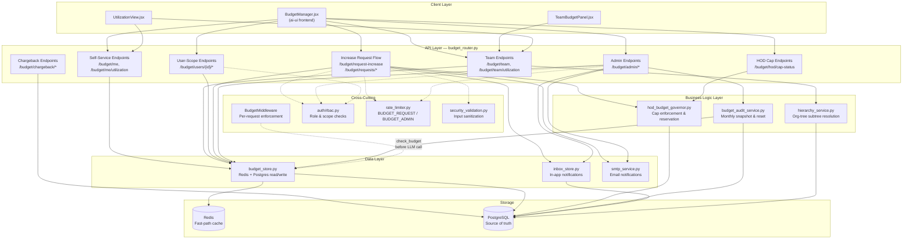

### Allocation Model

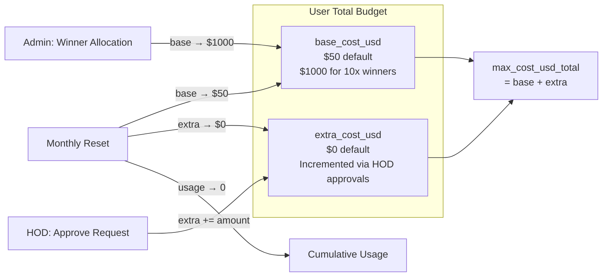

---

## Endpoint Groups

The router organizes ~30 endpoints into six functional groups. Each group has distinct authorization rules and data-access patterns.

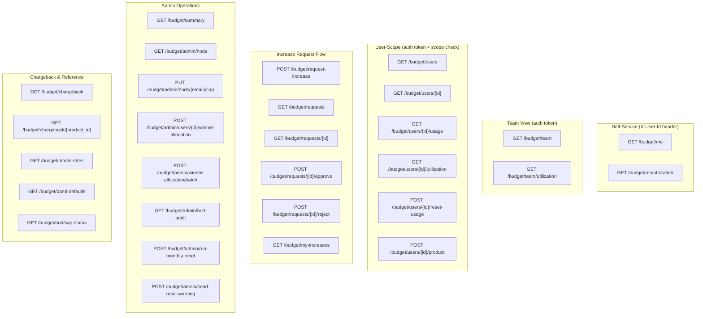

---

## Authorization & Scope Model

The module enforces a layered authorization model. Every endpoint that touches a specific user's data passes through `_scope_or_403()`, which checks three tiers in order:

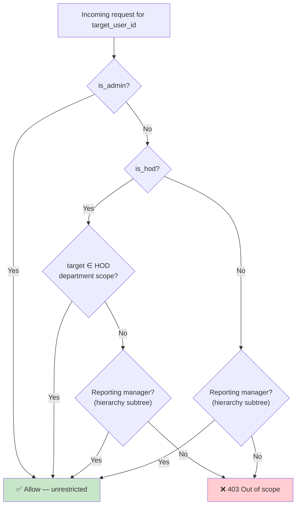

### Role Helpers (from `auth/rbac.py`)

| Helper | Returns | Description |
|--------|---------|-------------|
| `is_admin(current_user)` | `bool` | True if `role == "admin"` |
| `is_hod(current_user)` | `bool` | True if `is_hod` flag is set; admin+HOD users retain the flag |
| `get_hod_departments(current_user)` | `List[str]` | Department names the HOD owns |
| `get_visible_user_filter(current_user, request)` | `Optional[Set[str]]` | `None` = admin (unrestricted); `set` = scoped user IDs; memoized per-request |

### Rate Limiting

Two rate-limit profiles from `core/rate_limiter.py` are applied:

- **`BUDGET_REQUEST`** — applied to `POST /budget/request-increase` (user-scoped via `user_id`).
- **`BUDGET_ADMIN`** — applied to team/admin endpoints (`GET /budget/team`, `GET /budget/admin/hods`, `PUT /budget/admin/hods/{email}/cap`, winner-allocation endpoints, `GET /budget/admin/hod-audit`, `GET /budget/my-increases`).

Both use `enforce_rate_limit_with_behaviour()`, which first checks for behaviour-based IP/user blocks (anomaly detection) before applying the sliding-window limiter.

---

## Budget Increase Request Flow

This is the core business workflow of the module — the only mechanism (besides admin winner-allocation) by which a user's budget grows.

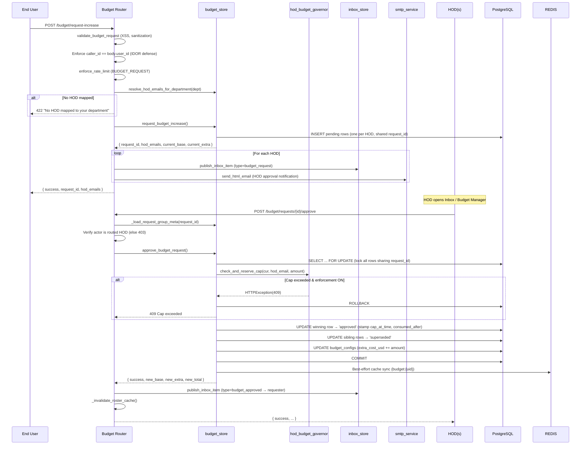

### Key Design Decisions

1. **Multi-HOD fan-out**: A department may map to multiple HODs. The request creates one `pending` ledger row per HOD, all sharing a single `request_id`. Whichever HOD acts first resolves it for everyone.

2. **Atomic approval**: The ledger status transition, HOD cap charge, and `budget_configs` update all happen inside a single Postgres transaction with `SELECT ... FOR UPDATE` row-level locks. If any step fails, everything rolls back.

3. **First-resolver wins**: A concurrent second action on an already-resolved group fails gracefully with `"already approved/rejected by X"`.

4. **IDOR defense**: The caller's authenticated `user_id` must match `body.user_id` — prevents submitting requests on behalf of other users.

5. **404 over 403 for status checks**: `GET /budget/requests/{id}` returns 404 (not 403) for unauthorized callers to prevent enumeration of valid request UUIDs.

---

## HOD Monthly Cap Management

HODs have a monthly allocation cap that limits the total extra budget they can approve across all their team members in a given period.

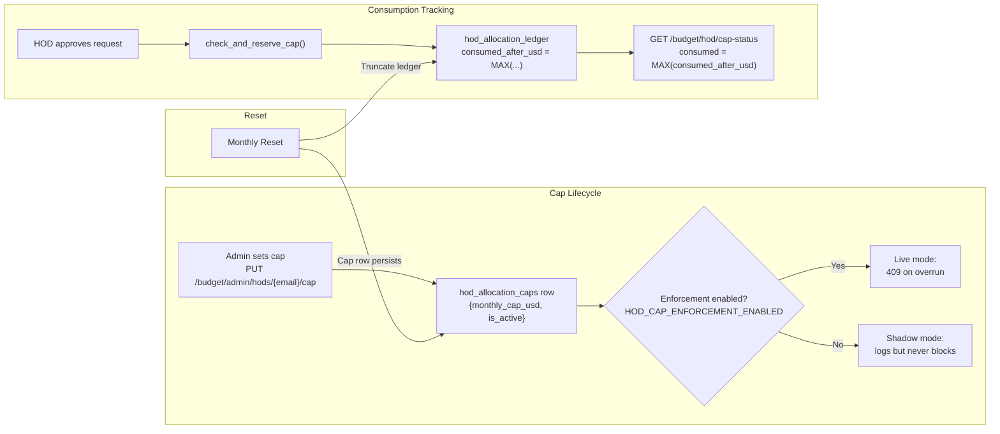

### Cap Enforcement (`services/hod_budget_governor.py`)

- **`check_and_reserve_cap(cur, hod_email, amount)`** — Called within the approval transaction. Locks the HOD's cap row (`FOR UPDATE`), computes projected consumption, and raises `HTTPException(409)` if the charge would exceed the cap and enforcement is enabled. In shadow mode, it logs but never raises.

- **`get_cap_status(hod_email)`** — Side-effect-free read for the UI banner. Returns `CapStatus` with `cap_usd`, `consumed_usd`, `remaining_usd`, `period_yyyymm`, and `resets_on`. Falls back to `HOD_DEFAULT_MONTHLY_CAP_USD` when no cap row exists.

- **`compute_allocate_delta(old, new)`** — Charge model: increases are charged, decreases and no-changes are zero (no refunds).

---

## Monthly Reset Cycle

The monthly reset is the mechanism that prevents budget accumulation across periods. It is triggered both automatically (cron thread) and manually (admin endpoint).

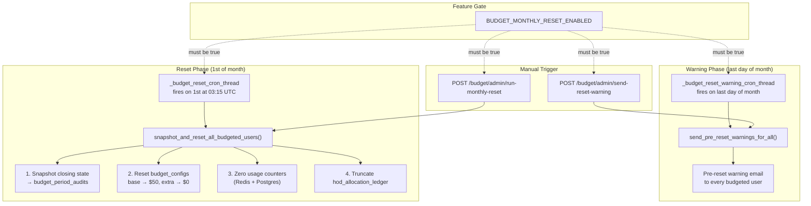

### Idempotency

`snapshot_and_reset_all_budgeted_users()` is idempotent — re-running for the same period is a no-op because the snapshot `INSERT` uses `ON CONFLICT DO NOTHING`. If the audit row already exists, the reset step is skipped to avoid clobbering subsequent admin/HOD changes.

---

## Data Storage Architecture

Budget data is dual-written to Redis (fast-path) and PostgreSQL (source of truth) with a carefully designed fallback chain.

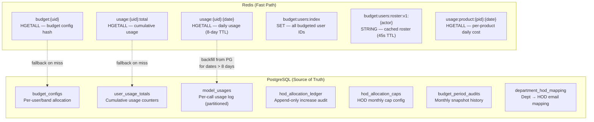

### Read/Write Patterns

| Operation | Redis | PostgreSQL | Fallback |
|-----------|-------|------------|----------|
| `get_budget(uid)` | `HGETALL budget:{uid}` | `budget_configs` SELECT | Redis → PG → None |
| `set_budget(uid, ...)` | `HSET budget:{uid}` + `SADD budget:users:index` | `budget_configs` UPSERT | Both written |
| `get_usage_total(uid)` | `HGETALL usage:{uid}:total` | `user_usage_totals` SELECT | Redis → PG → zeros |
| `increment_usage(uid, ...)` | `HINCRBY` total + dated keys | `user_usage_totals` UPSERT | Both written |
| `get_usage_history(uid)` | Dated keys (≤8 days) | `model_usages` GROUP BY date | Redis → PG backfill |
| `check_budget(uid)` | Redis budget + usage | PG budget + usage | Fail-open if both down |

### Roster Caching Strategy

The `GET /budget/users` endpoint (admin/HOD roster) uses a per-actor Redis cache with a 45-second TTL:

1. **Cache key**: `budget:users:roster:v1:{actor_email}` — scoped so admin and each HOD have separate cached rosters.
2. **Cache invalidation**: `_invalidate_roster_cache()` deletes all `budget:users:roster:v1:*` keys after any mutating action (budget increase, winner allocation, usage reset).
3. **Cold-cache optimization**: Auto-seeding of default budgets is deferred to `GET /budget/me` — the roster returns synthetic defaults without persisting, avoiding a fan-out of Redis+PG writes for large orgs.
4. **Concurrent fetch**: Redis hashes for each user (budget, usage-total, usage-today) are fetched via a bounded thread pool (4–32 workers) to minimize wall-clock latency for large rosters.

---

## Utilization Breakdown

Cost breakdowns by channel or model are computed directly from the `model_usages` table using SQL-level canonicalization.

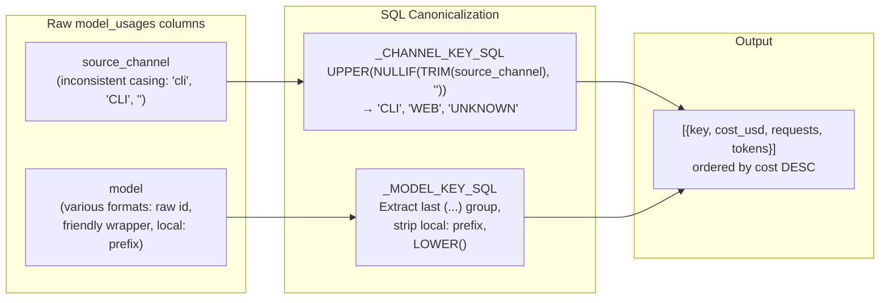

The `_breakdown_for_users()` function aggregates month-to-date costs for a set of user IDs, grouped by either `channel` or `model` dimension. It uses partition-pruning-friendly filters (`user_id::text = ANY(:uids)` and `created_at >= date_trunc('month', now())`).

---

## Chargeback / Per-Product Billing

The chargeback endpoints provide per-product cost attribution for the current calendar month, sourced directly from `model_usages` joined with `products`.

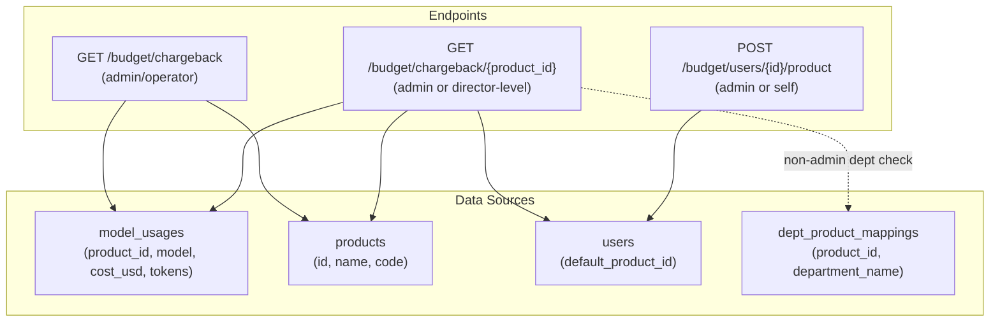

### Authorization for Chargeback

- **Summary** (`GET /budget/chargeback`): Admin or operator role only (`_require_admin_or_operator`).
- **Per-product** (`GET /budget/chargeback/{product_id}`): Admin (unrestricted) or director-level (`ad_level ≤ 3`) with department-product mapping check. Non-admins can only view chargeback for products mapped to their department.

---

## Request/Response Models

### `BudgetIncreaseRequest`

```python
class BudgetIncreaseRequest(BaseModel):
    user_id: str
    requested_extra_cost_usd: float    # Must be > 0, ≤ $200.00
    justification: str                 # Mandatory, ≤ 1000 chars
```

Validators enforce finite numeric values, positive amounts, the `$200` per-request ceiling (`_MAX_REQUEST_EXTRA_USD`), and non-empty justification within length limits.

### `HodCapUpsert`

```python
class HodCapUpsert(BaseModel):
    monthly_cap_usd: float    # Must be > 0
    notes: Optional[str]      # ≤ 1000 chars
```

### `WinnerAllocationBatch`

```python
class WinnerAllocationBatch(BaseModel):
    user_ids: List[str]       # 1–500 entries, deduplicated
```

### `ProductBudgetAssign`

```python
class ProductBudgetAssign(BaseModel):
    product_id: str
```

---

## Business Rule Constants

| Constant | Value | Purpose |
|----------|-------|---------|
| `_MAX_TOKENS_PER_DAY` | 50,000,000 | Hard ceiling on daily tokens |
| `_MAX_REQUESTS_PER_DAY` | 100,000 | Hard ceiling on daily requests |
| `_MAX_COST_USD_PER_DAY` | $10,000 | Hard ceiling on daily cost |
| `_MAX_COST_USD_PER_MONTH` | $100,000 | Hard ceiling on monthly cost |
| `_MAX_REQUEST_EXTRA_USD` | $200 | Max extra budget per increase request |
| `_WINNER_BASE_COST_USD` | $1,000 | 10x winner base allocation |
| `_ROSTER_DEFAULT_BASE_COST_USD` | $50 | Default base for unseeded roster rows |
| `_ROSTER_CACHE_TTL_SECONDS` | 45 | Roster cache TTL |

---

## Audit & Observability

### HOD Action Audit

Every write action performed by an HOD is logged via `_audit_hod_action()`:

```python
logger.info(
    "hod_action actor_email=%s target_user_id=%s action=%s hod_departments=%s",
    ...
)
```

Tracked actions: `reset_usage`, `approve_request`, `reject_request`.

### HOD Allocation Audit Endpoint

`GET /budget/admin/hod-audit` reads the append-only `hod_allocation_ledger` table, providing:
- **Admins**: All HOD ledger rows (optional `?hod_email` filter).
- **HODs**: Forced to their own `hod_email` (cannot read another HOD's spend).
- **Rollup**: Per-HOD aggregate (`total_increased_usd`, `allocation_count`, `distinct_users`).

### My Budget Increases

`GET /budget/my-increases` returns the calling user's own approved budget-increase history — mirroring what their HOD/admin can see via the audit endpoint, but scoped to the requester's own records.

---

## Integration with BudgetMiddleware

The `BudgetMiddleware` (see [middleware](middleware.md) documentation) intercepts every LLM-generating request and calls `check_budget(user_id)` from `budget_store` before allowing the request through. If the user's cumulative spend has reached their `max_cost_usd_total`, the middleware returns a `429 BUDGET_EXCEEDED` response and publishes an inbox notification.

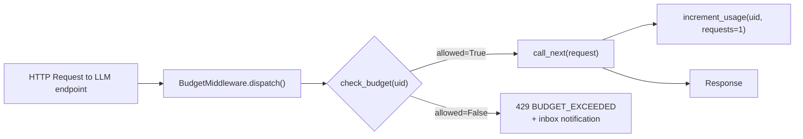

Local/in-house models bypass the budget check entirely (no external API cost).

---

## Frontend Integration

The Budget Manager UI (`ai-ui/src/components/BudgetManager.jsx`) is the primary consumer of these endpoints. It renders three views based on the user's role:

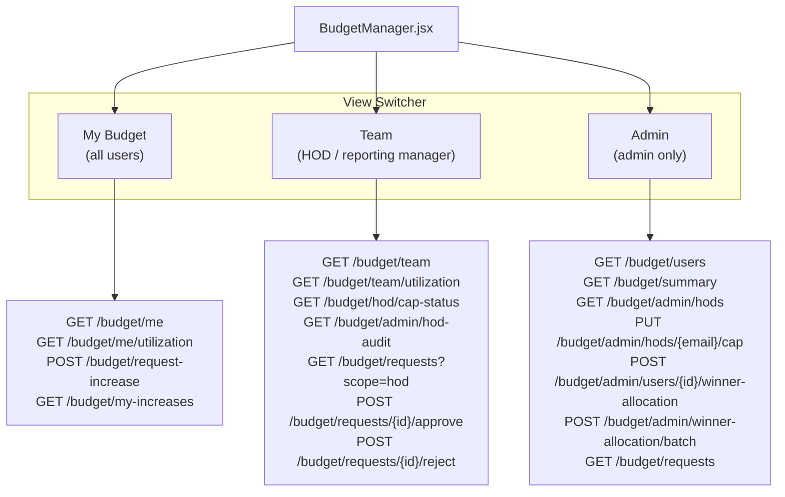

The `TeamBudgetPanel` and `UtilizationView` components provide the team roster table and cost-breakdown pie charts respectively, consuming the `/budget/team` and `/budget/*/utilization` endpoints.

---

## Dependencies

### Internal Modules

| Module | Usage |
|--------|-------|
| [`store/budget_store`](store_layer.md) | Redis + Postgres budget/usage CRUD, increase request lifecycle |
| [`services/hod_budget_governor`](services.md) | HOD monthly cap enforcement and status |
| [`services/budget_audit_service`](services.md) | Monthly snapshot, reset, and pre-reset warnings |
| [`services/hierarchy_service`](services.md) | Org-tree subtree resolution for reporting managers |
| [`store/inbox_store`](store_layer.md) | In-app notification publishing |
| [`services/smtp_service`](services.md) | HTML email delivery for HOD/winner notifications |
| [`auth/rbac`](authentication.md) | Role checks (`is_admin`, `is_hod`), scope filters |
| [`auth/dependencies`](authentication.md) | `get_current_user` dependency |
| [`core/rate_limiter`](core_infrastructure.md) | `enforce_rate_limit_with_behaviour`, `BUDGET_REQUEST`, `BUDGET_ADMIN` |
| [`core/security_validation`](core_infrastructure.md) | `validate_budget_request` input sanitization |
| [`core/logger`](core_infrastructure.md) | Structured logging |
| [`core/config`](core_infrastructure.md) | `postgres_dsn()` |
| [`db/database`](database.md) | `SessionLocal` for SQLAlchemy sessions |
| [`db/models`](database.md) | `User`, `BudgetConfig`, `ModelRateTable` ORM models |
| [`middleware/budget_middleware`](middleware.md) | Per-request budget enforcement (consumes `check_budget`) |
| [`workers/start_workers`](worker_orchestration.md) | Cron threads for monthly reset and warning emails |

### External Systems

| System | Usage |
|--------|-------|
| **Redis** | Fast-path cache for budget configs, usage totals, daily usage, roster cache |
| **PostgreSQL** | Source of truth for `budget_configs`, `user_usage_totals`, `model_usages`, `hod_allocation_ledger`, `hod_allocation_caps`, `budget_period_audits`, `department_hod_mapping` |
| **SMTP Relay** | Email delivery for HOD approval notifications, winner notifications, pre-reset warnings |

---

## Key Database Tables

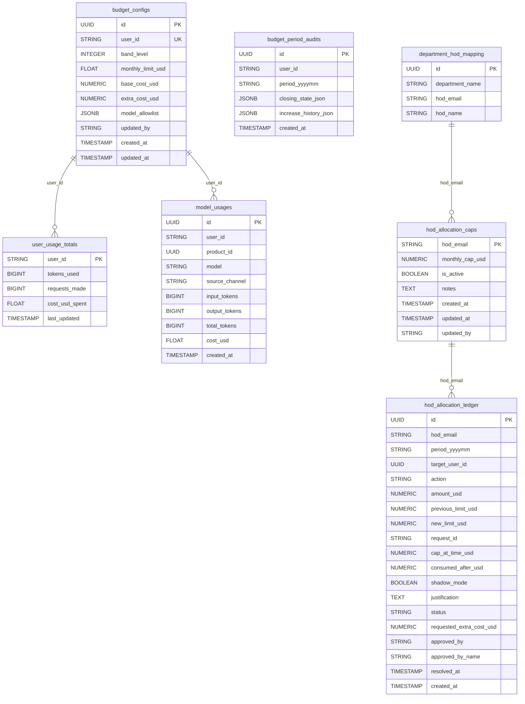

---

## Environment Variables

| Variable | Default | Purpose |
|----------|---------|---------|
| `BUDGET_MONTHLY_RESET_ENABLED` | `false` | Master gate for monthly reset and warning features |
| `BUDGET_MONTHLY_RESET_CRON` | `15 3 1 * *` | Cron schedule for monthly reset (UTC) |
| `BUDGET_MONTHLY_RESET_WARNING_CRON` | `15 3 28-31 * *` | Cron schedule for pre-reset warnings (UTC) |
| `HOD_CAP_ENFORCEMENT_ENABLED` | `false` | Toggle between live (409 on overrun) and shadow mode |
| `HOD_DEFAULT_MONTHLY_CAP_USD` | — | Fallback cap when no `hod_allocation_caps` row exists |
| `BUDGET_RESET_EMAIL_TEST_OVERRIDE` | — | Route all reset-warning emails to a single inbox for testing |
