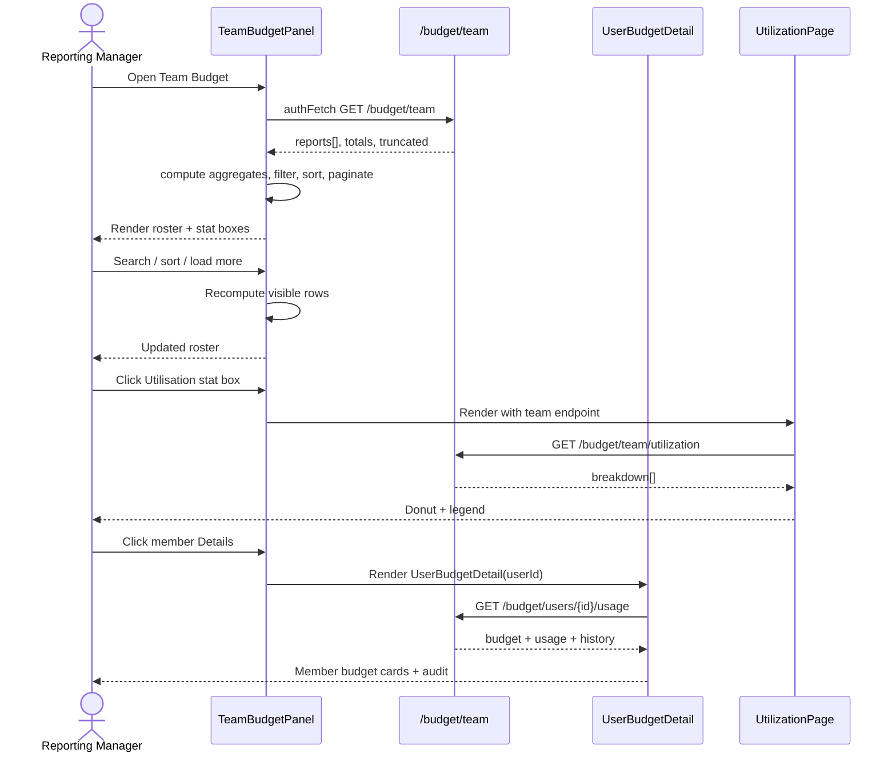
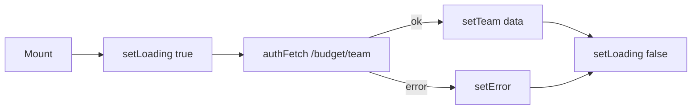
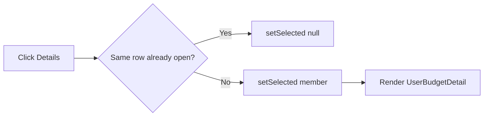
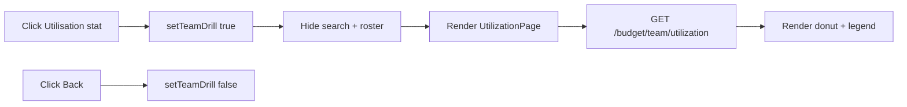

# budget_team_panel

## Brief Introduction

The `budget_team_panel` module provides a **read-only reporting-manager view** of team LLM budgets inside the `ai-ui` React application. It renders a roster of direct and indirect reports, shows each member's base allocation, approved extra budget, total ceiling, and current cost utilisation, and allows managers to drill down into per-member budget details or team-wide utilisation breakdowns.

This module is intentionally **not** an admin tool: it mirrors the layout of the admin `UserRosterPanel` and reuses the same `UserBudgetDetail` drill-down that end users see on the **My Budget** page, but it scopes the data to the caller's reporting subtree (or HOD department).

---

## Core Functionality

### 1. Team Roster

`TeamBudgetPanel` fetches the full team payload from `GET /budget/team` and renders:

- A team-wide aggregate summary (allocated base, extra budget, overall utilisation).
- A searchable, sortable table of team members.
- Per-member progress bars coloured by utilisation thresholds.
- Expandable rows that embed `UserBudgetDetail` for the selected member.

### 2. Sorting & Pagination

- Members are sorted by absolute cost spent (`cost_usd_spent`) using shared logic from [`budget_utilization_view`](budget_utilization_view.md).
- Capped users (those with a positive cost ceiling) are always grouped before uncapped users.
- The roster is paginated in chunks of `PAGE_SIZE` (50) with a **Load more** button.

### 3. Team-Wide Utilisation Drill-Down

Clicking the aggregate **Utilisation** stat box opens a sub-page powered by [`budget_utilization_view`](budget_utilization_view.md) that shows the team's month-to-date spend broken down by:

- **Channel** (e.g., chat, API, workflow)
- **Model** (e.g., GPT-4, Claude)

### 4. Per-Member Drill-Down

Clicking a member's **Details** button expands an inline panel that reuses [`BudgetManager`](budget_manager.md)`::UserBudgetDetail`, giving the manager the same stat cards, increase-request audit, and utilisation breakdown that the member sees on their own **My Budget** page.

---

## Architecture

### Component Hierarchy

```text
TeamBudgetPanel (default export)
├── TeamStatBox
├── UtilizationPage  (from budget_utilization_view)
│   ├── UtilizationPie
│   ├── DonutChart
│   ├── BreakdownLegend
│   └── MtdHistoryTable
└── UserBudgetDetail (from BudgetManager)
    ├── BudgetDetailLayout
    ├── UserIncreasesSection
    └── UtilizationPage
```

### State Management

`TeamBudgetPanel` uses local React state only:

| State | Purpose |
|-------|---------|
| `team` | Full payload from `GET /budget/team` |
| `loading` / `error` | Async fetch lifecycle |
| `search` | Filter by name, email, title, or department |
| `selected` | Currently expanded member row |
| `visibleCount` | Client-side pagination cursor |
| `sortDir` | `desc` (highest spend first) or `asc` |
| `teamDrill` | Toggles the team-wide `UtilizationPage` sub-view |

### Data Flow

```mermaid
flowchart TD
    A[Manager opens Team Budget tab] --> B[TeamBudgetPanel mounts]
    B --> C[authFetch GET /budget/team]
    C --> D[Redis / PG budget store]
    D --> E[Team payload: reports, totals, truncated flag]
    E --> F[Render aggregate stat boxes + roster table]
    F --> G{User action}
    G -->|Search / Sort / Load more| H[Re-filter / re-sort / extend visible rows]
    G -->|Click Utilisation stat| I[UtilizationPage<br/>GET /budget/team/utilization]
    G -->|Click Details| J[UserBudgetDetail<br/>GET /budget/users/{id}/usage]
```

---

## Component Reference

### `TeamBudgetPanel`

The main page component. Responsible for data fetching, filtering, sorting, pagination, and orchestrating the drill-down views.

**Key behaviours:**

- Returns an empty state if the caller is not a team viewer or has no reports.
- Shows a truncation banner when the backend caps the roster at 1,000 members.
- Computes team aggregates with `useMemo` over the full `reports` array (ignoring search filters).

### `loadTeam`

Manual refresh helper used by the **Retry** button after a fetch failure. It mirrors the initial `useEffect` fetch logic.

### `TeamStatBox`

Small clickable summary card used for the team aggregate row. Supports colour tones (`neutral`, `green`, `yellow`, `red`, `indigo`) and keyboard activation when clickable.

### `toggleSort`

Toggles the roster sort direction between descending and ascending spend. Resets pagination to the first page.

---

## API Contracts

### `GET /budget/team`

Returns the team roster and aggregate metadata.

```json
{
  "is_team_viewer": true,
  "caller": { "display_name": "...", "email": "..." },
  "reports": [
    {
      "user_id": "uuid",
      "email": "user@example.com",
      "display_name": "...",
      "title": "...",
      "department": "...",
      "base_cost_usd": 50.0,
      "extra_cost_usd": 10.0,
      "max_cost_usd_total": 60.0,
      "usage_total": { "cost_usd_spent": 12.34, "tokens_used": 0, "requests_made": 0 },
      "has_budget": true
    }
  ],
  "total_count": 42,
  "with_budget_count": 40,
  "truncated": false
}
```

### `GET /budget/team/utilization?dimension={channel|model}`

Returns the team-wide month-to-date cost breakdown.

```json
{
  "dimension": "channel",
  "breakdown": [
    { "key": "chat", "cost_usd": 12.34, "requests": 56 }
  ],
  "total_cost_usd": 12.34,
  "team_size": 42
}
```

### `GET /budget/users/{userId}/usage`

Used indirectly via [`BudgetManager`](budget_manager.md)`::UserBudgetDetail` when expanding a member row.

---

## Dependencies

### Internal Frontend Modules

| Module | Imported Symbol | Purpose |
|--------|-----------------|---------|
| [`config`](ai_ui_frontend_app_core.md) | `authFetch`, `API_BASE` | Authenticated HTTP requests |
| [`BudgetManager`](budget_manager.md) | `UserBudgetDetail` | Per-member budget drill-down |
| [`budget_utilization_view`](budget_utilization_view.md) | `UtilizationPage` | Team-wide utilisation sub-page |
| `budget/utilisationSort` | `sortByUtilisation`, `toggleSortDirection`, `SORT_DESC` | Shared roster sorting |
| `budget/utilizationEndpoints` | `utilizationEndpoints` | URL builders for utilisation APIs |

### Backend Modules

| Module | Endpoint | Purpose |
|--------|----------|---------|
| [`budget_router`](shared_api_routers.md) | `GET /budget/team` | Team roster + aggregates |
| [`budget_router`](shared_api_routers.md) | `GET /budget/team/utilization` | Team utilisation breakdown |
| [`budget_router`](shared_api_routers.md) | `GET /budget/users/{id}/usage` | Per-member usage details |

---

## Component Interaction Diagram



---

## Process Flows

### Initial Load



### Row Expansion



### Team Utilisation Drill-Down



---

## Design Decisions

1. **Read-only by design.** The panel does not allow managers to edit allocations or approve increases. Those actions live in [`BudgetManager`](budget_manager.md) (admin/HOD flows) and the per-member **My Budget** page.
2. **Reuse over duplication.** The module deliberately reuses `UserBudgetDetail` and `UtilizationPage` so that managers and end users see identical budget semantics.
3. **Client-side pagination.** The backend may return up to 1,000 rows; the UI renders them in 50-row chunks to keep DOM weight low.
4. **Capped-first sorting.** Members without a real budget row are deprioritised in the sort so that the highest-spending capped users surface first.

---

## Related Documentation

- [`budget_manager.md`](budget_manager.md) — Admin/HOD budget management and `UserBudgetDetail`.
- [`budget_utilization_view.md`](budget_utilization_view.md) — `UtilizationPage`, donut charts, and breakdown legends.
- [`shared_api_routers.md`](shared_api_routers.md) — Backend `budget_router` endpoints (`/budget/team`, `/budget/team/utilization`).
- [`ai_ui_frontend_app_core.md`](ai_ui_frontend_app_core.md) — Application shell, auth, and `authFetch` configuration.
