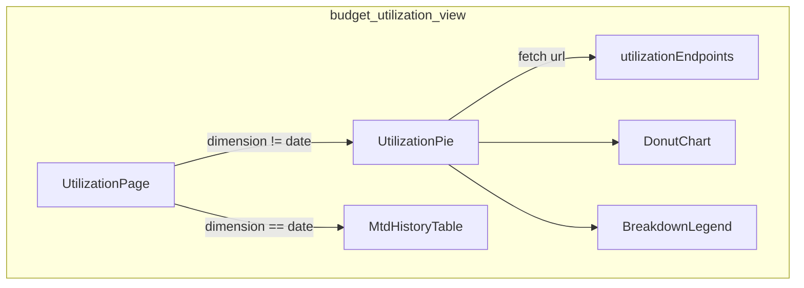
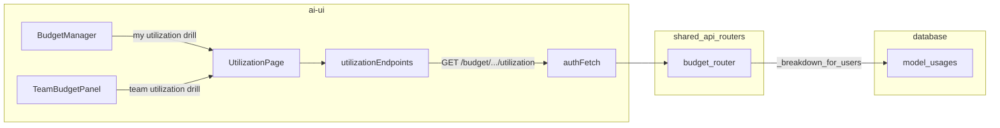
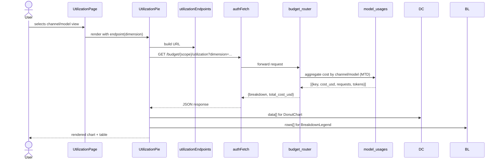
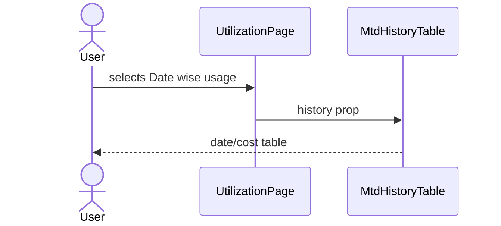
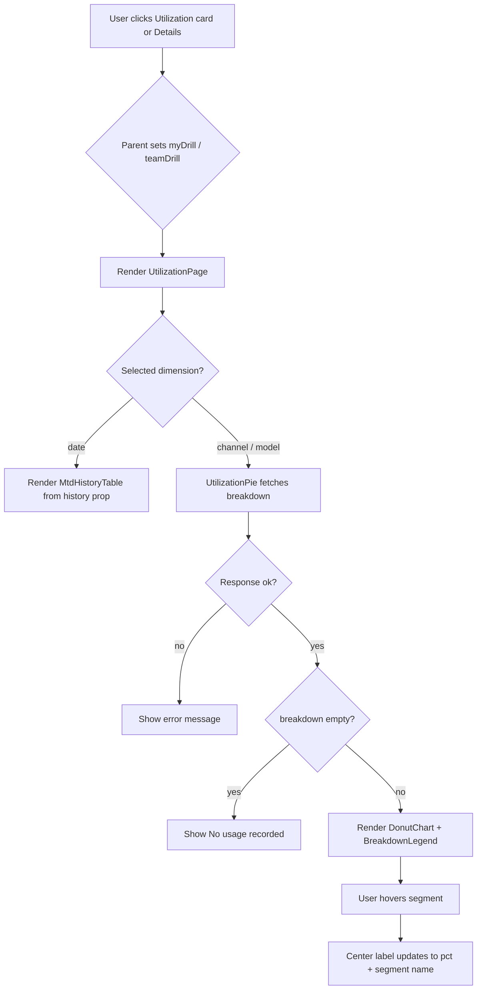

# Budget Utilization View

## Brief Introduction

The `budget_utilization_view` module is a React component library in the `ai-ui` frontend that renders budget utilization drill-downs. It provides zero-dependency SVG donut charts, breakdown tables, and month-to-date (MTD) history views for LLM spend. The module is consumed by the [Budget Manager](budget_manager.md) and [Team Budget Panel](budget_team_panel.md) to let users, team leads, and admins inspect how budgets are being spent across channels, models, or dates.

All visualization components are intentionally implemented with inline SVG rather than external charting libraries, keeping the bundle lightweight and avoiding private-registry dependencies.

---

## Core Functionality

The module exposes five public components from `ai-ui/src/components/budget/UtilizationView.jsx`:

| Component | Responsibility |
|-----------|----------------|
| `DonutChart` | Renders an interactive SVG donut/pie chart from a `{ key, value }[]` array. |
| `BreakdownLegend` | Renders a tabular legend with segment name, cost, share percentage, and request count. |
| `UtilizationPie` | Fetches a utilization breakdown from the backend and composes `DonutChart` + `BreakdownLegend`. |
| `MtdHistoryTable` | Renders a date-wise month-to-date cost table. |
| `UtilizationPage` | Full-page container with a dimension selector (`channel`, `model`, `date`) and optional back button. |

URL builders for the three supported scopes live in the companion module `ai-ui/src/components/budget/utilizationEndpoints.js`:

| Scope | Endpoint builder | Backend route |
|-------|------------------|---------------|
| Me | `utilizationEndpoints.me()` | `GET /budget/me/utilization?dimension={channel\|model}` |
| Team | `utilizationEndpoints.team()` | `GET /budget/team/utilization?dimension={channel\|model}` |
| User | `utilizationEndpoints.user(userId)` | `GET /budget/users/{userId}/utilization?dimension={channel\|model}` |

For details on the backend aggregation logic, see [budget_router](shared_api_routers_budget_router.md).

---

## Architecture

### Component Hierarchy

```text
UtilizationPage
├── dimension selector (channel / model / date)
├── UtilizationPie  (when dimension != date)
│   ├── DonutChart
│   └── BreakdownLegend
└── MtdHistoryTable (when dimension == date)
```

`UtilizationPage` is the orchestrator. It holds the currently selected dimension and decides whether to render a pie breakdown or the MTD history table. `UtilizationPie` is data-aware: it performs the `authFetch` call, handles loading/error states, and passes normalized data to the presentational `DonutChart` and `BreakdownLegend`.

### Module Boundaries

- **Presentation only** — `DonutChart`, `BreakdownLegend`, and `MtdHistoryTable` are pure presentational components.
- **Data fetching** — `UtilizationPie` is the only component in this module that talks to the network.
- **URL construction** — kept in `utilizationEndpoints.js` so the same components can serve `/me`, `/team`, and `/users/:id` scopes without hard-coding routes.

---

## Component Relationships

### Within the Module



### Integration with the Budget UI



---

## Data Flow

### Pie / Donut Breakdown Flow



### MTD History Flow



The MTD history rows are pre-fetched by the parent view (e.g., `BudgetManager` loads `myBudget.history` when it fetches `/budget/me`) and passed into `UtilizationPage` as the `history` prop.

---

## Key Implementation Details

### Inline SVG Donut Chart

`DonutChart` computes arc paths with basic trigonometry:

1. Sums all `value`s to get `total`.
2. Converts each slice into a fractional arc of 360°.
3. Builds an SVG path with `arcPath(cx, cy, rOuter, rInner, startAngle, endAngle)`.
4. Renders a center label that switches between total cost and the hovered segment's percentage.

A guard prevents a full-circle arc from being drawn as a single invalid path by nudging the end angle to `start + 359.999`.

### Color Palette

A fixed 12-color palette is cycled for slices:

```javascript
const PALETTE = [
  "#6366f1", "#22c55e", "#f59e0b", "#ef4444", "#06b6d4",
  "#a855f7", "#ec4899", "#14b8a6", "#eab308", "#3b82f6",
  "#f97316", "#84cc16",
];
```

### Data Normalization

The backend returns breakdown rows shaped as:

```json
{
  "breakdown": [
    { "key": "chat", "cost_usd": 12.3456, "requests": 42, "tokens": 15000 }
  ],
  "total_cost_usd": 12.3456
}
```

`UtilizationPie` maps `breakdown` to `{ key, value: cost_usd }[]` for the chart and passes the raw rows to `BreakdownLegend` for the table.

### Cancellation & Error Handling

`UtilizationPie` uses a `cancelled` flag inside `useEffect` to avoid state updates after unmount. Network errors surface as inline red text; empty usage renders a "No usage recorded" placeholder.

---

## How It Fits into the Overall System

The `budget_utilization_view` module is one of three budget-related UI modules in `ai-ui`:

| Module | Role |
|--------|------|
| [budget_manager](budget_manager.md) | Top-level budget manager with My Budget, Admin, and Team tabs. |
| [budget_team_panel](budget_team_panel.md) | Read-only team roster and team-wide utilization drill-down. |
| **budget_utilization_view** | Shared visualization primitives used by both of the above. |

It sits at the bottom of the budget UI stack: it does not own business rules, approvals, or allocations; it only visualizes spend data produced by the backend's `model_usages` aggregation.

Upstream consumers decide:

- Which dimensions are available (`channel`/`model` for team, `date`/`channel`/`model` for me).
- Which endpoint scope to use.
- Whether to show a back button.

---

## Process Flow: Rendering a Utilization Drill-Down



---

## Dependencies

### Internal

- `authFetch` from [config](ai_ui_frontend_config.md) — authenticated fetch wrapper.
- `utilizationEndpoints` from `ai-ui/src/components/budget/utilizationEndpoints.js` — URL builders.

### External

- `lucide-react` — `ArrowLeft` and `Clock` icons.
- React hooks: `useState`, `useEffect`.

### Backend

- [budget_router](shared_api_routers_budget_router.md) — `get_my_utilization`, `get_team_utilization`, `get_user_utilization`.
- `model_usages` table — source of truth for month-to-date LLM spend.

---

## References

- [budget_manager](budget_manager.md) — primary consumer for the "My Budget" utilization drill-down.
- [budget_team_panel](budget_team_panel.md) — primary consumer for the team-wide utilization drill-down.
- [shared_api_routers_budget_router](shared_api_routers_budget_router.md) — backend routes that power the pie/history data.
- [ai_ui_frontend_config](ai_ui_frontend_config.md) — `authFetch` and `API_BASE` configuration.
