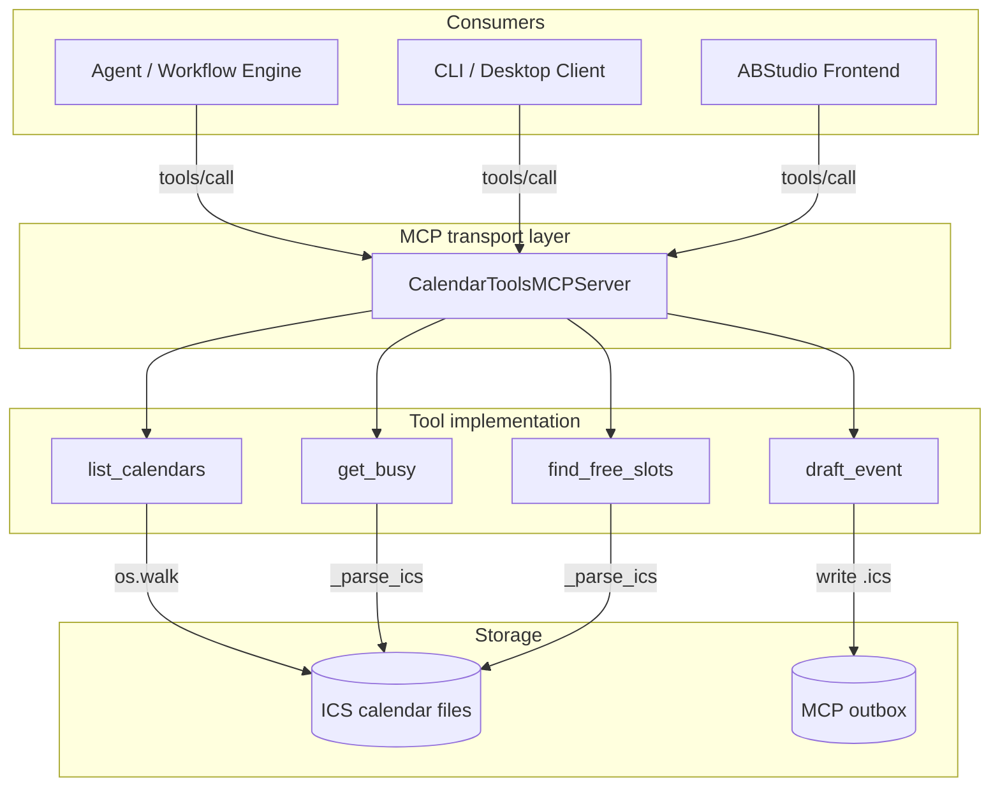
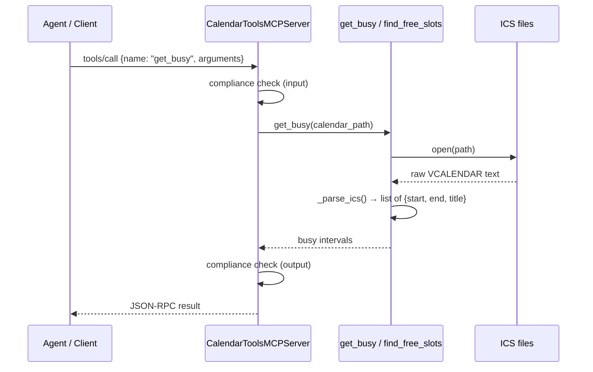
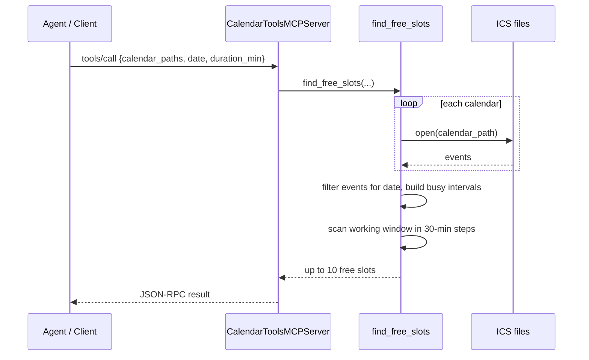
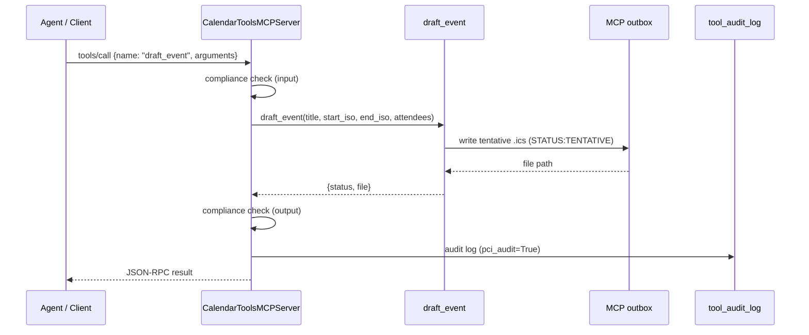

# calendar_tools

The `calendar_tools` module provides read-only calendar introspection and tentative event drafting for the NPCI Agentic Platform. It operates on local `.ics` calendar files and is intentionally **non-destructive**: it can list calendars, read busy intervals, compute common free slots, and write draft `.ics` files to an outbox, but it never performs live calendar bookings.

This module is the backing implementation for the `calendar_tools` MCP server. It is used by use cases such as meeting-notes follow-up (UC-57), interview scheduling (UC-63), executive inbox triage (UC-86), and calendar management (UC-87).

---

## Core responsibilities

- **Discover calendars**: enumerate `.ics` files under a configured data directory.
- **Read availability**: parse busy intervals (start, end, summary) from a calendar.
- **Find free slots**: compute common free windows across multiple calendars for a given date and duration.
- **Draft events**: write tentative `.ics` files to an outbox for later human review or gated live booking.

---

## Module location

| Layer | Path |
|-------|------|
| Tool implementation | `tools/calendar_tools_tools.py` |
| MCP server wrapper | `mcp/servers/calendar_tools_server.py` |
| Server registration | `mcp/registry.py` (via `CalendarToolsMCPServer`) |

---

## Architecture

The `calendar_tools` module is a **stateless tool library**. All persistent state lives on disk as `.ics` files. The MCP server (`CalendarToolsMCPServer`) wraps the four tool functions with JSON-RPC schema definitions, compliance gating, and audit logging. For details on the MCP server base class and transport handling, see [mcp_system](mcp_system.md).

---

## Component overview

### `tools/calendar_tools_tools.py`

| Function | Purpose | Side effects |
|----------|---------|--------------|
| `list_calendars()` | Return relative paths of all `.ics` files under `CALENDAR_TOOLS_DATA_DIR`. | None |
| `get_busy(calendar_path)` | Parse a single `.ics` file and return busy intervals. | None |
| `find_free_slots(calendar_paths, date, duration_min, earliest, latest)` | Compute up to 10 common free slots across the given calendars on a date. | None |
| `draft_event(title, start_iso, end_iso, attendees)` | Write a tentative `.ics` file to `CALENDAR_TOOLS_OUTBOX_DIR`. | Creates outbox file |

### `mcp/servers/calendar_tools_server.py`

`CalendarToolsMCPServer` extends `BaseMCPServer` and registers the four functions as MCP tools. It sets `pci_audit=True` on `draft_event`, which causes the base server to write an audit row to `tool_audit_log` after each call. Input/output compliance scanning is applied to every tool call by the base class.

---

## Configuration

All behavior is driven by environment variables:

| Variable | Default | Description |
|----------|---------|-------------|
| `CALENDAR_TOOLS_DATA_DIR` | `/data/calendars` | Root directory scanned for `.ics` calendar files. |
| `CALENDAR_TOOLS_OUTBOX_DIR` | `/data/mcp_outbox/calendar` | Directory where `draft_event` writes tentative `.ics` files. |
| `CALENDAR_TOOLS_WORK_HOURS` | `09:00-18:30` | Default working window used by `find_free_slots`. |
| `CALENDAR_TOOLS_TIMEZONE` | `Asia/Kolkata` | TZID emitted in draft `.ics` files. |

---

## Data flow

### Reading availability

### Finding common free slots

### Drafting an event

---

## ICS parsing

The module uses a minimal line-oriented parser (`_parse_ics`) rather than a full iCalendar library. It extracts:

- `DTSTART` → event start
- `DTEND` → event end
- `SUMMARY` → event title

Only the base key (before any `;` parameters) is considered. This keeps the dependency surface small but means the parser does not handle recurrence rules, time-zone folding, or complex iCalendar properties.

---

## Free-slot algorithm

`find_free_slots` performs the following steps:

1. Resolve the search window from `earliest`/`latest` arguments, falling back to `CALENDAR_TOOLS_WORK_HOURS`.
2. Parse each requested calendar and keep only events whose `DTSTART` begins on the requested date.
3. Build a list of busy `(start, end)` tuples.
4. Scan the working window in 30-minute increments, emitting any contiguous window that can fit `duration_min` minutes without overlapping a busy interval.
5. Return at most 10 slots.

The scan advances by the full slot duration when a slot is found, or by 30 minutes when blocked, which produces compact but not necessarily exhaustive results.

---

## Security and governance

- **No live writes**: `draft_event` only creates `STATUS:TENTATIVE` `.ics` files in the outbox. A separate gated booking tool or human action is required to send calendar invites.
- **Compliance scanning**: all inputs and outputs pass through the platform compliance gate inside `BaseMCPServer.handle_message`.
- **Audit logging**: `draft_event` is flagged with `pci_audit=True`, so every call is recorded in `tool_audit_log`.
- **File-system scope**: tools are restricted to the configured `CALENDAR_TOOLS_DATA_DIR` and `CALENDAR_TOOLS_OUTBOX_DIR`.

For broader governance patterns, see [mcp_system](mcp_system.md) and [guardrails](guardrails.md).

---

## Integration with the platform

`calendar_tools` is one of several tool families in `shared_integrations`. It is conceptually related to:

- [email_tools](email_tools.md) — another MCP-backed communication tool set.
- [m365_tools](m365_tools.md) / [tools_m365_bridge](tools_m365_bridge.md) — for live Microsoft 365 integration; `calendar_tools` can be pointed at exported M365 `.ics` feeds, while live booking should use a gated M365 connector.
- [mcp_system](mcp_system.md) — for MCP server lifecycle, transport, and registration details.
- [shared_integrations_connector_infrastructure](shared_integrations_connector_infrastructure.md) — for OAuth2-backed connectors that could consume the outbox drafts.

---

## Deployment notes

- Mount the calendar data directory at `CALENDAR_TOOLS_DATA_DIR` and the outbox directory at `CALENDAR_TOOLS_OUTBOX_DIR`.
- Populate calendars as `.ics` files. File names and subdirectories are preserved as relative paths returned by `list_calendars`.
- Ensure the process has read access to the data directory and write access to the outbox directory.
- The companion MCP server is started by the platform's MCP registry bootstrap; no separate process is required unless running in standalone mode.

---

## Limitations and future work

- The parser is intentionally minimal and does not expand recurring events.
- Free-slot search is date-local and does not cross midnight.
- Time-zone handling relies on the configured `CALENDAR_TOOLS_TIMEZONE`; calendars without explicit TZID parameters are parsed as-is.
- Live booking is out of scope; integrate with [m365_tools](m365_tools.md) or a similar connector for that capability.
