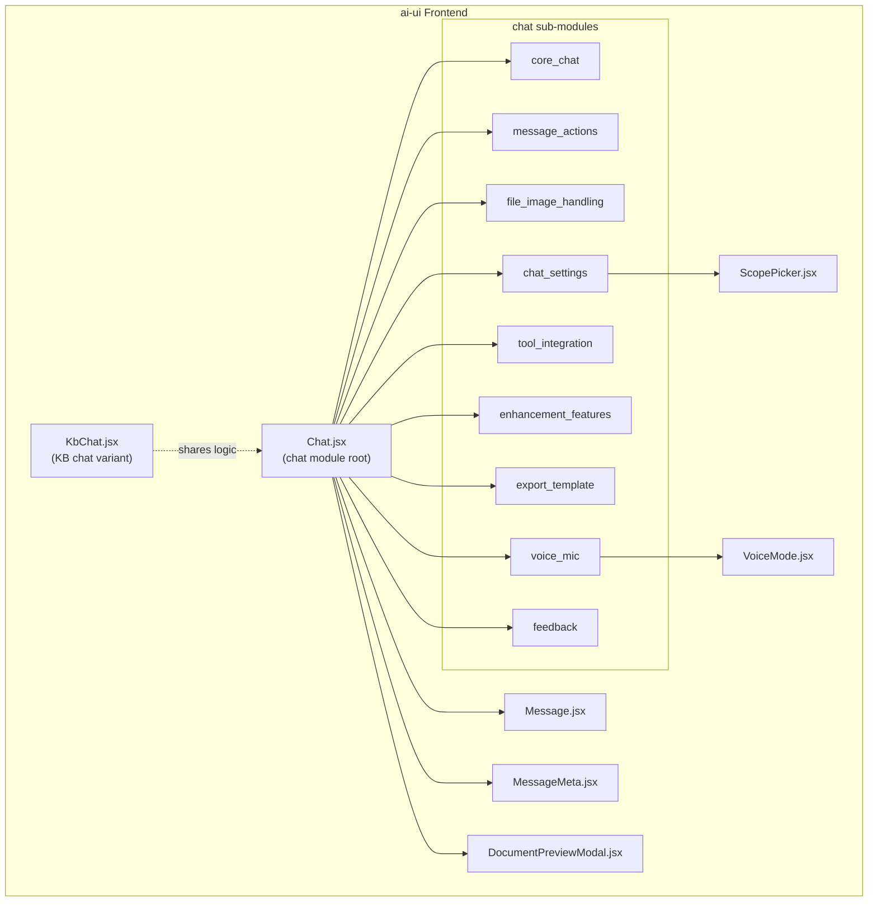
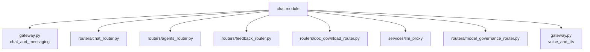

# `chat` Module Overview

## Purpose

The `chat` module is the primary conversational interface of the AI-UI frontend. It provides a single, stateful React surface where users can send text/voice messages, attach files and images, invoke agents, generate images and documents, manage per-chat settings, and give feedback on assistant responses. The module orchestrates all client-side chat lifecycle concerns—message streaming, cancellation, retry/continue, upload caching, model governance, and RAG/KB scoping—and delegates rendering and specialized behavior to focused sub-components.

---

## Architecture

### High-level component layout



### Request routing & data flow

```mermaid
flowchart LR
    User["User input"] --> Chat
    Chat --> Classify["classifyIntent"]
    Classify -->|image intent| ImageGen["handleImageGenerate<br/>POST /chat/image-generate"]
    Classify -->|doc intent| AskDoc["POST /ask<br/>→ doc job"]
    Chat -->|@agent| AgentRun["POST /agents/{name}/run"]
    Chat -->|veo model| VideoGen["POST /chat/video-generate"]
    Chat -->|default| AskSSE["POST /ask<br/>SSE stream"]

    ImageGen --> LLMProxy["llm_proxy /llm/imagen"]
    AskDoc --> Gateway["gateway /ask"]
    AgentRun --> Gateway
    VideoGen --> LLMProxy
    AskSSE --> Gateway

    Gateway -->|tokens / meta| Chat
    Chat --> Msg
    Chat --> Meta
```

### Backend dependencies



---

## Core Components

| Sub-module | Key source symbols | Responsibility |
|---|---|---|
| **core_chat** | `Chat.jsx::Chat`, `sendMessage`, `classifyIntent`, `createNewChat` | Main component, message state, SSE streaming, intent routing, chat lifecycle. |
| **message_actions** | `sendMessageForVoice`, `handleRegenerate`, `handleContinue`, `stopGeneration` | User-initiated message actions: voice send, regenerate, continue, stop. |
| **file_image_handling** | `handleImageSelect`, `handleFileUpload`, `AttachmentChip`, `ImageChip`, `cancelUpload` | File/image selection, upload, caching, and preview chips. |
| **chat_settings** | `setChatScope`, `setChatRagMode` | Per-chat RAG mode and KB scope persistence. |
| **tool_integration** | `ToolCard`, `ToolGroup` | Rendering of structured tool-call events inside messages. |
| **enhancement_features** | `handleEnhance`, `applyEnhancement`, `handleImageGenerate`, `_tryExtractJSON` | AI prompt enhancement and inline image generation. |
| **export_template** | `handleExport`, `saveSelectionAsTemplate` | Export chat to Markdown and save composer text as prompt template. |
| **voice_mic** | `handleMicToggle`, `sendMessageForVoice` | Browser Web Speech API microphone input. |
| **feedback** | `submitFeedback` | Thumbs-up/down feedback collection and submission. |

---

## Related Modules

- **message** — Message bubble rendering, markdown, code blocks, artifacts, download buttons.
- **message_meta** — Token/cost/latency/model footer chips beneath each assistant message.
- **kb_chat** — Knowledge-base chat variant that reuses most `chat` logic with KB-scoped retrieval.
- **voice_mode** — Full-screen hands-free voice conversation overlay.
- **document_preview** — Modal for previewing attached documents and images.
- **scope_picker** — Reusable KB scope selector used by chat settings.
- **config** — `authFetch` / `API` used for all authenticated backend calls.
- **ai_ui_frontend_utils** — Content utilities such as `stripMemoryTag`, `previewCache`.

---

## References to Core Component Documentation

- [core_chat](core_chat.md)
- [message_actions](message_actions.md)
- [file_image_handling](file_image_handling.md)
- [chat_settings](chat_settings.md)
- [tool_integration](tool_integration.md)
- [enhancement_features](enhancement_features.md)
- [export_template](export_template.md)
- [voice_mic](voice_mic.md)
- [feedback](feedback.md)
- [message](message.md)
- [message_meta](message_meta.md)
- [kb_chat](kb_chat.md)