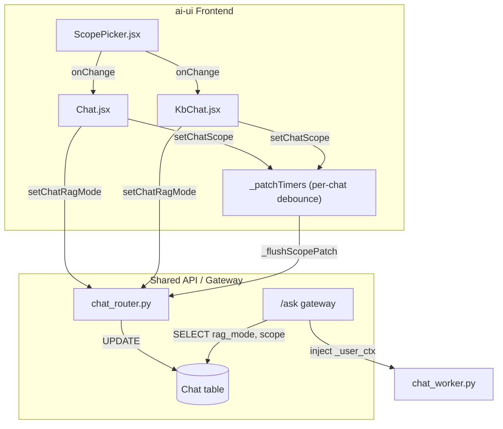
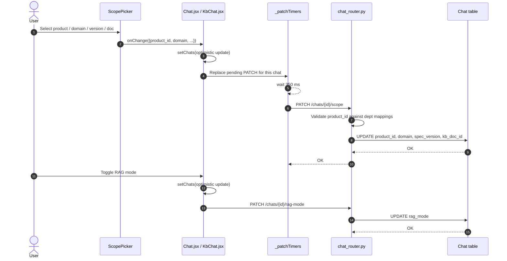

# chat_settings

The `chat_settings` module manages per-chat configuration that controls how a conversation retrieves and uses knowledge. It provides the frontend state mutations and backend persistence for two settings:

1. **RAG mode** — whether retrieval-augmented generation is `off`, `auto`, or `on` for a chat.
2. **KB scope** — the knowledge boundary for a chat, expressed as `product_id`, `domain`, `spec_version`, and an optional `kb_doc_id`.

These settings are shared between the generic chat surface (`Chat.jsx`) and the knowledge-base chat surface (`KbChat.jsx`). They are persisted on the `Chat` database row and read by the `/ask` gateway on every request to inject scoped retrieval context.

---

## Core Components

| Component | File | Responsibility |
|-----------|------|----------------|
| `setChatRagMode` | `ai-ui/src/components/Chat.jsx`<br>`ai-ui/src/components/KbChat.jsx` | Sets the per-chat RAG mode (`off`/`auto`/`on`) with an optimistic local update and a best-effort PATCH to the backend. |
| `setChatScope` | `ai-ui/src/components/Chat.jsx`<br>`ai-ui/src/components/KbChat.jsx` | Sets the per-chat KB scope (`product_id`, `domain`, `spec_version`, `kb_doc_id`). Updates local state immediately and debounces the backend PATCH (350 ms) per chat. |
| `_flushScopePatch` | `ai-ui/src/components/Chat.jsx`<br>`ai-ui/src/components/KbChat.jsx` | Sends the pending scope PATCH for a specific chat and clears its debounce timer. |
| `update_chat_rag_mode` | `routers/chat_router.py` | Backend endpoint `PATCH /chats/{chat_id}/rag-mode`. Validates the mode and persists it on the `Chat` row. |
| `update_chat_scope` | `routers/chat_router.py` | Backend endpoint `PATCH /chats/{chat_id}/scope`. Normalizes scope fields, validates `product_id` against the user's department mappings, and persists the scope. |
| `ScopePicker` | `ai-ui/src/components/ScopePicker.jsx` | Reusable UI control for selecting domain, product, version, and document. Emits scope changes via `onChange`. |

---

## Architecture



### Component Interaction



---

## Data Model

The settings are stored on the `Chat` table (defined in `db/models.py` and referenced in `routers/chat_router.py`):

| Column | Type | Meaning |
|--------|------|---------|
| `id` | UUID | Chat identifier. |
| `user_id` | string | Owner of the chat; used for authorization. |
| `rag_mode` | string | `off`, `auto`, or `on`. |
| `product_id` | UUID/null | Product the chat is scoped to. |
| `domain` | string/null | Department / domain scope. |
| `spec_version` | string/null | Specification or version scope. |
| `kb_doc_id` | UUID/null | Optional pin to a single KB document. |
| `updated_at` | datetime | Bumped on every settings change. |

---

## Process Flows

### Setting the KB Scope

```mermaid
flowchart LR
    A[User changes scope picker] --> B[setChatScope receives next scope]
    B --> C[Optimistically merge into active chat]
    C --> D{Existing timer for this chat?}
    D -->|Yes| E[clearTimeout(existing)]
    D -->|No| F[Create new timer]
    E --> F
    F --> G[setTimeout 350 ms]
    G --> H[_flushScopePatch(chatId)]
    H --> I[authFetch PATCH /chats/{id}/scope]
    I --> J[Server validates & persists]
```

Key behaviors:

- **Optimistic UI**: the local `chats` array is updated immediately so the picker, header breadcrumb, and welcome line reflect the new scope without waiting for the network.
- **Per-chat debounce**: `_patchTimers` is keyed by `chat_id`. Switching chats does not cancel another chat's pending write.
- **Flush on unmount**: the cleanup effect iterates all pending timers and flushes them so SPA navigation cannot lose in-flight edits.
- **Send-time flush**: `sendMessage()` explicitly flushes any pending scope PATCH before calling `/ask`, preventing a stale scope from being used for the current turn.

### Setting the RAG Mode

```mermaid
flowchart LR
    A[User toggles RAG] --> B[setChatRagMode(mode)]
    B --> C{mode in [off,auto,on]?}
    C -->|No| D[Return early]
    C -->|Yes| E[Optimistically update chat.rag_mode]
    E --> F[authFetch PATCH /chats/{id}/rag-mode]
    F --> G[Server validates enum & persists]
```

The RAG mode toggle is intentionally immediate (no debounce) because it is a single-value change. The local state is not rolled back on network failure because the server default matches the new value.

### Server-Side Scope Validation

`update_chat_scope` enforces a **server-derived, non-spoofable** product boundary:

1. Normalizes all fields to trimmed strings or `None`.
2. For non-admin users, resolves the set of `product_id`s mapped to the user's department via `dept_product_mappings`.
3. Rejects the request with HTTP 403 if the requested `product_id` is not in the allowed set.
4. If validation cannot be performed (cache/DB failure), it fail-closes by dropping `product_id` to `None`.

This guarantees that even if a client sends an arbitrary `product_id`, the backend will not scope retrieval to an unauthorized product.

---

## Dependencies

### Upstream / callers

- [`chat.md`](chat.md) — the parent `Chat` and `KbChat` components own the `chats` state and pass `activeChatId` into the settings functions.
- [`kb_chat.md`](../knowledge/kb_chat.md) — `KbChat.jsx` duplicates the same settings logic for knowledge-base conversations.

### Downstream / callees

- [`chat_router.md`](../api/chat_router.md) — backend router exposing `PATCH /chats/{id}/rag-mode` and `PATCH /chats/{id}/scope`.
- [`knowledge_base.md`](../knowledge/knowledge_base.md) — `ScopePicker.jsx` is also used when uploading documents and when starting a KB chat from `KbDrillGraph`.
- [`gateway.md`](../models/gateway.md) — the `/ask` gateway reads `rag_mode` and scope columns from the `Chat` row and injects them into `_user_ctx` for retrieval.

### Shared utilities

- `authFetch` from `ai-ui/src/config.js` for authenticated HTTP calls.
- `ScopePicker.jsx` for the scope selection UI.

---

## Design Notes

- **Why debounce scope but not RAG mode?** Scope changes often come in rapid sequences (domain → product → version → document). Debouncing coalesces them into one network request. RAG mode is a single toggle.
- **Why per-chat timers?** A user can edit chat A, switch to chat B, edit chat B, and both writes must land. A single shared timer would cancel chat A's write.
- **Why server-side product validation?** The scope determines what documents the retrieval pipeline can see. Client-side validation is not sufficient for access control.
- **Why flush before `/ask`?** Without the explicit flush, a user who changes scope and immediately presses Send could trigger retrieval against the previous scope because the debounced PATCH has not yet reached the database.

---

## Related Documentation

- [chat.md](chat.md) — generic chat surface and message streaming.
- [kb_chat.md](../knowledge/kb_chat.md) — knowledge-base chat surface.
- [chat_router.md](../api/chat_router.md) — backend chat API routes.
- [knowledge_base.md](../knowledge/knowledge_base.md) — KB document management and scope picker usage.
- [gateway.md](../models/gateway.md) — runtime injection of chat settings into retrieval context.
