# core_chat

## Introduction

`core_chat` is the central conversational interface component of the AI-UI
frontend. It is implemented in `ai-ui/src/components/Chat.jsx` and renders the
full chat experience: a chat-list sidebar, a scrollable message thread, and a
multimodal composer. The component orchestrates message sending, streaming
response handling, intent classification, file uploads, image/video/document
generation, agent routing, voice I/O, feedback, and model governance — all
within a single React function component.

This module is the **core** sub-module of the broader
[chat](chat.md) feature. Sibling sub-modules (message actions, file/image
handling, tool integration, enhancement, export, voice, and feedback) are
implemented as functions inside the same file but are documented separately for
readability. `core_chat` focuses on the `Chat` component itself, chat lifecycle
management (`createNewChat`, `handleRetry`), and the primary send/stream
pipeline (`sendMessage`).

---

## Architecture Overview

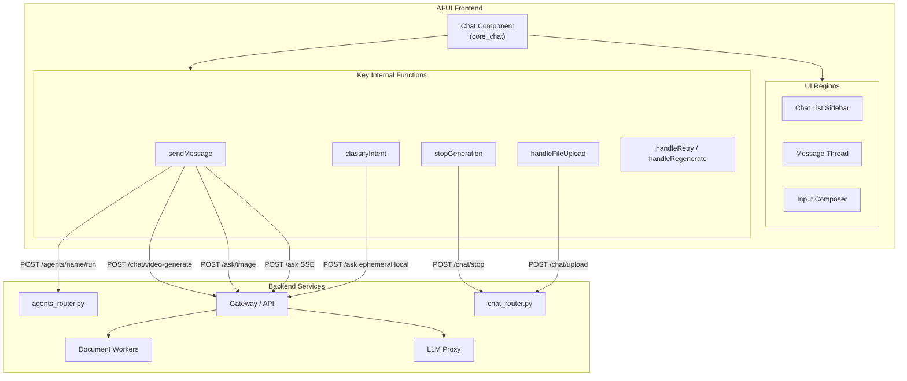

The `Chat` component is a stateful orchestrator. It holds all conversation
state in React `useState`/`useRef` hooks (no external state library), talks to
the backend via `authFetch` (see [config](../core/config.md)), and delegates rendering
of individual messages to [message](message.md) and metadata to
[message_meta](message_meta.md).

---

## Component Dependencies

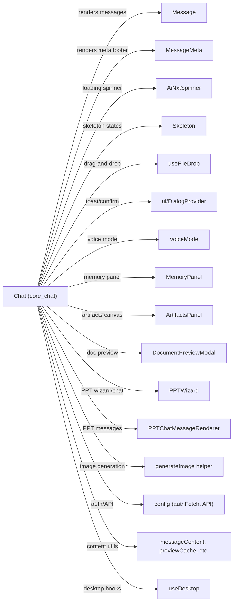

### External Modules Referenced

| Dependency | Purpose | Documentation |
|---|---|---|
| `config.js` (`authFetch`, `API`) | Authenticated API calls and base URL | [config](../core/config.md) |
| `useFileDrop` | Drag-and-drop file handling | [ai_ui_frontend_hooks](../ui/ai_ui_frontend_hooks.md) |
| `Message` / `MessageMeta` | Message bubble and metadata rendering | [message](message.md), [message_meta](message_meta.md) |
| `AiNxtSpinner` / `Skeleton` | Loading and skeleton states | [spinner](../ui/spinner.md), [skeleton](../core/skeleton.md) |
| `VoiceMode` | Full-screen voice conversation overlay | [voice_mode](../ui/voice_mode.md) |
| `MemoryPanel` | User memory viewer | [memory_panel](../storage/memory_panel.md) |
| `ArtifactsPanel` | Canvas for HTML/SVG/Mermaid artifacts | [artifacts_panel](../ui/artifacts_panel.md) |
| `DocumentPreviewModal` | File attachment preview | [document_preview](../documents/document_preview.md) |
| `PPTWizard` / `PPTChatMessageRenderer` | Presentation generation | [ppt_wizard](../presentation/ppt_wizard.md), [ppt_chat](../presentation/ppt_chat.md) |
| `useToast` / `useConfirm` | Toast notifications and confirmation dialogs | [ui_dialog](../ui/ui_dialog.md) |
| `generateImage` | Image generation API helper | [chat](chat.md) |
| `stripMemoryTag`, `parseMemoryTag`, `stripSystemPrefix`, etc. | Content sanitisation utilities | [ai_ui_frontend_utils](../ui/ai_ui_frontend_utils.md) |

---

## State Management

The `Chat` component manages a large amount of state entirely through React
hooks. There is no Redux or Zustand store. State is categorised into the
following groups:

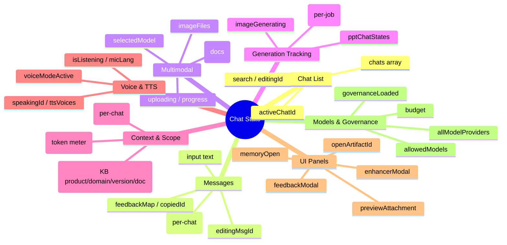

### Per-Chat Loading & Cancellation

Loading state is keyed by `chatId` (`loadingMap`) so that switching chats does
not clobber the loading flag of a background stream. Similarly, `AbortController`
references are stored in `abortMapRef` keyed by chat ID, and cancellation flags
in `cancelledChatsRef` ensure a Stop click during the intent-classifier hop
prevents the second API call from firing.

---

## Core Workflows

### 1. Message Send Pipeline (`sendMessage`)

This is the most complex function in the module. It handles multiple routing
paths based on user input, attachments, selected model, and backend intent
classification.

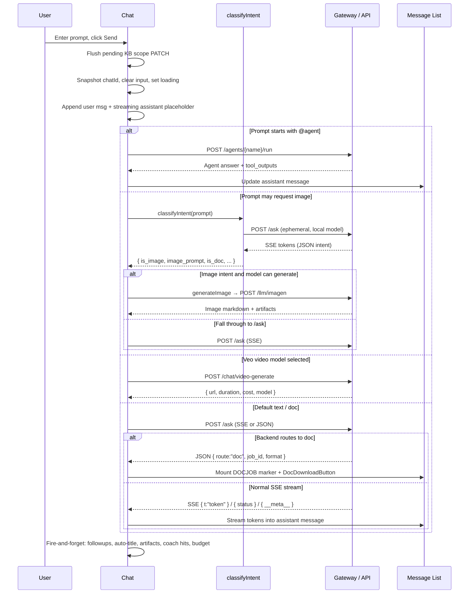

#### Key Routing Decisions

| Condition | Route | Endpoint |
|---|---|---|
| Prompt starts with `@agentName` | Agent runner | `POST /agents/{name}/run` |
| Image intent + model is `auto` or `gemini-3.1-flash-image` | Image generation | `generateImage()` helper |
| Model is `veo-3.1-generate-preview` | Video generation | `POST /chat/video-generate` |
| Backend returns `{route:"doc"}` JSON | Document generation | `POST /ask` → background job |
| All other cases | Text chat (SSE) | `POST /ask` |
| Images attached | Vision query | `POST /ask/image` (multipart) |

#### SSE Event Handling

The streaming reader processes `data: <json>\n\n` events with the following
event types:

| SSE Key | Purpose |
|---|---|
| `{ t: "..." }` | Token chunk — appended to assistant content |
| `{ status: "..." }` | Live status line (e.g. "Thinking…", "Reading sources…") |
| `{ context: {...} }` | Context-window telemetry for the composer meter |
| `{ compaction: {...} }` | History summarisation notice |
| `{ tool_event: {...} }` | Structured tool-call card |
| `{ tool_call: "..." }` | Legacy string-form tool call |
| `{ __meta__: {...} }` | Final metadata: model, tokens, cost, latency, sources, confidence, coverage trace, message_id |

### 2. Intent Classification (`classifyIntent`)

Document intent routing is **backend-authoritative** — the client no longer
classifies document requests. However, image intent still requires a client-side
classifier hop because image generation is not handled by the backend doc router.

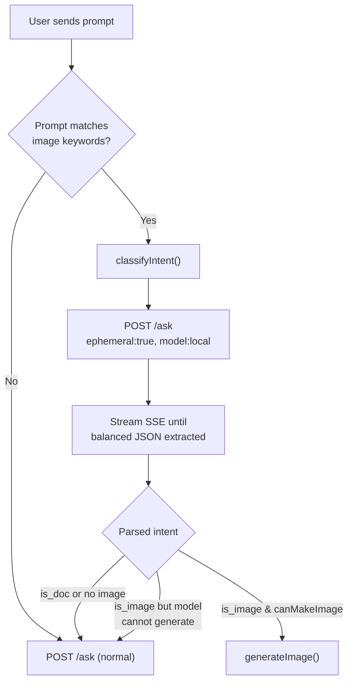

The classifier uses a strict JSON schema prompt (`DOC_CLASSIFIER_SYS_PROMPT`)
and a brace-depth scanner (`_tryExtractJSON`) to early-exit the SSE stream as
soon as a valid JSON object is detected. The call is marked `ephemeral: true`
so it does not persist to chat history. Filenames from attachments are
sanitised (path stripping, control-char removal, length capping, bracket
wrapping) to mitigate prompt-injection into the classifier.

### 3. File Upload Pipeline (`handleFileUpload`)

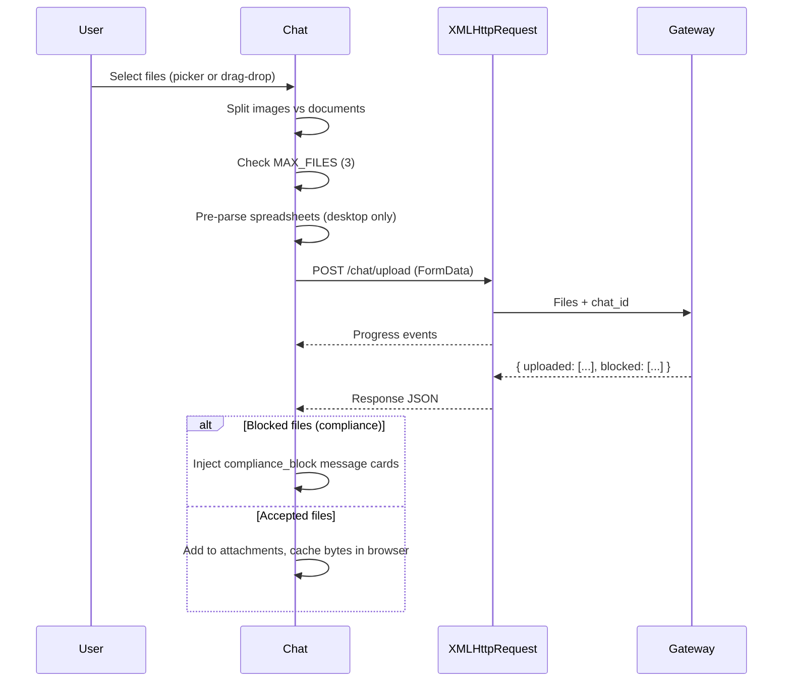

Files are cached client-side via `cacheStore` so attachment previews survive
page refreshes. On desktop (Electron), Excel files are pre-parsed locally via
`readFileSpreadsheet` to provide immediate tabular content.

### 4. Stop / Retry / Regenerate / Continue

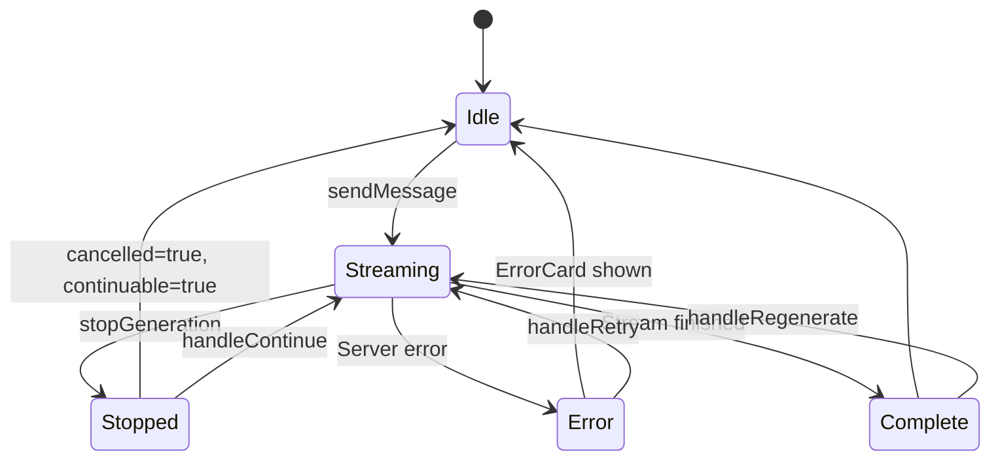

- **`stopGeneration`** — Aborts the browser fetch, aborts the in-flight
  classifier, sends `POST /chat/stop` with the request ID for cooperative
  backend cancellation, and marks the message as `cancelled` + `continuable`.
- **`handleRetry`** — Drops the failed assistant message, re-populates the
  composer with the last user prompt, and programmatically clicks Send.
- **`handleRegenerate`** — Drops the last assistant reply, keeps the user
  prompt, and re-sends.
- **`handleContinue`** — Calls `POST /ask/continue/{message_id}` to resume a
  truncated/stopped response from the cut point.

### 5. Chat Lifecycle

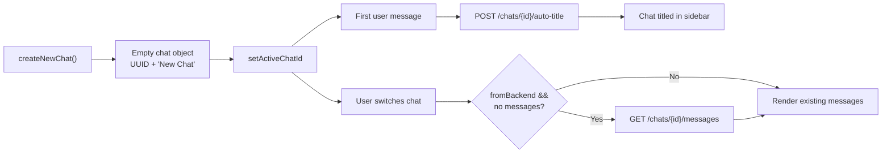

- **`createNewChat`** — Creates a local chat object with a fresh UUID, prepends
  it to the chats array, and activates it.
- **Lazy-load** — When a backend-origin chat is opened for the first time,
  messages are fetched from `GET /chats/{id}/messages` and hydrated with
  attachment metadata, coverage traces, and artifacts.
- **Auto-title** — After the first assistant turn, if the title is still
  default, `POST /chats/{id}/auto-title` is called to generate an LLM-based
  title.

---

## Model Discovery & Governance

On mount, the component fetches two model lists:

1. **`GET /all-models`** — All available model providers and their models
   (grouped by provider, with tier badges).
2. **`GET /model-governance/my-models`** — Models the current user is permitted
   to use based on governance rules.

The model picker (`MODEL_OPTIONS`) is filtered to only show allowed models once
governance has loaded. If governance fails to load (network error), the picker
fails open and shows all models. See
[model_governance](../llm/model_governance.md) and
[endpoint_manager](../products/endpoint_manager.md) for backend details.

Local models are sent as `model: "local"` with a `local_model` field containing
the model name (e.g. `Kimi-k2.5`).

---

## KB Scope & RAG Integration

When the Chat component is hosted inside the Knowledge Base surface (embedded
mode), it receives a `kbScope` prop and per-chat scope fields
(`product_id`, `domain`, `spec_version`, `kb_doc_id`). These are persisted to
the backend via debounced `PATCH /chats/{id}/scope` calls.

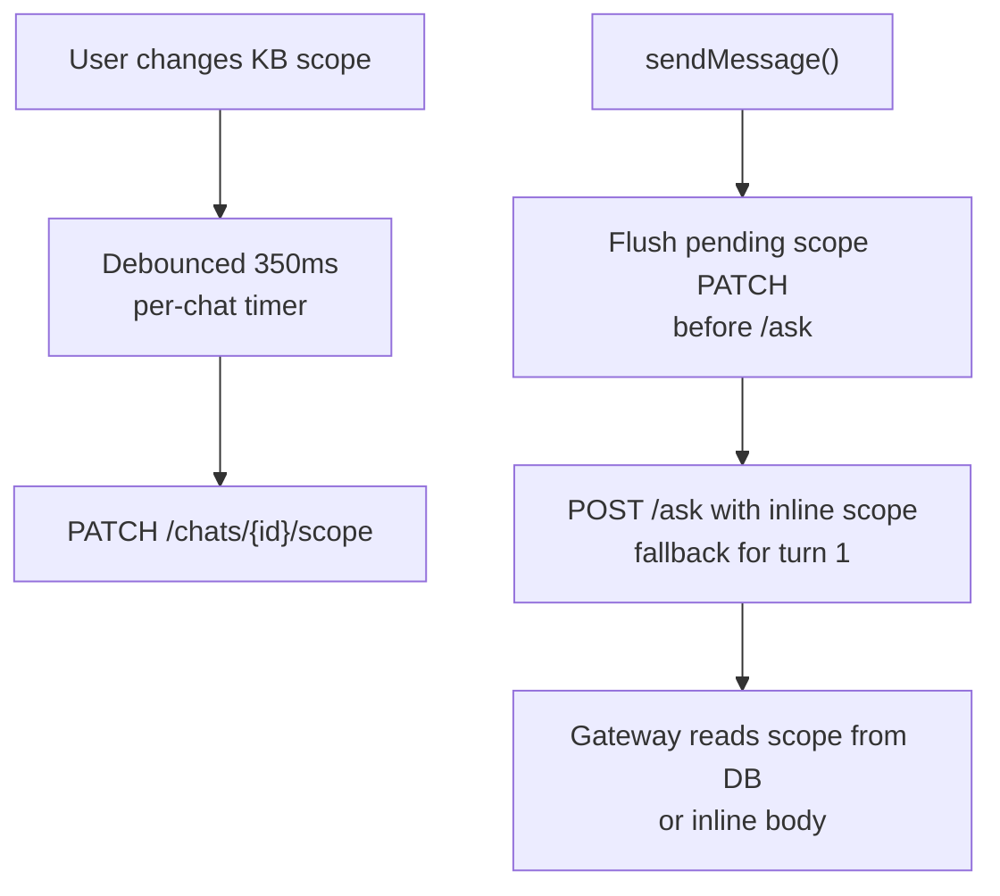

The `kbScopePending` flag triggers a one-time back-patch of scope and RAG mode
after the first `/ask` call creates the chat row server-side. See
[kb_chat](../knowledge/kb_chat.md) for the KB-embedded chat variant.

---

## API Endpoints Used

| Endpoint | Method | Purpose |
|---|---|---|
| `/ask` | POST | Primary chat (SSE stream or JSON doc-route) |
| `/ask/image` | POST | Vision query with image attachments (multipart) |
| `/ask/continue/{message_id}` | POST | Continue a truncated response |
| `/chat/stop` | POST | Cooperatively stop backend generation |
| `/chat/upload` | POST | Upload document attachments |
| `/chat/video-generate` | POST | Generate video via Veo model |
| `/chat/followups` | POST | Generate follow-up suggestion chips |
| `/chats` | GET | List user chats |
| `/chats/{id}/messages` | GET | Lazy-load chat history |
| `/chats/{id}` | DELETE | Delete a chat |
| `/chats/{id}/title` | PATCH | Rename a chat |
| `/chats/{id}/pin` | PATCH | Pin/unpin a chat |
| `/chats/{id}/auto-title` | POST | LLM-based auto-titling |
| `/chats/{id}/scope` | PATCH | Update KB scope fields |
| `/chats/{id}/rag-mode` | PATCH | Update RAG mode |
| `/chats/{id}/artifacts` | POST | Persist extracted artifacts |
| `/agents/{name}/run` | POST | Run a named agent |
| `/all-models` | GET | Fetch all model providers |
| `/model-governance/my-models` | GET | Fetch user-allowed models |
| `/budget/me` | GET | Fetch user budget status |
| `/enhance` | POST | Prompt enhancement |
| `/voice/tts` | POST | Text-to-speech audio |
| `/coach/events/by-request/{id}/hits` | GET | Inline coach rule hits |
| `/chat/messages/{id}/feedback` | POST | Submit message feedback |
| `/prompt-templates` | GET/POST | Saved prompt templates |

---

## Key Internal Functions

| Function | Purpose |
|---|---|
| `sendMessage` | Primary send pipeline — routes to text/image/video/doc/agent paths |
| `classifyIntent` | Local-LLM intent classifier for image generation (doc intent is backend-authoritative) |
| `handleImageGenerate` | Explicit image generation via toolbar shortcut |
| `handleFileUpload` | Document upload with progress, compliance blocking, desktop pre-parse |
| `stopGeneration` | Abort fetch + classifier, cooperative backend stop, mark cancelled |
| `handleRetry` | Drop failed reply, re-send last user prompt |
| `handleRegenerate` | Drop last assistant reply, re-send last user prompt |
| `handleContinue` | Resume a stopped/truncated response via `/ask/continue` |
| `handleSpeak` | Text-to-speech with backend TTS + Web Speech fallback |
| `handleMicToggle` | Speech-to-text via Web Speech API |
| `handleEnhance` | AI prompt enhancement with follow-up questions |
| `handleExport` | Export chat as Markdown file |
| `handleFeedback` / `submitFeedback` | Thumbs up/down with structured feedback modal |
| `setChatScope` | Debounced per-chat KB scope persistence |
| `setChatRagMode` | Per-chat RAG mode toggle |
| `createNewChat` | Create and activate a new empty chat |
| `maybeExtractArtifacts` | Detect HTML/SVG/Mermaid blocks and persist as artifacts |
| `attachCoachHits` | Fetch and attach inline coach rule hits to a message |

---

## Message Object Shape

The component enriches each assistant message with metadata during streaming.
The final message object includes:

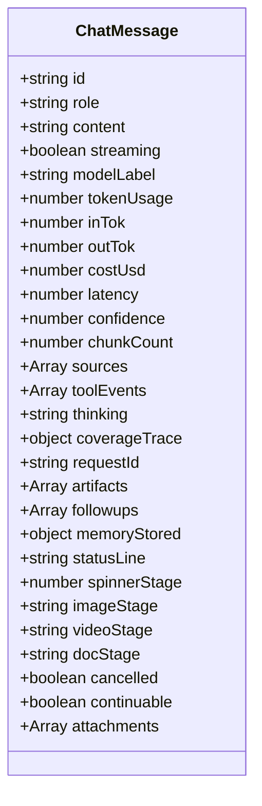

---

## Design Decisions

### Backend-Authoritative Document Routing
Document intent classification was moved from the client to the backend. Every
prompt is sent to `/ask`; the backend runs the small local model and returns
`{route:"doc", job_id}` if it is a document request. The client intercepts this
JSON response to mount a `DOCJOB` marker and `DocDownloadButton`. This
eliminated regex-based misrouting on the client.

### Ephemeral Classifier
The image intent classifier call uses `ephemeral: true` and omits `chat_id` so
it never persists to Postgres or appears in the chat sidebar.

### Per-Chat State Isolation
Loading, abort, and cancellation state are all keyed by chat ID. This allows
background document generation in chat A to continue while the user works in
chat B, and ensures Stop only affects the visible chat.

### Session Storage for Doc Jobs
In-flight document job timestamps are persisted to `sessionStorage` so they
survive page refreshes. On mount, the component restores these jobs and
re-probes the backend for their status.

### KB Scope Back-Patch
Chats created from the Knowledge Base surface carry `kbScopePending=true`
because the chat row does not exist server-side until the first `/ask` call.
After the first turn, scope and RAG mode are back-patched so subsequent turns
read scope from the database.

### Governance-Aware Model Picker
The model picker filters based on `/model-governance/my-models`. If governance
has not loaded, it fails open (shows all models). Once loaded, an empty
allowed-models list means all models are blocked (only Auto is shown).

---

## Relationship to Other Modules

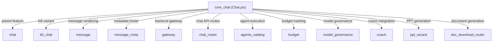

The `KbChat.jsx` component duplicates the `sendMessage` pipeline verbatim. Any
change to the streaming logic in `core_chat` must be mirrored in
[kb_chat](../knowledge/kb_chat.md) until the duplication is extracted into a shared hook.

---

## Error Handling

| Scenario | Behaviour |
|---|---|
| Server error (non-429) | Assistant placeholder replaced with `ErrorCard` component; `handleRetry` available |
| HTTP 429 `BUDGET_EXCEEDED` | Budget-exhausted banner shown; in-house models suggested |
| AbortError (user Stop) | Message marked `cancelled: true`, `continuable: true`; Continue button rendered |
| Image model unavailable (503) | Friendly "not available" message rendered as normal assistant reply |
| Upload blocked by compliance | `compliance_block` message card injected with reasons |
| Stream timeout (5 min) | `AbortController` auto-aborts; treated as user Stop |
| Classifier failure | Returns `NONE` intent; falls through to normal `/ask` |

---

## References

- [chat](chat.md) — Parent chat feature module (all sub-modules)
- [kb_chat](../knowledge/kb_chat.md) — Knowledge Base embedded chat variant
- [message](message.md) — Message bubble rendering and markdown
- [message_meta](message_meta.md) — Model/token/cost/latency footer chips
- [config](../core/config.md) — `authFetch` and `API` configuration
- [ai_ui_frontend_hooks](../ui/ai_ui_frontend_hooks.md) — `useFileDrop`, `useDesktop`
- [ai_ui_frontend_utils](../ui/ai_ui_frontend_utils.md) — Content utilities and cache
- [gateway](../core/gateway.md) — Backend gateway service
- [chat_router](chat_router.md) — Backend chat API routes
- [agents_catalog](../agents/agents_catalog.md) — Agent catalog and execution
- [budget](../llm/budget.md) — User budget management
- [model_governance](../llm/model_governance.md) — Model permission governance
- [coach](../coach/coach.md) — Coach rule evaluation and inline hits
- [ppt_wizard](../presentation/ppt_wizard.md) — Presentation generation wizard
- [voice_mode](../ui/voice_mode.md) — Voice conversation mode
- [spinner](../ui/spinner.md) — Loading spinner component
- [skeleton](../core/skeleton.md) — Skeleton loading states
- [ui_dialog](../ui/ui_dialog.md) — Toast and confirmation providers
