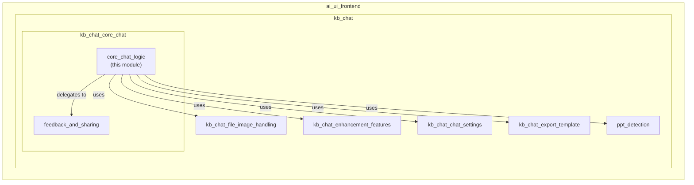
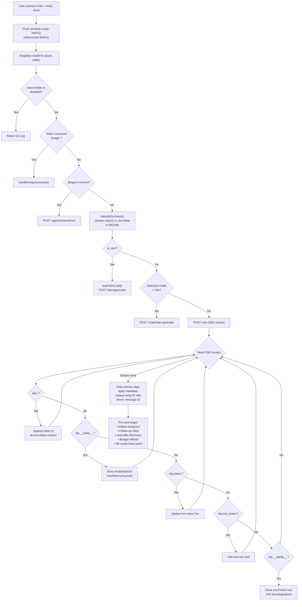
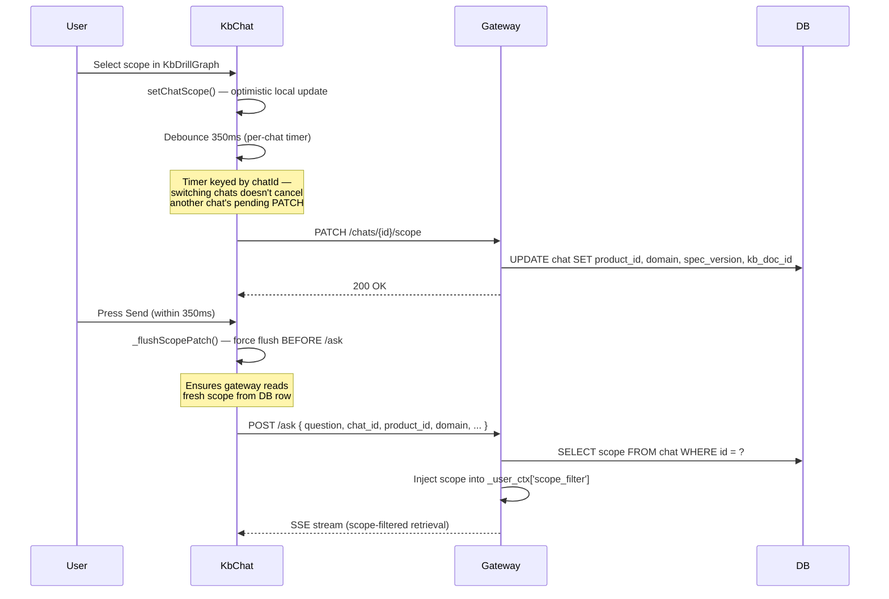
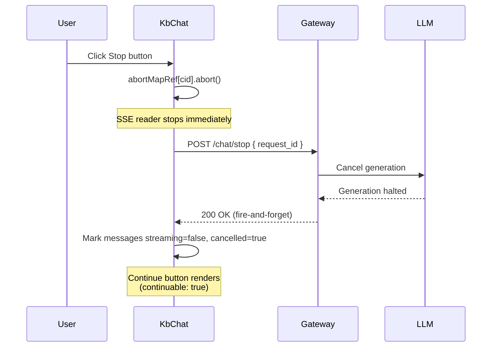
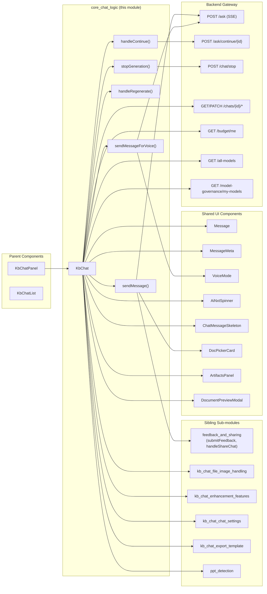
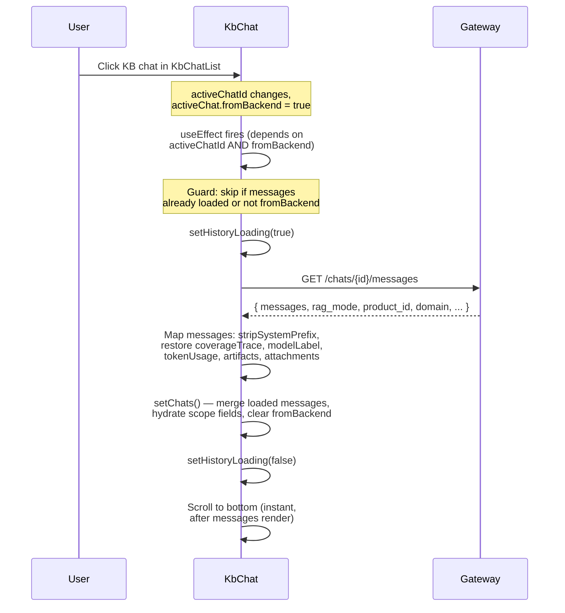
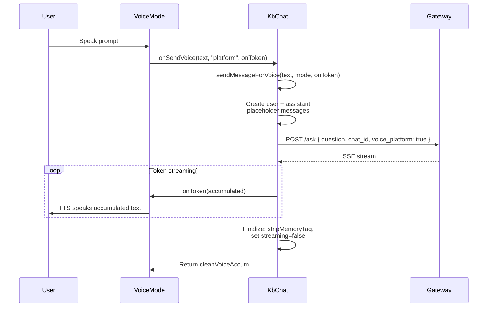

# Core Chat Logic (KbChat)

## Overview

The `core_chat_logic` module encapsulates the primary conversational engine for the **Knowledge Base (KB) chat surface** in the AI-UI frontend. It is implemented as the `KbChat` React component — a deliberate fork of the general-purpose [`Chat`](core_chat.md) component — specialized for KB-scoped, retrieval-augmented conversations. The module manages the full lifecycle of a KB chat turn: message composition, SSE streaming, intent routing, cooperative cancellation, regeneration, continuation, and voice-mode interaction.

Unlike the general chat, KB chats are **scope-bound**: every question is answered from an indexed document corpus filtered by a user-selected domain → product → version → document hierarchy. The scope is persisted on the server-side Chat row and injected into the gateway's retrieval pipeline.

---

## Architecture

### Module Position

`core_chat_logic` is a sub-module within the `kb_chat` → `kb_chat_core_chat` hierarchy of the `ai_ui_frontend` project. It sits alongside sibling sub-modules that handle file/image attachments, prompt enhancement, chat settings, export, PPT detection, and feedback/sharing — all co-located in the same `KbChat.jsx` source file.

### Fork Relationship with Chat.jsx

`KbChat` is a **code fork** of `Chat.jsx`. The two components share a ~700-line `sendMessage()` streaming pipeline that is duplicated verbatim. The source code explicitly documents this:

> *SYNC WITH Chat.jsx sendMessage — any change to sendMessage here must also be applied in Chat.jsx until a shared `useChatSend` hook is extracted.*

Key differences from `Chat.jsx`:

| Aspect | `KbChat` (this module) | `Chat` ([core_chat](core_chat.md)) |
|---|---|---|
| Sidebar | None — `KbChatList` owns the left rail | Internal chat list panel |
| Container height | `h-full` (fits KB tab flex box) | `h-screen` |
| Header | 4-chip scope breadcrumb (Domain › Product › Version › Document) | Chat title |
| Welcome screen | Resolved KB scope path | "Hey {firstName}!" greeting |
| Voice mode | **Kept** (hands-free KB lookup) | Kept |
| Memory panel | Removed | Present |
| Share button | Removed | Present |
| File/image attach | Removed (answers from indexed corpus) | Present |
| Drag-and-drop | Removed | Present |
| PPT wizard | Removed | Present |
| Doc-generation classifier | Client-side (always returns `is_doc: false`) | Backend-authoritative via local-LLM classifier |
| Model selection | Per-chat (via `useRef` map keyed by `chatId`) | Global `useState` |

---

## Core Components

### KbChat

The main React component that renders the entire KB chat surface. It receives the shared `chats` array, `activeChatId`, and `user` from the parent `KbChatPanel`, and manages all internal state for message composition, streaming, model selection, and UI affordances.

**Props:**

| Prop | Type | Description |
|---|---|---|
| `chats` | `Array` | Shared chat list (managed by parent) |
| `setChats` | `Function` | State setter for chats |
| `activeChatId` | `string` | Currently active chat ID |
| `setActiveChatId` | `Function` | Chat switch handler |
| `user` | `Object` | Authenticated user object |
| `chatsLoading` | `boolean` | Initial chat list loading flag |
| `pendingPrompt` | `string` | Desktop-injected prompt (from clipboard/LocalFiles) |
| `onPendingPromptConsumed` | `Function` | Callback after consuming pending prompt |

**Key internal state:**

- **Per-chat model selection**: Uses a `useRef` map (`modelPerChat`) keyed by `chatId` so each KB chat retains its own model choice independently. A version counter (`setModelVersion`) forces re-renders on change.
- **Per-chat loading**: `loadingMap` keyed by `chatId` ensures switching chats doesn't clobber loading state.
- **KB scope**: Derived from `activeChat` fields (`product_id`, `domain`, `spec_version`, `kb_doc_id`) — persisted server-side via debounced `PATCH /chats/{id}/scope`.
- **RAG mode**: Per-chat, default `"off"`. Persisted via `PATCH /chats/{id}/rag-mode`.
- **Abort controllers**: `abortMapRef` (per-chat `AbortController` for SSE streams) and `requestIdMapRef` (per-chat `X-Request-ID` for cooperative backend cancellation).

### sendMessageForVoice

Sends a text prompt via `POST /ask` with `voice_platform: true` flag, streams the SSE response, and returns the full accumulated answer string. Used exclusively by the `VoiceMode` overlay component for hands-free KB interaction.

**Parameters:**
- `text` — The user's spoken/typed prompt
- `mode` — `"platform"` (KB RAG) or `"generic"` (no RAG, pure model)
- `onToken` — Optional callback receiving accumulated text on each token

**Returns:** The cleaned (memory-tag-stripped) full response string.

**SSE event handling:**
- `{"t": "..."}` — Token chunk; appended to accumulated content
- `{"__meta__": {...}}` — Metadata (model label, latency); applied on stream end

### handleRegenerate

Re-sends the last user prompt by trimming the conversation history back to the last user message, populating the input field, and programmatically clicking the send button.

**Flow:**
1. Find the last user message index
2. Drop everything after it (the previous assistant reply)
3. Set the input to the original user prompt
4. Trigger `sendMessage()` via a simulated button click

### handleContinue

Resumes a truncated or stopped assistant response by calling `POST /ask/continue/{message_id}`. The backend re-streams from the cut point, appending tokens to the existing message content.

**SSE event handling:**
- `{"t": "..."}` — Token appended to existing message content
- `{"__meta__": {...}}` — Sets `continuable: false` to hide the Continue button

### stopGeneration

Performs a **two-phase cooperative cancellation** of the active streaming generation:

1. **Client-side abort**: Calls `abort()` on the `AbortController` for the currently visible chat, immediately stopping the SSE reader.
2. **Backend cooperative stop**: Sends `POST /chat/stop` with the `X-Request-ID` captured from the stream response headers, so the backend stops the LLM generator and doesn't waste tokens after the client disconnects.

After cancellation, all streaming messages in the active chat are marked `streaming: false` and `cancelled: true`, which renders the "stopped generating" indicator and the Continue button.

---

## Data Flow

### Message Send Pipeline

The `sendMessage()` function (the largest function in the module, ~700 lines) orchestrates the complete message lifecycle. The flow below shows the KB-specific routing:

### SSE Event Schema

The backend gateway streams `text/event-stream` responses. Each event is `data: <json>\n\n`. The KbChat client handles these event types:

| Event Key | Purpose | KbChat Handling |
|---|---|---|
| `{"t": "..."}` | Token chunk | Append to accumulated content, update message |
| `{"__meta__": {...}}` | Turn metadata (model, tokens, cost, latency, sources, coverage_trace, message_id) | Store on message; replace client temp ID with server ID |
| `{"status": "..."}` | Live backend status narration | Update `statusLine` on message for spinner label |
| `{"tool_event": {...}}` | Structured tool-call card | Accumulate in `toolEvents` array on message |
| `{"tool_call": "..."}` | Legacy string-form tool call | Append as inline code (back-compat) |
| `{"__clarify__": {...}}` | KB disambiguation (4+ docs found) | Replace streaming placeholder with `DocPickerCard` |

### KB Scope Management

### Cooperative Stop Flow

---

## Component Interaction Diagram

---

## Dependencies

### Frontend Dependencies

| Dependency | Module | Purpose |
|---|---|---|
| `authFetch` | [config](../core/config.md) | Authenticated HTTP client (sends httpOnly cookie + correlation ID) |
| `stripMemoryTag` | [ai_ui_frontend_utils](../ui/ai_ui_frontend_utils.md) (`messageContent.js`) | Removes `<!--MEMORY:{...}-->` footer from streamed content |
| `stripSystemPrefix` | [ai_ui_frontend_utils](../ui/ai_ui_frontend_utils.md) (`messageContent.js`) | Removes `[STYLE INSTRUCTION:...]` / `[CONTEXT:...]` prefixes |
| `cacheStore` / `cachePurgeExpired` | [ai_ui_frontend_utils](../ui/ai_ui_frontend_utils.md) (`previewCache.js`) | Browser Cache API for attachment preview persistence |
| `Message` / `ExpandableMessageBody` | [message](message.md) | Markdown rendering with collapsible long content |
| `MessageMeta` | [message_meta](message_meta.md) | Token/cost/latency/model footer chips |
| `VoiceMode` | [voice_mode](../ui/voice_mode.md) | Full-screen voice conversation overlay |
| `AiNxtSpinner` | [spinner](../ui/spinner.md) | Multi-stage loading spinner with live status line |
| `ChatMessageSkeleton` | [skeleton](../core/skeleton.md) | Shimmer placeholder during initial load |
| `DocPickerCard` | [documents](../documents/documents.md) | KB disambiguation document picker |
| `ArtifactsPanel` | [artifacts_panel](../ui/artifacts_panel.md) | Canvas panel for HTML/SVG/Mermaid artifacts |
| `DocumentPreviewModal` | [document_preview](../documents/document_preview.md) | File preview modal for attachments |
| `useToast` | [ui_dialog](../ui/ui_dialog.md) | Toast notifications |
| `usePPTChat` / `usePPTConversation` | PPT hooks | Inert in KbChat (always reports inactive) |

### Backend API Endpoints

| Endpoint | Method | Purpose |
|---|---|---|
| `/ask` | POST | Main SSE chat stream (KB-scoped retrieval) |
| `/ask/continue/{message_id}` | POST | Resume a truncated/stopped response |
| `/ask/image` | POST | Image-attached question (multipart) |
| `/chat/stop` | POST | Cooperative backend generation cancellation |
| `/chat/followups` | POST | Auto-generate follow-up suggestion chips |
| `/chats/{id}/messages` | GET | Lazy-load chat history from backend |
| `/chats/{id}/scope` | PATCH | Persist KB scope (product/domain/version/doc) |
| `/chats/{id}/rag-mode` | PATCH | Persist RAG mode (off/auto/on) |
| `/chats/{id}/auto-title` | POST | LLM-generated chat title (first turn) |
| `/chats/{id}/artifacts` | POST | Persist extracted HTML/SVG/Mermaid blocks |
| `/chats/{id}/share` | POST | Create public read-only share link |
| `/chat/upload` | POST | File attachment upload (XHR with progress) |
| `/chat/messages/{id}/feedback` | POST | Thumbs-up/down feedback with issue categorization |
| `/chat/image-generate` | POST | Inline image generation (Imagen/DALL-E) |
| `/chat/video-generate` | POST | Veo video generation |
| `/docs/generate` | POST | Document generation job submission |
| `/agents/{name}/run` | POST | @agent mention routing |
| `/budget/me` | GET | User budget status |
| `/all-models` | GET | All-provider model discovery |
| `/model-governance/my-models` | GET | User's governance-allowed models |
| `/prompt-templates` | GET/POST | Saved prompt templates ("/" menu) |
| `/enhance` | POST | AI prompt enhancement |
| `/voice/tts` | POST | Backend text-to-speech (OpenAI TTS) |

---

## Key Design Decisions

### 1. Per-Chat State Isolation

Because `KbChat` is mounted once for the entire KB tab (only `activeChatId` changes on chat switch, not the component), plain `useState` would share state across all chats. The module uses:

- **`useRef` maps** keyed by `chatId` for model selection (`modelPerChat`)
- **`useState` objects** keyed by `chatId` for loading state (`loadingMap`)
- **Per-chat `AbortController`** in `abortMapRef` for stream cancellation
- **Per-chat `X-Request-ID`** in `requestIdMapRef` for cooperative stop

### 2. Debounced Scope PATCH with Per-Chat Timers

Scope changes are debounced at 350ms to avoid one round-trip per dropdown change. Timers are keyed **per chat** (`_patchTimers.current[cid]`) so switching to chat B between an edit on chat A and the deadline doesn't cancel A's pending PATCH. On unmount, all pending timers are flushed.

### 3. Pre-Send Scope Flush

Before `POST /ask`, any pending scope PATCH for the active chat is force-flushed. This prevents a race where hitting Send within 350ms of changing the scope dropdown would send a request whose retrieval is still scoped to the previous product/version.

### 4. KB Scope Back-Patch

Chats created from the Knowledge Base → Chat flow carry `kbScopePending=true` because the Chat row only exists server-side after the first `/ask` call lazy-creates it. After the first successful turn, the module retries the scope and RAG-mode PATCHes (which initially 404'd) and clears the marker.

### 5. Doc-Intent Short-Circuit

In `KbChat`, `classifyDocIntent()` always returns `{ is_doc: false, format: null }` — KB chats route straight to `/ask`. This is an intentional behavior difference from `Chat.jsx`, where document generation is a supported capability.

### 6. SSE Buffer Management

The SSE reader splits on `\n\n` boundaries and retains any incomplete trailing event in `sseBuffer`. This ensures partial chunks (common with large token bursts) are reassembled correctly before JSON parsing.

### 7. Memory Tag Stripping

Every token append and final content assignment calls `stripMemoryTag()` to remove the `<!--MEMORY:{...}-->` footer that the backend appends for cross-chat memory persistence. This footer is metadata, not user-visible content.

---

## Process Flows

### Chat History Lazy-Load

### Voice Mode Interaction

---

## Error Handling

| Scenario | Handling |
|---|---|
| **Stream abort (user stop)** | `AbortError` caught → message marked `cancelled: true`, `continuable: true` |
| **Budget exhausted (HTTP 429)** | `BUDGET_EXCEEDED` parsed from response body → budget banner shown, error message thrown |
| **Server error (non-429)** | Error text extracted from response → inline error message in assistant bubble |
| **Voice request failure** | Error message set on assistant bubble, error re-thrown to caller |
| **Continue failure** | Silently swallowed — UI stays usable |
| **Scope PATCH failure** | Best-effort — local state not rolled back (server default matches) |
| **History load failure** | Silently caught — `historyLoading` reset in `finally` |
| **Follow-up / auto-title / artifact extraction** | Fire-and-forget — failures are silently ignored |

---

## Related Documentation

- [core_chat](core_chat.md) — The general-purpose `Chat.jsx` component from which `KbChat` is forked
- [kb_chat](../knowledge/kb_chat.md) — Parent module containing all KbChat sub-modules
- [kb_chat_core_chat](../knowledge/kb_chat_core_chat.md) — Parent sub-module containing `core_chat_logic` and `feedback_and_sharing`
- [config](../core/config.md) — `authFetch` / `apiFetch` HTTP client utilities
- [ai_ui_frontend_utils](../ui/ai_ui_frontend_utils.md) — Shared utilities (`stripMemoryTag`, `stripSystemPrefix`, `previewCache`)
- [message](message.md) — Message rendering component with Markdown/KaTeX/highlight support
- [message_meta](message_meta.md) — Token/cost/latency/model metadata chips
- [voice_mode](../ui/voice_mode.md) — Full-screen voice conversation overlay
- [spinner](../ui/spinner.md) — Multi-stage loading spinner
- [skeleton](../core/skeleton.md) — Shimmer loading placeholders
- [documents](../documents/documents.md) — `DocPickerCard` for KB disambiguation
- [document_preview](../documents/document_preview.md) — Attachment preview modal
- [artifacts_panel](../ui/artifacts_panel.md) — Canvas panel for code artifacts
- [ui_dialog](../ui/ui_dialog.md) — Toast and confirm dialog providers
- [chat_and_messaging](chat_and_messaging.md) — Backend gateway chat/messaging endpoints
