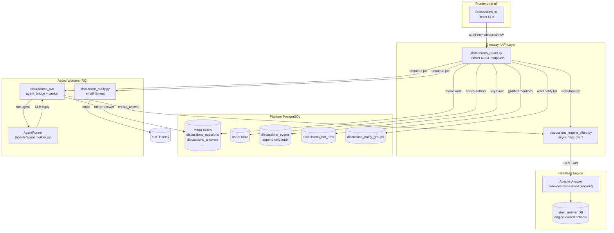
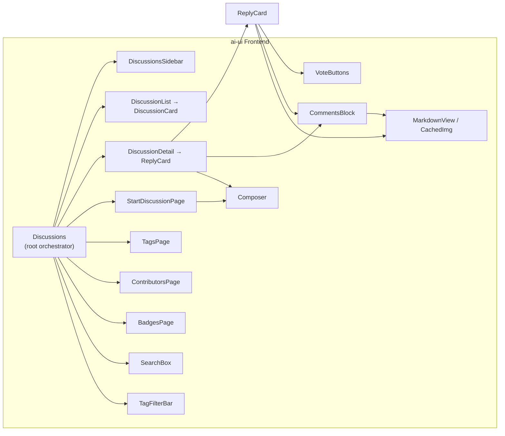
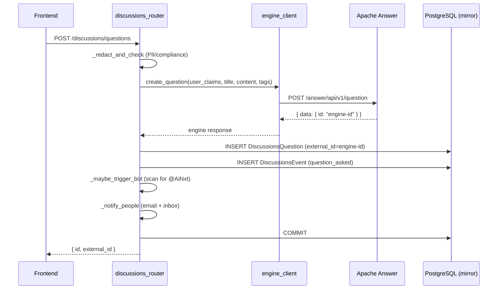
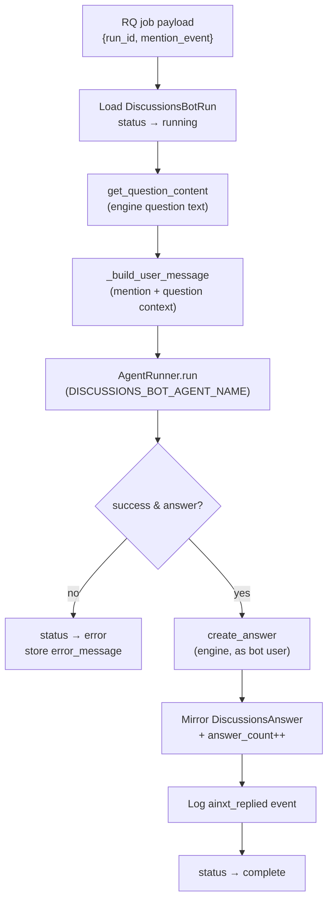
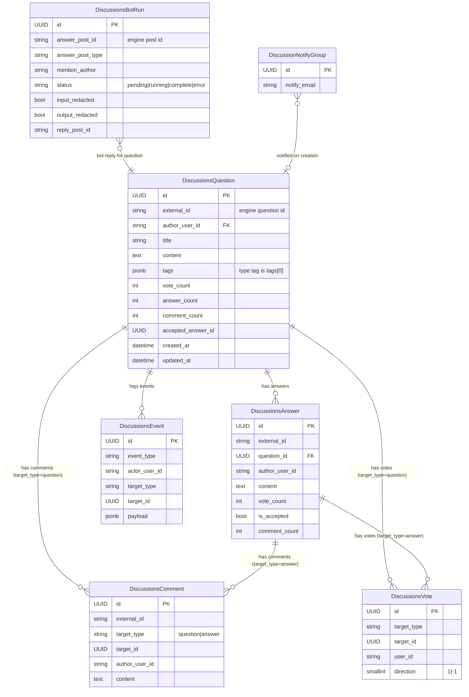
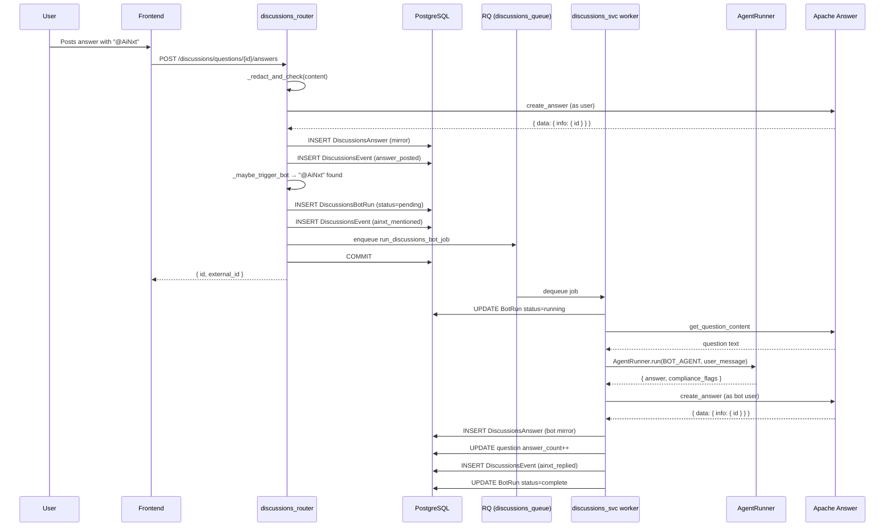

# Discussions Module

A community Q&A and discussion platform built into the AI-NXT platform. The module provides a Stack-Overflow-style experience where users ask questions, share feedback, report issues, post answers, vote, accept solutions, and earn badges — with an optional `@AiNxt` bot that can be mentioned for AI-generated replies. The frontend is a native React SPA; the backend is a FastAPI router that proxies a headless **Apache Answer** engine while mirroring data into the platform's own PostgreSQL for fast reads, author enrichment, and analytics.

> **At a glance**
> - **Frontend:** `ai-ui/src/components/Discussions.jsx` — single-file React component with four sections (Discussions, Tags, Contributors, Badges).
> - **Backend API:** `routers/discussions_router.py` — FastAPI router exposing `/discussions/*` endpoints.
> - **Engine client:** `core/discussions_engine_client.py` — async HTTP client to the headless Apache Answer engine.
> - **Bot service:** `services/discussions_svc/` — RQ worker + agent bridge that generates `@AiNxt` replies.
> - **Notifications:** `services/discussion_notify.py` — email fan-out via RQ.
> - **Data model:** `db/models.py` — mirror tables (`discussions_questions`, `discussions_answers`, …) plus an append-only event spine.

---

## Architecture Overview

The module follows a **write-through mirror** pattern: every mutating request is first committed to the Apache Answer engine (the system of record for the Q&A data model), then mirrored into the platform's own PostgreSQL in the same request. Reads are served entirely from the mirror tables, which lets the router join against the platform's `users` table for author names/departments and run fast filtered queries without round-tripping to the engine.



### Key design decisions

| Decision | Rationale |
|---|---|
| **Write-through mirror** (engine first, then local DB) | The engine is the system of record for the Q&A schema (votes, badges, reputation, tags). Mirroring into the platform DB enables fast filtered reads, author enrichment via `users`, and analytics without engine round-trips. |
| **Reads from mirror only** | The frontend never talks to the engine directly. All list/detail queries hit the mirror tables, which are indexed and joinable. |
| **`@AiNxt` as a content-scanned trigger** | Bot invocation is detected by scanning post content for the literal `@AiNxt` token — no separate webhook or event subscription. This keeps the trigger logic in one place (`_maybe_trigger_bot`) and works for questions, answers, and comments uniformly. |
| **Append-only event spine** | `discussions_events` captures every meaningful action (asked, answered, voted, accepted, mentioned, bot-replied) as an immutable log for future self-improvement / analytics workers. |
| **Type tags, not a schema field** | Discussion type (`question` / `feedback` / `issue`) is stored as the first element of the JSONB `tags` array, not a dedicated column. The engine auto-creates unknown tag slugs on first use, so this doubles as a type selector without forking the vendored engine. |

---

## Component Map



---

## Frontend: `Discussions.jsx`

The entire frontend lives in a single file (`ai-ui/src/components/Discussions.jsx`) and is organized as a set of small, composable presentational components plus one root orchestrator.

### Root orchestrator — `Discussions`

Holds all top-level UI state and renders one of four sections based on the active tab:

| State | Purpose |
|---|---|
| `section` | Active tab: `discussions` / `tags` / `contributors` / `badges` |
| `openId` | Currently-open question UUID (null = list view) |
| `composing` | Whether the "Start a discussion" form is shown |
| `composeType` | Pre-selected type for the composer (`question` / `feedback` / `issue`) |
| `tagFilters` | Active tag filter chips |
| `quickFilter` | `all` / `unanswered` / `mine` |
| `statusFilter` | Admin drill-down: `null` (raised) / `replied` / `closed` |
| `sort` | `newest` / `active` / `votes` |
| `statsOpen` / `statsData` | Admin overview modal state |

The feed is reloaded via a `useEffect` whenever `section`, `sort`, `tagFilters`, `quickFilter`, or `statusFilter` change — no manual refetch needed after filter changes.

### Layout structure

```
┌─────────────────────────────────────────────────────┐
│  TOP TAB BAR  [Discussions] [Tags] [Contributors] [Badges]   [Overview] [Start]  │
├──────────┬──────────────────────────────────────────┤
│          │  TOOLBAR: [Search] … [TagFilter] [Sort]   │
│ SIDEBAR  ├──────────────────────────────────────────┤
│ (disc.   │                                          │
│  only)   │  MAIN CONTENT (scrollable)               │
│          │  - DiscussionList / DiscussionDetail     │
│          │  - StartDiscussionPage                   │
│          │  - TagsPage / ContributorsPage / BadgesPage │
└──────────┴──────────────────────────────────────────┘
```

The sidebar (`DiscussionsSidebar`) is only shown on the Discussions tab and provides quick filters, type filters, admin-only status filters, and tag shortcuts.

### Key sub-components

#### `Composer`
A bordered textarea with a toolbar row — the same shape as the chat message box. Features:
- **Auto-growing textarea** — `minHeight` is a floor, not a cap; grows with content.
- **Markdown preview** toggle (Eye / EyeOff).
- **Image upload** — POSTs to `/discussions/upload`, seeds the browser preview cache with the returned URL, and inserts a markdown image.
- **`@AiNxt` mention button** — inserts the literal token at the cursor (or appends if unfocused).

#### `CachedImg`
Cache-first image renderer used by `MarkdownView` for all `` tags:
1. Check the browser preview cache (`cachedGet`) — fast local path.
2. On a miss, fetch from the server and re-populate the cache.
3. On total miss/error, fall back to the raw `src`.

Blob URLs are revoked on unmount/src-change to avoid leaks.

#### `DiscussionCard` / `DiscussionList`
Feed cards showing type badge, topic tags, title, content preview, author line, vote count, reply count (with accepted indicator), and comment count. `CardSkeleton` placeholders are shown during initial load for perceived performance.

#### `DiscussionDetail` / `ReplyCard`
Full question view with:
- Vote buttons (upvote/downvote).
- Inline question editing (title, content, tags) — author-only.
- Accepted solution highlighted in a green-bordered card at the top.
- Other replies below, sorted by accepted-then-votes.
- Reply composer at the bottom.
- `CommentsBlock` on both the question and each reply.

#### `CommentsBlock`
Collapsible inline comments on questions and answers. Supports:
- Post / edit / delete (author-only).
- `@AiNxt` mention in comments triggers the bot.
- Character limits: 2–600 characters.

#### `SearchBox`
Live debounced search (300ms) that queries `/discussions/questions?q=…&limit=5` and also matches tags client-side. Results open the discussion or apply a tag filter directly.

#### `TagsPage` / `ContributorsPage` / `BadgesPage`
- **TagsPage** — grid of tag cards with discussion counts; clicking filters the feed.
- **ContributorsPage** — top experts by topic (from `/discussions/experts`) plus global leaderboards (from `/discussions/users`).
- **BadgesPage** — user's earned badges plus the full badge catalog grouped by category.

### Admin overview modal

Admins (`user.role === "admin"`) see an "Overview" button that opens a modal with per-type (question/feedback/issue) stats: total raised, replied, closed, and a reply-rate progress bar. Each stat chip is clickable and drills down into the feed filtered to that type + status via `openOverviewSelection`.

### Frontend dependencies

| Dependency | Purpose |
|---|---|
| `../config` (`authFetch`) | Authenticated fetch wrapper for all API calls |
| `./ui/DialogProvider.jsx` (`useToast`, `useConfirm`) | Toast notifications and confirmation dialogs |
| `../utils/time` (`toIST`, `toISTRelative`) | IST timestamp formatting |
| `../utils/previewCache` (`cacheStore`, `cachedGet`) | Browser-side image blob cache |
| `react-markdown` + `remark-gfm` + `rehype-highlight` | Markdown rendering with GFM tables and syntax highlighting |

---

## Backend: `discussions_router.py`

A FastAPI router (mounted under `/discussions`) that implements the full CRUD + voting + commenting + bot-trigger lifecycle. All endpoints require JWT auth via `get_current_user`.

### API surface

| Method | Path | Handler | Description |
|---|---|---|---|
| GET | `/discussions/questions` | `list_questions` | Filtered/sorted/paginated feed |
| POST | `/discussions/questions` | `ask_question` | Create a question (write-through) |
| GET | `/discussions/questions/{id}` | `get_question` | Full detail with answers + my votes |
| PUT | `/discussions/questions/{id}` | `edit_question` | Edit (author-only) |
| DELETE | `/discussions/questions/{id}` | `delete_question` | Delete (author-only) |
| POST | `/discussions/questions/{id}/answers` | `post_answer` | Post a reply |
| POST | `/discussions/questions/{id}/accept` | `accept` | Accept an answer (question author only) |
| POST | `/discussions/{type}/{id}/vote` | `vote` | Upvote/downvote (±1) |
| GET | `/discussions/{type}/{id}/comments` | `list_comments` | List comments |
| POST | `/discussions/{type}/{id}/comments` | `post_comment` | Add a comment |
| PUT | `/discussions/{type}/{id}/comments/{cid}` | `edit_comment` | Edit comment (author-only) |
| DELETE | `/discussions/{type}/{id}/comments/{cid}` | `delete_comment` | Delete comment (author-only) |
| PUT/DELETE | `/discussions/answers/{id}` | `edit_answer` / `delete_answer` | Answer edit/delete |
| GET | `/discussions/tags` | `list_tags` | All tags with counts |
| GET | `/discussions/users` | `list_users` | User reputation ranking |
| GET | `/discussions/experts` | `list_experts` | Top experts per tag |
| GET | `/discussions/badges` | `list_badges` | Badge catalog |
| GET | `/discussions/badges/mine` | `my_badges` | Current user's badges |
| GET | `/discussions/stats` | `get_discussion_stats` | Admin-only overview stats |
| POST | `/discussions/upload` | `upload_image` | Image upload |
| GET | `/discussions/uploads/{path}` | `get_upload` | Serve uploaded image |

### Write-through flow

Every mutating endpoint follows the same pattern:



### Compliance & PII redaction

`_redact_and_check` runs on all user-supplied text (titles, content, comments) before it reaches the engine. If redaction is triggered, the `DiscussionsBotRun` row records `input_redacted` / `output_redacted` flags. See [shared_core](#) for the underlying PII detector and compliance engine.

### `@AiNxt` bot trigger — `_maybe_trigger_bot`

Scans post content for the literal `@AiNxt` token. If found:
1. Creates a `DiscussionsBotRun` row with status `pending`.
2. Logs an `ainxt_mentioned` event.
3. Enqueues an RQ job on the `discussions_queue`.

If the RQ enqueue fails (back-pressure / Redis unavailable), the row stays `pending` and the user's post is **not** failed — the bot reply is best-effort.

### Notifications — `_notify_people`

On new question creation, merges the poster's `notify_emails` list with the department-specific `discussion_notify_groups` table, then for each recipient:
- **Internal users** (matched by email in `users`) → in-app inbox item (SSE-pushed) **and** email.
- **External/unknown emails** → email only.

Email delivery is fanned out to RQ (retry + DLQ) so it never blocks the poster's request. See [shared_core](#) for the inbox store and job queue infrastructure.

---

## Engine Client: `discussions_engine_client.py`

An async `httpx` client that wraps the Apache Answer REST API. All calls go through `_authed_request`, which injects the user's JWT claims as the engine's auth headers so the engine attributes actions to the correct user.

| Function | Engine endpoint |
|---|---|
| `create_question` | `POST /answer/api/v1/question` |
| `create_answer` | `POST /answer/api/v1/answer` |
| `list_comments` | `GET /answer/api/v1/comment/page` |
| `engine_cast_vote` | `POST /answer/api/v1/vote` |
| `engine_accept_answer` | `POST /answer/api/v1/answer/solution` |
| `engine_add_comment` | `POST /answer/api/v1/comment` |

> **Note on response shapes:** `POST /question` returns the new id under `data.id`, while `POST /answer` nests it under `data.info.id`. This asymmetry is documented in the code and handled explicitly.

---

## Bot Service: `services/discussions_svc/`

A dedicated RQ worker process that consumes the `discussions_queue` and generates `@AiNxt` replies.

### Worker (`worker.py`)

A thin RQ worker bootstrap that:
1. Checks `ENABLE_DISCUSSIONS` flag — refuses to start if false.
2. Connects to Redis and verifies connectivity.
3. Starts an `rq.Worker` (or `SimpleWorker` on macOS) on the `discussions_queue`.

### Agent bridge (`agent_bridge.py::run_discussions_bot_job`)



Key details:
- The bot runs as a dedicated agent (`DISCUSSIONS_BOT_AGENT_NAME`) seeded by `scripts/seed_discussions_bot.py`.
- The bot's reply is posted to the engine under the bot user's claims (`DISCUSSIONS_BOT_USER_CLAIMS`), not the mentioning user's.
- Compliance flags from `AgentRunner` are recorded as `input_redacted` / `output_redacted` on the run row.
- The bot answer is mirrored to the local `discussions_answers` table so it appears in the feed without an engine round-trip.

### Bot seeding (`scripts/seed_discussions_bot.py`)

Creates or updates the `AgentRecord` for the discussions bot with a production system prompt, `preferred_model="claude"`, and `visibility="private"`. Idempotent — safe to re-run.

---

## Notifications: `discussion_notify.py`

An RQ job (`send_discussion_email`) that renders a Jinja template (`discussion_mention.html` / `.txt`) and sends an HTML email via the platform's email relay. Raises on hard failure so RQ retries (2×) and then routes to the DLQ — no custom retry logic.

---

## Data Model

All mirror tables live in the platform PostgreSQL and are written in the same request as the engine call.



### Event types logged in `discussions_events`

| Event | When |
|---|---|
| `question_asked` | New question created |
| `answer_posted` | New answer posted |
| `comment_posted` | New comment added |
| `vote_cast` | Upvote or downvote |
| `answer_accepted` | Answer marked as accepted |
| `ainxt_mentioned` | `@AiNxt` detected in content |
| `ainxt_replied` | Bot reply posted to engine + mirrored |

---

## End-to-End Data Flow: `@AiNxt` Mention



---

## Filtering & Sorting

The feed (`list_questions`) supports the following query parameters, all combinable:

| Param | Effect |
|---|---|
| `sort` | `newest` (created_at desc) / `active` / `votes` |
| `tag` (repeatable) | JSONB `has_any` — matches discussions tagged with ANY selected tag |
| `unanswered=true` | `answer_count == 0` |
| `mine=true` | `author_user_id == current_user.sub` |
| `status` | `replied` (answer_count > 0) / `closed` (accepted_answer_id IS NOT NULL) |
| `q` | ILIKE search on title + content |
| `limit` | Capped at 200 |

The `status` filter predicates **must** match the `/stats` endpoint's SQL so that a stat card's count equals the filtered result count — this invariant is enforced in code comments.

---

## Dependencies on Other Modules

| Module | Relationship |
|---|---|
| **[auth](#)** (`get_current_user`) | JWT authentication for all endpoints; provides `sub`, `email`, `name`, `department`, `role` |
| **[shared_core](#)** (`agents/agent_builder.py::AgentRunner`) | Runs the `@AiNxt` bot agent to generate replies |
| **[shared_core](#)** (`core/job_queue.py`) | RQ enqueue for bot jobs (`Q_DISCUSSIONS`) and notification jobs (`Q_DEFAULT`) |
| **[shared_core](#)** (`store/inbox_store.py::publish_inbox_item`) | In-app inbox notifications for mentioned internal users |
| **[shared_core](#)** (`agents/pii_detector.py`, compliance engine) | PII redaction and compliance checks via `_redact_and_check` |
| **[shared_core](#)** (`db/database.py::get_db`) | SQLAlchemy session for mirror table access |
| **[shared_api_routers](#)** (`routers/discussions_router.py`) | The FastAPI router itself (this module's backend) |
| **[ai_ui_frontend](#)** (`config.js::authFetch`) | Authenticated fetch wrapper used by the frontend |
| **[ai_ui_frontend](#)** (`ui/DialogProvider.jsx`) | Toast + confirm dialog context |
| **[ai_ui_frontend](#)** (`utils/previewCache`, `utils/time`) | Image blob caching and IST time formatting |
| **[discussions_service](#)** (`services/discussions_svc/`) | Dedicated RQ worker process for bot reply generation |
| **[workers](#)** (`workers/start_workers.py`) | Does NOT start the discussions worker — it runs as a separate process |

---

## Operational Notes

- **Separate worker process:** The discussions bot worker (`services/discussions_svc/worker.py`) is **not** started by the main `start_workers.py` orchestrator. It must be launched independently (e.g., via PM2) with `ENABLE_DISCUSSIONS=true` and Redis connectivity.
- **Engine as system of record:** If the engine is down, writes fail (the mirror is not written). Reads continue from the mirror but will be stale.
- **Bot reply is best-effort:** If Redis/RQ is unavailable when a mention is posted, the `DiscussionsBotRun` row stays `pending` and the user's post succeeds. A future reconciliation pass could scan for stale `pending` rows.
- **Image uploads** are stored server-side and served from `/discussions/uploads/{path}`. The frontend caches them in the browser's preview cache for cache-first rendering.
- **Admin features** (Overview modal, status filters) are gated on `user.role === "admin"` on both frontend and backend (`get_discussion_stats` returns 403 for non-admins).
