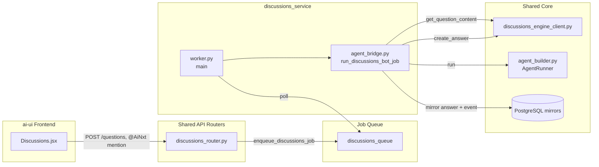
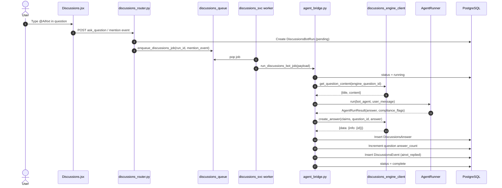

# Discussions Service

## Introduction

The `discussions_service` module is a dedicated, isolated worker service that powers the **@AiNxt bot** on the AiNxt Discussions board. It consumes jobs from a private RQ queue (`discussions_queue`), fetches the content of a question where the bot was mentioned, runs it through the shared agent runtime, and posts the generated answer back to the Discussions engine. It also mirrors the reply into the local `ainxt` database so that the answer is visible to the rest of the platform (analytics, governance, future self-improvement loops).

This module is intentionally small and self-contained: it contains only the RQ job implementation and the worker entry point. All persistence, routing, and agent orchestration are delegated to shared platform components.

## Architecture Overview

The module sits at the edge of the agent-execution pipeline: it is triggered by user activity in the Discussions UI, but it does not implement any UI, routing, or core agent logic itself. Instead, it composes three shared primitives:

1. **`core.discussions_engine_client`** - headless read/write client for the Apache Answer engine.
2. **`agents.agent_builder.AgentRunner`** - shared singleton that runs the bot agent and applies compliance checks.
3. **`db.models`** - local mirror tables (`DiscussionsQuestion`, `DiscussionsAnswer`, `DiscussionsEvent`, `DiscussionsBotRun`).

## Core Components

### `agent_bridge.py`

`run_discussions_bot_job(payload: dict) -> str` is the only RQ job in this module. It performs the following steps:

1. **Load the run record** from `DiscussionsBotRun` and mark it `running`.
2. **Fetch the question content** from the headless engine via `get_question_content(engine_question_id)`.
3. **Build a user message** that includes the mention trigger, question title, and question body.
4. **Run the configured bot agent** via `agent_runner.run(DISCUSSIONS_BOT_AGENT_NAME, user_message, ...)`.
5. **Record compliance flags** conservatively in both `input_redacted` and `output_redacted` columns.
6. **Post the answer** back to the engine via `create_answer(...)` using the bot's identity claims.
7. **Mirror the answer** into `DiscussionsAnswer`, increment the parent question's `answer_count`, and append a `discussions_events` row of type `ainxt_replied`.
8. **Commit final status** (`complete` or `error`) and close the database session.

The job is designed to fail safely: unexpected errors roll back the transaction, update the run record with an error message, and re-raise so that RQ can retry or dead-letter the job according to platform policy.

### `worker.py`

`main()` is the dedicated worker entry point. It:

1. Calls `_load_env()` to ensure environment variables are available (the worker is started standalone under PM2, outside the gateway process).
2. Verifies that `ENABLE_DISCUSSIONS` is true; exits otherwise.
3. Connects to Redis and asserts reachability.
4. Starts an RQ worker listening **only** to `discussions_queue`.
5. Uses `rq.SimpleWorker` on macOS to avoid the known fork-crash issue with subprocess/docker-touching jobs.

`_load_env()` loads the env file pointed to by `DISCUSSIONS_ENV_FILE` (defaulting to `<repo>/.env`) so that the worker shares the same Redis, Postgres, and Answer-engine configuration as the gateway.

## Data Flow: @AiNxt Mention to Posted Reply

## Configuration & Environment

The worker expects the same environment as the gateway, loaded via `_load_env()`:

| Variable | Purpose |
|----------|---------|
| `ENABLE_DISCUSSIONS` | Feature flag; worker refuses to start if false. |
| `DISCUSSIONS_ENV_FILE` | Optional path to an env file; defaults to `<repo>/.env`. |
| `REDIS_HOST` / `REDIS_PORT` / `REDIS_PASSWORD` | RQ broker connection. |
| Postgres DSN variables | Used indirectly via `SessionLocal` for mirror tables. |
| `DISCUSSIONS_BOT_AGENT_NAME` | Name of the agent definition passed to `AgentRunner`. |
| `DISCUSSIONS_BOT_USER_CLAIMS` | Assertion claims used to authenticate the bot when writing back to the engine. |

## Operational Notes

- **Isolation**: The worker runs in its own PM2 process (`ainxt-discussions-worker`) and consumes only `discussions_queue`. It does not share a worker pool with chat, agent, or document jobs.
- **macOS compatibility**: Uses `rq.SimpleWorker` on Darwin to avoid a known fork-crash issue, documented in `workers/start_workers.py`.
- **Compliance**: Unlike the legacy Threads @AiNxt flow, this module routes through `AgentRunner`, which applies compliance checks on input, prompt, and output stages. See [shared_core.md](../reference/shared_core.md) for details on `AgentRunner`.
- **Idempotency**: The job updates a persistent `DiscussionsBotRun` record, so retries are visible and duplicate engine posts are limited by the single `create_answer` call per run.

## Dependencies & Related Modules

| Dependency | Module | Role |
|------------|--------|------|
| `core.discussions_engine_client` | [shared_core.md](../reference/shared_core.md) | Headless read/write client for the Apache Answer engine. |
| `agents.agent_builder.AgentRunner` | [shared_core.md](../reference/shared_core.md) | Shared agent runtime and compliance wrapper. |
| `db.models` (Discussions tables) | [shared_core.md](../reference/shared_core.md) | Local mirror and event-log schema. |
| `routers/discussions_router.py` | [shared_api_routers.md](../api/shared_api_routers.md) | API surface that enqueues the bot job. |
| `workers/skill_loop_worker.py` | [workers.md](../workers/workers.md) | Future consumer of `discussions_events` for self-improvement. |
| `core.job_queue` | [shared_core.md](../reference/shared_core.md) | RQ queue factory and `Q_DISCUSSIONS` constant. |

## Files

- `services/discussions_svc/agent_bridge.py` - RQ job that fetches the question, runs the bot agent, posts the answer, and mirrors the result.
- `services/discussions_svc/worker.py` - Standalone RQ worker entry point for `discussions_queue`.
