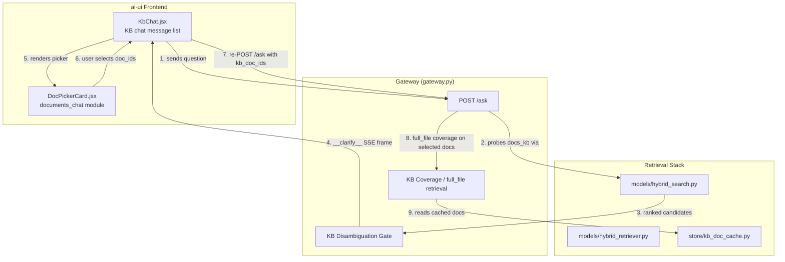
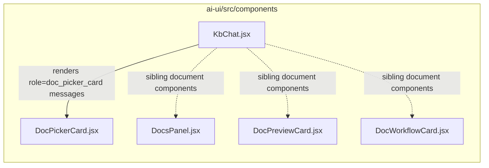
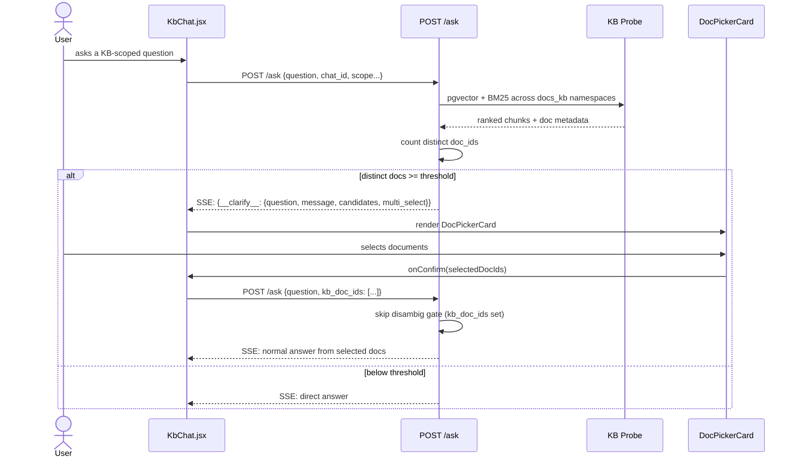
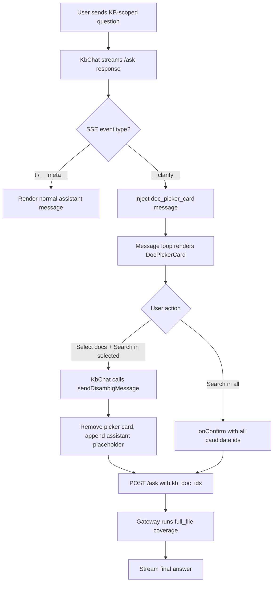

# documents_chat

## Brief Introduction

`documents_chat` is a small, focused frontend module in the `ai-ui` application. Its single responsibility is to render an inline **document disambiguation picker** inside the Knowledge Base (KB) chat stream. When the backend's `/ask` endpoint detects that a user query could match multiple KB documents, it returns a special `__clarify__` Server-Sent Events (SSE) frame instead of a normal answer. `documents_chat` displays that frame as an interactive card, lets the user select one or more documents, and automatically re-sends the original question scoped to the selected documents.

The module lives at:

```
ai-ui/src/components/DocPickerCard.jsx
```

and is consumed by the KB chat component at:

```
ai-ui/src/components/KbChat.jsx
```

---

## Core Component

### `DocPickerCard`

`DocPickerCard` is a React functional component that renders a scrollable, selectable list of candidate documents.

**Props**

| Prop | Type | Description |
|------|------|-------------|
| `message` | `string` | Human-readable prompt from the backend (e.g. "I found 5 related documents..."). |
| `candidates` | `{ doc_id, doc_name, score }[]` | All matching documents, sorted by relevance descending. |
| `multiSelect` | `boolean` | If `true`, renders checkboxes; otherwise radio buttons. |
| `onConfirm` | `(selectedDocIds: string[]) => void` | Callback invoked when the user confirms a selection. |

**Key behaviors**

- **No upper cap on candidates** — every matching document is shown. The list is scrollable (`max-h-72`) so the card never overflow the chat window.
- **Relative relevance badges** — each document shows a 0–100% badge normalized against the top score, color-coded green/amber/gray.
- **Select all / deselect all** — shown only in multi-select mode when more than one document is present.
- **Two action buttons** — "Search in selected" (enabled only when at least one doc is selected) and "Search in all" (always available).
- **Re-sends the original question** scoped to the chosen `doc_id`s via the parent callback.

---

## Where It Fits in the System

`documents_chat` sits at the intersection of three larger subsystems:

1. **KB Chat UI** (`KbChat.jsx`) — renders messages, handles streaming, and decides when to mount a `DocPickerCard`.
2. **Gateway `/ask` fast-path** (`gateway.py`) — performs KB retrieval and emits the `__clarify__` SSE frame when disambiguation is needed.
3. **KB retrieval stack** (`models/hybrid_search.py`, `models/hybrid_retriever.py`, `store/kb_doc_cache.py`) — provides the ranked document candidates and later serves full-document coverage for the re-query.



---

## Architecture

### Component Hierarchy



`DocPickerCard` is intentionally a **leaf component**: it owns no state beyond the current selection and delegates all side effects (re-query, message list updates) to `KbChat` through the `onConfirm` callback.

### Message Role Contract

`KbChat` stores the picker as a message object with a special role:

```javascript
{
  id: crypto.randomUUID(),
  role: "doc_picker_card",
  question: clarify.question,
  message: clarify.message,
  candidates: clarify.candidates || [],
  multiSelect: clarify.multi_select !== false,
  streaming: false,
}
```

When iterating over `messages`, `KbChat` branches on `msg.role === "doc_picker_card"` and renders `DocPickerCard` instead of the standard user/assistant bubbles.

---

## Data Flow

### Triggering Disambiguation

The backend `/ask` fast-path runs a KB probe whenever `rag_mode` is `auto`/`on` or the request comes from voice mode. After retrieving and reranking chunks, it counts distinct matching documents.



### Threshold Logic

The disambiguation threshold is adaptive:

- **At scope level** (domain or product selected in the KB scope picker): threshold is `1`. The picker fires even for a single matching document so the user always confirms the exact document before the LLM answers.
- **General chat / no scope**: threshold defaults to `4` and is tunable via `KB_DISAMBIG_MIN_DOCS`.

The gate is skipped when:

- The user already selected a specific `kb_doc_id` in the scope picker.
- The request includes `kb_doc_ids` (a re-query from the picker).

### Re-Query Path

When the user confirms a selection, `KbChat` calls `sendDisambigMessage(question, kbDocIds)`:

1. Removes the picker card from the message list.
2. Appends a fresh assistant placeholder message.
3. POSTs to `/ask` with `kb_doc_ids` set.
4. The gateway bypasses the disambiguation gate and runs `full_file` coverage on exactly those documents.
5. The streaming answer is rendered normally.

---

## Dependencies

### Direct Consumers

- **[KbChat.jsx](../knowledge/kb_chat.md)** — mounts `DocPickerCard` and handles `onConfirm` by re-sending the scoped query.

### Backend Collaborators

- **[gateway.py](../models/gateway.md) `POST /ask`** — emits the `__clarify__` SSE frame and honors `kb_doc_ids` on re-query.
- **[models/hybrid_search.py](../hybrid_search.md)** — provides `pgvector_search` and `keyword_search` used by the KB probe.
- **[models/hybrid_retriever.py](../hybrid_retriever.md)** — supplies the BGE reranker (`_rerank_via_svc`) used to score candidates before disambiguation.
- **[store/kb_doc_cache.py](../kb_doc_cache.md)** — serves cached full-document text for the `full_file` coverage path after the user selects documents.

### Sibling Document Components

- **[DocsPanel.jsx](../documents/documents_guide.md)** — platform documentation browser.
- **[DocPreviewCard.jsx](../documents/documents_preview.md)** — expandable document summary card.
- **[DocWorkflowCard.jsx](../documents/documents_generation.md)** — PPTX theme picker for generated presentations.

---

## Process Flow: Rendering a Picker



---

## Design Notes

- **State isolation** — `DocPickerCard` keeps only the local `selected` set. It does not talk to the backend directly; this keeps the component testable and avoids duplicating chat state logic.
- **Accessibility** — inputs use native checkboxes/radios with labels, and the list is keyboard-focusable.
- **Performance** — the candidate list is virtualized by CSS scroll, not by a virtual-list library, because the design requirement is to show *all* matches without an arbitrary cap.
- **No PII** — the picker only displays document names and relevance scores; no document content is rendered in the card.

---

## Related Documentation

- [kb_chat.md](../knowledge/kb_chat.md) — the parent KB chat component that hosts the picker.
- [gateway.md](../models/gateway.md) — the `/ask` endpoint and disambiguation gate.
- [hybrid_search.md](../hybrid_search.md) — semantic and keyword retrieval.
- [hybrid_retriever.md](../hybrid_retriever.md) — reranking and coverage dispatch.
- [documents.md](../documents/documents.md) — overview of the `documents` feature family.
