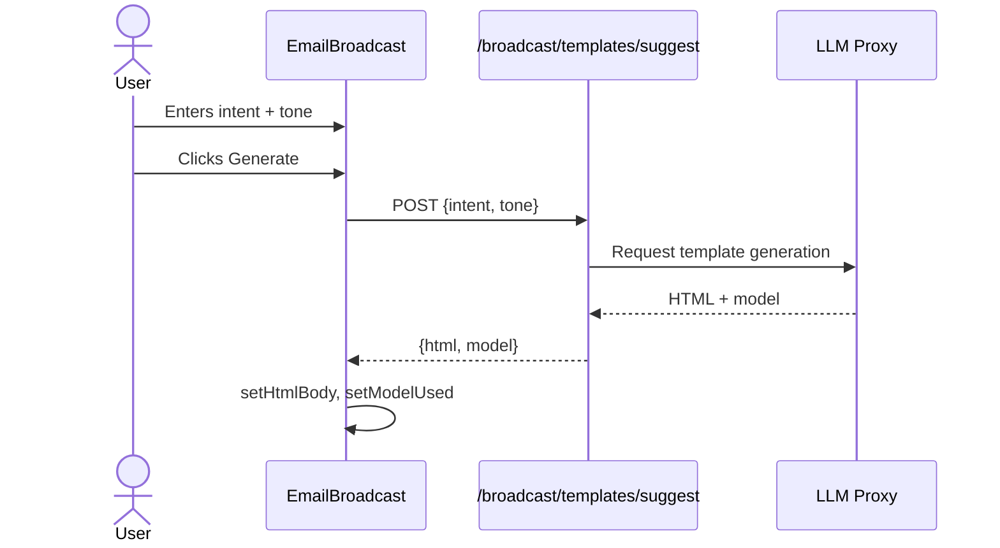
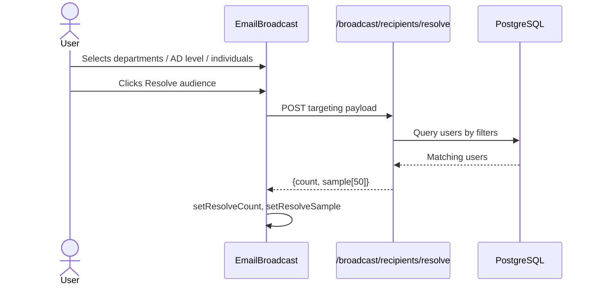
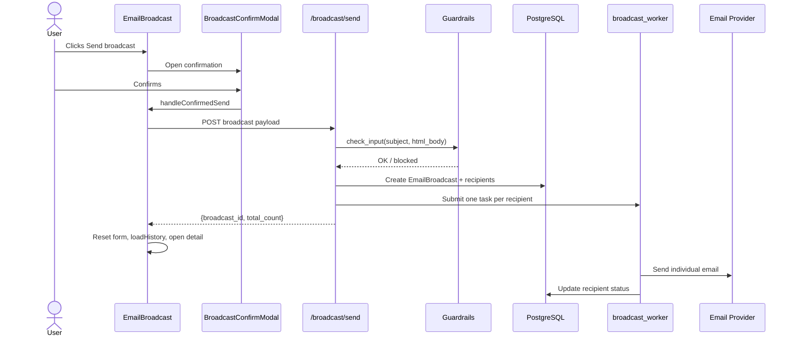

# Email Broadcast Module

The **Email Broadcast** module is a React-based UI feature in `ai-ui` that allows authorized users to compose, target, preview, and send rich HTML email broadcasts to employees. It provides a guided workflow for generating email templates from natural-language intent, selecting recipients by department or AD level, attaching files, personalizing content per recipient, and tracking delivery status with a full audit trail.

This module is part of the `ai_ui_frontend` package and is located at `ai-ui/src/components/EmailBroadcast.jsx`.

---

## Table of Contents

1. [Overview](#overview)
2. [Architecture](#architecture)
3. [Core Components](#core-components)
4. [Data Flow](#data-flow)
5. [User Workflows](#user-workflows)
6. [State Management](#state-management)
7. [Backend Integration](#backend-integration)
8. [Dependencies](#dependencies)
9. [Security & Compliance](#security--compliance)
10. [Related Documentation](#related-documentation)

---

## Overview

The Email Broadcast module enables internal communications at scale. A user with broadcast privileges can:

- Describe the desired email in plain language and have an HTML template generated by an LLM.
- Choose a tone (professional, friendly, formal, urgent, celebratory).
- Preview the rendered email, including personalization with a sample recipient name.
- Target recipients by:
  - All active employees
  - Specific departments
  - Maximum AD level (organizational hierarchy level)
  - Individual users (by name or email)
- Resolve the audience to see a count and sample list before sending.
- Attach files (PDF, DOCX, images, CSV, XLSX up to 25 MB).
- Send the broadcast, which queues one email per recipient and tracks delivery.
- View broadcast history and per-recipient delivery details.
- Cancel a broadcast while it is queued or sending.

The module enforces access control via `BROADCAST_ALLOWED_EMAILS` and integrates with compliance checks, audit logging, and the broadcast worker thread pool on the backend.

---

## Architecture

The module follows a single-file React component architecture with nested sub-components for modals and the detail view. It communicates with the backend through REST endpoints exposed by the `broadcast_router` in the gateway.

```mermaid
flowchart TB
    subgraph Frontend["ai-ui Frontend"]
        EB["EmailBroadcast.jsx"]
        PM["PreviewModal"]
        BCM["BroadcastConfirmModal"]
        BD["BroadcastDetail"]
        Config["config.js<br/>authFetch / API_BASE"]
        Toast["DialogProvider<br/>useToast"]
    end

    subgraph Gateway["Gateway API"]
        BR["broadcast_router.py"]
        Auth["auth/dependencies.py<br/>require_broadcast_user"]
        Compliance["guardrails/runtime_guardrails.py<br/>check_input"]
        Audit["core/audit"]
    end

    subgraph Workers["Workers"]
        BW["broadcast_worker.py<br/>ThreadPoolExecutor"]
    end

    subgraph Data["Data Layer"]
        DB[("PostgreSQL<br/>EmailBroadcast tables")]
        Email[("Email Provider"]
    end

    EB -->|"GET /broadcast/access"| BR
    EB -->|"POST /broadcast/templates/suggest"| BR
    EB -->|"POST /broadcast/recipients/resolve"| BR
    EB -->|"POST /broadcast/preview"| BR
    EB -->|"POST /broadcast/attachments"| BR
    EB -->|"POST /broadcast/send"| BR
    EB -->|"GET /broadcast"| BR
    EB -->|"GET /broadcast/{id}"| BR
    EB -->|"GET /broadcast/{id}/recipients"| BR
    EB -->|"POST /broadcast/{id}/cancel"| BR
    EB -->|"GET /auth/users"| Auth

    BR -->|"compliance check"| Compliance
    BR -->|"enqueue per recipient"| BW
    BW -->|"send email"| Email
    BR -->|"persist broadcast"| DB
    BW -->|"update recipient status"| DB

    EB --> PM
    EB --> BCM
    EB --> BD
    EB --> Config
    EB --> Toast
```

---

## Core Components

### `EmailBroadcast`

The default exported main component. It manages the full broadcast lifecycle:

- Access check on mount (`/broadcast/access`).
- Compose state: intent, tone, generated HTML body, subject, text fallback.
- Targeting state: departments, AD level, individuals, resolved count/sample.
- Options state: subject, text body, name enrichment, attachments.
- History list with search and pagination.
- Navigation to `BroadcastDetail` when a history item is selected.

Key handlers:

| Handler | Purpose |
|---------|---------|
| `handleGenerate` | Calls `/broadcast/templates/suggest` to generate HTML from intent and tone. |
| `handleResolve` | Calls `/broadcast/recipients/resolve` to compute the audience count and sample. |
| `handleUpload` | Uploads files to `/broadcast/attachments`. |
| `handleRemoveAttachment` | Deletes an uploaded attachment. |
| `handleSend` | Validates pre-flight checks and opens the confirmation modal. |
| `handleConfirmedSend` | Calls `/broadcast/send` to queue the broadcast. |

### `PreviewModal`

A full-screen modal that renders the generated HTML in a sandboxed `<iframe>`. It supports:

- Toggling personalization (`{{name}}` substitution).
- Editing a sample recipient name to preview personalization.
- Displaying the model used and subject.
- Closing via Escape key or backdrop click.

### `BroadcastConfirmModal`

A confirmation dialog shown before sending. It summarizes:

- Subject
- Resolved recipient count
- Whether personalization is enabled
- Number of attachments

It warns that one email will be queued per recipient and that the broadcast can be cancelled mid-flight.

### `BroadcastDetail`

A dedicated view for a single broadcast. It displays:

- Subject, status, creation time, sender, and model used.
- Aggregate statistics: total, delivered, failed.
- A paginated, filterable table of recipients with status, sent time, and error text.
- A cancel button for broadcasts in `queued` or `sending` status.
- Live polling every 5 seconds while the broadcast is sending.

---

## Data Flow

### Compose & Generate



### Audience Resolution



### Send Broadcast



---

## User Workflows

### Creating a New Broadcast

1. The user navigates to the Email Broadcast page.
2. The UI checks `/broadcast/access`. If denied, an access-restricted message is shown.
3. In the **Compose** section, the user describes the email intent and selects a tone.
4. The user clicks **Generate template**. The LLM returns an HTML body, which is editable.
5. The user clicks **Preview** to review the rendered email and test personalization.
6. In the **Targeting** section, the user selects recipients by department, AD level, and/or individuals.
7. The user clicks **Resolve audience** to see the count and a sample list.
8. In the **Options** section, the user enters a subject, optional plain-text fallback, enables/disables name enrichment, and uploads attachments.
9. The **Send Broadcast** section shows pre-flight pills. Once all checks pass, the user clicks **Send broadcast**.
10. A confirmation modal appears. After confirmation, the broadcast is queued and the detail view opens.

### Viewing Broadcast History

1. The history list loads automatically on mount.
2. The user can search by subject and paginate through results.
3. Clicking the eye icon opens `BroadcastDetail`.
4. While a detail view is open, the history list refreshes every 5 seconds.

### Cancelling a Broadcast

1. In `BroadcastDetail`, if the broadcast status is `queued` or `sending`, a **Cancel** button is shown.
2. Clicking it calls `/broadcast/{id}/cancel`.
3. The UI refreshes to reflect the cancelled status.

---

## State Management

The component uses React `useState` and `useEffect` hooks. No external state library is used.

### Key State Groups

| Group | State Variables |
|-------|-----------------|
| Access | `accessAllowed` |
| History | `history`, `historyLoading`, `historySearch`, `historyPage` |
| Navigation | `detailId`, `confirmOpen` |
| Compose | `intent`, `intentError`, `tone`, `htmlBody`, `modelUsed`, `generating` |
| Preview | `previewOpen`, `previewName`, `previewEnrich`, `previewHtml` |
| Targeting | `departments`, `targetAll`, `selectedDepts`, `maxAdLevel`, `individuals`, `userSearch`, `userResults`, `resolveCount`, `resolveSample`, `resolving` |
| Options | `subject`, `textBody`, `enrichName`, `attachments`, `uploading`, `uploadError` |
| Send | `sending` |

### Side Effects

- **Access check**: Runs once on mount.
- **Live preview enrichment**: Re-fetches `/broadcast/preview` whenever `htmlBody`, `previewEnrich`, or `previewName` changes.
- **User search debounce**: 250 ms delay before calling `/auth/users`.
- **Outside click handling**: Closes department dropdown and user search results.
- **Polling**: Refreshes history/detail every 5 seconds when a detail is open or a broadcast is sending.

---

## Backend Integration

The module relies on the `broadcast_router` REST API. For full backend behavior, see [broadcast_router.md](../api/broadcast_router.md).

| Endpoint | Method | Purpose |
|----------|--------|---------|
| `/broadcast/access` | GET | Check if current user can use broadcast. |
| `/broadcast/departments` | GET | List available departments. |
| `/auth/users` | GET | Search users by name/email. |
| `/broadcast/templates/suggest` | POST | Generate HTML template from intent/tone. |
| `/broadcast/recipients/resolve` | POST | Resolve targeting to count + sample. |
| `/broadcast/preview` | POST | Render personalized preview HTML. |
| `/broadcast/attachments` | POST | Upload an attachment. |
| `/broadcast/attachments/{id}` | DELETE | Remove an attachment. |
| `/broadcast/send` | POST | Create and queue the broadcast. |
| `/broadcast` | GET | List recent broadcasts. |
| `/broadcast/{id}` | GET | Get broadcast metadata. |
| `/broadcast/{id}/recipients` | GET | Get paginated recipient list. |
| `/broadcast/{id}/cancel` | POST | Cancel a queued/sending broadcast. |

The backend performs compliance checks, resolves recipients from the user database, persists broadcast and recipient rows, and submits per-recipient jobs to the broadcast worker thread pool. For worker details, see [broadcast_worker.md](../broadcast_worker.md).

---

## Dependencies

### Internal Frontend Dependencies

- [config.md](../infrastructure/config.md) — `API_BASE` and `authFetch` for authenticated HTTP requests.
- [ui_dialog.md](../ui/ui_dialog.md) — `useToast` for success/error notifications.

### Internal Backend Dependencies

- [broadcast_router.md](../api/broadcast_router.md) — REST API for broadcast operations.
- [broadcast_worker.md](../broadcast_worker.md) — Background worker that sends individual emails.
- [auth.md](../security/auth.md) — User authentication and `require_broadcast_user` authorization.
- [guardrails.md](../security/guardrails.md) — Compliance checks on subject and body.

### External Libraries

- `react` — Hooks and JSX rendering.
- `lucide-react` — Iconography.

---

## Security & Compliance

- **Access control**: Only users whose emails are in `BROADCAST_ALLOWED_EMAILS` can access the feature. The UI shows a restricted-access message if the check fails.
- **Compliance checks**: The backend scans the subject and HTML body for policy violations before creating the broadcast.
- **Rate limiting**: Sensitive-admin rate limiting is enforced on backend endpoints.
- **Audit trail**: Every broadcast creates `created` and `queued` audit records. Per-recipient success/failure is tracked in the database.
- **HTML preview sandbox**: The preview modal uses a sandboxed `<iframe>` with no permissions to mitigate XSS risks from generated HTML.
- **Name enrichment escaping**: The backend HTML-escapes substituted names to prevent injection.

---

## Related Documentation

- [ai_ui_frontend.md](../ui/ai_ui_frontend.md) — Parent frontend package overview.
- [broadcast_router.md](../api/broadcast_router.md) — Backend broadcast API.
- [broadcast_worker.md](../broadcast_worker.md) — Email-sending worker.
- [config.md](../infrastructure/config.md) — API configuration and `authFetch`.
- [ui_dialog.md](../ui/ui_dialog.md) — Toast notification provider.
- [auth.md](../security/auth.md) — Authentication and authorization.
- [guardrails.md](../security/guardrails.md) — Runtime compliance guardrails.
