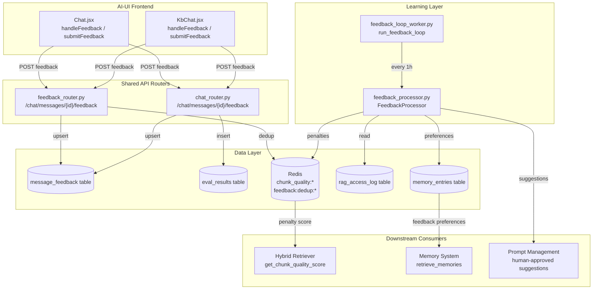
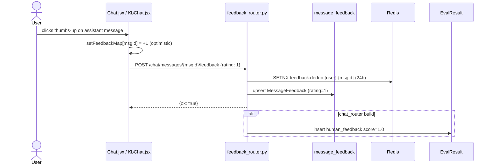
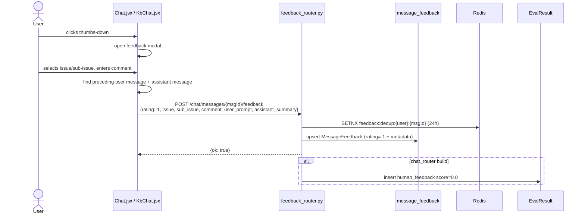
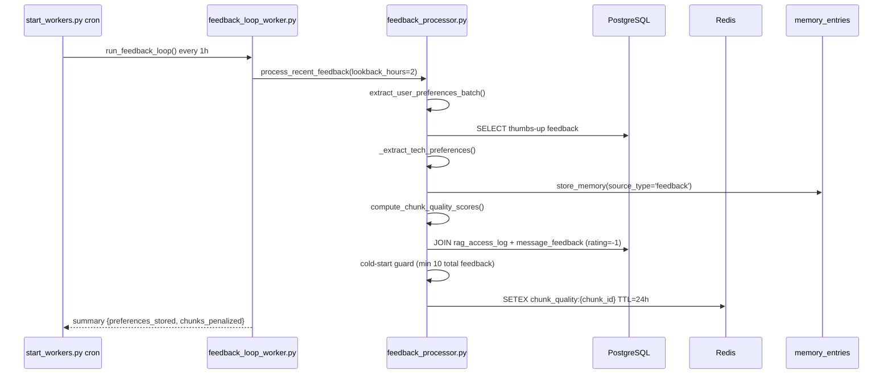

# Feedback Module

## Brief Introduction

The **Feedback Module** collects, stores, and learns from user ratings on individual AI assistant messages across the AI-UI chat experience. It enables users to submit thumbs-up / thumbs-down reactions, captures structured issue metadata for negative feedback, and feeds those signals back into the platform's retrieval, memory, evals, and prompt-improvement pipelines.

The module spans the **AI-UI frontend** (`ai-ui/src/components/Chat.jsx`, `ai-ui/src/components/KbChat.jsx`), the **shared API layer** (`routers/feedback_router.py`, `routers/chat_router.py`), the **feedback processing service** (`services/feedback_processor.py`), and the **background worker** (`workers/feedback_loop_worker.py`).

---

## Core Functionality

### 1. User-Facing Feedback Capture

Users can rate any assistant message in the main **Chat** and **Knowledge-Base Chat** (KbChat) interfaces.

- **Thumbs-up (+1)** — submitted immediately.
- **Thumbs-down (-1)** — opens a modal that collects:
  - `issue` (top-level category)
  - `sub_issue` (sub-category)
  - `comment` (free-text, max 1000 chars)
  - `user_prompt` (the preceding user message, truncated to 2000 chars)
  - `assistant_summary` (the assistant response, truncated to 1000 chars)

The frontend components `Chat.jsx::handleFeedback` and `KbChat.jsx::handleFeedback` handle the optimistic UI update and API call. `Chat.jsx::submitFeedback` and `KbChat.jsx::submitFeedback` assemble the enriched payload for negative feedback and POST it to the backend.

### 2. Feedback Submission API

Two backend routes accept feedback:

- `routers/feedback_router.py::submit_feedback` — canonical `/chat/messages/{message_id}/feedback` endpoint. Performs per-user per-message deduplication via Redis `SETNX` (24h TTL), upserts the `MessageFeedback` row, and supports the full enriched schema.
- `routers/chat_router.py::submit_message_feedback` — alternate `/chat/messages/{message_id}/feedback` implementation used in some gateway builds. It records the vote in `message_feedback` and also writes a corresponding `EvalResult` record (`eval_type="human_feedback"`) so human preference signals appear alongside automated eval scores.

Both endpoints enforce that `rating` is either `+1` or `-1`.

### 3. Feedback Retrieval & Insights

- `feedback_router.py::get_feedback` returns the current user's existing feedback for a message so the UI can restore the thumbs state on reload.
- `feedback_router.py::get_feedback_insights` (admin only) returns aggregate quality metrics:
  - total feedback count
  - thumbs-up / thumbs-down counts
  - top negative issue categories
  - number of penalized chunks in Redis
  - number of preference memory entries derived from feedback

### 4. Admin Repo-Permission Helpers

The same router hosts repo-permission management endpoints (`set_repo_permission`, `get_repo_permissions`) used to grant or revoke access to indexed repositories. These are admin/operator endpoints and are enforced at retrieval level in the search layer.

### 5. Feedback-Driven Learning Loop

`services/feedback_processor.py::FeedbackProcessor` is the core learning engine. It is invoked hourly by `workers/feedback_loop_worker.py::run_feedback_loop` and performs three idempotent tasks:

1. **Extract user preferences** from thumbs-up feedback (`extract_user_preferences_batch`)
   - Scans recent positive feedback.
   - Uses regex heuristics to detect technology/framework/language mentions.
   - Stores inferred preferences as `memory_entries` with `source_type='feedback'`, `importance_score=0.8`, and `confidence=0.7`.

2. **Compute chunk quality penalties** (`compute_chunk_quality_scores`)
   - Joins thumbs-down `message_feedback` rows with `rag_access_log` on `session_id = message_id`.
   - Identifies chunks that appeared in negatively-rated responses.
   - Applies a cold-start guard (`FEEDBACK_MIN_ENTRIES`, default 10 total feedback rows).
   - Stores penalty scores in Redis as `chunk_quality:{chunk_id}` with TTL 24h.
   - Penalty formula: `max(0.1, 1.0 - down_count / 10)`.

3. **Generate prompt-improvement suggestions** (`generate_prompt_improvement`)
   - Validates the issue category against an allowlist (`_VALID_ISSUE_CATEGORIES`).
   - Gathers the last 20 thumbs-down examples for the category.
   - Wraps user content in XML delimiters with an explicit untrusted-input instruction (SEC-07).
   - Calls the LLM proxy (`/llm/generate` with Claude Haiku) to propose a concise system-prompt addition.
   - Returns the suggestion for human review/approval via the prompt-management workflow.

The helper `get_chunk_quality_score(chunk_id)` is consumed by the retrieval/reranking layer to apply feedback-driven penalties to retrieved chunks.

---

## Architecture

---

## Component Relationships

| Component | Responsibility | Key Exports |
|-----------|----------------|-------------|
| `ai-ui/src/components/Chat.jsx` | Main chat UI; captures thumbs-up/down and submits enriched negative feedback. | `handleFeedback`, `submitFeedback` |
| `ai-ui/src/components/KbChat.jsx` | Knowledge-base chat UI; mirrors the feedback flow of Chat.jsx. | `handleFeedback`, `submitFeedback` |
| `routers/feedback_router.py` | Canonical feedback API: submit, get, insights, repo permissions. | `submit_feedback`, `get_feedback`, `get_feedback_insights`, `FeedbackRequest` |
| `routers/chat_router.py` | Alternate feedback endpoint that also logs to `eval_results`. | `submit_message_feedback`, `_FeedbackBody` |
| `services/feedback_processor.py` | Learning engine: preference extraction, chunk penalties, prompt suggestions. | `FeedbackProcessor`, `get_chunk_quality_score` |
| `workers/feedback_loop_worker.py` | Cron worker that drives the feedback processor every hour. | `run_feedback_loop` |
| `db/models.py::MessageFeedback` | ORM model for per-message user ratings. | `MessageFeedback` |
| `db/models.py::EvalResult` | ORM model for eval/human-preference scores. | `EvalResult` |
| `memory/postgres_memory.py::PostgresMemory` | Stores inferred feedback preferences. | `store_memory`, `retrieve_memories` |
| `core/kv/redis_impl.py::RedisKVClient` | Redis client used for dedup and chunk quality scores. | `set`, `setex`, `get`, `scan_iter` |

---

## Data Flow

### Submitting Thumbs-Up Feedback

### Submitting Thumbs-Down Feedback

### Hourly Learning Loop

---

## Process Flows

### Chunk Quality Penalty Calculation

1. Count total rows in `message_feedback`.
2. If count < `FEEDBACK_MIN_ENTRIES` (default 10), skip penalty calculation.
3. Query chunks retrieved for thumbs-down messages via `rag_access_log`.
4. Group by `chunk_id`, requiring at least 2 thumbs-down occurrences.
5. Compute penalty: `max(0.1, 1.0 - down_count / 10)`.
6. Write `chunk_quality:{chunk_id}` to Redis with 24h TTL.
7. Downstream retrievers call `get_chunk_quality_score(chunk_id)` to multiply relevance scores.

### Prompt Improvement Suggestion

1. Validate `issue_category` against `_VALID_ISSUE_CATEGORIES` allowlist.
2. Fetch up to 20 recent thumbs-down rows for that issue where `user_prompt` is not null.
3. Require at least 5 examples.
4. Build an XML-wrapped prompt with explicit untrusted-input instructions.
5. Call LLM proxy (`/llm/generate`) with Claude Haiku.
6. Return the generated suggestion for human review in the prompt-management workflow.

---

## Security & Safety Considerations

- **SEC-10**: Per-user per-message feedback deduplication via Redis `SETNX` with 24h TTL prevents feedback flooding.
- **SEC-07**: Issue categories are validated against an allowlist; user comments are wrapped in XML delimiters with an explicit untrusted-input instruction before being sent to the LLM for prompt-improvement suggestions.
- **SEC-09**: The insights endpoint uses `scan_iter` (cursor-based) instead of `KEYS` when counting penalized chunks in Redis.
- All admin endpoints (`get_feedback_insights`, repo-permission endpoints) enforce admin/operator role checks.
- Free-text fields are truncated at ingestion (`comment` 1000, `user_prompt` 2000, `assistant_summary` 1000) to limit storage and prompt-injection surface.

---

## Configuration & Environment

| Variable | Default | Purpose |
|----------|---------|---------|
| `FEEDBACK_MIN_ENTRIES` | `10` | Minimum total feedback rows before chunk penalties are applied. |
| `LLM_PROXY_URL` | — | Base URL for the LLM proxy used to generate prompt-improvement suggestions. |
| `EMBED_SVC_URL` | `http://localhost:8001` | Used indirectly via `PostgresMemory` for semantic memory operations. |
| `RDB_CACHE` | — | Redis database identifier used for dedup and chunk quality keys. |

---

## Integration with the Broader System

- **Chat / KB Chat**: The feedback module is embedded in the two primary chat UIs. See [chat.md](../chat/chat.md) and [kb_chat.md](../knowledge/kb_chat.md) for the surrounding chat architecture.
- **Evals**: `chat_router.py::submit_message_feedback` writes human feedback into `eval_results`, integrating with the evaluation and analytics pipeline. See [evals_router.md](../observability/evals_router.md) and [evals_dashboard.md](../observability/evals_dashboard.md).
- **Memory**: Positive feedback drives inferred user preferences stored in `memory_entries`. See [memory.md](../storage/memory.md) and [memory_router.md](../storage/memory_router.md).
- **Retrieval / RAG**: Chunk quality penalties are consumed by the hybrid retriever to downgrade frequently-disliked chunks. See hybrid_search.md and [kb_router.md](../knowledge/kb_router.md).
- **Prompt Management**: Generated prompt-improvement suggestions are intended for human review and versioning through the prompt-management workflow. See [prompt_mgmt_router.md](../api/prompt_mgmt_router.md).
- **Workers / Cron**: The feedback loop is scheduled by the worker orchestration layer. See start_workers.md.

---

## Files & Modules

- `ai-ui/src/components/Chat.jsx`
- `ai-ui/src/components/KbChat.jsx`
- `routers/feedback_router.py`
- `routers/chat_router.py`
- `services/feedback_processor.py`
- `workers/feedback_loop_worker.py`
- `db/models.py` (`MessageFeedback`, `EvalResult`)
- `memory/postgres_memory.py`
- `core/kv/redis_impl.py`
