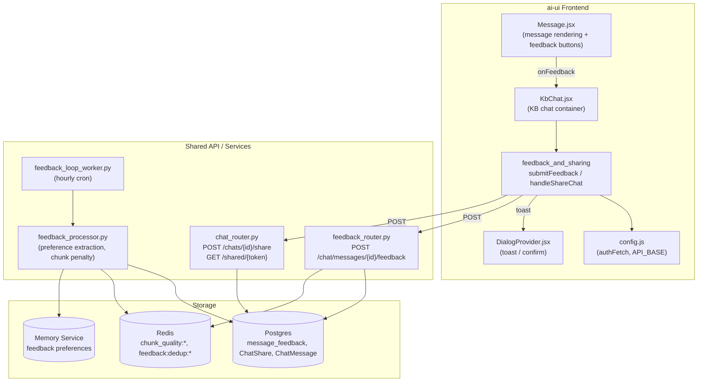
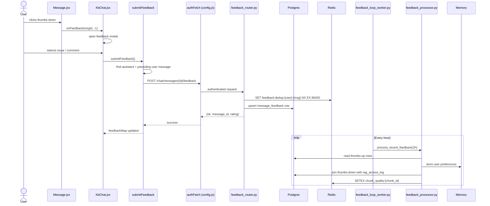
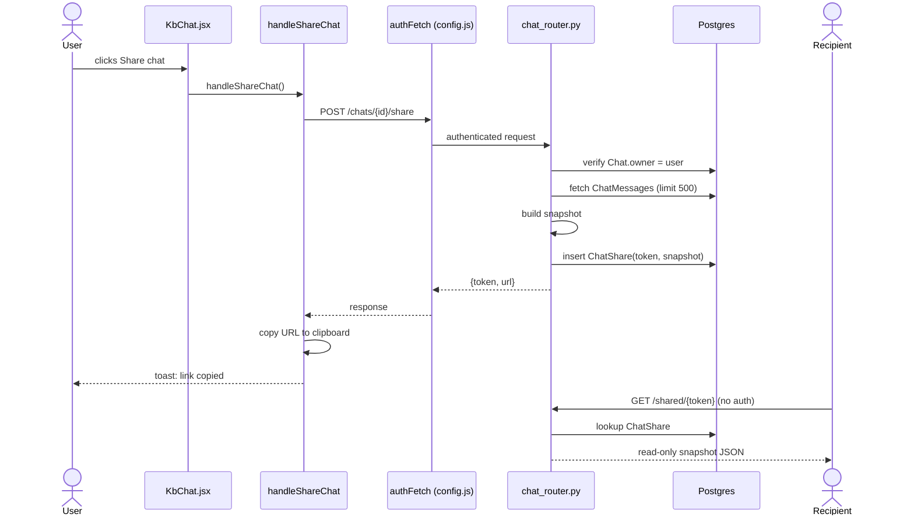

# Feedback and Sharing Module

## Brief Introduction

The **Feedback and Sharing** module is a frontend capability embedded in the Knowledge-Base (KB) chat experience (`ai-ui/src/components/KbChat.jsx`). It enables end users to provide explicit quality signals on individual AI responses (thumbs-up / thumbs-down) and to generate public, read-only share links for entire chat sessions. Feedback data drives the platform's learning loop—preferences are extracted into memory, problematic chunks are penalized in retrieval, and prompt improvements are suggested. Sharing creates immutable snapshots that can be viewed without authentication, making it easy to distribute conversation outcomes across teams.

---

## Comprehensive Documentation

### 1. Purpose and Core Functionality

This module exposes two user-facing capabilities inside the KB chat UI:

| Capability | Function | User Value | System Impact |
|------------|----------|------------|---------------|
| **Message Feedback** | `submitFeedback` | Rate any assistant message; for thumbs-down, specify an issue category, sub-issue, and free-text comment. | Feeds the feedback processor, which updates user memory, chunk quality scores, and prompt improvement suggestions. |
| **Chat Sharing** | `handleShareChat` | Create a public, read-only link for the current chat and copy it to the clipboard. | Persists a snapshot in `ChatShare`; the recipient can view it via `/shared/{token}` without logging in. |

Both functions are thin UI handlers. They do not implement business logic directly; instead they authenticate via `authFetch`, call backend routers, and update local React state to give immediate visual feedback.

### 2. Architecture and Component Relationships

The module lives inside the `KbChat` React component and depends on state managed by that parent. It is a leaf concern of the larger [kb_chat_core_chat](../knowledge/kb_chat_core_chat.md) module.



### 3. How It Fits into the Overall System

- **KB Chat Context**: The module is a sub-feature of [kb_chat_core_chat](../knowledge/kb_chat_core_chat.md). It reuses the active chat state (`activeChatId`, `activeChat.messages`, `messages`) and the `authFetch` utility from [config](../core/config.md).
- **Quality Loop**: Feedback is the human signal that closes the feedback_processor learning loop. Thumbs-up data is mined for technology preferences and stored in memory; thumbs-down data is correlated with RAG access logs to penalize low-quality chunks.
- **Sharing**: Chat sharing is implemented by the [chat_router](chat_router.md) public-share endpoints. The snapshot semantics ensure that shared content remains immutable even if the original chat is edited or deleted.
- **Governance and Budget**: Feedback submission is idempotent and deduplicated per user/message. Sharing is restricted to the chat owner (enforced by `Chat.user_id` check in the backend).

---

## Component Details

### `submitFeedback`

**Location**: `ai-ui/src/components/KbChat.jsx`

Submits a thumbs-down rating for an assistant message. The function is invoked after the user fills the negative-feedback modal (issue, sub-issue, comment). It locates the assistant message and the most recent preceding user message, truncates them to backend limits, and POSTs the payload.

**Behavior**:
- Sets the local `feedbackMap` immediately so the UI shows the selected rating.
- Closes the feedback modal before the network call to keep the UI responsive.
- Sends `rating: -1`, `issue`, `sub_issue`, `comment`, `user_prompt` (max 2000 chars), and `assistant_summary` (max 1000 chars).
- Swallows errors silently; the local feedback state is rolled back on failure.

**Backend contract**: `POST /chat/messages/{message_id}/feedback` defined in [feedback_router](feedback_router.md).

### `handleShareChat`

**Location**: `ai-ui/src/components/KbChat.jsx`

Creates a public share link for the active chat and copies it to the clipboard.

**Behavior**:
- Guards against empty chats (`activeChatId` and `messages` required).
- POSTs to `/chats/{activeChatId}/share`.
- On success, extracts `url` from the response or builds it from `token`.
- Copies the URL to the clipboard via `navigator.clipboard`; falls back to a browser prompt if clipboard access fails.
- Shows toast notifications for success / failure.

**Backend contract**: `POST /chats/{chat_id}/share` and `GET /shared/{token}` defined in [chat_router](chat_router.md).

---

## Data Flows

### Feedback Submission Flow



### Chat Sharing Flow



---

## Process Flows

### Thumbs-Down Feedback Process

```mermaid
flowchart LR
    A[User clicks thumbs-down] --> B[Open feedback modal]
    B --> C[User selects issue, sub-issue, comment]
    C --> D[submitFeedback invoked]
    D --> E[Locate assistant message + prior user message]
    E --> F[Truncate prompt & summary]
    F --> G[POST /chat/messages/{id}/feedback]
    G --> H{Backend dedup + upsert}
    H -->|success| I[Update feedbackMap]
    H -->|failure| J[Rollback feedbackMap]
    I --> K[Feedback loop worker processes data hourly]
```

### Chat Sharing Process

```mermaid
flowchart LR
    A[User clicks Share] --> B{activeChatId && messages?}
    B -->|no| C[Abort]
    B -->|yes| D[POST /chats/{id}/share]
    D --> E{Response ok?}
    E -->|no| F[Toast: share failed]
    E -->|yes| G[Extract url/token]
    G --> H[Copy to clipboard]
    H --> I[Toast: link copied]
    H -->|clipboard blocked| J[Show prompt with URL]
```

---

## Dependencies

### Frontend Dependencies

| Dependency | Module | Purpose |
|------------|--------|---------|
| `authFetch`, `API_BASE` | [config](../core/config.md) | Authenticated HTTP requests to the backend. |
| `useToast` | [DialogProvider](../ui/ui_dialog.md) | Success / error toast notifications. |
| `activeChat`, `activeChatId`, `messages` | [kb_chat_core_chat](../knowledge/kb_chat_core_chat.md) | Chat state consumed by the handlers. |
| `feedbackModal`, `feedbackIssue`, `feedbackSubIssue`, `feedbackComment`, `feedbackMap` | [kb_chat_core_chat](../knowledge/kb_chat_core_chat.md) | Local state for the feedback modal and ratings. |

### Backend Dependencies

| Dependency | Module | Purpose |
|------------|--------|---------|
| `POST /chat/messages/{id}/feedback` | [feedback_router](feedback_router.md) | Persists message feedback with deduplication. |
| `POST /chats/{id}/share`, `GET /shared/{token}` | [chat_router](chat_router.md) | Creates and serves public chat snapshots. |
| `FeedbackProcessor` | feedback_processor | Extracts preferences and computes chunk penalties. |
| `run_feedback_loop` | feedback_loop_worker | Hourly cron that invokes the feedback processor. |

---

## Security and Governance Notes

- **Feedback deduplication**: The backend uses Redis `SET NX` with a 24-hour TTL to prevent feedback spam (`feedback:dedup:{user_id}:{message_id}`).
- **Issue allowlist**: `feedback_processor.py` validates issue categories against a fixed set to prevent prompt injection when generating improvement suggestions.
- **Ownership enforcement**: Share creation verifies that `Chat.user_id` matches the authenticated user. Shared snapshots are read-only and do not expose internal metadata such as token usage or cost.
- **Data truncation**: The frontend truncates `user_prompt` to 2000 characters and `assistant_summary` to 1000 characters before sending; the backend further clamps comments to 1000 characters.

---

## References

- [kb_chat_core_chat](../knowledge/kb_chat_core_chat.md) — parent chat container and state management.
- [feedback_router](feedback_router.md) — backend API for message feedback.
- [chat_router](chat_router.md) — backend API for chat sharing and public snapshots.
- feedback_processor — learning loop that consumes feedback.
- feedback_loop_worker — cron worker that schedules feedback processing.
- [config](../core/config.md) — `authFetch` and API base configuration.
