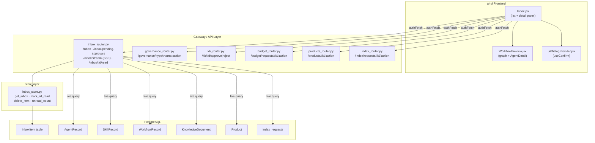
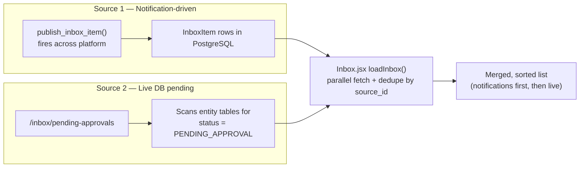
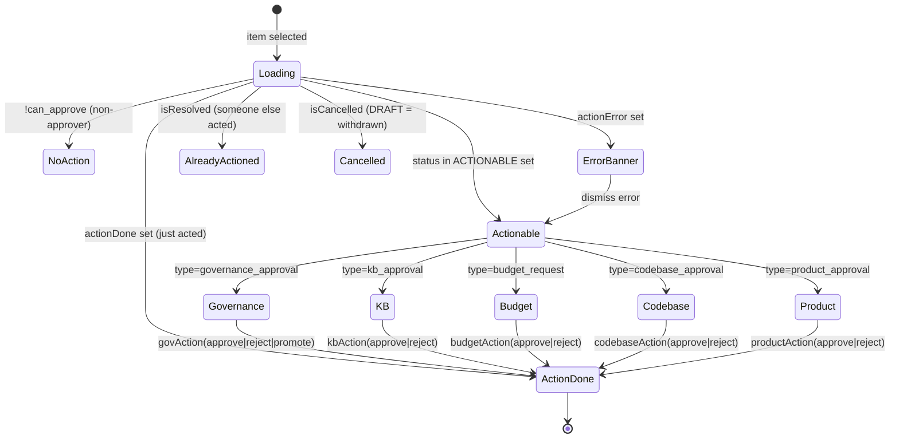
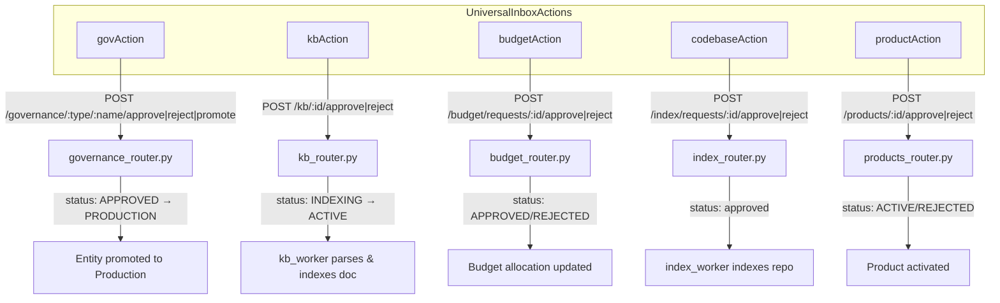
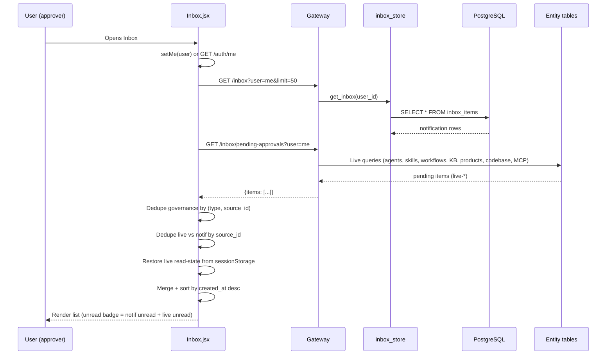
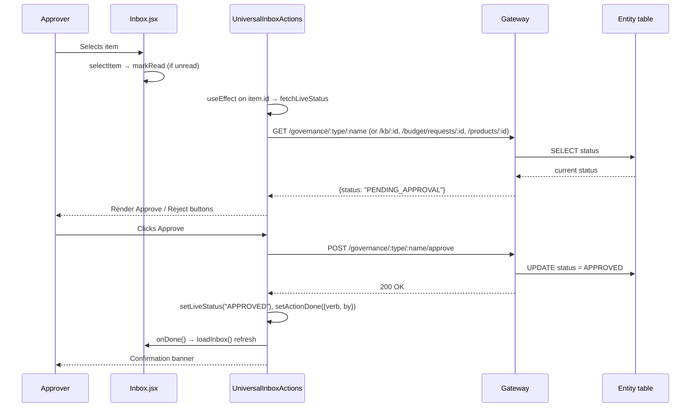

# Inbox Module

The Inbox module is the **universal notification and approval center** of the AI-NXT platform. It aggregates human-in-the-loop (HITL) approval requests, system notifications, and live pending-approval items from across the platform into a single, filterable, actionable surface. Approvers can review submitted agents, skills, workflows, knowledge-base documents, codebase index requests, products, and budget requests — and approve, reject, or promote them directly from the inbox without navigating to each subsystem.

The module spans two layers:

- **Frontend** — `ai-ui/src/components/Inbox.jsx`: a React component that renders a two-pane (list + detail) inbox UI, merges notification-driven items with live DB-pending items, and exposes per-type approval actions.
- **Backend** — `routers/inbox_router.py` + `store/inbox_store.py`: REST endpoints for fetching, marking-read, deleting, and streaming (SSE) inbox items, plus a live "pending approvals" query that scans entity tables (agents, skills, workflows, KB docs, products, codebase index requests, MCP tools) in real time.

---

## Architecture Overview

### Two-source merge model

The inbox does not rely on a single data source. It merges two streams so that both persisted notifications and real-time pending items appear:

- **Notification items** carry persistent `read`/`unread` state in the `InboxItem` table and are managed via `inbox_store.py`.
- **Live items** (prefixed `live-`) have no `InboxItem` row; their read state is kept in `sessionStorage` (`inbox_live_read_ids`) so it survives tab switches but clears on reload. Live items cannot be deleted — only dismissed by acting on them.

### Deduplication

Governance-approval notifications can produce multiple persisted rows for the same artifact (repeated submits, overlapping approver + HOD routing). `loadInbox()` collapses these by keeping only the newest per `(type, source_id)` for governance types. Live items are deduped against notification `source_id`s so a pending artifact that also has a notification appears only once.

---

## Component Reference

### Frontend — `Inbox.jsx`

| Component | Role |
|---|---|
| `Inbox` | Top-level component. Manages state (`items`, `selected`, `unread`, `activeFilters`, `searchQ`, `me`), fetches and merges both sources, renders the two-pane layout, and propagates unread count to `App.jsx` via `onUnreadChange`. |
| `FilterDropdown` | Multi-select type filter with in-dropdown search. Backed by `FILTER_OPTIONS` and `TYPE_LABELS`. |
| `MetaLinks` | Renders metadata link cards (Jira, GitLab, Confluence, PR) and info chips (SDLC run, Jira key, severity, score, revision) from `item.metadata`. |
| `RejectForm` | Textarea + confirm/cancel for mandatory rejection reasons. |
| `WorkflowNodeRow` | A single node row in the workflow approval summary; agent rows expand to show `AgentDetail`. |
| `WorkflowApprovalPreview` | Loads `/governance/workflows/:name/graph` (approver-only, owner-scoped) and renders a node summary list + expandable read-only `WorkflowPreview` diagram. Fails silently on 403/404. |
| `AgentApprovalPreview` | Loads `/governance/agents/:name/config` and reuses `AgentDetail` to show system prompt, tools, and skills. |
| `SkillApprovalPreview` | Loads `/governance/skills/:name/source` and shows the skill's source code, description, and category. |
| `UniversalInboxActions` | The action engine. Re-fetches live entity status on every item selection, then renders type-specific Approve/Reject/Promote buttons (or "already actioned" / "cancelled" banners). Enforces maker-checker for KB docs and default-deny for unknown governance statuses. |
| `markAllRead` / `deleteItemOLD` / `handleClick` | Handlers for bulk-read, legacy delete, and item selection. |

#### Type system

The inbox is driven by a rich type taxonomy that controls icons, colors, background tints, labels, and timestamp labels:

- `TYPE_ICONS` / `TYPE_COLORS` / `TYPE_BG` / `TYPE_LABELS` / `TYPE_TIMESTAMP_LABELS` — static maps keyed by `item.type`.
- `PRIORITY_COLORS` — High/Medium/Low priority badges parsed from body text (`Priority: High.`) or `metadata.priority`.
- Approval types (`governance_approval`, `kb_approval`, `product_approval`, `codebase_approval`, `sdlc_approval_required`, `design_approval`, `solution_approval`, `pr_approval`) get a "Needs Action" badge.

#### `UniversalInboxActions` state machine

This is the most complex sub-component. It guards against stale UI by re-fetching the entity's current status whenever the selected item changes, then renders one of several states:

Key safety behaviors:
- **Default-deny for governance**: action buttons only render when `status` is explicitly in `ACTIONABLE` (`PENDING_APPROVAL`, `PENDING_L2`, `APPROVED`). Unknown/missing status → no buttons.
- **Maker-checker for KB docs**: the uploader (`meta.uploaded_by === me.email`) cannot approve their own document; the Approve button is disabled with a tooltip.
- **Live status refresh**: prevents showing Approve/Reject after another approver has already acted. `RESOLVED_STATUSES` includes `INDEXING`/`ACTIVE` so approved-and-parsing docs don't invite double-approval.
- **Cancelled detection**: a governance item back in `DRAFT` means the submitter withdrew — shows a "cancelled" banner instead of a blank panel.

### Backend — `inbox_router.py`

| Endpoint | Method | Purpose |
|---|---|---|
| `/inbox` | GET | Fetch persisted notification items for a user (via `inbox_store.get_inbox`). |
| `/inbox/pending-approvals` | GET | Live query across entity tables for `PENDING_APPROVAL` items. Approver-gated by JWT (`ad_level <= 3`, admin, or HOD). Department-scoped. |
| `/inbox/unread-count` | GET | Unread count for a user. |
| `/inbox/stream` | GET (SSE) | Server-sent events stream; pushes items as `publish_inbox_item()` fires. 25s heartbeat keeps proxies alive. |
| `/inbox/{item_id}/read` | POST | Mark a single persisted item as read. |
| `/inbox/read-all` | POST | Mark all persisted items read for a user. |
| `/inbox/{item_id}` | DELETE | Delete a persisted item (live items cannot be deleted). |

#### `get_pending_approvals` — the live query

This endpoint is the backbone of the "live items" stream. It performs department-scoped queries across:

1. **Agents** (`AgentRecord`) — `governance_approval` items
2. **Skills** (`SkillRecord`) — `governance_approval` items
3. **Workflows** (`WorkflowRecord`) — `governance_approval` items
4. **Products** (`Product`) — `product_approval` items (dept-scoped via `DeptProductMapping`)
5. **KB documents** (`KnowledgeDocument`) — `kb_approval` items (dept-scoped via `department_ids` JSONB containment)
6. **Codebase index requests** (`index_requests`) — `codebase_approval` items (dept-scoped via product mapping)
7. **MCP tools** (Redis `marketplace:tool:*`) — `governance_approval` items in `PENDING_L2` (IS/Security team only)

Each result is shaped into an inbox-compatible object with a `live-*` id, `source_id` for dedup, and `metadata` carrying `entity_type`, `entity_name`, `owner_id`, `current_status`, and `submitted_by`. Approver visibility is determined authoritatively from the JWT — never from query params.

### Store — `inbox_store.py`

Thin SQLAlchemy wrappers over the `InboxItem` table: `get_inbox`, `mark_all_read`, `delete_item`, `unread_count`, plus internal SSE pub/sub helpers (`_sse_subscribe`/`_sse_unsubscribe`) used by `inbox_stream`.

---

## Approval Workflows

The inbox is the single entry point for all HITL approvals. Each approval type routes to a different backend action endpoint:

### Governance lifecycle (agents, skills, workflows, MCP tools)

Governance approvals follow a multi-stage lifecycle. The inbox surfaces each stage as actionable:

| Status | Inbox action | Effect |
|---|---|---|
| `PENDING_APPROVAL` | Approve / Reject | L1 approver (ad_level ≤ 3, admin, or HOD) reviews |
| `PENDING_L2` | Approve (L2) / Reject | IS/Security team reviews MCP tools |
| `APPROVED` | Promote to Production | Entity moves from staging to production |
| `REJECTED` | — (resolved) | No further action |
| `PRODUCTION` | — (resolved) | Terminal success |
| `DRAFT` | — (cancelled) | Submitter withdrew the deploy request |

See the [governance_router](#) module documentation for the full governance state machine, entity graph, and SLA logic.

### KB document approval (maker-checker)

KB approvals enforce a maker-checker policy: the user who uploaded a document cannot approve it. On approval, the doc status transitions to `INDEXING` and the `kb_worker` asynchronously parses and indexes it, eventually reaching `ACTIVE`. The inbox intentionally treats `INDEXING` as resolved (no further approver action needed) — parsing progress is visible to the uploader in the KnowledgeBase UI, not in the inbox.

---

## Data Flow: Loading the Inbox

## Data Flow: Taking an Approval Action

---

## Dependencies

### Internal (ai-ui)

| Dependency | Usage |
|---|---|
| `WorkflowPreview` / `AgentDetail` (`./WorkflowPreview`) | Read-only React Flow diagram + agent detail panel for governance workflow/agent approval previews. |
| `useConfirm` (`./ui/DialogProvider`) | Confirmation dialog for item deletion. |
| `authFetch` / `API_BASE` (`../config`) | Authenticated API calls to the gateway. |
| `toIST` (`../utils/time`) | Timestamp formatting to IST. |

### Backend routers (action endpoints)

| Router | Endpoints used |
|---|---|
| `inbox_router.py` | `/inbox`, `/inbox/pending-approvals`, `/inbox/:id/read`, `/inbox/read-all`, `/inbox/:id` |
| `governance_router.py` | `/governance/:type/:name`, `/governance/:type/:name/:action`, `/governance/workflows/:name/graph`, `/governance/agents/:name/config`, `/governance/skills/:name/source` |
| `kb_router.py` | `/kb/:id`, `/kb/:id/approve`, `/kb/:id/reject` |
| `budget_router.py` | `/budget/requests/:id`, `/budget/requests/:id/:action` |
| `products_router.py` | `/products/:id`, `/products/:id/:action` |
| `index_router.py` | `/index/requests/:id/:action` |
| `auth_router.py` | `/auth/me` (fallback user identity) |

### Backend stores / models

| Component | Role |
|---|---|
| `store/inbox_store.py` | `InboxItem` CRUD + SSE pub/sub. |
| `db/models.py` | `InboxItem`, `AgentRecord`, `SkillRecord`, `WorkflowRecord`, `KnowledgeDocument`, `Product`, `DeptProductMapping` — entity tables scanned by `get_pending_approvals`. |

---

## How It Fits Into the System

The inbox is the **convergence point** for all asynchronous, human-judgment workflows in the platform. Rather than each subsystem (governance, KB, budget, products, codebase indexing, SDLC) building its own approval UI, they all publish inbox items or leave entities in `PENDING_APPROVAL` state, and the inbox provides a unified review surface.

- **Governance** — agents, skills, workflows, and MCP tools submitted for deployment appear as `governance_approval` items. See the governance module for the full submission → approval → promotion lifecycle.
- **Knowledge Base** — uploaded documents require approval before indexing (maker-checker). See the KB module.
- **Budget** — HOD budget increase requests route to approvers. See the budget module.
- **Products** — new product registrations require approval. See the products module.
- **Codebase indexing** — repo index requests require approval before the index worker runs. See the index module.
- **SDLC pipeline** — `sdlc_approval_required`, `design_approval`, `solution_approval`, `pr_approval` items surface HITL gates in the SDLC pipeline. See the SDLC module.
- **Notifications** — `agent_completion`, `workflow_completion`, `thread_response`, `budget_alert`, `coach_digest`, `failure`/`agent_failure`/`workflow_failed` are informational notifications that don't require action but keep users informed.

The unread count propagates up to `App.jsx` (via `onUnreadChange`) to drive the global notification badge, making the inbox the system-wide source of truth for "things needing your attention."

---

## Key Design Decisions

1. **Two-source merge** — notifications (persisted, event-driven) + live DB queries (real-time, status-based) ensure the inbox never misses a pending item even if a notification failed to fire, and never shows stale items that have already been resolved elsewhere.

2. **Live items are ephemeral** — `live-*` items have no `InboxItem` row. Their read state lives in `sessionStorage` and they can't be deleted, only resolved by acting on them. This avoids polluting the `InboxItem` table with duplicates of entity-state-derived items.

3. **Approver-gated live query** — `get_pending_approvals` checks `ad_level`, `role`, `is_hod`, and department membership from the JWT. Non-approvers get an empty list; the frontend's `UniversalInboxActions` also hides action buttons when `me.can_approve` is false. Defense in depth.

4. **Silent failure for previews** — `WorkflowApprovalPreview`, `AgentApprovalPreview`, and `SkillApprovalPreview` return `null` on 403/404. Non-approvers simply don't see the preview, but the action panel (which is also hidden for non-approvers) is never blocked.

5. **Live status refresh on selection** — `UniversalInboxActions` re-fetches the entity's current status every time the selected item changes, preventing the "approve a already-approved item" race condition when multiple approvers share the queue.

6. **Maker-checker enforcement** — KB document uploaders cannot approve their own uploads. The check is client-side (disabled button + tooltip) and the backend enforces it independently.
