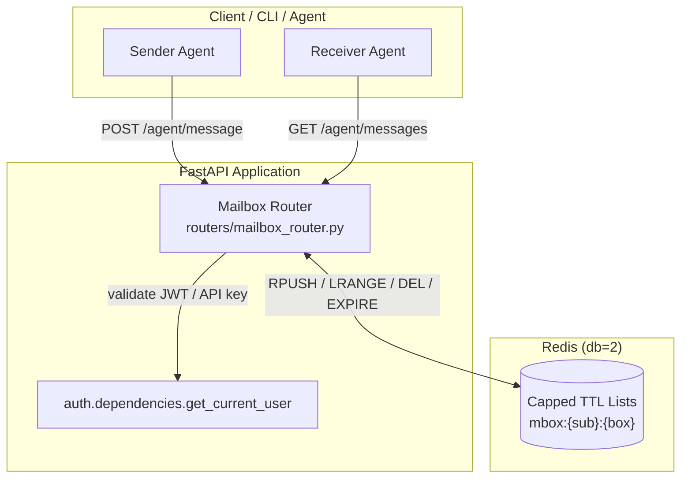
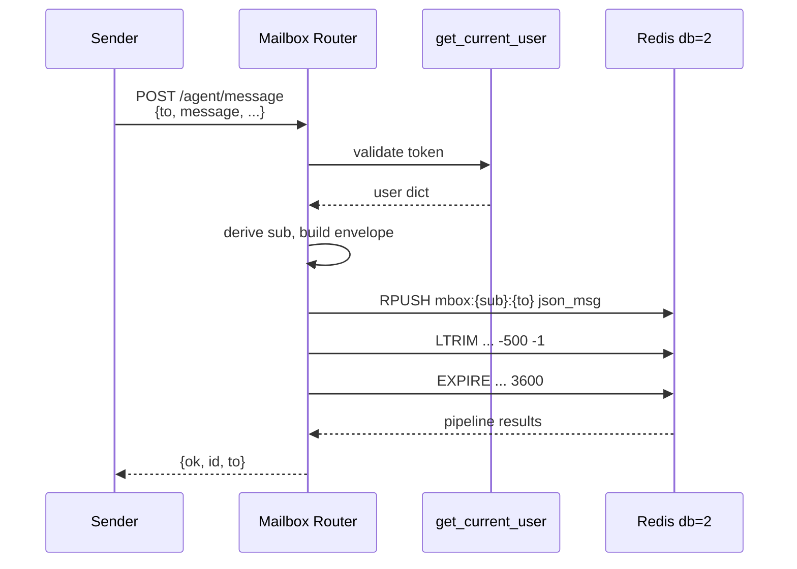
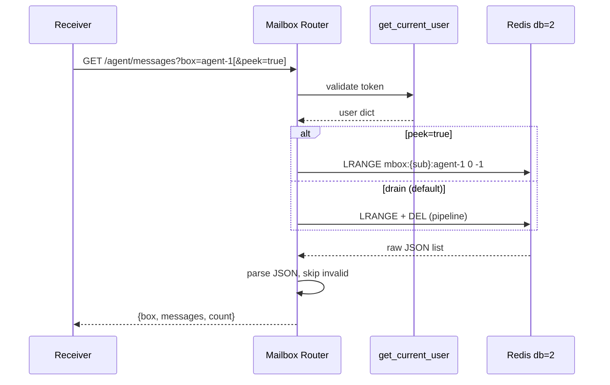
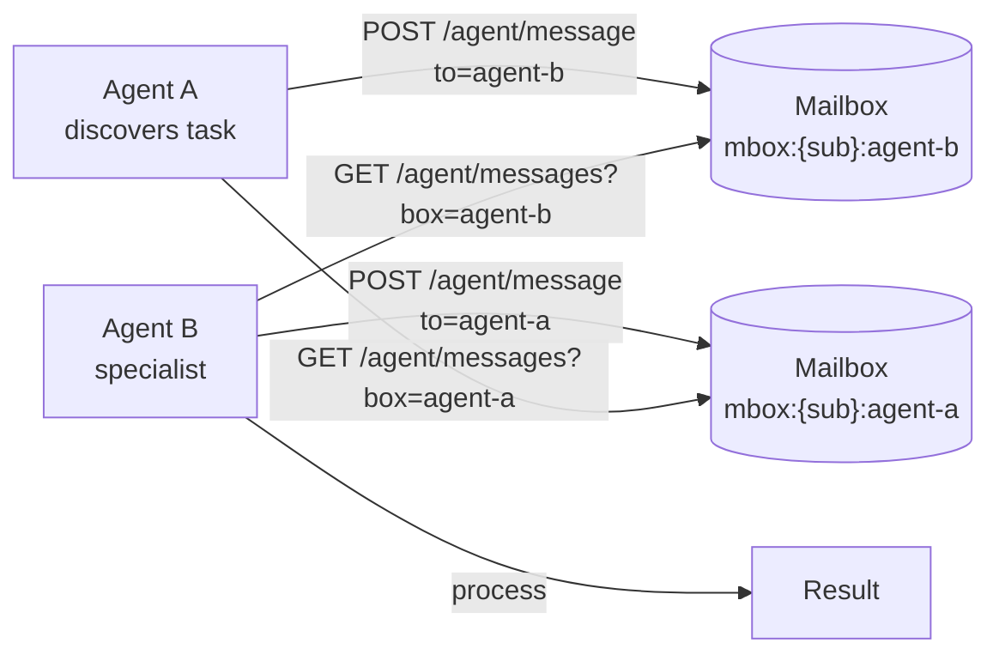

# Mailbox Router

The **Mailbox Router** provides a lightweight, Redis-backed message queue for inter-agent and teammate coordination. It exposes HTTP endpoints that allow agents (and the CLI) to send messages to named mailboxes and poll for incoming messages in a non-blocking, user-scoped manner.

This module implements the backend-managed queue design for agent-to-agent messaging, replacing any earlier in-process mailbox implementation. It is intentionally simple, transient, and scale-safe: all operations are O(1) or bounded O(n-in-box), use atomic Redis pipelines, and never hold long-polling workers.

---

## Core Functionality

The router supports three operations:

| Endpoint | Method | Purpose |
|----------|--------|---------|
| `/agent/message` | `POST` | Send a message to a target mailbox (`to`). Supports broadcasts to box `"*"`. |
| `/agent/messages` | `GET` | Drain or peek pending messages for the polling agent's own mailbox (`box`). |
| `/agent/mailboxes` | `GET` | List the caller's non-empty mailboxes and their pending counts. |

Messages are stored as capped, TTL'd Redis lists keyed by the caller's identity (`sub`) and the target mailbox name. Each mailbox is isolated per user, so one user's agents cannot see another user's traffic.

---

## Architecture



### Key Design Decisions

- **User-scoped keys**: Every mailbox key is prefixed with `mbox:{sub}:`, where `sub` is derived from the authenticated user's JWT subject, email, or user ID. This guarantees isolation between users.
- **Capped lists**: Each mailbox is bounded to `_MAX_PER_BOX = 500` entries using `LTRIM`. Older messages are dropped once the cap is exceeded.
- **Self-expiring mailboxes**: Each key has a TTL of `_TTL_SECONDS = 3600` (1 hour). Empty or stale mailboxes disappear automatically.
- **Non-blocking poll**: The receive endpoint returns immediately. There is no long-poll, blocking pop, or worker wait.
- **Atomic drain**: `LRANGE` and `DEL` are executed inside a Redis pipeline so two concurrent pollers cannot double-deliver the same message.

---

## Component Overview

### `SendBody`

Pydantic request model for sending a message.

| Field | Type | Required | Description |
|-------|------|----------|-------------|
| `to` | `str` | Yes | Target mailbox name. Use `"*"` for broadcast. |
| `message` | `str` | Yes | Message payload. |
| `summary` | `Optional[str]` | No | Optional short summary. |
| `sent_at` | `Optional[str]` | No | Optional ISO timestamp; defaults to current UTC time. |
| `frm` | `Optional[str]` | No | Optional sender box/agent name. |

### `send_agent_message`

Validates the recipient and message body, constructs a JSON message envelope with a generated UUID and timestamp, and pushes it onto the target Redis list. Also trims the list and refreshes the TTL atomically via a pipeline.

### `poll_agent_messages`

Reads pending messages for a given `box` query parameter. Supports two modes:

- **Drain mode** (default): atomically fetches all messages and deletes the key.
- **Peek mode** (`peek=true`): reads messages without removing them.

Malformed JSON entries are silently skipped.

### `list_mailboxes`

Scans Redis for all keys matching `mbox:{sub}:*` and returns each mailbox name with its pending message count. Intended for diagnostics and debugging.

---

## Data Flow

### Sending a Message



### Polling / Draining a Mailbox



---

## Dependencies

The Mailbox Router relies on two shared utilities:

- **`auth.dependencies.get_current_user`** — Extracts and validates the caller identity from a JWT Bearer token, API key, or `auth_token` cookie, and enriches the payload with server-side profile data.
- **[`core.config.redis_client`](../core/core_config.md)** — Returns a configured Redis client for the requested database number. The router uses database `2` for transient agent coordination.

For details on how authentication and Redis configuration are managed, refer to the linked module documentation.

---

## Relationship to Other Modules

The Mailbox Router sits alongside other messaging and coordination modules but serves a distinct purpose:

- **[`chat_router`](chat_router.md)** — Handles persistent user chat threads, message history, attachments, and feedback. Use the chat router for human-facing conversations.
- **[`threads_router`](threads_router.md)** — Manages threaded conversations with HITL (human-in-the-loop) actions and reactions. Use threads for collaborative, persistent discussions.
- **[`inbox_router`](inbox_router.md)** — Provides user approval queues and unread counts for governance and workflow interrupts. Use the inbox for actionable approvals.
- **[`memory_router`](../storage/memory_router.md)** — Stores long-term agent and platform memory. Use memory for durable recall, not transient coordination.
- **[`agents_router`](../agents/agents_router.md)** — Manages agent CRUD, KB attachments, and favorites. Agents are the typical senders/receivers of mailbox messages.

Use the Mailbox Router when one agent or tool needs to pass a short, transient message to another agent or broadcast to a group, without requiring persistence, history, or human interaction.

---

## Process Flow: Agent Coordination Example



In this pattern, Agent A sends a work item to Agent B's mailbox, Agent B drains its mailbox, performs the work, and replies by sending a message back to Agent A's mailbox. No database schema is required, and stale mailboxes expire automatically.

---

## Operational Considerations

- **Redis availability**: If Redis is unreachable, all endpoints will fail fast because `socket_connect_timeout` is set to 2 seconds. Callers should handle transient Redis errors.
- **Message ordering**: Messages within a mailbox are ordered by arrival time because Redis lists preserve insertion order.
- **At-most-once delivery**: Drain mode uses an atomic `LRANGE` + `DEL` pipeline, so a message is delivered to exactly one successful poller. If the poller crashes after reading but before processing, the message is lost. Use peek mode or an application-level acknowledgment if durability is required.
- **Broadcast semantics**: Sending to `to="*"` places the message in a mailbox literally named `*`. Receivers must poll `box=*` to receive broadcasts; there is no fan-out to every agent's individual mailbox.
- **No encryption at rest**: Messages are stored as plain JSON in Redis. Do not include secrets or sensitive PII in mailbox payloads.

---

## File Location

```
routers/mailbox_router.py
```

---

## Summary

The Mailbox Router is a minimal, high-throughput coordination primitive for agent-to-agent messaging. By leveraging Redis capped lists, per-user scoping, and atomic pipelines, it provides a safe backend-managed queue without adding database schema or long-polling workers. It is best used for transient, fire-and-forget coordination between agents and tools within the broader agent and messaging ecosystem.
