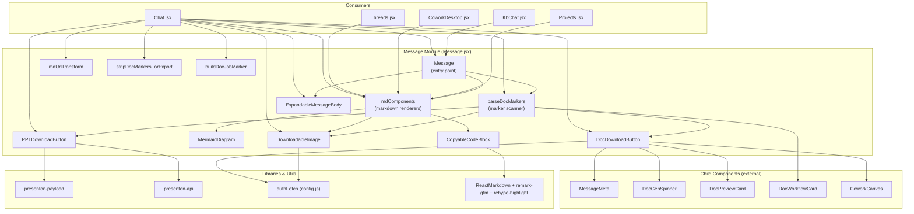
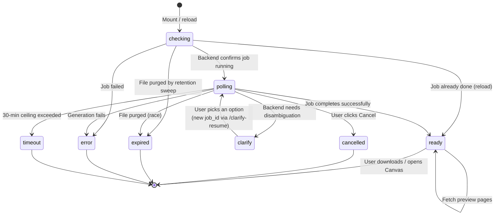
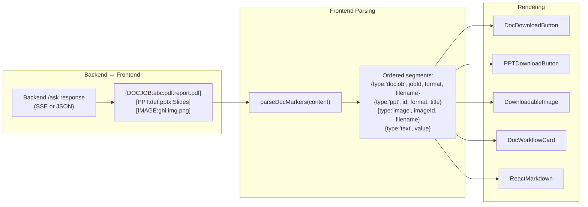
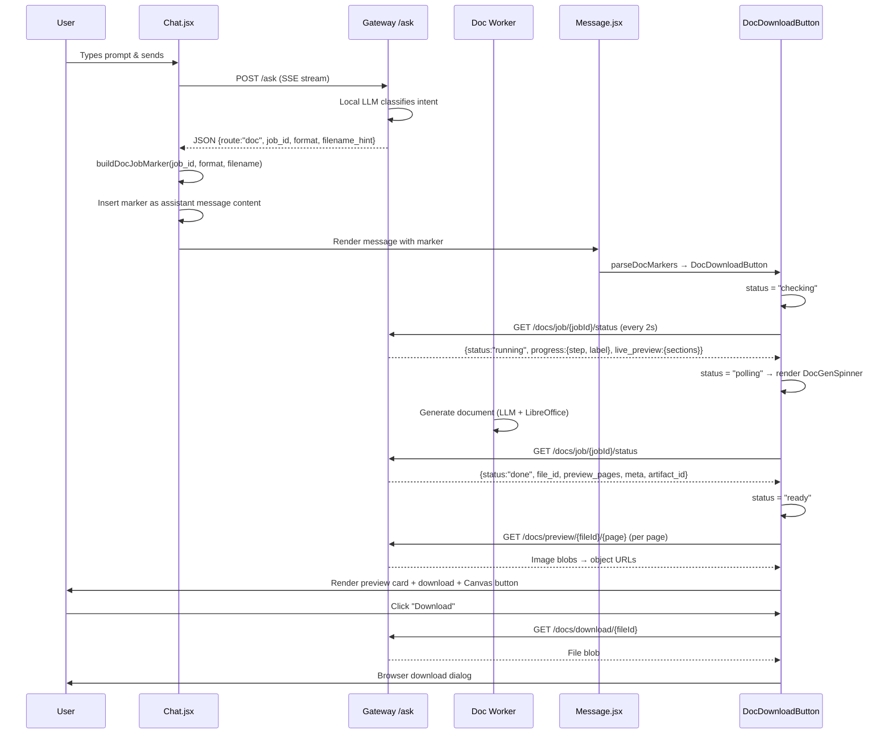

# Message Module

## Overview

The **Message** module (`ai-ui/src/components/Message.jsx`) is the central rich-content rendering engine for all conversational surfaces in the AI-UI frontend. It transforms raw assistant message text — which may contain Markdown, fenced code blocks, Mermaid diagrams, and special inline markers for generated documents, presentations, and images — into a fully interactive, styled chat bubble with download buttons, live progress spinners, inline previews, and metadata chips.

Every chat surface in the platform — the main [Chat](chat.md) interface, [KbChat](../knowledge/kb_chat.md), [Threads](threads.md), [CoworkDesktop](../buddy/cowork_desktop.md), and [Projects](../reference/projects.md) — relies on the exports from this module to render assistant responses consistently.

---

## Architecture

---

## Core Components

### `Message`

The primary entry-point component. Given a `role` ("user" | "assistant"), `content` string, and optional `isStreaming` flag, it renders the appropriate chat bubble.

**User messages** are rendered as simple right-aligned blue bubbles with `whitespace-pre-wrap` text.

**Assistant messages** undergo a two-phase pipeline:

1. **Marker parsing** — `parseDocMarkers(content)` scans for four types of inline markers and splits the content into ordered segments:
   - `[DOCJOB:jobId:format:filename]` → `DocDownloadButton`
   - `[DOC_PICKER_BEGIN]{json}[DOC_PICKER_END]` → `DocWorkflowCard`
   - `[PPT:presentationId:format:title]` → `PPTDownloadButton`
   - `[IMAGE:imageId:filename]` → `DownloadableImage`
   - Remaining text → `ReactMarkdown` with `mdComponents`

2. **Markdown rendering** — Each text segment is rendered through `ReactMarkdown` with `remark-gfm` (GitHub Flavored Markdown), `rehype-highlight` (syntax highlighting), the `mdUrlTransform` URL sanitizer, and the `mdComponents` custom renderer map.

If no special markers are found, the entire content is rendered as a single `ReactMarkdown` block.

---

### `DocDownloadButton`

The most complex component in the module. It manages the full lifecycle of an asynchronous document generation job — from initial status probe through live progress, clarify flows, preview rendering, download, and AI-powered editing.

**Key behaviors:**

| State | UI Rendered | Description |
|-------|-------------|-------------|
| `checking` | Nothing | Initial probe in flight — avoids flashing a spinner for already-completed jobs on page reload |
| `polling` | `DocGenSpinner` | Live progress: step X/N, elapsed timer, streaming section headings, running character count |
| `clarify` | Quick-reply buttons | Backend asks which prior document a fuzzy reference means; user choice resumes via `/docs/clarify-resume` |
| `ready` | Preview card + download | Inline page-image previews, fullscreen modal, download button, "Edit in Canvas" button (if `artifact_id` present) |
| `cancelled` | Grey chip | Clean cancellation notice |
| `expired` | Disabled chip | Document generated successfully but file removed by nightly retention sweep (`DOC_RETAIN_DAYS`) |
| `error` | Red banner | Generation failure with error message |
| `timeout` | (falls through to error) | 30-minute polling ceiling exceeded |

**Polling mechanism:** Every 2 seconds, calls `GET /ainxt/v1/api/docs/job/{jobId}/status?started_at={epoch}`. The `started_at` parameter lets the backend compute accurate elapsed time and detect stale jobs. A 30-minute timeout prevents infinite polling.

**Preview rendering:** Once status is `ready`, fetches each preview page as an authenticated blob (`GET /ainxt/v1/api/docs/preview/{fileId}/{page}`), converts to object URLs, and renders inline `` elements. A fullscreen modal is available via the "Full screen" button (Esc to close).

**Canvas integration:** When the backend returns an `artifact_id`, an "Edit in Canvas" button opens [CoworkCanvas](../buddy/cowork_desktop.md) — a full-screen modal with version history and AI-powered iterative editing (see [CoworkCanvas](../buddy/cowork_desktop.md) documentation for details).

**Metadata display:** Shapes the job's `meta` object (model, tokens, cost, latency) into the same prop structure `MessageMeta` expects, so the chip below the download button renders identically to a regular assistant message's metadata row.

---

### `PPTDownloadButton`

A simpler download component for presentations generated via the Presenton service. Uses `buildExportPayload(presentationId, title)` from [presenton-payload](../reference/presenton_lib.md) and `presentonApi.exportPresentation()` from [presenton-api](../reference/presenton_lib.md) to fetch the file as a blob, then triggers a browser download with a sanitized filename.

---

### `DownloadableImage`

Renders generated images with robust availability handling. Supports two image sources:

- **Live data URIs** (`data:image/...`) — always available, no probe needed
- **Server-hosted images** (`/ainxt/v1/api/chat/image/{id}`) — probed via `fetch` with `credentials: "include"` to verify the resource is still a valid image (not a 404 JSON body from expired retention)

**States:** `checking` (spinner chip) → `available` (image + hover download button) or `expired` (grey "preview expired" chip).

**Download:** Fetches the image as a blob, creates a temporary object URL, and triggers download with a friendly filename (UUID-based filenames from the backend are replaced with `"generated image"`).

---

### `MermaidDiagram`

Lazy-loads the `mermaid` library (dynamic `import()`) on first use, initializes it with `securityLevel: "strict"`, and renders the diagram source to SVG via `mermaid.render()`. Uses `useId()` for unique diagram IDs. On render failure, displays the error message and raw source in a red-bordered `<pre>` block.

The mermaid initialization is memoized via a module-level promise (`_mermaidInitPromise`) so subsequent diagrams share the same initialized instance.

---

### `CopyableCodeBlock`

Renders fenced code blocks with:

- **Language label** in the top bar (extracted from the `className` prop)
- **Copy button** — uses `navigator.clipboard.writeText()` with a `document.execCommand("copy")` fallback for older browsers
- **Expand/collapse** — blocks exceeding `CODE_COLLAPSE_LINES` (20 lines) are collapsed by default with a gradient fade overlay and "Show all N lines" button; expanded state shows a "Collapse" footer
- **Syntax highlighting** — delegated to `rehype-highlight` (atom-one-dark theme) which colors the `<code>` children

Line counting walks the React children tree to extract plain text, ensuring accurate counts even with highlighted spans.

---

### `ExpandableMessageBody`

A pass-through wrapper component. Whole-message expand/collapse was intentionally disabled in favor of per-code-block expand/collapse (handled inside `CopyableCodeBlock`). Kept as a no-op wrapper so call-sites need no changes.

---

### `mdComponents`

A comprehensive map of custom React renderers for every Markdown element type, exported for reuse by [Chat](chat.md), [Threads](threads.md), [CoworkDesktop](../buddy/cowork_desktop.md), and [Projects](../reference/projects.md). Provides consistent indigo-themed styling across all surfaces:

| Element | Styling Highlights |
|---------|-------------------|
| `h1`–`h6` | Indigo headings with varying weights; `h3` has a left accent bar |
| `table`/`thead`/`tbody`/`tr`/`th`/`td` | Rounded border, gradient header, zebra striping, hover highlight |
| `code` (inline) | Grey background, indigo text, monospace |
| `code` (block) | Delegates to `CopyableCodeBlock` via `pre` renderer |
| `code` (mermaid) | Delegates to `MermaidDiagram` |
| `img` | Delegates to `DownloadableImage` |
| `a` | Opens in new tab with `noopener noreferrer`; unwraps image-only links |
| `blockquote` | Indigo left border, italic, light indigo background |
| `ul`/`ol`/`li` | Indigo list markers, consistent spacing |
| `strong`/`em` | Indigo bold, grey italic |
| `hr` | Decorative gradient divider (currently commented out) |

---

### `mdUrlTransform`

A URL sanitizer for `ReactMarkdown` v9+. Allows `data:` URIs (for inline base64 generated images) while applying default sanitization for all other schemes — only `http(s)`, `mailto`, `tel`, relative paths (`/`, `#`, `./`, `../`) are permitted; `javascript:` and other dangerous schemes are blocked.

---

## Marker System

The module defines a marker-based protocol for embedding interactive UI elements within plain-text message content. This allows the backend to return a single text response that the frontend parses into rich components.

### Marker Formats

| Marker | Regex | Parsed Into |
|--------|-------|-------------|
| `[DOCJOB:jobId:format:filename]` | `/\[DOCJOB:([^:]+):([^:]+):([^\]]+)\]/g` | `{ type: "docjob", jobId, format, filename }` |
| `[DOC_PICKER_BEGIN]{json}[DOC_PICKER_END]` | `/\[DOC_PICKER_BEGIN\](../[\s\S]*?)\[DOC_PICKER_END\]/g` | `{ type: "docpicker", data: JSON.parse(...) }` |
| `[PPT:presentationId:format:title]` | `/\[PPT:([^:]+):([^:]+):([^\]]+)\]/g` | `{ type: "ppt", id, format, title }` (title URI-decoded) |
| `[IMAGE:imageId:filename]` | `/\[IMAGE:([^:]+):([^\]]+)\]/g` | `{ type: "image", imageId, filename }` |

### Export Utilities

- **`stripDocMarkersForExport(content)`** — Replaces markers with human-readable text for Markdown export: `[DOCJOB:...]` → filename, `[IMAGE:...]` → filename, `[PPT:...]` → `title.format`, `[DOC_PICKER...]` → removed entirely. Used by [Chat](chat.md)'s `handleExport()` function.
- **`buildDocJobMarker(jobId, format, filename)`** — Single source of truth for emitting the `[DOCJOB:...]` marker, keeping the producer (Chat's streaming handler) in sync with the parser regex.

---

## Data Flow: Document Generation Lifecycle

---

## Dependencies

### Internal Components

| Component | Source | Purpose |
|-----------|--------|---------|
| `MessageMeta` | [message_meta](message_meta.md) | Renders model/token/cost/latency chips below messages and doc download cards |
| `DocGenSpinner` | `./DocGenSpinner.jsx` | Live progress spinner with step counter, elapsed timer, streaming section outline |
| `DocPreviewCard` | `./DocPreviewCard.jsx` | Collapsible summary + section preview card shown after document generation |
| `DocWorkflowCard` | `./DocWorkflowCard.jsx` | Theme picker card for themed presentation generation |
| `CoworkCanvas` | [cowork_canvas](../ui/cowork_canvas.md) | Full-screen document editing modal with version history and AI revision |

### Libraries

| Library | Purpose |
|---------|---------|
| `react-markdown` | Markdown → React rendering |
| `remark-gfm` | GitHub Flavored Markdown (tables, strikethrough, task lists) |
| `rehype-highlight` | Syntax highlighting for fenced code blocks |
| `mermaid` (lazy) | Diagram rendering from `language-mermaid` code blocks |
| `lucide-react` | Icon set (Copy, Check, FileDown, Presentation, etc.) |

### Utilities

| Utility | Source | Purpose |
|---------|--------|---------|
| `authFetch` | `../config.js` | Authenticated fetch with credentials, retry, and correlation IDs |
| `buildExportPayload` | [presenton-payload](../reference/presenton_lib.md) | Builds PPT export request payload |
| `presentonApi` | [presenton-api](../reference/presenton_lib.md) | Presenton API client (export, outline, status) |

---

## Consumers

The module's exports are consumed by multiple frontend surfaces:

| Consumer | Exports Used | Context |
|----------|-------------|---------|
| [Chat](chat.md) | `Message`, `mdComponents`, `mdUrlTransform`, `parseDocMarkers`, `stripDocMarkersForExport`, `buildDocJobMarker`, `DocDownloadButton`, `PPTDownloadButton`, `DownloadableImage`, `ExpandableMessageBody` | Main chat interface — full message rendering, doc job tracking, export |
| [KbChat](../knowledge/kb_chat.md) | `Message`, `mdComponents`, `mdUrlTransform`, `parseDocMarkers`, `DocDownloadButton`, `PPTDownloadButton`, `DownloadableImage`, `ExpandableMessageBody` | Knowledge Base chat — mirrors Chat's rendering pipeline |
| [Threads](threads.md) | `mdComponents` | Discussion threads — uses shared markdown renderers for assistant responses |
| [CoworkDesktop](../buddy/cowork_desktop.md) | `mdComponents` | Desktop cowork — uses shared markdown renderers |
| [Projects](../reference/projects.md) | `mdComponents` | Projects — uses shared markdown renderers |

---

## Key Design Decisions

### 1. Marker-Based Rich Content Protocol
Instead of returning structured JSON from the backend, the system embeds special markers (`[DOCJOB:...]`, `[PPT:...]`, `[IMAGE:...]`) directly in the assistant message text. This keeps the streaming SSE pipeline simple (single text stream) while allowing the frontend to parse and render interactive components at specific positions within the prose.

### 2. Deferred Status Probe ("checking" State)
On page reload, `DocDownloadButton` starts in a `checking` state and renders nothing. It only transitions to `polling` (showing the spinner) if the backend confirms the job is genuinely still running. This prevents a completed job from briefly flashing a spinner on reload.

### 3. Graceful Expiration Handling
Both `DownloadableImage` and `DocDownloadButton` handle expired resources (files purged by nightly retention sweeps) with a disabled "expired" chip rather than an alarming error — matching the UX pattern used for attachment chips elsewhere in the app.

### 4. Shared Markdown Renderer Map
`mdComponents` is exported as a single object so all chat surfaces (Chat, KbChat, Threads, CoworkDesktop, Projects) render Markdown identically. Any styling change in `mdComponents` propagates to all consumers automatically.

### 5. Lazy Mermaid Loading
The `mermaid` library is loaded via dynamic `import()` only when a `language-mermaid` code block is first encountered. The initialization is memoized at module level so subsequent diagrams reuse the same instance without re-initialization overhead.

### 6. Blob URL Revocation Pattern
All blob URL creations (image downloads, document downloads, preview pages) use a deferred `setTimeout(() => URL.revokeObjectURL(url), 1000)` pattern to ensure the browser has finished reading the blob before revocation — preventing empty/failed downloads on slow browsers or large files.
