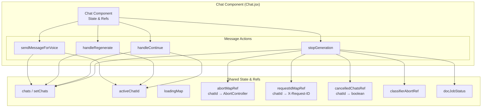
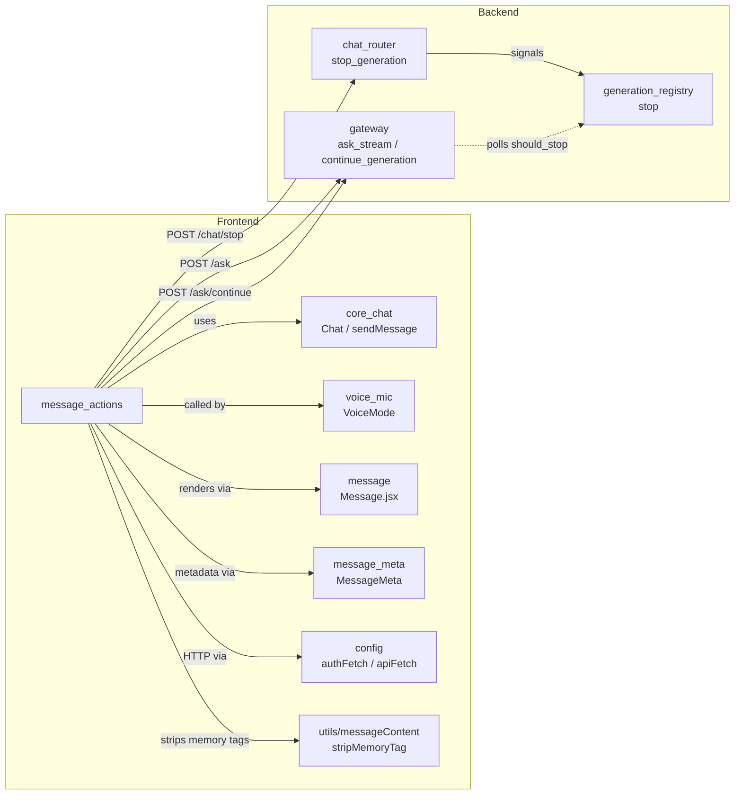
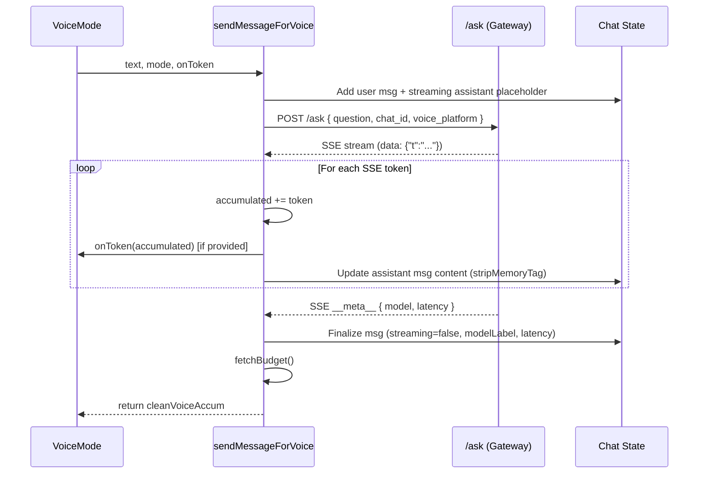
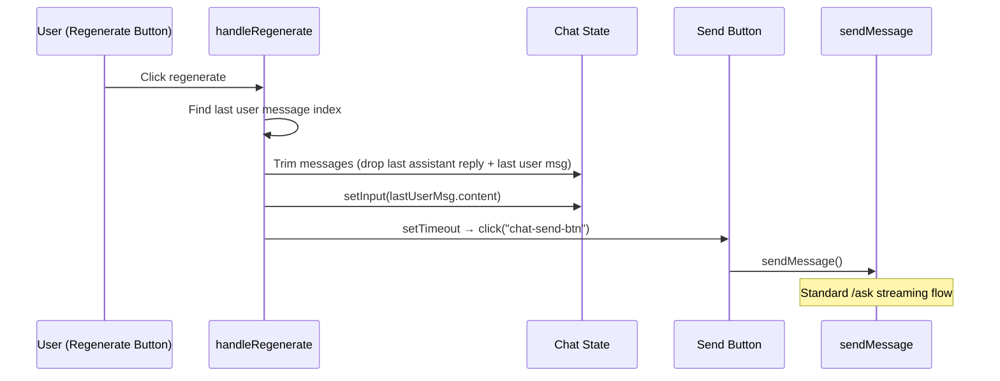
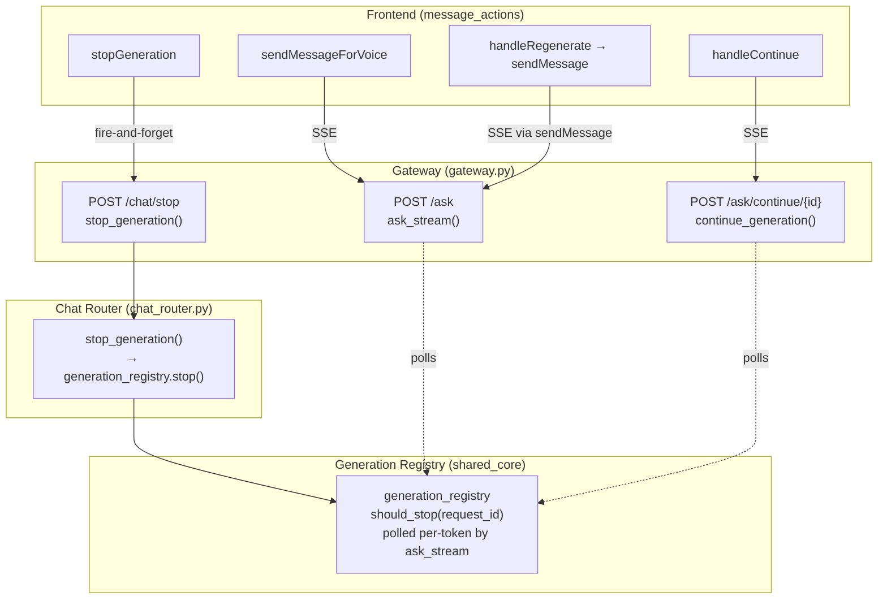
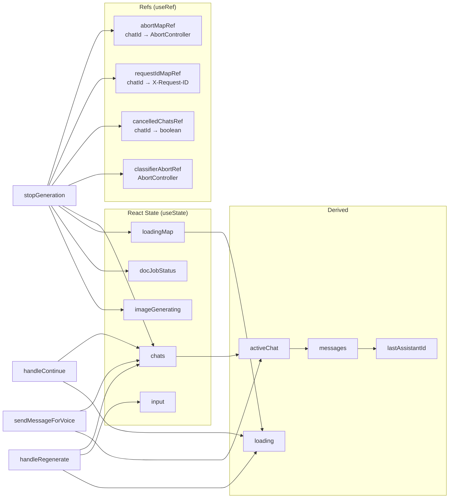
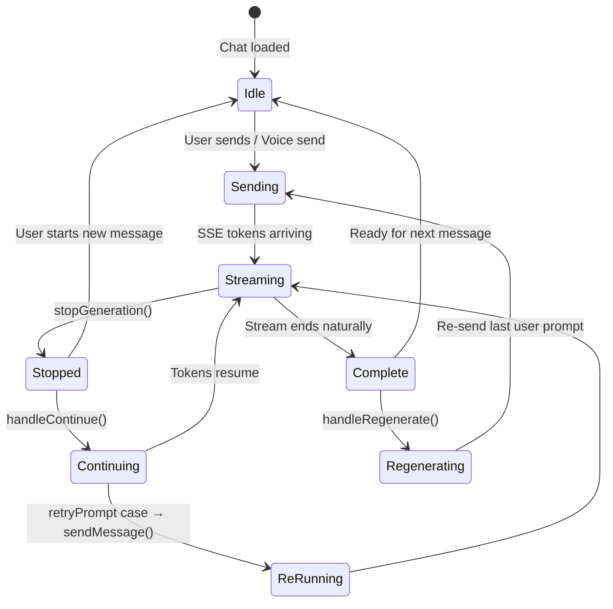

# Message Actions Module

## Introduction

The **message_actions** module encompasses the four primary user-initiated message lifecycle actions within the AI-UI chat interface: **sending a voice message**, **regenerating** the last assistant response, **continuing** a truncated or stopped response, and **stopping** an in-progress generation. All four functions are defined inside the `Chat` React component (`ai-ui/src/components/Chat.jsx`) and share its state — the chat list, active chat ID, loading flags, and per-chat abort/cancellation refs.

These actions form the interactive backbone of the chat experience, bridging the frontend UI with backend streaming endpoints via Server-Sent Events (SSE) and cooperative cancellation signals.

---

## Module Architecture



### Component Overview

| Component | Purpose | Backend Endpoint(s) | Streaming |
|---|---|---|---|
| `sendMessageForVoice` | Send a text prompt from voice mode, stream the response, and return the full answer string to the caller (VoiceMode overlay). | `POST /ask` | SSE |
| `handleRegenerate` | Drop the last assistant reply and re-send the preceding user prompt to get a fresh response. | Reuses `sendMessage()` via programmatic send-button click | SSE (via sendMessage) |
| `handleContinue` | Resume a truncated or stopped assistant message from where it left off, or re-run a cancelled pre-generation turn. | `POST /ask/continue/{messageId}` | SSE |
| `stopGeneration` | Abort the active stream for the currently visible chat — client-side fetch abort + cooperative backend stop + doc-job timeout. | `POST /chat/stop` | Non-streaming (fire-and-forget) |

---

## Dependencies



### Key Dependencies

- **[core_chat](#)** (`Chat` component, `sendMessage`): `handleRegenerate` delegates to `sendMessage()` by setting the input and programmatically clicking the send button. `sendMessageForVoice` is a standalone streaming implementation that mirrors `sendMessage`'s SSE parsing but is simpler (no doc routing, image intent, or attachment handling).
- **[voice_mic](#)** (`VoiceMode`): The `VoiceMode` overlay component calls `sendMessageForVoice` as its `onSendVoice` callback. Voice mode captures speech-to-text, sends it through this function, and plays back the response via TTS.
- **[config](#)** (`authFetch`, `API`): All HTTP calls use the authenticated fetch wrapper from `ai-ui/src/config.js`, which attaches session cookies and auth headers.
- **[message](#)** (`Message.jsx`): Renders the assistant/user message bubbles. The `cancelled`, `continuable`, and `streaming` flags set by `stopGeneration` and `handleContinue` drive the UI state (cancelled banner, Continue button, spinner).
- **Backend `gateway`** (`ask_stream`, `continue_generation`): The gateway's `/ask` and `/ask/continue/{id}` endpoints serve SSE token streams. See [chat_and_messaging](#) in the gateway module.
- **Backend `chat_router`** (`stop_generation`): The `POST /chat/stop` endpoint signals the `generation_registry` to set a stop flag, which the streaming generator polls on every token.
- **`generation_registry`** (shared_core): A server-side registry that tracks active generations by `request_id`. The `stop()` function sets a cooperative cancellation flag.

---

## Detailed Component Documentation

### 1. `sendMessageForVoice`

**Signature:**
```javascript
async function sendMessageForVoice(text, mode = "platform", onToken = null)
```

**Purpose:** Sends a text prompt (typically transcribed from speech) to the backend `/ask` endpoint, streams the SSE response token-by-token, updates the chat state in real-time, and returns the complete answer string to the caller.

**Parameters:**
| Parameter | Type | Default | Description |
|---|---|---|---|
| `text` | `string` | — | The prompt to send |
| `mode` | `"platform" \| "generic"` | `"platform"` | `"platform"` enables RAG (docs_kb:platform); `"generic"` disables RAG for pure model response |
| `onToken` | `function \| null` | `null` | Callback invoked with the accumulated text on each token — used by VoiceMode for live TTS playback |

**Returns:** `Promise<string>` — the full cleaned answer text (memory tags stripped).

**Data Flow:**



**Key Behaviors:**
- Creates a user message and an empty streaming assistant placeholder before the fetch.
- Uses `AbortController` for cancellation (though the controller is not stored in `abortMapRef` — voice sends are managed separately from the main `sendMessage` flow).
- Strips `<!--MEMORY:{...}-->` footers from the accumulated text on every token update and on finalization using `stripMemoryTag()`.
- Captures `__meta__` SSE events for `model` and `latency` metadata.
- On error, replaces the assistant placeholder with `Error: {message}` and re-throws.
- Calls `fetchBudget()` after completion to refresh the user's remaining budget display.

---

### 2. `handleRegenerate`

**Signature:**
```javascript
async function handleRegenerate()
```

**Purpose:** Discards the last assistant reply and re-sends the preceding user prompt to generate a fresh response. Mirrors the regenerate behavior of Claude/ChatGPT.

**Data Flow:**



**Key Behaviors:**
- Guards against concurrent execution: returns early if `loading` is true.
- Finds the last user message by scanning the message array for `role === "user"`.
- Trims the message list to remove everything after the last user message AND the last user message itself (since `sendMessage` re-adds a fresh user bubble).
- Sets the input field to the last user message content and programmatically clicks the send button after an 80ms delay.
- This approach reuses the full `sendMessage()` pipeline (doc routing, image intent, attachments, SSE streaming, metadata capture) without duplicating logic.

**UI Trigger:** The regenerate button (⟲ icon) is rendered only on the most recent assistant reply (`msg.id === lastAssistantId && !loading`).

---

### 3. `handleContinue`

**Signature:**
```javascript
async function handleContinue(messageId)
```

**Purpose:** Resumes a truncated or stopped assistant response. Has two distinct code paths depending on whether the message was cancelled before or after generation began.

**Parameters:**
| Parameter | Type | Description |
|---|---|---|
| `messageId` | `string` | The ID of the assistant message to continue |

**Decision Flow:**

```mermaid
flowchart TD
    Start[handleContinue messageId] --> CheckLoading{loading?}
    CheckLoading -->|Yes| Return[Return early]
    CheckLoading -->|No| CheckRetry{msg.retryPrompt exists?}
    
    CheckRetry -->|Yes| ReRunCase[Re-run Case<br/>Cancelled during classification]
    ReRunCase --> FindIdx[Find message index]
    FindIdx --> CutMsgs[Cut messages at user bubble before target]
    CutMsgs --> SetInput[setInput retryPrompt]
    SetInput --> ClickSend[Click send button → sendMessage]
    
    CheckRetry -->|No| ContinueCase[Continue Case<br/>Stopped mid-generation]
    ContinueCase --> FetchContinue[POST /ask/continue/messageId<br/>{ chat_id, rag_mode }]
    FetchContinue --> CheckResp{Response OK?}
    CheckResp -->|No| Return
    CheckResp -->|Yes| StreamSSE[Read SSE stream]
    
    StreamSSE --> Loop{More events?}
    Loop -->|Yes| ParseEvt[Parse SSE event]
    ParseEvt --> IsToken{obj.t?}
    IsToken -->|Yes| AppendTok[Append token to msg.content<br/>Clear cancelled flag]
    IsToken -->|No| IsMeta{obj.__meta__?}
    IsMeta -->|Yes| ClearCont[Set continuable=false]
    IsMeta -->|No| Loop
    AppendTok --> Loop
    ClearCont --> Loop
    Loop -->|No| Done[Stream complete]
```

**Two Code Paths:**

#### Path A: Re-run Case (`retryPrompt` exists)
When a turn was cancelled **during classification or doc-submit** (before any answer was generated or persisted server-side), the `/ask/continue` endpoint has nothing to resume. Instead:
1. Find the cancelled assistant placeholder and its preceding user bubble.
2. Cut the message list before the user bubble.
3. Set the input to the original prompt (stored in `msg.retryPrompt`).
4. Programmatically click the send button to re-run from scratch via `sendMessage()`.

#### Path B: Continue Case (normal resume)
When a turn was stopped **mid-generation** (tokens were already streamed and the message exists server-side):
1. Call `POST /ask/continue/{messageId}` with `chat_id` and `rag_mode`.
2. Read the SSE response stream.
3. For each `{"t": "..."}` token event: append to the existing message content and clear the `cancelled` flag (replacing the "stopped generating" banner with the continued answer).
4. For each `{"__meta__": {...}}` event: set `continuable = false` (hides the Continue button once the backend signals completion).
5. Errors are silently swallowed to keep the UI usable.

**UI Trigger:** The Continue button renders when `msg.cancelled === true` (set by `stopGeneration`).

---

### 4. `stopGeneration`

**Signature:**
```javascript
function stopGeneration()
```

**Purpose:** Aborts the active streaming generation for the currently visible chat. This is a synchronous, multi-layered cancellation mechanism that ensures both the client and backend stop promptly.

**Cancellation Layers:**

```mermaid
flowchart TD
    Start[stopGeneration] --> GetCID[cid = activeChatId]
    
    GetCID --> L0[Layer 0: Cancellation Flag]
    L0 --> SetCancel[cancelledChatsRef.current cid = true<br/>sendMessage checks this after every await]
    
    SetCancel --> L1[Layer 1: Abort SSE Fetch]
    L1 --> AbortFetch[abortMapRef.current cid.abort]
    L1 --> DeleteAbort[delete abortMapRef.current cid]
    
    DeleteAbort --> L1b[Layer 1b: Abort Classifier]
    L1b --> AbortClassifier[classifierAbortRef.current.abort<br/>Stops the pre-stream intent classification fetch]
    
    AbortClassifier --> L2[Layer 2: Cooperative Backend Stop]
    L2 --> CheckReqId{requestIdMapRef has cid?}
    CheckReqId -->|Yes| PostStop[POST /chat/stop<br/>{ request_id: rid }<br/>Fire-and-forget]
    CheckReqId -->|No| SkipStop[Skip]
    PostStop --> DeleteReqId[delete requestIdMapRef.current cid]
    
    DeleteReqId --> L3[Layer 3: UI State Update]
    SkipStop --> L3
    L3 --> SetLoading[setLoading false, cid]
    L3 --> SetImgGen[setImageGenerating false]
    
    L3 --> L4[Layer 4: Doc Job Timeout]
    L4 --> CheckDocJobs{Active doc jobs for this chat?}
    CheckDocJobs -->|Yes| TimeoutJobs[Set status = timeout<br/>for matching jobs only]
    CheckDocJobs -->|No| SkipDoc[Leave other chats' jobs untouched]
    
    TimeoutJobs --> L5[Layer 5: Message State]
    SkipDoc --> L5
    L5 --> UpdateMsgs[For all streaming messages in cid:<br/>streaming=false, cancelled=true<br/>Clear docStage/imageStage/spinnerStage]
```

**Detailed Layer Breakdown:**

| Layer | Mechanism | Purpose |
|---|---|---|
| **0 — Cancellation Flag** | `cancelledChatsRef.current[cid] = true` | Prevents `sendMessage()` from firing the second API call (response generation) after the first call (classifier) settles. Checked after every `await` in `sendMessage`. |
| **1 — SSE Fetch Abort** | `abortMapRef.current[cid]?.abort()` | Immediately stops the browser-side SSE reader so tokens stop arriving. |
| **1b — Classifier Abort** | `classifierAbortRef.current?.abort()` | Aborts the in-flight intent classifier fetch that runs *before* the SSE stream exists. Without this, an early Stop leaves the classifier running and it resolves into the second call. |
| **2 — Cooperative Backend Stop** | `POST /chat/stop { request_id }` | Tells the backend to stop the generator cooperatively so it doesn't keep burning tokens after the client disconnects. Fire-and-forget (not awaited) for instant UI feedback. |
| **3 — Loading State** | `setLoading(false, cid)`, `setImageGenerating(false)` | Unlocks the composer and model selector immediately. |
| **4 — Doc Job Timeout** | `setDocJobStatus(...)` | Marks in-progress doc jobs **for this chat only** as `"timeout"` (terminal state) so the composer unlocks. Jobs in other chats are left untouched so background generation continues. |
| **5 — Message State** | `setChats(...)` | For all streaming messages in the stopped chat: sets `streaming=false`, `cancelled=true`, and clears `docStage`, `docFormat`, `imageStage`, `spinnerStage` so the "Understanding" spinner is replaced by the cancelled banner immediately. |

**Critical Design Decisions:**
- **Chat-scoped**: Only stops the stream belonging to the *currently visible* chat. Other chats' background streams (doc generation, PPT) continue uninterrupted.
- **Functional state update**: Uses `setChats(prev => ...)` keyed by `cid` (not `activeChatId` or the stale `messages` closure) to prevent race conditions with the cancellation gate in `sendMessage()`.
- **No Stop for image generation**: The send/stop button reverts to a disabled Send icon when `imageGenerating` is true, because image generation is a single round-trip (no cooperative cancel).

**UI Trigger:** The send/stop button toggles between `sendMessage` and `stopGeneration` based on `loading && !imageGenerating`.

---

## Interaction with Backend Endpoints



### Endpoint Summary

| Endpoint | Method | Called By | Response Type | Purpose |
|---|---|---|---|---|
| `/ask` | POST | `sendMessageForVoice`, `sendMessage` (via regenerate) | SSE stream | Stream LLM response tokens |
| `/ask/continue/{messageId}` | POST | `handleContinue` | SSE stream | Resume a stopped/truncated generation |
| `/chat/stop` | POST | `stopGeneration` | JSON `{ ok, stopped, request_id }` | Cooperatively signal backend to stop generation |

---

## State Management

The message actions interact with a complex web of React state and refs:



### Ref Lifecycle

| Ref | Set By | Cleared By | Purpose |
|---|---|---|---|
| `abortMapRef[cid]` | `sendMessage()` (at fetch start) | `stopGeneration()` (on abort) or `sendMessage()` finally block | Abort the SSE fetch reader |
| `requestIdMapRef[cid]` | `sendMessage()` (from `X-Request-ID` header) | `stopGeneration()` (after POST /chat/stop) or `sendMessage()` finally block | Pass request_id to backend stop endpoint |
| `cancelledChatsRef[cid]` | `stopGeneration()` (set `true`) | `sendMessage()` / `handleImageGenerate()` (set `false` at turn start) | Gate to prevent second API call after classifier abort |
| `classifierAbortRef` | `classifyIntent()` (new AbortController) | `stopGeneration()` (abort + null) or `classifyIntent()` (on completion) | Abort the pre-stream intent classification fetch |

---

## Process Flow: Complete Message Lifecycle

The following diagram shows how the four message actions fit into the complete message lifecycle:



---

## Relationship to Sibling Modules

The `message_actions` module is one of several sub-modules within the `chat` parent module. See the [chat](#) module documentation for the full component overview.

| Sibling Module | Relationship |
|---|---|
| **core_chat** | `handleRegenerate` delegates to `sendMessage()` from core_chat. `sendMessageForVoice` is a parallel implementation that mirrors core_chat's SSE parsing. |
| **voice_mic** | `VoiceMode` component calls `sendMessageForVoice` as its `onSendVoice` callback. |
| **file_image_handling** | `stopGeneration` cancels in-progress doc jobs tracked by the file handling module. |
| **enhancement_features** | Independent — prompt enhancement runs before send, not during message actions. |
| **feedback** | Independent — feedback is submitted after a message completes, not during message actions. |
| **chat_settings** | `handleContinue` reads `ragMode` (derived from chat settings) to pass to the continue endpoint. |

---

## Error Handling

| Component | Error Strategy |
|---|---|
| `sendMessageForVoice` | Catches errors, replaces assistant placeholder with `Error: {message}`, sets `streaming=false`, and **re-throws** so the caller (VoiceMode) can handle it. |
| `handleRegenerate` | No explicit error handling — delegates entirely to `sendMessage()`, which has its own error card rendering. |
| `handleContinue` | Silently swallows errors (`catch (_e) { /* swallow */ }`) to keep the UI usable. The message retains its pre-continue state. |
| `stopGeneration` | Fire-and-forget for the backend stop call (`catch(() => {})`). All state updates are synchronous and cannot fail. |

---

## Security Considerations

- All HTTP calls use `authFetch` from [config](#), which attaches authentication cookies/headers automatically.
- The `request_id` passed to `/chat/stop` is server-assigned (from the `X-Request-ID` response header) and scoped to the authenticated user's session — a user cannot stop another user's generation.
- `sendMessageForVoice` does not handle file attachments or image uploads, reducing the attack surface compared to the main `sendMessage()` flow.
- Memory tags (`<!--MEMORY:{...}-->`) are stripped from displayed content via `stripMemoryTag()` to prevent memory metadata from leaking into the UI.
