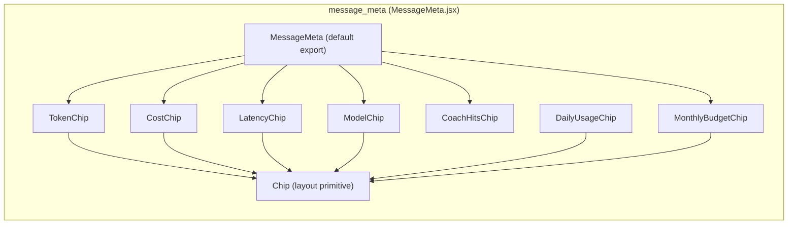
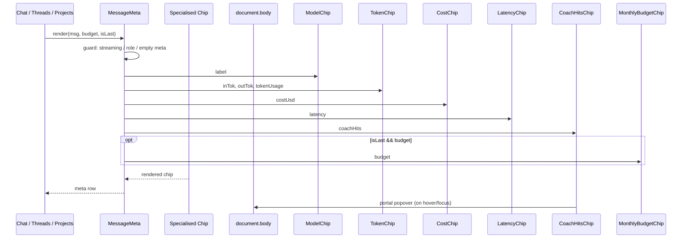
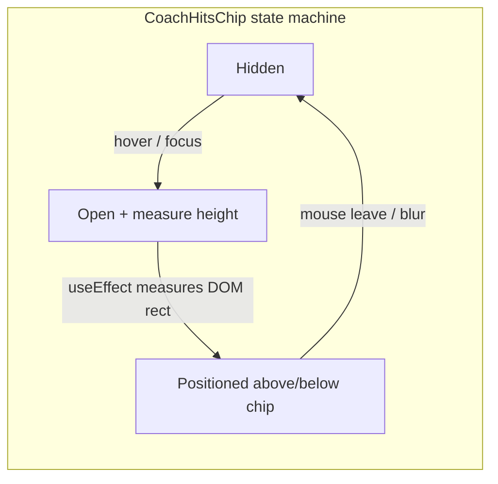
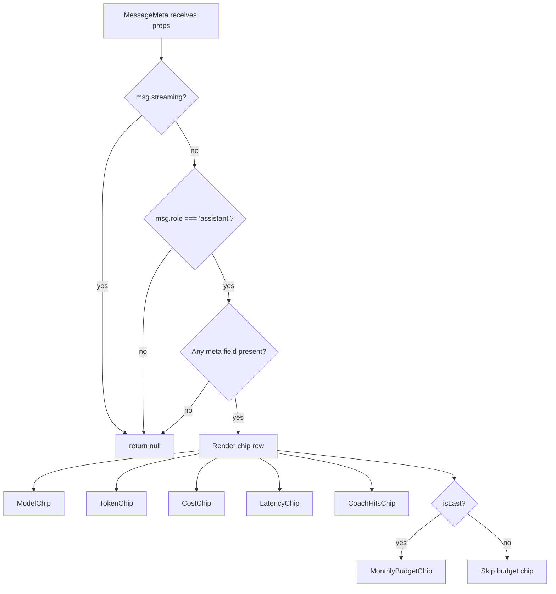
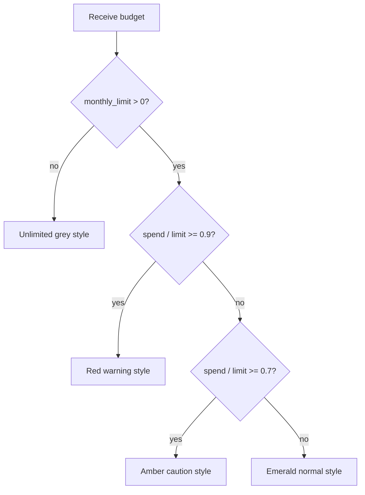

# message_meta

## Brief Introduction

`message_meta` is a React component module in the `ai-ui` frontend that renders a standardised row of per-message metadata chips. It is displayed beneath assistant messages in chat-style interfaces and surfaces operational details such as the model used, token consumption, estimated cost, latency, monthly budget burn, and any coaching rule hits raised by the platform's quality coach.

The module is intentionally presentational: it receives a message record and an optional budget object, then decides which chips are relevant and how they should be styled. It is consumed by higher-level chat modules including [`chat`](chat.md), [`threads`](threads.md), and [`projects`](../products/projects.md).

---

## Comprehensive Documentation

### 1. Purpose and Core Functionality

`MessageMeta` answers the question: *"What happened during the generation of this assistant message?"* It gives end users transparency into:

- **Model identity** — which model produced the response, including a special "Cached" state.
- **Token usage** — input/output split or a single aggregate value.
- **Cost** — estimated USD cost for the message.
- **Latency** — wall-clock time for the response.
- **Budget context** — user's monthly spend versus limit, rendered only on the last assistant message to avoid visual noise.
- **Coach feedback** — rule hits from the AI coach, surfaced via an interactive popover.

The component is conservative about when it renders: it returns `null` when the message is still streaming, when the message is not from the assistant role, or when no metadata fields are present.

### 2. Architecture

The module follows a **compound-chip pattern**: a thin `Chip` shell provides consistent layout and border styling, while specialised chip components (`ModelChip`, `TokenChip`, `CostChip`, `LatencyChip`, `DailyUsageChip`, `MonthlyBudgetChip`, `CoachHitsChip`) each own their own rendering logic, null-guarding, and colour semantics.

### 3. Component Relationships

| Component | Responsibility | Reused By |
|-----------|---------------|-----------|
| `MessageMeta` | Orchestrates chip visibility and renders the meta row. | [`chat`](chat.md), [`threads`](threads.md), [`projects`](../products/projects.md) |
| `Chip` | Shared visual primitive: rounded pill with icon + text. | All chip variants |
| `ModelChip` | Renders model label or "Cached" badge. | `MessageMeta` |
| `TokenChip` | Renders input/output tokens or aggregate token usage. | `MessageMeta` |
| `CostChip` | Renders per-message cost, suppressing zero values. | `MessageMeta` |
| `LatencyChip` | Renders response latency in seconds. | `MessageMeta` |
| `DailyUsageChip` | Renders daily token/request usage (currently unused in main flow). | `MessageMeta` |
| `MonthlyBudgetChip` | Renders monthly budget progress with colour-coded thresholds. | `MessageMeta` |
| `CoachHitsChip` | Interactive chip + portal popover for AI coach rule hits. | `MessageMeta` |

### 4. Data Flow

The parent chat component passes two props:

- `msg` — the message record, which may contain `modelLabel`, `inTok`, `outTok`, `tokenUsage`, `costUsd`, `latency`, `tokensToday`, `maxTokensToday`, `requestsToday`, `maxRequestsToday`, and `coachHits`.
- `budget` — the `/budget/me` response, containing `monthly_spend`, `monthly_limit`, and `monthly_remaining`.
- `isLast` — boolean indicating whether this is the last assistant message; controls whether the monthly budget chip is shown.

### 5. Component Interaction

`MessageMeta` does not manage server state or perform API calls. Its only stateful child is `CoachHitsChip`, which tracks:

- `open` — whether the popover is visible.
- `pos` — measured screen coordinates for the portal.
- `closeTimerRef` — a delayed close timer to allow mouse travel from chip to popover.

The popover is rendered via `createPortal` directly on `document.body` to avoid clipping by `overflow-hidden` ancestors. After opening, an effect measures the popover height and flips it above or below the chip to keep it in the viewport.

### 6. Process Flows

#### 6.1 Rendering decision flow

#### 6.2 Monthly budget colour logic

### 7. Key Design Decisions

- **Null-guarding per chip**: each chip decides independently whether it has enough data to render, keeping `MessageMeta` free of field-specific conditionals.
- **Budget chip gated by `isLast`**: monthly budget context is shown once per assistant turn, on the final message, to reduce repetitive UI noise.
- **Portal-based coach popover**: avoids `overflow-hidden` clipping and supports viewport-aware positioning.
- **No daily usage in main flow**: `DailyUsageChip` is implemented but intentionally commented out in `MessageMeta`; daily token/request counts are surfaced in the analytics dashboard instead.

### 8. Dependencies

| Dependency | Usage |
|------------|-------|
| `react` (`useEffect`, `useRef`, `useState`, `createPortal`) | State, effects, and portal rendering for `CoachHitsChip`. |
| `lucide-react` (`Cpu`, `Clock`, `DollarSign`, `BarChart2`, `Zap`, `Wallet`, `TrendingDown`, `Target`) | Icons for each chip variant. |
| [`chat`](chat.md), [`threads`](threads.md), [`projects`](../products/projects.md) | Parent modules that import and render `MessageMeta`. |

### 9. Integration with the Wider System

`message_meta` sits at the **presentation layer** of the `ai-ui` chat experience. It relies on upstream modules to populate the `msg` and `budget` objects:

- [`chat`](chat.md) and [`threads`](threads.md) provide message records produced by the gateway's chat endpoints.
- [`budget`](../llm/budget.md) (via the `/budget/me` API) supplies monthly spend and limit data.
- The AI coach system, surfaced through [`coach`](../coach/coach.md), populates `msg.coachHits` when a message triggers quality rules.

Because the component is purely presentational, it can be reused across any chat-like surface without knowledge of how the data is fetched or stored.

### 10. References

- [`chat`](chat.md) — primary consumer of `MessageMeta` for one-on-one chat.
- [`threads`](threads.md) — uses `MessageMeta` inside threaded discussions.
- [`projects`](../products/projects.md) — uses `MessageMeta` inside project-based chat.
- [`budget`](../llm/budget.md) — provides the monthly budget data consumed by `MonthlyBudgetChip`.
- [`coach`](../coach/coach.md) — produces the rule hits consumed by `CoachHitsChip`.
