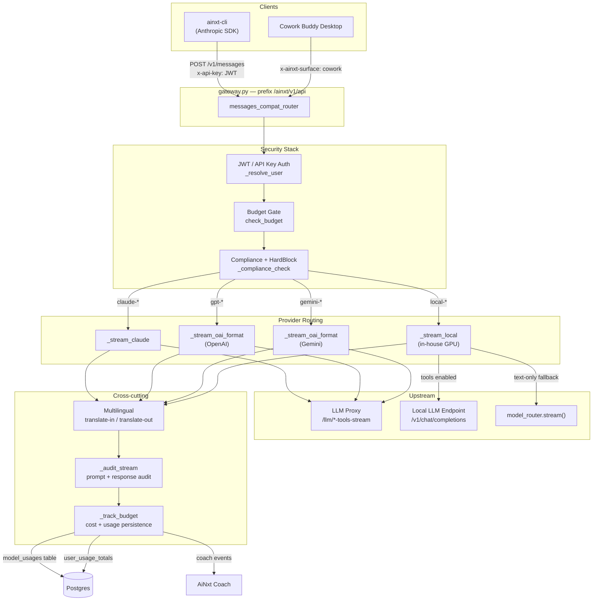
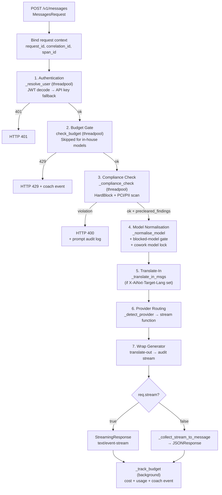
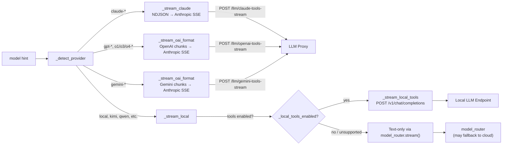
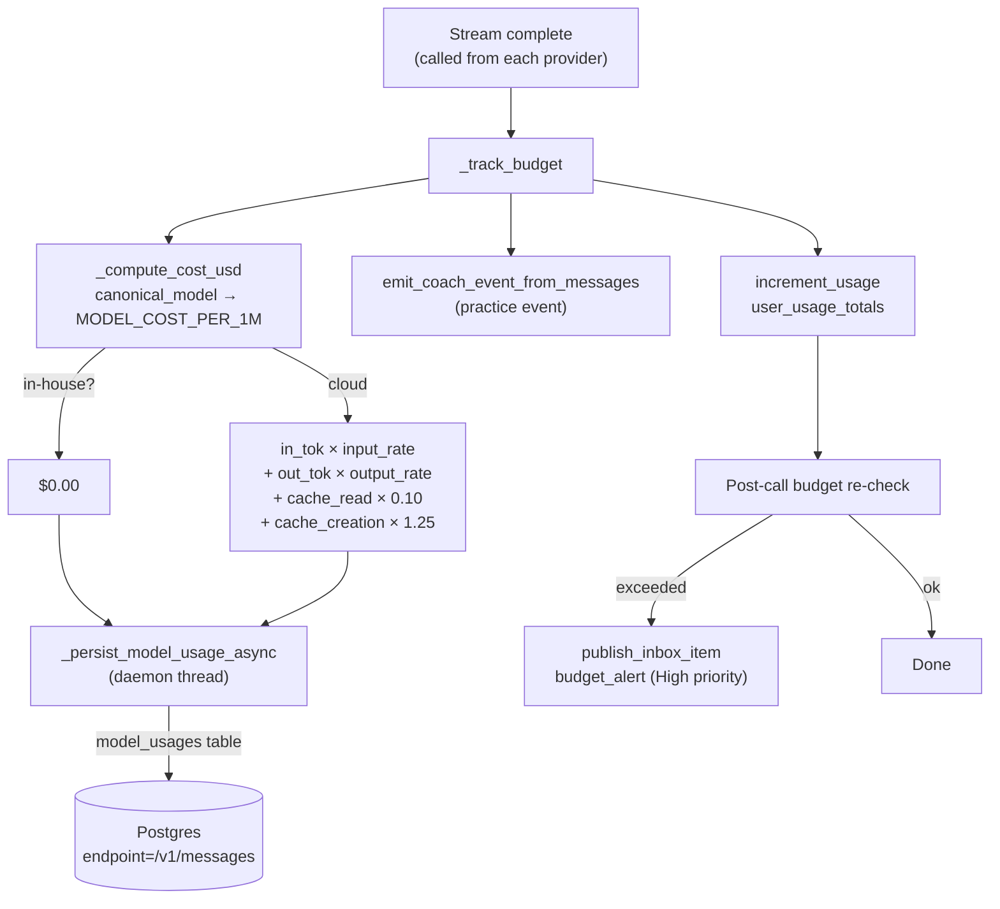
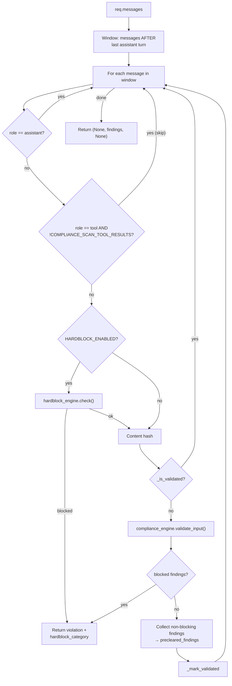
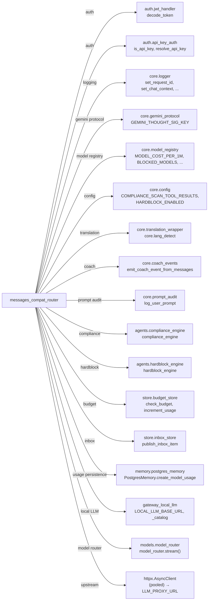
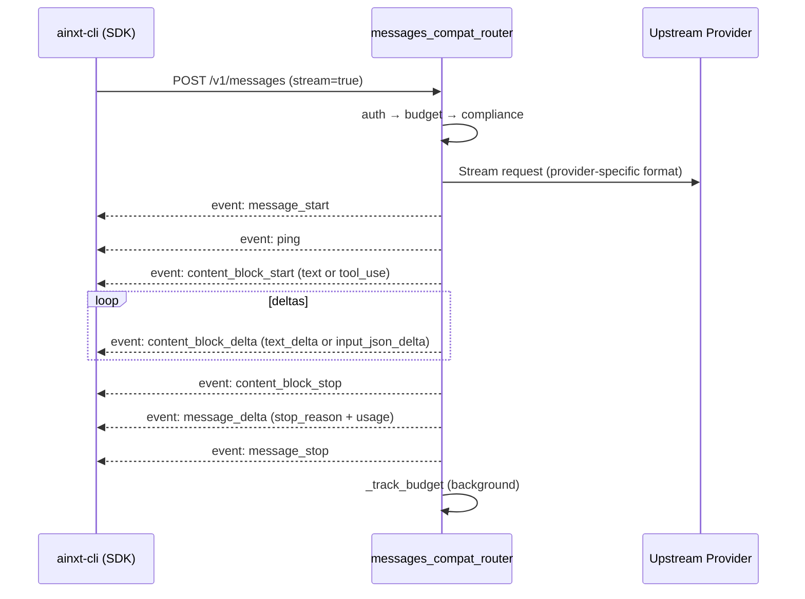

# Messages Compat Router

## Overview

The **Messages Compat Router** (`routers/messages_compat_router.py`) is an Anthropic Messages API compatibility layer that lets the `ainxt-cli` (and the Cowork "Buddy" desktop) point the Anthropic SDK at the NPCI gateway instead of `api.anthropic.com`. Every SDK call is transparently routed through the platform's full security stack — JWT authentication, budget enforcement, PCI/PII compliance, and multi-model routing — while the CLI agent loop sees a single, uniform Anthropic SSE protocol regardless of which LLM provider actually served the request.

The router is registered in `gateway.py` under the prefix `/ainxt/v1/api`, so the CLI sets `baseURL=http://localhost:8000/ainxt/v1/api` and all SDK traffic flows through this module.

### Key Capabilities

| Capability | Description |
|---|---|
| **Multi-provider routing** | Routes to Claude, OpenAI, Gemini, or in-house GPU models based on the model hint, normalising all responses to Anthropic SSE format. |
| **Compliance gate** | Scans every outgoing message for PCI/PII/secrets via the [shared_core](../core/shared_core.md) compliance engine and hardblock engine before any byte reaches a provider. |
| **Budget enforcement** | Pre-call budget gate (cloud models only) and post-call cost recording with Claude prompt-cache token billing. |
| **Multilingual** | Translate-in (user prose → English before the model) and translate-out (English response → user language) via the translation wrapper. |
| **Audit logging** | Prompt and response audit lines flow to Loki/Grafana; blocked prompts are written to `user_prompts.log`. |
| **Non-streaming support** | SDK `.create()` calls are internally consumed and assembled into a complete Anthropic JSON message. |
| **Token counting** | Fast `count_tokens` estimate for SDK context management. |
| **Model listing** | `/v1/models` returns all available models (Claude, OpenAI, Gemini, in-house) for the CLI `/model` command. |

---

## Architecture



---

## Request Processing Pipeline

The `messages_endpoint` handler orchestrates a strict sequential pipeline. Each phase is timed and logged in a single INFO line at stream completion, enabling latency diagnosis (auth vs. budget vs. compliance vs. TTFB vs. stream).



### Phase Details

#### 1. Authentication (`_resolve_user`)
- Accepts JWT via `x-api-key` (Anthropic SDK convention) or `Authorization: Bearer`.
- Falls back to platform API key resolution for IDE integrations.
- Offloaded to a threadpool because `decode_token` does blocking Redis (revocation + session check).

#### 2. Budget Gate
- Calls `check_budget(user_id)` from the [shared_core](../core/shared_core.md) budget store.
- **In-house models are exempt** — they run on NPCI hardware at $0 cost, so the gate and billing stay consistent.
- Blocked requests emit a coach event (`model="budget_blocked"`) before raising HTTP 429.

#### 3. Compliance Check (`_compliance_check`)
- Two-layer scan: **HardBlock engine** (deterministic AI-safety policy blocks) → **Compliance engine** (PCI/PII/secret detection via privacy-svc).
- **Scope optimisation**: only scans messages *after* the last assistant turn, avoiding O(N²) re-scans on long agent sessions (reduced 107s → tens of ms on 169-message sessions).
- **Hash cache**: LRU `OrderedDict` (max 10,000 entries) de-duplicates repeated message bodies within a process.
- Returns `(violation, precleared_findings, hardblock_category)` — findings flow downstream so the local fallback path can redact without re-validating.
- Blocked prompts are written to `user_prompts.log` via `core.prompt_audit`.

#### 4. Model Normalisation (`_normalise_model`)
- Maps CLI hints (e.g. `"sonnet"`, `"opus"`, `"gpt"`, `"gemini"`) to canonical model IDs from `core.model_registry`.
- In-house models pass through unchanged so the local backend receives the exact ID the user selected.
- Blocked models (e.g. Opus when `ENABLE_OPUS=false`) are rejected with HTTP 400 before routing.
- **Cowork model lock**: when `x-ainxt-surface: cowork` is present and `COWORK_MODEL_LOCKED=true`, the model is server-side overridden to `COWORK_FORCED_MODEL` — a UI-only lock is bypassable, so this enforces the policy at the gateway.

#### 5–6. Multilingual + Provider Routing
- If `X-AiNxt-Target-Lang` is set, user prose is translated to English before the model reasons (code/paths/tool blocks are never translated).
- Provider is detected from the normalised model hint and routed to the appropriate streaming function.

#### 7. Generator Wrapping
The base provider generator is wrapped in order:
1. **`_translate_out_stream`** — buffers text blocks, translates the full English text to the target language at `content_block_stop`, emits as a single delta.
2. **`_audit_stream`** — transparent pass-through that accumulates text fragments and fires `_log_response_audit()` at `message_stop`.

---

## Provider Routing

All four providers return **Anthropic SSE format** so the CLI agent loop works identically regardless of model selection.



### Provider Stream Functions

| Function | Provider | Upstream | Format Conversion |
|---|---|---|---|
| `_stream_claude` | Claude | LLM Proxy `/llm/claude-tools-stream` | Proxy NDJSON (`tbs`/`tad`/`txt`/`stop`) → Anthropic SSE |
| `_stream_oai_format` | OpenAI / Gemini | LLM Proxy `/llm/openai-tools-stream` or `/llm/gemini-tools-stream` | OpenAI chunks → Anthropic SSE via `_oai_chunks_to_anthropic_sse` |
| `_stream_local_tools` | In-house (tool-calling) | Local LLM `/v1/chat/completions` | OpenAI chunks → Anthropic SSE (shared converter) |
| `_stream_local` | In-house (text-only) | `model_router.stream()` | Text tokens → Anthropic text-only SSE |

### Shared OAI → Anthropic SSE Converter (`_oai_chunks_to_anthropic_sse`)
Consumes an async iterator of lines (either bare-JSON NDJSON from the proxy or `data: {...}` / `[DONE]` SSE from a raw OpenAI endpoint) and yields Anthropic-protocol SSE. Handles:
- Text deltas → `content_block_start` (text) + `content_block_delta` (text_delta)
- Tool call deltas → `content_block_start` (tool_use) + `content_block_delta` (input_json_delta)
- Non-standard tool call ID normalisation (e.g. Kimi's `functions.<name>:<idx>` → `toolu_<hex>`)
- Gemini `thought_signature` round-tripping via `GEMINI_THOUGHT_SIG_KEY`
- Usage extraction from the final `include_usage` chunk
- Block index management to prevent text/tool block index collisions

### Connection Pooling
A single pooled `httpx.AsyncClient` (`_get_proxy_client()`) is reused across all requests, eliminating per-iteration TLS handshakes to the LLM proxy. Key settings:
- `read=600s` (slow Opus generations), `connect=30s`, `pool=10s` (fail-fast on saturation)
- `max_keepalive_connections=40`, `max_connections=100`
- `keepalive_expiry=30s` — shorter than the proxy's idle-close window to prevent stale-socket reuse

### Stale-Socket Retry
Both `_stream_claude` and `_stream_oai_format` implement a single retry if the proxy drops the connection *before* any response byte is seen (`httpx.RemoteProtocolError` / `ConnectError`). This is safe because no client-visible content has been emitted yet. Once streaming starts, errors are surfaced as Anthropic error events with no retry.

---

## Component Reference

### Data Models

#### `Message`
```python
class Message(BaseModel):
    role: str
    content: Any  # str | list[dict]
```

#### `MessagesRequest`
```python
class MessagesRequest(BaseModel):
    model: str = "claude-sonnet-4-6"
    messages: list[Message]
    system: Optional[Any] = None
    tools: Optional[list[dict]] = None
    max_tokens: int = Field(default=8192, ge=1, le=131072)
    stream: bool = False
    temperature: Optional[float] = None
    top_p: Optional[float] = None
    stop_sequences: Optional[list[str]] = None
    metadata: Optional[dict] = None
```

### Endpoints

| Method | Path | Handler | Description |
|---|---|---|---|
| POST | `/v1/messages`, `/messages` | `messages_endpoint` | Main Anthropic Messages API endpoint. Streaming (`stream=true`) returns `StreamingResponse`; non-streaming internally collects and returns `JSONResponse`. |
| POST | `/messages/count_tokens` | `count_tokens_compat` | Fast `chars/4` token estimate for SDK context management. |
| GET | `/v1/models`, `/models` | `list_models_compat` | Returns all available models (Claude, OpenAI, Gemini, in-house) with provider, label, and tag metadata. |

### Internal Functions

| Function | Purpose |
|---|---|
| `_resolve_user` | JWT / API key authentication from request headers. |
| `_detect_provider` | Maps model hint → `"claude"` / `"openai"` / `"gemini"` / `"local"`. In-house check runs before `gpt-*` to catch models like `gpt-oss-120b`. |
| `_normalise_model` | Maps CLI aliases to canonical model IDs from `core.model_registry`. |
| `_system_text` | Prepends the AiNxt identity lock to the system prompt (prevents model identity leakage). |
| `_serial_msgs` | Serialises `Message` objects to plain dicts for upstream payloads. |
| `_anthropic_tools_to_oai` | Converts Anthropic tool schema (`input_schema`) → OpenAI function calling format. |
| `_anthropic_msgs_to_oai` | Converts Anthropic messages (with `tool_use` / `tool_result`) → OpenAI format. |
| `_sse` / `_sse_message_start` | SSE event formatting helpers. |
| `_stream_claude` | Claude provider stream: proxy NDJSON → Anthropic SSE. |
| `_oai_chunks_to_anthropic_sse` | Shared OAI-format chunk → Anthropic SSE converter. |
| `_stream_oai_format` | OpenAI / Gemini provider stream via LLM proxy. |
| `_stream_local_tools` | In-house tool-calling stream (OpenAI-compatible endpoint). Raises `_LocalToolsUnsupported` to trigger text-only fallback. |
| `_stream_local` | In-house text-only stream via `model_router.stream()`. |
| `_is_in_house_model` / `_is_local_catalog_model` | Determines if a model is hosted on NPCI GPU (free, no billing). |
| `_compute_cost_usd` | Calculates USD cost from `MODEL_COST_PER_1M` rates, including Claude cache token billing. |
| `_persist_model_usage_async` | Fire-and-forget daemon-thread write to `model_usages` table. |
| `_track_budget` | Post-stream: cost computation, usage persistence, coach event emission, post-call budget re-check with inbox alert. |
| `_compliance_check` | HardBlock + compliance engine scan with scope-windowing and hash caching. |
| `_translate_in_msgs` | Translates user prose → English (detection-driven, code untouched). |
| `_translate_out_stream` | Wraps SSE generator to translate English response blocks → target language. |
| `_audit_stream` | Transparent SSE pass-through that logs the response at `message_stop`. |
| `_collect_stream_to_message` | Consumes SSE generator → assembled Anthropic JSON message (non-streaming path). |
| `_log_phase_timings` | Single INFO line per request: auth → budget → compliance → TTFB → stream → total. |

---

## Budget Tracking & Cost Accounting



### Claude Prompt-Cache Billing
Anthropic's `input_tokens` excludes cache tokens entirely — they are separate, non-overlapping buckets. The router bills them at Anthropic's documented rates:
- **Cache read**: 10% of input rate (`_CLAUDE_CACHE_READ_RATIO = 0.10`)
- **Cache creation**: 125% of input rate (`_CLAUDE_CACHE_WRITE_RATIO = 1.25`)

Controlled by `TRACK_CACHE_TOKENS` env var (defaults to `false` for backward compatibility).

### Source Channel Tagging
- **CLI**: plain terminal / API traffic (default).
- **BUDDY**: Cowork desktop (`x-ainxt-surface: cowork` header) — reported as its own slice in utilization charts and chargeback.

---

## Compliance Check Flow



---

## Dependencies



### External Service Dependencies

| Dependency | Purpose | Module Reference |
|---|---|---|
| **LLM Proxy** (`LLM_PROXY_URL`) | Streams Claude/OpenAI/Gemini tool-calling responses | [llm_proxy](../llm/llm_proxy.md) |
| **Local LLM Endpoint** (`LOCAL_LLM_BASE_URL`) | In-house GPU models (Kimi, Qwen, GLM, Ollama) | [local_llm_gateway](../llm/local_llm_gateway.md) |
| **Privacy Service** | PCI/PII detection via `compliance_engine.validate_input()` | [privacy_service](../security/privacy_service.md) |
| **Postgres** | `model_usages` audit table + `user_usage_totals` budget aggregates | [shared_core](../core/shared_core.md) |
| **Translation Service** | Multilingual translate-in/out | [translation_service](../translation/translation_service.md) |

---

## Environment Variables

| Variable | Default | Description |
|---|---|---|
| `LLM_PROXY_URL` | — | Base URL of the LLM proxy (e.g. `http://web02:9301`). Required for cloud providers. |
| `LOCAL_LLM_BASE_URL` | — | Base URL of the in-house OpenAI-compatible endpoint. |
| `LOCAL_LLM_API_KEY` | — | API key for the local LLM endpoint. |
| `LOCAL_LLM_TOOLS` | `true` | Kill-switch for in-house tool calling. Set to `false` to force text-only. |
| `TRACK_CACHE_TOKENS` | `false` | Enable Claude prompt-cache token billing and persistence. |
| `HARDBLOCK_ENABLED` | `true` | Enable/disable the HardBlock engine. |
| `COMPLIANCE_SCAN_TOOL_RESULTS` | — | Gate whether `tool_result` messages are compliance-scanned. |
| `COWORK_MODEL_LOCKED` | `true` | Server-side model lock for Cowork Buddy traffic. |
| `COWORK_FORCED_MODEL` | `claude-sonnet-5` | Model to force for Cowork Buddy when lock is enabled. |
| `ENABLE_OPUS` | `true` | Gate for Opus model availability. |
| `ENABLE_CLI_OPUS_48` | `true` | Gate for Opus 4.8 on CLI/IDE. |
| `ENABLE_CLI_OPUS_5` | `false` | Gate for Opus 5 on CLI/IDE. |
| `ENABLE_SONNET_5` | `true` | Gate for Sonnet 5 availability. |
| `ENABLE_GPT56_TERA` | `true` | Gate for GPT-5.6 Tera variant. |
| `ENABLE_GPT56_LUNA` | `true` | Gate for GPT-5.6 Luna variant. |

---

## SSE Protocol Mapping

All providers emit the same Anthropic SSE event sequence so the CLI SDK agent loop is provider-agnostic:



### Event Types

| Event | Payload | Purpose |
|---|---|---|
| `message_start` | `message.id`, `model`, `usage` (seed) | Seeds the SDK's running usage tracker. |
| `ping` | `{type: "ping"}` | Keepalive. |
| `content_block_start` | `index`, `content_block.type` (text/tool_use) | Opens a content block. |
| `content_block_delta` | `index`, `delta.type` (text_delta/input_json_delta) | Incremental content. |
| `content_block_stop` | `index` | Closes a content block. |
| `message_delta` | `delta.stop_reason`, `usage` (authoritative) | Final stop reason + token counts. |
| `message_stop` | — | Terminal marker. |
| `error` | `error.type`, `error.message` | Mid-stream error (no retry). |

---

## Non-Streaming Path

When `stream=false`, the router internally consumes the SSE generator via `_collect_stream_to_message()` and returns a complete Anthropic JSON message. This supports SDK `.create()` calls used for title generation, summarisation, classification, and side-quests. The function parses all SSE events in order, assembles content blocks (JSON-parsing tool `input` from accumulated `partial_json` fragments), and returns a `JSONResponse` with `anthropic-version: 2023-06-01`.

---

## Related Documentation

- [shared_core](../core/shared_core.md) — Core infrastructure: logger, model registry, compliance engine, hardblock engine, budget store, model router, translation wrapper.
- [llm_proxy](../llm/llm_proxy.md) — Upstream LLM proxy serving Claude/OpenAI/Gemini tool-stream endpoints.
- [local_llm_gateway](../llm/local_llm_gateway.md) — In-house GPU model gateway and catalog.
- [privacy_service](../security/privacy_service.md) — PCI/PII detection service used by the compliance engine.
- [translation_service](../translation/translation_service.md) — Multilingual translation service for translate-in/out.
- [gateway](../core/gateway.md) — Main gateway that registers this router under `/ainxt/v1/api`.
- [budget_router](../llm/budget_router.md) — Budget management API (shares `budget_store`).
- [coach_router](../coach/coach_router.md) — AiNxt Coach dashboard (consumes coach events emitted here).
