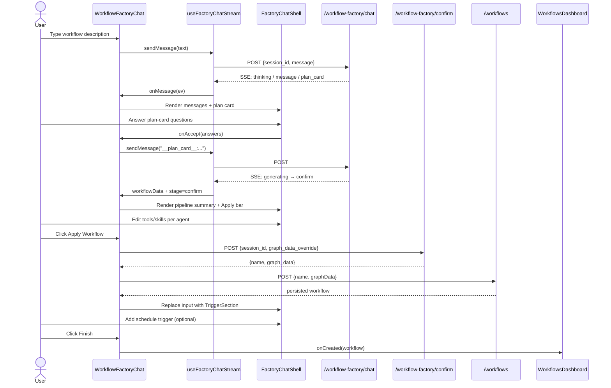
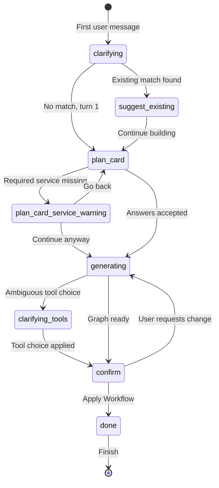

# workflows_feature_factory_chat

## Brief Introduction

The `workflows_feature_factory_chat` module provides the **Workflow Factory** — a conversational, AI-assisted interface for creating multi-agent workflows in ABStudio. It allows users to describe an automation idea in plain language and receive a fully wired workflow graph (nodes, edges, agents, tools, and skills) that can be reviewed, edited, saved, and scheduled without leaving the chat panel.

This module is the primary entry point for the **"Create with AI"** workflow builder experience. It sits between the user's natural-language intent and the backend workflow-generation pipeline, orchestrating streaming responses, interactive plan cards, existing-template recommendations, per-agent tool/skill tuning, and post-save trigger scheduling.

---

## Core Functionality

### 1. Conversational Workflow Generation

`WorkflowFactoryChat` opens as a modal overlay from the [Workflows Dashboard](../workflows/workflows_feature_dashboard.md). Users type a high-level description such as *"Every morning, summarize support tickets from Jira and email the report to the team."* The component streams the backend's progress via Server-Sent Events (SSE) and renders:

- **Thinking steps** — live progress indicators while the backend loads catalogs, designs the graph, and attaches tools/skills.
- **AI messages** — clarifying questions, plan cards, existing-match recommendations, and the final workflow summary.
- **Suggestion chips** — one-tap follow-ups surfaced by the backend.

### 2. Interactive Plan Card

On the first substantive turn, the backend emits a `plan_card` stage. The component renders a [`PlanCard`](../ui/common_components.md) with structured questions (e.g., output format, data sources, approval requirements). User answers are sent back as a control message (`__plan_card__:{json}`) and merged into generation requirements.

### 3. Existing Workflow / Template Recommendations

Before generating a new workflow, the backend checks for existing workflows or templates that already match the user's intent. If matches are found, the component displays recommendation cards with confidence scores and lets the user:

- **Open an existing workflow** directly.
- **Use a template** via the templates API.
- **Continue building** a new workflow anyway.

### 4. Per-Agent Tool & Skill Tuning

When the backend reaches the `confirm` stage, the generated workflow graph is shown in a pipeline summary. Users can expand a per-agent editor overlay to add, remove, or generate tools and skills for each agent node using [`InlinePicker`](../ui/common_components.md).

### 5. Apply & Persist

Clicking **Apply Workflow** sends the edited graph to `/workflow-factory/confirm`, then creates the workflow via `POST /workflows`. On success, the chat input is replaced with a trigger-scheduling panel ([`TriggerSection`](../reference/triggers_feature.md)) so the user can immediately schedule the new workflow.

### 6. Post-Save Trigger Scheduling

After persistence, the component surfaces the [`TriggerSection`](../reference/triggers_feature.md) inline, allowing the user to add schedule-based triggers (daily, weekly, etc.) and input messages before finishing and opening the workflow in the canvas editor.

---

## Architecture

### Component Hierarchy

```text
WorkflowsDashboard
└── WorkflowFactoryChat (modal)
    ├── FactoryChatShell      (shared chat UI: header, messages, input, overlay)
    │   ├── StepsBlock        (progress steps during generation)
    │   ├── AnswerCards       (suggestion chips)
    │   └── ReactMarkdown     (AI message rendering)
    ├── PlanCard              (structured pre-build questionnaire)
    ├── InlinePicker          (per-agent tool/skill picker)
    ├── TriggerSection        (post-save schedule configuration)
    ├── FactoryFileChips      (downloadable generated-file chips)
    └── DownloadNotice        (transient download status toast)
```

### State Management

`WorkflowFactoryChat` uses local React state for UI-specific concerns:

| State | Purpose |
|-------|---------|
| `deployedWorkflow` | The persisted workflow row returned by `POST /workflows`. |
| `workflowData` | The generated workflow blueprint received from the SSE stream. |
| `editedNodes` | User-modified node list (tools/skills normalized to `{name}` objects). |
| `isApplying` / `applyError` | Apply button loading and error states. |
| `existingMatches` | Existing workflow/template recommendations. |
| `planCard` / `serviceWarning` | Active plan card or service-warning UI. |
| `scheduled` | Whether the user has reached the post-save trigger panel. |

The chat message stream, session ID, loading state, and stage are managed by the shared hook [`useFactoryChatStream`](../reference/shared_features.md).

### Backend Integration

| Endpoint | Method | Purpose |
|----------|--------|---------|
| `/workflow-factory/chat` | `POST` | SSE chat endpoint; drives the entire conversational generation flow. |
| `/workflow-factory/confirm` | `POST` | Accepts the final edited graph and returns the assembled workflow data. |
| `/workflows` | `POST` | Persists the confirmed workflow. |
| `/templates/{id}/use` | `POST` | Clones a recommended template into a workflow. |
| `/{tools\|skills}-catalog` | `GET` | Loads available tools/skills for `InlinePicker`. |
| `/{tools\|skills}-catalog/generate` | `POST` | Generates a new catalog entry on demand. |

---

## Data Flow

### Sequence: From Prompt to Saved Workflow



### SSE Event Handling

`useFactoryChatStream` parses SSE lines and dispatches events:

- `thinking` → appends a progress step.
- `message` → finalizes the step block and adds an AI message; updates `stage` and `suggestions`.
- `error` → renders an error bubble.
- `done` → stores the `session_id` and clears loading.

`WorkflowFactoryChat`'s `onMessage` callback inspects each message event to:

- Capture `workflow` data.
- Detect `plan_card` and `plan_card_service_warning` stages.
- Detect `suggest_existing` and populate recommendation cards.

---

## Component Relationships

### Shared Factory Infrastructure

`WorkflowFactoryChat` reuses the same conversational scaffolding as the [Agent Factory](../agents/agents_feature.md) and [Skill Factory](../agents/skills_feature.md):

- [`FactoryChatShell`](../reference/shared_features.md) — modal shell, message list, input, focus trap, and animation.
- [`useFactoryChatStream`](../reference/shared_features.md) — SSE client, message/step state, plan-card protocol handling.
- [`FactoryFileChips`](../reference/shared_features.md) / [`DownloadNotice`](../reference/shared_features.md) — download UX for generated files referenced in replies.

### Common UI Components

- [`PlanCard`](../ui/common_components.md) — renders structured questionnaires and collects answers.
- [`InlinePicker`](../ui/common_components.md) — searchable dropdown for attaching catalog tools/skills; supports on-demand generation of new entries.

### Triggers Integration

- [`TriggerSection`](../reference/triggers_feature.md) is mounted after the workflow is persisted, using `targetKind="workflow"` and the new workflow's `id`.
- [`TriggerScopedCss`](../reference/triggers_feature.md) is injected to style the inline trigger panel consistently with the agent factory.

### Backend Pipeline

The backend counterpart lives in [`api_factories.md`](../api/api_factories.md) (`workflow_factory_chat` and `workflow_factory_confirm`) and [`workflow_factory_pipeline.md`](../workflows/workflow_factory_pipeline.md). The pipeline handles:

- Greeting detection and short-circuit replies.
- Existing-match lookup against workflows and templates.
- Plan-card generation with live catalog services.
- Requirements clarification.
- Workflow blueprint generation, skill/tool injection, and gap detection.
- Tool-choice clarification for ambiguous system mappings.

---

## Process Flows

### User Journey: New Workflow

```mermaid
flowchart TD
    A[User clicks "Create with AI"] --> B[WorkflowFactoryChat opens]
    B --> C[User describes automation goal]
    C --> D{Existing match?}
    D -->|Yes| E[Show recommendation cards]
    E --> F{User choice}
    F -->|Open existing| G[Clone/use template or workflow]
    F -->|Continue building| H[Show Plan Card]
    D -->|No| H
    H --> I[User answers structured questions]
    I --> J{Required services valid?}
    J -->|No| K[Show service warning]
    K --> L[User acknowledges or goes back]
    L --> H
    J -->|Yes| M[Generate workflow graph]
    M --> N[Render pipeline summary]
    N --> O[User edits per-agent tools/skills]
    O --> P[Click Apply Workflow]
    P --> Q[Confirm + create workflow]
    Q --> R[Show trigger scheduler]
    R --> S[User adds triggers or finishes]
    S --> T[Open workflow in canvas editor]
```

### Stage State Machine

The backend drives the chat through a sequence of stages that the frontend renders differently:



---

## Key Design Decisions

1. **No backdrop click-to-close** — `FactoryChatShell` intentionally disables closing on outside clicks to prevent accidental loss of an in-progress build.
2. **Normalized tool/skill shapes** — The backend may return tools/skills as plain strings or `{name}` objects. The component normalizes everything to `{name}` objects so `InlinePicker` can render them consistently.
3. **Preserved in-flight edits** — When the same node set is streamed again (e.g., after a redesign), the component keeps existing edits if node IDs match.
4. **Plan-card protocol** — Answers are sent as a control string (`__plan_card__:{json}`) and rendered to the user as a friendly summary bubble.
5. **Service-warning acknowledgement** — If the user selects a service with no catalog tools, a warning is shown and an `_svc_warning_ack` flag is included on resend to avoid looping.
6. **Immediate persistence before triggers** — The workflow is created via `POST /workflows` before the trigger panel appears, so triggers can reference a real workflow ID.

---

## How It Fits Into the Overall System

`WorkflowFactoryChat` is part of the **ABStudio frontend workflow builder** ([`workflows_feature`](../workflows/workflows_feature.md)). It connects:

- **Dashboard entry** — Launched from [`WorkflowsDashboard`](../workflows/workflows_feature_dashboard.md) when the user clicks **Create with AI**.
- **Editor exit** — On finish, the persisted workflow is passed to `App.jsx`'s `handleOpenWorkflow`, which seeds the [workflow editor](../workflows/workflow_editor.md) store and opens the canvas in preview mode.
- **Backend factory APIs** — Relies on [`api_factories.md`](../api/api_factories.md) for conversational generation and confirmation.
- **Trigger system** — Delegates schedule configuration to [`triggers_feature.md`](../reference/triggers_feature.md).
- **Shared factory UX** — Uses the same shell, stream hook, file chips, and download notice as the agent and skill factories to keep the AI-assisted creation experience consistent across ABStudio.

---

## References

- [workflows_feature_dashboard](../workflows/workflows_feature_dashboard.md) — Dashboard that hosts the factory entry point.
- [workflow_editor](../workflows/workflow_editor.md) — Canvas editor where the finished workflow is opened.
- [shared_features](../reference/shared_features.md) — `FactoryChatShell`, `useFactoryChatStream`, `FactoryFileChips`, `DownloadNotice`.
- [common_components](../ui/common_components.md) — `PlanCard`, `InlinePicker`.
- [triggers_feature](../reference/triggers_feature.md) — `TriggerSection`, `TriggerScopedCss`.
- [api_factories](../api/api_factories.md) — Backend `/workflow-factory/chat` and `/workflow-factory/confirm` endpoints.
- [workflow_factory_pipeline](../workflows/workflow_factory_pipeline.md) — Backend workflow generation pipeline.
- [agents_feature](../agents/agents_feature.md) — Parallel factory experience for agents.
- [skills_feature](../agents/skills_feature.md) — Parallel factory experience for skills.
