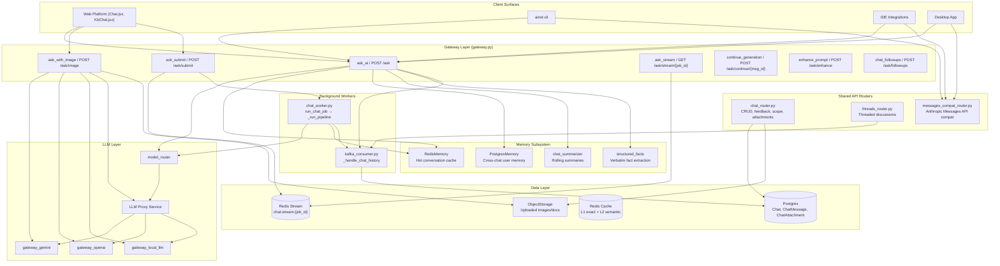
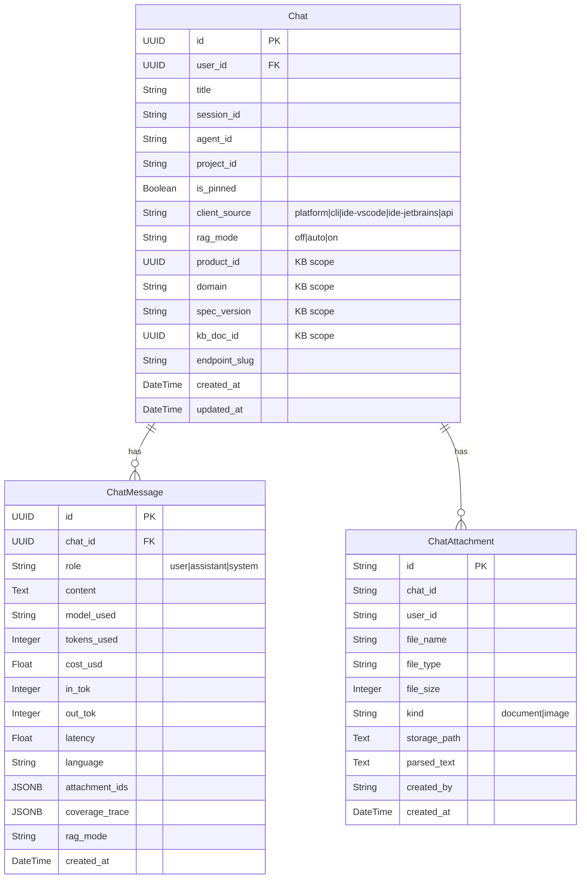
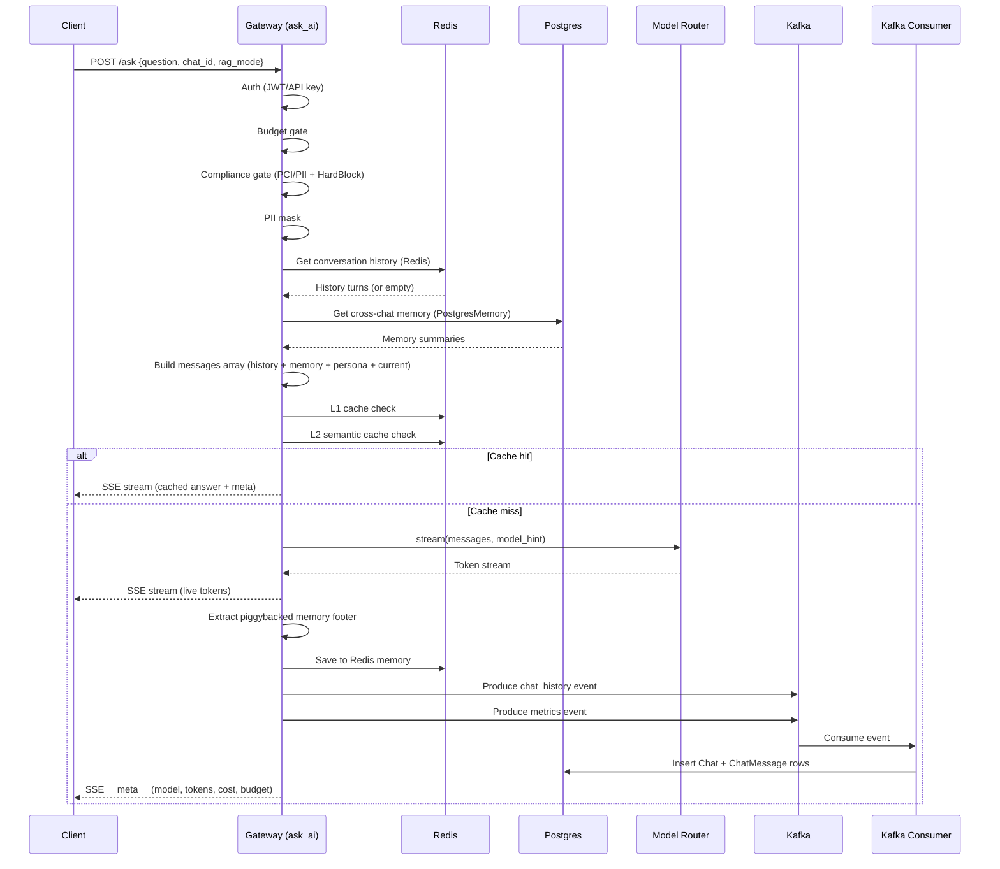
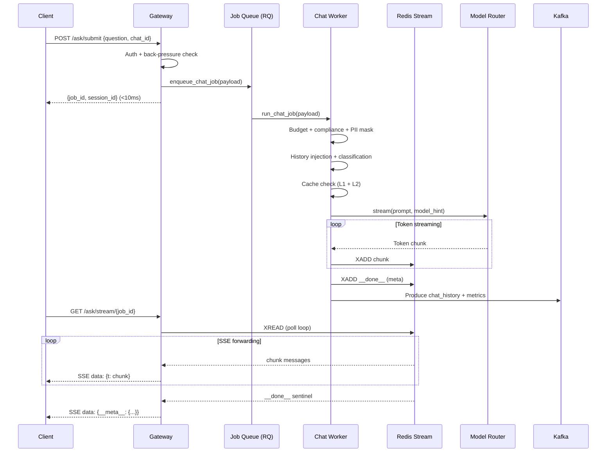
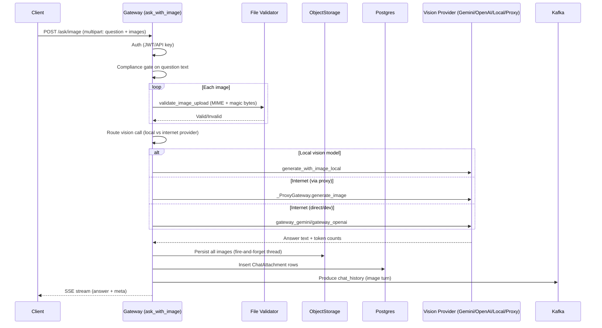
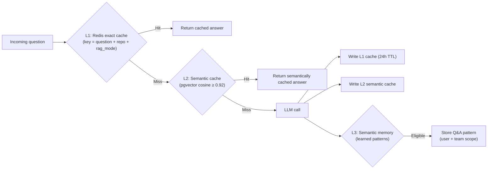
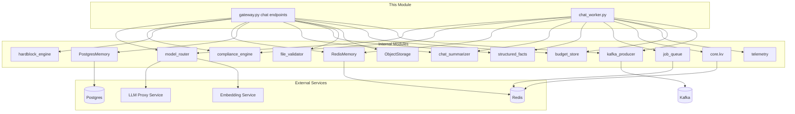

# Chat & Messaging Module

## Overview

The **Chat & Messaging** module is the primary conversational interface of the AiNxt platform. It handles all real-time chat interactions between users and LLMs — including text streaming, image-based vision queries, asynchronous job-based chat, conversation history persistence, cross-chat memory, follow-up suggestions, prompt enhancement, and message continuation. The module spans the API gateway (`gateway.py`), shared API routers (`chat_router`, `threads_router`, `messages_compat_router`), background workers (`chat_worker`), and the memory subsystem (`chat_summarizer`, `structured_facts`, `postgres_memory`).

The module supports multiple client surfaces — **web platform**, **CLI** (`ainxt-cli`), **IDE integrations** (VS Code, JetBrains), **desktop app**, and **API keys** — with strict channel isolation ensuring conversations from one surface never leak into another.

---

## Architecture



---

## Core Components

### Gateway Endpoints (`gateway.py`)

The gateway hosts the primary chat endpoints. These are the entry points for all real-time conversational interactions.

#### `ask_ai` (POST /ask)

The main synchronous streaming chat endpoint. This is the most complex component in the module, orchestrating the entire chat pipeline:

1. **Authentication** — JWT → API key → 401 (no anonymous access)
2. **Platform kill-switch** — checks Redis `platform:disabled`
3. **Context isolation** — rejects contradictory `rag_mode="off"` + `repo_filter`
4. **Budget gate** — blocks cloud models when user allocation is exhausted
5. **Compliance gate** — PCI/PII detection + HardBlock engine (AI safety)
6. **PII masking** — redacts sensitive data before LLM call
7. **Conversation history injection** — Redis (hot) → Postgres (durable), with rolling summarization when history exceeds model context window
8. **Cross-chat memory** — injects distilled summaries from prior sessions
9. **Custom instructions** — per-user persona/style preferences
10. **Document intent routing** — intercepts document generation requests before LLM
11. **KB retrieval** — hybrid search (pgvector + BM25 + BGE reranker) with scope filtering
12. **Cache check** — L1 exact (Redis) → L2 semantic (pgvector)
13. **LLM streaming** — SSE token stream via `model_router`
14. **Post-stream** — memory piggyback extraction, budget recording, Kafka persistence

The endpoint supports multiple dispatch lanes:

| Lane | Trigger | Behavior |
|------|---------|----------|
| **General fast-path** | No repo/project, non-trivial query | Direct model stream with optional KB context |
| **CLI direct** | `cli_mode=True` or `X-AiNxt-Client: cli/*` | Skip orchestrator, direct model relay |
| **Intent route** | `@mention` or CIL skill/agent hint | Route to named skill/agent |
| **Orchestrator** | repo_filter or project_id set | Full agent orchestration with tools |
| **Doc route** | Document intent detected | Enqueue doc generation job |
| **Clarify** | Ambiguous prompt or multi-doc KB | Ask user to elaborate/select |

#### `ask_with_image` (POST /ask/image)

Multipart endpoint for vision-capable chat with image attachments:

- Accepts multiple images under repeated `image` form field
- Validates each image via `validate_image_upload` (MIME + magic bytes)
- Routes to local vision models, Gemini, or OpenAI based on model selection
- Falls back from primary to secondary vision provider on failure
- Persists all uploaded images server-side via `ObjectStorage` + `ChatAttachment`
- Streams result as SSE with token/cost metadata

#### `ask_submit` / `ask_stream` (Async Chat Path)

Two-phase asynchronous chat for decoupled request/response:

- **`ask_submit`** (POST /ask/submit) — enqueues a chat job via `enqueue_chat_job`, returns `job_id` in <10ms
- **`ask_stream`** (GET /ask/stream/{job_id}) — reads Redis Stream `chat:stream:{job_id}` and forwards as SSE

The `ask_stream` reader handles:
- Client disconnect detection
- 120-second hard timeout
- `__done__` / `__error__` sentinels from worker
- Job status polling when no new messages arrive

#### `continue_generation` (POST /ask/continue/{message_id})

Resumes a stopped or truncated assistant message:

- Loads the partial assistant message + prior user question from Postgres
- Constructs a continuation prompt instructing the model to resume without repeating
- Streams new tokens via `model_router.stream()`
- Updates the existing `ChatMessage` row with the completed content

#### `enhance_prompt` (POST /ask/enhance)

Takes a raw user prompt and returns an enhanced version via `_enhance_core`. Used by the frontend to improve prompt quality before submission.

#### `chat_followups` (POST /ask/followups)

Generates 2–3 short follow-up question suggestions based on a Q&A pair:

- Uses a lightweight model (`haiku` tier) to produce a JSON array
- Strips code fences and extracts JSON array from surrounding prose
- Returns `{"followups": [...]}` — never raises (returns empty on failure)

### Request Models

| Model | Fields | Purpose |
|-------|--------|---------|
| `Question` | question, model, attachment_ids, chat_id, repo_filter, rag_mode, agent_id, cli_mode, images, etc. | Primary `/ask` request body |
| `_ContinueReq` | chat_id, rag_mode | Continue generation request |
| `_FollowupReq` | question, answer | Follow-up suggestion request |
| `EnhanceRequest` | prompt | Prompt enhancement request |
| `SubmitRequest` | question, chat_id, session_id, model, repo_filter, rag_mode, attachment_ids | Async job submission |

### Chat History Management

#### `list_my_chats` (GET /chats)

Returns the authenticated user's chat sessions ordered by most recently updated. Enforces **channel isolation** — web UI never sees CLI/IDE chats and vice versa. The `client_source` is set by `ClientSourceMiddleware` from the `X-AiNxt-Client` header.

#### `get_chat_messages` (GET /chats/{chat_id}/messages)

Returns all messages for a chat the caller owns. Enforces:
- **User ownership** — only the chat owner or admins can read
- **Channel isolation** — requesting client must match chat's `client_source` (admins exempt)

#### `get_user_chat_history` (GET /users/{user_id}/history)

Returns full prompt/response history for a given user. Requires **operator or admin** role. Supports optional `chat_id` scoping and pagination.

#### `_save_chat_messages`

Internal function that persists user + assistant messages to Postgres. Called in background threads or via Kafka. Performs:

1. **Chat upsert** — creates `Chat` row if missing, updates title/agent_id if needed
2. **Message insert** — stores user and assistant `ChatMessage` rows with full metadata (tokens, cost, latency, coverage_trace, rag_mode)
3. **Rolling summary** — calls `update_chat_summary` when history exceeds threshold
4. **Structured facts** — extracts verbatim JSON/YAML/CSV/key-value pairs from user turn
5. **Cross-chat memory** — parses piggybacked `<!--MEMORY:{...}-->` footer from LLM response and persists via `PostgresMemory.save_user_memory`

### Shared API Routers

#### `chat_router.py`

Provides the REST CRUD layer for chat management. Key endpoints:

| Endpoint | Function | Description |
|----------|----------|-------------|
| `GET /chats` | `list_chats` | List user's chats with KB scope metadata |
| `POST /chats` | `create_chat` | Eagerly create chat with KB scope (idempotent) |
| `GET /chats/{id}/messages` | `get_chat_messages` | Load messages with artifacts + attachments |
| `POST /chats/{id}/messages/{msg_id}/feedback` | `submit_message_feedback` | Thumbs up/down → `MessageFeedback` + `EvalResult` |
| `PATCH /chats/{id}/scope` | — | Update KB scope (product/domain/version/doc) |
| `PATCH /chats/{id}/rag-mode` | — | Update RAG mode (off/auto/on) |

The `create_chat` endpoint enforces **server-derived product authorization** — non-admins can only select a `product_id` mapped to their department via `dept_product_mappings`.

#### `threads_router.py`

Manages threaded discussions (separate from chat). Messages are published to Kafka (`TOPIC_THREAD_EVENTS`) for async DB persistence. Supports `@AiNxt` mentions that trigger CodeNxt pipeline flows.

#### `messages_compat_router.py`

Anthropic Messages API-compatible endpoint (`POST /v1/messages`) for `ainxt-cli`. Provides:

- JWT authentication via `x-api-key` header
- Budget gate (cloud models only; in-house models exempt)
- Compliance check (PCI/PII + hardblock)
- Provider routing (Claude / OpenAI / Gemini / in-house)
- Anthropic SSE format response (unified regardless of provider)
- Multilingual translation (input → English, output → user language)
- Cowork model lock (server-side override for Buddy/cowork surface)
- Non-streaming support (collects SSE → assembled JSON message)

### Background Worker: `chat_worker.py`

The `run_chat_job` function is the RQ job handler for the async chat path. The `_run_pipeline` function executes a 13-step pipeline:

```mermaid
flowchart TD
    START["Job received"] --> STEP0["Step 0: Budget gate (cloud models)"]
    STEP0 --> STEP1["Step 1: Compliance gate"]
    STEP1 --> STEP2["Step 2: PII mask"]
    STEP2 --> STEP2B["Step 2b: Engineer context injection"]
    STEP2B --> STEP3["Step 3: Conversation history (Redis → summarization)"]
    STEP3 --> STEP4["Step 4: Classify + domain detect"]
    STEP4 --> STEP5["Step 5: L1 cache check"]
    STEP5 --> STEP5B["Step 5b: L2 semantic cache check"]
    STEP5B --> STEP6["Step 6: Query rewrite (code domain)"]
    STEP6 --> STEP7["Step 7: Repo detection"]
    STEP7 --> STEP8["Step 8: RAG retrieval (docs_kb or repo)"]
    STEP8 --> STEP8B["Step 8b: Doc generation intent shortcut"]
    STEP8B --> STEP8C["Step 8c: L3 semantic memory injection"]
    STEP8C --> STEP9["Step 9: Build prompt (KB_DOC_PROMPT or GROUNDED_PROMPT)"]
    STEP9 --> STEP10["Step 10: Stream tokens via model_router"]
    STEP10 --> STEP11["Step 11: L1 + L2 cache write"]
    STEP11 --> STEP12["Step 12: Save to Redis memory"]
    STEP12 --> STEP12B["Step 12b: Update engineer context"]
    STEP12B --> STEP12C["Step 12c: L3 semantic memory write"]
    STEP12C --> STEP13["Step 13: Kafka publish (chat_history + metrics)"]
    STEP13 --> DONE["__done__ sentinel published"]
```



Key features:
- **Distributed semaphore** — throttles concurrent LLM calls (capacity 500)
- **BGE reranker** — cross-encoder reranking of retrieved chunks with relevance gate
- **Zero-context refusal** — KB queries with no retrieved context return a refusal instead of hallucinating
- **W3C traceparent propagation** — worker spans attach to gateway trace

### Memory Subsystem

The chat module integrates with three layers of memory, documented in detail in [memory_system](memory_system.md).

#### RedisMemory (Hot Cache)
- Stores recent conversation turns per `chat_id`
- Written immediately after each turn (both sync and async paths)
- Used for fast history injection on subsequent turns

#### PostgresMemory (Cross-Chat User Memory)
- Persists distilled turn summaries keyed by `user:{user_id}`
- Smart upsert: exact context_key match → merge; semantic similarity (cosine ≥ 0.82) → merge; else insert
- Prunes to 50 most recent entries per user
- Context isolation: `rag_mode_filter="off"` prevents KB context from leaking into Generic chat

#### chat_summarizer (Rolling Summaries)
- Triggers when raw history exceeds `_TRIGGER_TOKENS` (150K tokens, model-aware)
- Preserves exact numeric values, identifiers, and dates verbatim
- Cached in Redis for 30 minutes (worker path) or Postgres (gateway path)

#### structured_facts (Verbatim Fact Extraction)
- Extracts fenced JSON/YAML/CSV/table blocks from user messages
- Extracts `key: value` scalar facts with numeric values
- Maintains ordered value-history for trackable fields (contradiction detection)
- Re-injected into context so exact values survive summarization

---

## Data Model



---

## Data Flow: Synchronous Chat (/ask)



---

## Data Flow: Asynchronous Chat (/ask/submit → /ask/stream)



---

## Data Flow: Image Chat (/ask/image)



---

## Context Isolation

The module enforces strict **RAG mode isolation** to prevent knowledge-base context from contaminating generic chat:

| `rag_mode` | Behavior |
|------------|----------|
| `off` (Generic) | No KB retrieval; history filtered to `rag_mode="off"` turns only; cross-chat memory filtered to `rag_mode="off"` |
| `auto` | Low-threshold KB probe; retrieval runs if relevant chunks found |
| `on` | Force KB retrieval; strict grounding prompt (`KB_DOC_PROMPT`) |

**Server-derived scope enforcement**: The `product_id` in a chat's KB scope is validated against the user's department-mapped products. If mismatched, the entire scope is dropped (fail-closed) rather than allowing unscoped retrieval.

---

## Caching Strategy



Cache eligibility rules:
- **L1/L2 write**: First turn only, non-code domain, non-ephemeral
- **L3 write**: Response ≥80 chars, non-trivial query, non-identity query, retrieval confidence ≥0.35 or code domain, authenticated user

---

## Dependencies



### Cross-Module References

- **[agent_management](agent_management.md)** — Agent catalog chat (`agent_id` scoping), `AgentRunner`
- **[model_and_tool_listing](model_and_tool_listing.md)** — Model listing, tool catalog
- **[openai_compatible_endpoints](openai_compatible_endpoints.md)** — Anthropic Messages API compatibility
- **[audit_and_tracing](audit_and_tracing.md)** — Request tracing, audit logging
- **[security_and_governance](security_and_governance.md)** — Compliance engine, rate limiting, guardrails
- **[memory_system](memory_system.md)** — RedisMemory, PostgresMemory, chat_summarizer, structured_facts
- **[database](database.md)** — Chat, ChatMessage, ChatAttachment models
- **[core_infrastructure](core_infrastructure.md)** — KV store, telemetry, circuit breaker, distributed semaphore
- **[llm_proxy_main](llm_proxy_main.md)** — LLM proxy service for vision and text generation
- **[chat_agent_execution_workers](chat_agent_execution_workers.md)** — `chat_worker.py`, `kafka_consumer.py`
- **[kafka_event_consumer](kafka_event_consumer.md)** — `_handle_chat_history` consumer

---

## SSE Protocol

All streaming endpoints use Server-Sent Events (SSE) with the following frame types:

| Frame | Format | Description |
|-------|--------|-------------|
| Token | `data: {"t": "chunk"}` | Incremental answer text |
| Status | `data: {"status": "Thinking…"}` | Live status indicator |
| Meta | `data: {"__meta__": {...}}` | Final metadata (model, tokens, cost, latency, budget, sources) |
| Clarify | `data: {"__clarify__": {...}}` | KB disambiguation picker |
| Context | `data: {"context": {...}}` | Context window telemetry |
| Compaction | `data: {"compaction": {...}}` | History summarization notice |
| Plan | `data: {"plan": {...}}` | Multi-step plan panel |
| Tool | `data: {"tool": {...}}` | Tool call event |
| Reasoning | `data: {"reasoning": {...}}` | Extended thinking delta |
| Done | `data: [DONE]` | Stream end (CLI path) |

Response headers on all streaming endpoints:
```
Cache-Control: no-cache
X-Accel-Buffering: no
X-Request-ID: {request_id}
```

---

## Key Design Decisions

1. **Channel isolation** — `client_source` column on `Chat` ensures CLI/IDE/web conversations never cross-pollinate. Enforced at both `list_my_chats` and `get_chat_messages`.

2. **Piggybacked memory** — The LLM appends a `<!--MEMORY:{...}-->` JSON footer to its response. The gateway strips it before streaming to the client and uses the contained `store`/`summary`/`context_key` to persist cross-chat memory — zero extra LLM calls.

3. **Dual persistence path** — Chat history is published to Kafka (primary, async) with a direct Postgres write fallback when Kafka is unavailable. The Kafka consumer (`_handle_chat_history`) performs idempotent upserts.

4. **Server-derived KB scope** — `product_id` is validated server-side against `dept_product_mappings`. A malicious client cannot bypass the scope guard by going through the create path or sending inline scope fields.

5. **Cooperative cancellation** — The gateway registers active streams in a `_gen_registry`. `POST /chat/stop` sets a stop flag that streaming generators check on each token, enabling user-initiated generation cancellation.

6. **No retry on async chat** — `enqueue_chat_job` sets `retry_count=0` because stale streams confuse users. The Redis Stream self-cleans via TTL (`STREAM_TTL`).
