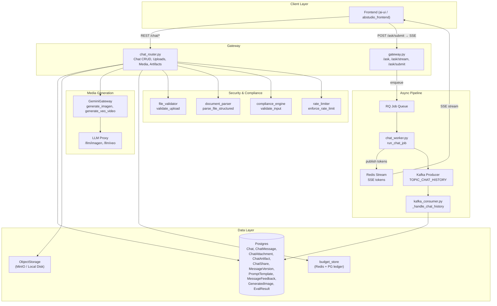
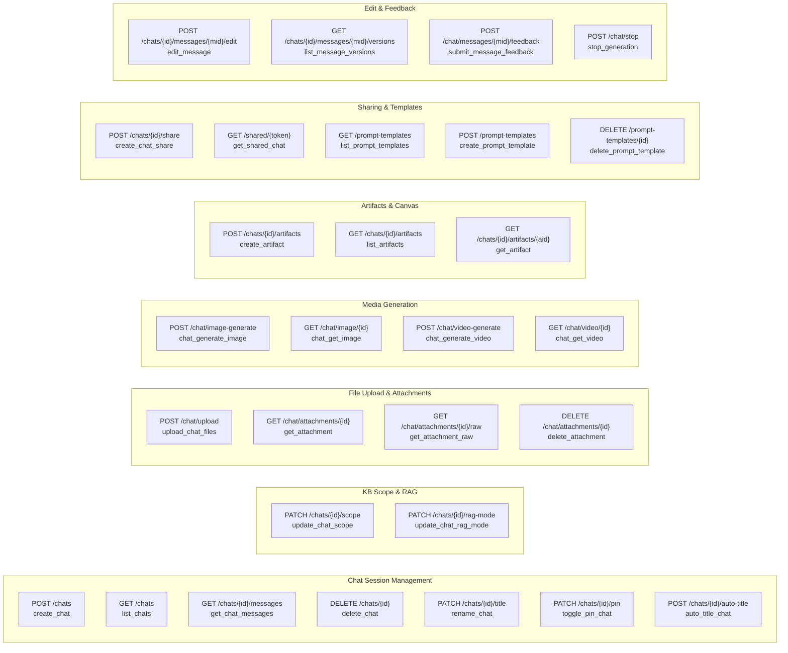
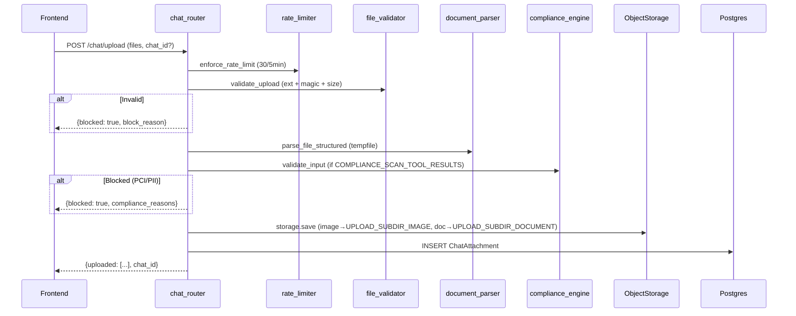
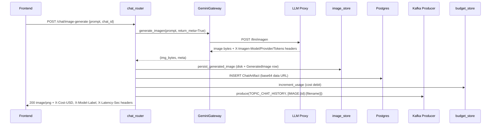
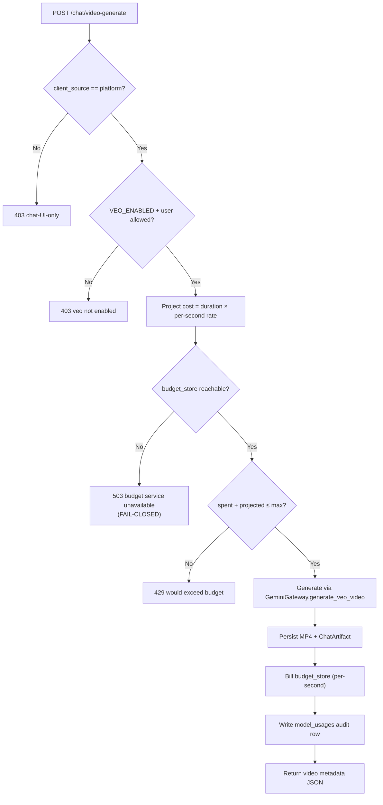
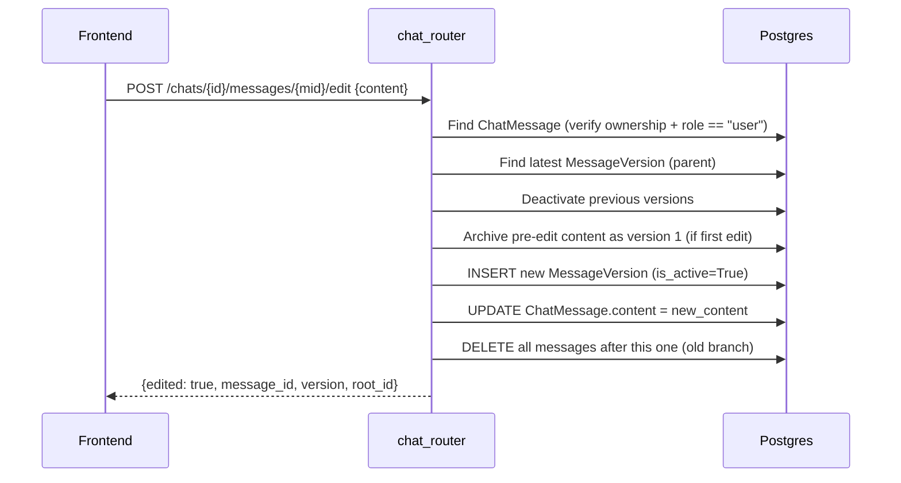
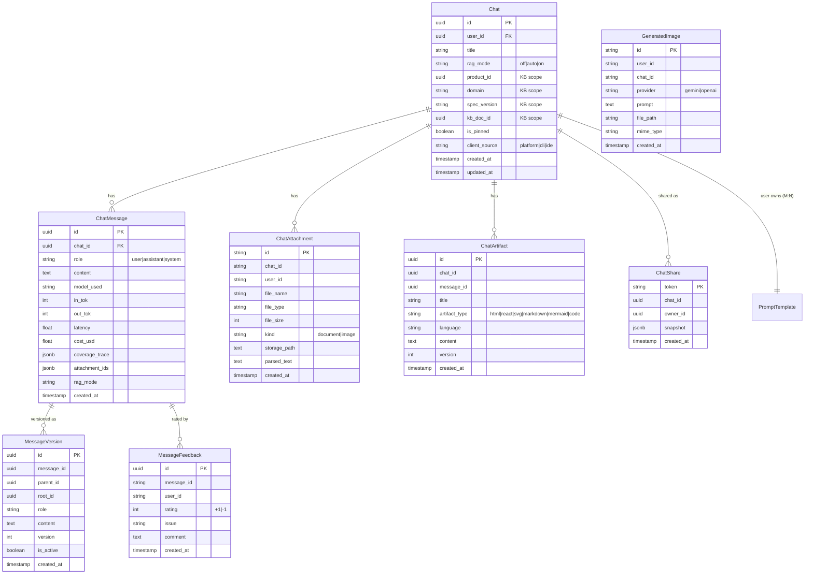
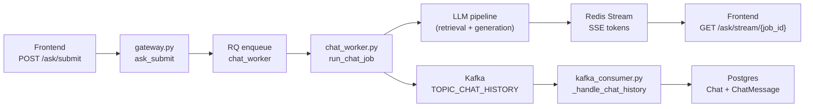

# Chat Router

## Overview

The **Chat Router** (`routers/chat_router.py`) is a FastAPI `APIRouter` that serves as the primary REST API surface for the platform's conversational chat experience. It manages the full lifecycle of chat sessions — from creation and message persistence to multimodal file uploads, inline image/video generation, Canvas artifacts, public share links, prompt templates, message editing with branching, and human feedback signals.

The router is mounted into the main gateway application and works in concert with the asynchronous chat pipeline (gateway `/ask` → RQ worker → Redis Stream SSE) and the Kafka-based chat-history consumer. While the gateway handles the real-time streaming of LLM tokens, the chat router owns all **synchronous CRUD, persistence, media generation, and metadata** operations that surround and support the streaming path.

---

## Architecture

### Relationship to the Gateway

The chat router and the gateway's `/ask` endpoints form a complementary pair:

| Responsibility | Owner | Mechanism |
|---|---|---|
| Real-time LLM token streaming | `gateway.py` (`ask_stream`, `ask_submit`) | RQ worker → Redis Stream → SSE |
| Chat session CRUD | `chat_router.py` | Direct Postgres queries |
| Message persistence (user + assistant turns) | `gateway.py` (`_save_chat_messages`) + Kafka consumer | Background thread / async consumer |
| File upload, parsing, storage | `chat_router.py` | `ObjectStorage` + `document_parser` |
| Image / video generation | `chat_router.py` | `GeminiGateway` → LLM Proxy |
| Budget enforcement (text chat) | `gateway.py` (`BudgetMiddleware`) | Middleware on `/ask` path |
| Budget enforcement (image/video) | `chat_router.py` | Direct `budget_store.increment_usage` |
| Stop generation | `chat_router.py` | `generation_registry.stop()` |

> **Key design note:** Chat rows are normally created *lazily* by the Kafka consumer when the first user→assistant exchange lands. The `POST /chats` endpoint exists to create rows *eagerly* — needed for KB-scoped chats where `rag_mode`, `product_id`, `domain`, and `kb_doc_id` must be set before the first prompt.

---

## Component Map

---

## Endpoint Reference

### Chat Session Management

| Method | Path | Function | Description |
|---|---|---|---|
| `POST` | `/chats` | `create_chat` | Eagerly create a Chat row with KB scope + rag_mode. Idempotent on `(id, user_id)`. Enforces server-derived `product_id` authorization against `dept_product_mappings`. |
| `GET` | `/chats` | `list_chats` | List the user's chat sessions (most recent first, limit 100). Includes message count, pin state, rag_mode, and KB scope fields. |
| `GET` | `/chats/{chat_id}/messages` | `get_chat_messages` | Load last 100 messages with artifacts, attachments, token/cost/latency metadata, and coverage trace. |
| `DELETE` | `/chats/{chat_id}` | `delete_chat` | Delete a chat and all its messages (cascade). |
| `PATCH` | `/chats/{chat_id}/title` | `rename_chat` | Update chat title (max 500 chars). Ownership-enforced. |
| `PATCH` | `/chats/{chat_id}/pin` | `toggle_pin_chat` | Toggle pinned state. |
| `POST` | `/chats/{chat_id}/auto-title` | `auto_title_chat` | Generate a 4–7 word title via Claude Haiku (`model_router.generate`). |

### KB Scope & RAG Mode

| Method | Path | Function | Description |
|---|---|---|---|
| `PATCH` | `/chats/{chat_id}/scope` | `update_chat_scope` | Set per-chat KB retrieval scope (`product_id`, `domain`, `spec_version`, `kb_doc_id`). Server-derived product validation against `dept_product_mappings` (Redis-cached). Fail-closed: unverified `product_id` is silently dropped. |
| `PATCH` | `/chats/{chat_id}/rag-mode` | `update_chat_rag_mode` | Set per-chat RAG mode (`off` / `auto` / `on`). Drives the Generic / Knowledge Base toggle. |

> The `/ask` gateway reads these Chat columns on every request and injects them into `_user_ctx['scope_filter']` + `_user_ctx['kb_doc_id']`, so hybrid search's product/domain/version WHERE clauses fire deterministically. See [gateway](gateway.md) for the `/ask` path details.

### File Upload & Attachments

| Method | Path | Function | Description |
|---|---|---|---|
| `POST` | `/chat/upload` | `upload_chat_files` | Multipart upload of one or more files. Validates extension + magic bytes + size (25 MB max). Parses text via `document_parser`. Optional compliance scan (gated by `COMPLIANCE_SCAN_TOOL_RESULTS`). Stores via `ObjectStorage` and persists `ChatAttachment` row. |
| `GET` | `/chat/attachments/{id}` | `get_attachment` | Return attachment metadata + presigned download URL (MinIO). |
| `GET` | `/chat/attachments/{id}/raw` | `get_attachment_raw` | Serve stored bytes (backend-agnostic). Strict per-user ACL — 404 on mismatch (no existence leak). |
| `DELETE` | `/chat/attachments/{id}` | `delete_attachment` | Delete file from object store + DB record. Owner-only (admins excepted). |

**Allowed file types:** `pdf`, `docx`, `pptx`, `ppt`, `xlsx`, `xls`, `csv`, `html`, `htm`, `rtf`, `txt`, `json`, `md`, `xml`, `png`, `jpg`, `jpeg`, `gif`, `webp`, `bmp`

**Upload flow:**

### Media Generation

#### Image Generation

| Method | Path | Function | Description |
|---|---|---|---|
| `POST` | `/chat/image-generate` | `chat_generate_image` | Generate an image via `GeminiGateway.generate_imagen()`. Provider hard-pinned to Gemini (with OpenAI fallback inside the LLM proxy). Returns `image/png` bytes inline with cost/token/latency headers. Persists as `ChatAttachment` + `ChatArtifact` + `GeneratedImage`. Publishes to Kafka for chat-history persistence. |
| `GET` | `/chat/image/{image_id}` | `chat_get_image` | Serve a persisted generated image (JWT-authenticated). |

**Image generation flow:**

**Cost computation:**
- **Gemini path:** per-token using `MODEL_COST_PER_1M[GEMINI_IMAGE_MODEL]` (input + output rates from the central registry). Real token counts from Gemini `usage_metadata`.
- **OpenAI fallback:** flat per-image rate (`gpt-image-1` = $0.04, `dall-e-3` = $0.08). Token chips zeroed.

#### Video Generation (Veo 3.1)

| Method | Path | Function | Description |
|---|---|---|---|
| `POST` | `/chat/video-generate` | `chat_generate_video` | Generate a short Veo 3.1 video. Three-gate defense: (1) `client_source == "platform"`, (2) `VEO_ENABLED` + `is_veo_allowed_for_user`, (3) authoritative budget projection check (fail-closed). Duration capped at 2–16 seconds. Persists MP4 to filesystem, bills per-second, writes `model_usages` audit row. |
| `GET` | `/chat/video/{video_id}` | `chat_get_video` | Stream MP4 with HTTP Range support (JWT-authenticated). |

**Video budget gate (fail-closed):**

### Artifacts (Canvas)

| Method | Path | Function | Description |
|---|---|---|---|
| `POST` | `/chats/{chat_id}/artifacts` | `create_artifact` | Persist an artifact (html / react / svg / markdown / mermaid / code) extracted from an assistant message. Max 200 KB content. |
| `GET` | `/chats/{chat_id}/artifacts` | `list_artifacts` | List artifacts for a chat (newest first). |
| `GET` | `/chats/{chat_id}/artifacts/{artifact_id}` | `get_artifact` | Fetch one artifact in full (content included). |

### Public Share Links

| Method | Path | Function | Description |
|---|---|---|---|
| `POST` | `/chats/{chat_id}/share` | `create_chat_share` | Create a public read-only share link (snapshot semantics — up to 500 messages frozen at share time). Token is `secrets.token_urlsafe(32)`. Base URL resolved from `Origin` → `Referer` → `Host`/`X-Forwarded-*` → `PLATFORM_BASE_URL`. |
| `GET` | `/shared/{token}` | `get_shared_chat` | Public endpoint (no auth). Returns the frozen snapshot. Registered on a separate `_public_share_router`. |

### Prompt Templates

| Method | Path | Function | Description |
|---|---|---|---|
| `GET` | `/prompt-templates` | `list_prompt_templates` | Return caller's private templates + org-visible templates. |
| `POST` | `/prompt-templates` | `create_prompt_template` | Create a template (private or org scope). |
| `DELETE` | `/prompt-templates/{tpl_id}` | `delete_prompt_template` | Delete a template (owner-only). |

### Message Editing & Branching

| Method | Path | Function | Description |
|---|---|---|---|
| `POST` | `/chats/{chat_id}/messages/{message_id}/edit` | `edit_message` | Edit a past user message. Archives old content into `MessageVersion`, updates the live `ChatMessage`, and deletes all subsequent messages (old branch). Next `/ask` creates a fresh assistant turn on the new branch. |
| `GET` | `/chats/{chat_id}/messages/{message_id}/versions` | `list_message_versions` | Return version history for a message (oldest first). |

**Edit + Branch flow:**

### Feedback & Stop

| Method | Path | Function | Description |
|---|---|---|---|
| `POST` | `/chat/messages/{message_id}/feedback` | `submit_message_feedback` | Record thumbs-up (+1) / thumbs-down (-1). Upserts in `MessageFeedback` table. Also writes an `EvalResult` row (`eval_type="human_feedback"`) so human preference signals appear alongside automated eval scores. |
| `POST` | `/chat/stop` | `stop_generation` | Signal cooperative cancellation of an active streaming generation via `generation_registry.stop(request_id)`. The streaming generator in `gateway.py` polls `should_stop()` on every token. |

---

## Data Model

---

## Key Dependencies

```mermaid
graph TD
    CR["chat_router.py"]

    CR -->|"file storage"| OS["core/storage.py::ObjectStorage<br/>(MinIO / local disk)"]
    CR -->|"file validation"| FV["core/file_validator.py::validate_upload<br/>(extension + magic bytes + size)"]
    CR -->|"document parsing"| DP["core/document_parser.py::parse_file_structured"]
    CR -->|"compliance scan"| CE["agents/compliance_engine.py<br/>(gated by COMPLIANCE_SCAN_TOOL_RESULTS)"]
    CR -->|"rate limiting"| RL["core/rate_limiter.py::enforce_rate_limit_with_behaviour"]
    CR -->|"image generation"| GG["gateway_gemini.py::GeminiGateway.generate_imagen"]
    CR -->|"video generation"| GG2["gateway_gemini.py::GeminiGateway.generate_veo_video"]
    CR -->|"image persistence"| IS["services/image_store.py::persist_generated_image"]
    CR -->|"budget tracking"| BS["store/budget_store.py::increment_usage / check_budget"]
    CR -->|"model usage audit"| PM["memory/postgres_memory.py::PostgresMemory.create_model_usage"]
    CR -->|"async message persist"| KP["core/kafka_producer.py::produce → TOPIC_CHAT_HISTORY"]
    CR -->|"stop generation"| GR["core/generation_registry.py::stop"]
    CR -->|"auto-title LLM"| MR["models/model_router.py::model_router.generate"]
    CR -->|"cost rates"| MREG["core/model_registry.py<br/>MODEL_COST_PER_1M, GEMINI_IMAGE_MODEL, VEO_MODEL"]
    CR -->|"auth"| AUTH["auth/dependencies.py::get_current_user"]
    CR -->|"DB models"| DBM["db/models.py<br/>Chat, ChatMessage, ChatAttachment, ..."]
```

### Dependency Details

| Dependency | Purpose |
|---|---|
| **`ObjectStorage`** | Unified file storage backend (MinIO with local disk fallback). Uploads are sharded by `subdir/user_id/chat_id`. Opaque path strings returned by `save()` are passed back to `load()`/`delete()`/`presigned_url()`. See [shared_core](shared_core.md). |
| **`validate_upload`** | Multi-layer file security: always-blocked extensions, extension whitelist, executable magic-byte detection (PE/ELF), per-extension magic validation, HTML `<script>` blocking, WebP signature check, size limit. |
| **`parse_file_structured`** | Enterprise document parser returning `{type, content, metadata, source, timestamp}`. Delegates to Docling / legacy parsers based on file type. |
| **`GeminiGateway`** | Direct Gemini SDK client for image (Imagen) and video (Veo 3.1) generation. Routes through LLM Proxy when `LLM_PROXY_URL` is set. Implements gemini→openai fallback for images. See [gemini_gateway](gemini_gateway.md). |
| **`budget_store`** | Redis + Postgres budget ledger. `increment_usage` debits cost; `check_budget` / `get_budget` / `get_usage_total` used for Veo projection checks. See [shared_core](shared_core.md). |
| **`kafka_producer`** | Fire-and-forget publish to `TOPIC_CHAT_HISTORY`. The Kafka consumer (`workers/kafka_consumer.py::_handle_chat_history`) asynchronously persists `ChatMessage` rows. Falls back to Redis if Kafka is unavailable. See [workers](workers.md). |
| **`generation_registry`** | Cooperative cancellation registry. `stop(request_id)` sets an in-memory flag (and Redis flag when configured) that the streaming generator polls on every token. |
| **`model_router`** | Used by `auto_title_chat` to generate concise titles via Claude Haiku (`model_hint="haiku"`). |
| **`compliance_engine`** | PCI/PII data-breach guard. Only invoked on uploaded file content when `COMPLIANCE_SCAN_TOOL_RESULTS` is enabled (default OFF). |

---

## Security Model

### Authentication
All endpoints (except `GET /shared/{token}`) require JWT authentication via `Depends(get_current_user)`. The user identity is resolved from `current_user.get("sub")` (JWT subject), falling back to `user_id` then `email`.

### Authorization
- **Chat ownership:** Most mutations verify `Chat.user_id == current_user.sub`. Non-owners receive 404 (not 403) to avoid leaking chat existence.
- **Attachment ACL:** `get_attachment_raw` enforces strict per-user ownership. Returns 404 on mismatch — file existence is never leaked to non-owners. Admins and platform engineers are exempted.
- **Product scope validation:** `create_chat` and `update_chat_scope` validate that the selected `product_id` belongs to the user's department-mapped product set (`dept_product_mappings`). Non-admins cannot set an arbitrary `product_id`. Fail-closed: unverified products are silently dropped.
- **Video generation gating:** Three-layer defense — client source check, global enable + ad_level/admin check, and authoritative budget projection (fail-closed on budget store outage).

### File Upload Security
1. **Rate limiting:** 30 uploads per 5 minutes per user/IP (behaviour-aware).
2. **Extension whitelist:** Only the 20 allowed file types are accepted.
3. **Magic-byte validation:** Executable signatures (PE, ELF, Mach-O) are always blocked regardless of extension. Per-extension magic checks catch renamed files.
4. **HTML sanitization:** HTML files with `<script>` tags are rejected. Files must contain at least one recognized HTML tag.
5. **Size limit:** 25 MB maximum.
6. **Filename sanitization:** Storage uses sanitized filenames; original names preserved for display.
7. **Compliance scan (optional):** When `COMPLIANCE_SCAN_TOOL_RESULTS` is enabled, uploaded file content is scanned for PCI/PII data. Blocked files are not stored.

---

## Integration Points

### With the Gateway `/ask` Path

The chat router does **not** handle LLM inference. The streaming chat flow is:

The chat router supports this flow by:
- Providing `POST /chats` for eager chat creation (needed before the first `/ask` for KB-scoped chats)
- Providing `POST /chat/stop` for cooperative cancellation
- Providing `GET /chats/{id}/messages` for history reload after page refresh
- Persisting image/video generation results to Kafka so they survive as `ChatMessage` rows

### With the LLM Proxy

All cloud media generation calls route through the LLM Proxy (`LLM_PROXY_URL`):
- **Image:** `POST {LLM_PROXY_URL}/llm/imagen` — the proxy implements the gemini→openai fallback chain internally and reports the actual provider/model via response headers.
- **Video:** `POST {LLM_PROXY_URL}/llm/veo` — the proxy handles the Veo Long-Running Operation (submit → poll → download).

See [llm_proxy](llm_proxy.md) for proxy internals.

### With the Budget System

| Flow | Budget Mechanism | Fail Mode |
|---|---|---|
| Text chat (`/ask`) | `BudgetMiddleware` on gateway | Fail-open (middleware) |
| Image generation | `budget_store.increment_usage` (fire-and-forget) | Fail-open (non-fatal) |
| Video generation (Veo) | `check_budget` + projection + `increment_usage` | **Fail-closed** (503 on budget store outage) |

See [shared_core](shared_core.md) and [budget_router](budget_router.md) for budget management details.

### With the Evals System

`submit_message_feedback` writes an `EvalResult` row (`eval_type="human_feedback"`, score 1.0 for thumbs-up / 0.0 for thumbs-down) so human preference signals appear alongside automated eval scores in the evals dashboard. See [evals_router](evals_router.md).

---

## Internal Helper Functions

| Function | Description |
|---|---|
| `_ext(filename)` | Extract lowercase file extension from a filename. |
| `_gemini_image_rates_per_1k()` | Return `(input_per_1k, output_per_1k)` for the Gemini image model from `MODEL_COST_PER_1M`. Falls back to `(0.0003, 0.03)` if registry lookup fails. |
| `_media_dir()` | Resolve/create the video storage directory (`MEDIA_DIR/videos`, mode 0o700). |
| `_veo_video_path(video_id)` | Resolve and validate a video file path (regex-validated `video_id` to prevent path traversal). |
| `_resolve_share_base_url(request)` | Derive a public base URL for share links from `Origin` → `Referer` → `Host`/`X-Forwarded-*` → `PLATFORM_BASE_URL`. |
| `_is_localhost(url_or_host)` | Check if a URL/host points to localhost (used to filter out dev origins from share links). |

## Pydantic Models

| Model | Fields | Used By |
|---|---|---|
| `_StopBody` | `request_id: str` | `stop_generation` |
| `_FeedbackBody` | `rating: int` (+1 / -1) | `submit_message_feedback` |

---

## Routers Exported

The module exports two `APIRouter` instances:

1. **`router`** (tagged `"chat"`) — All authenticated endpoints. Mounted into the main gateway app with JWT auth dependency.
2. **`_public_share_router`** (tagged `"chat"`) — The single `GET /shared/{token}` endpoint. Registered **without** the standard auth dependency so shared chats are publicly accessible.
