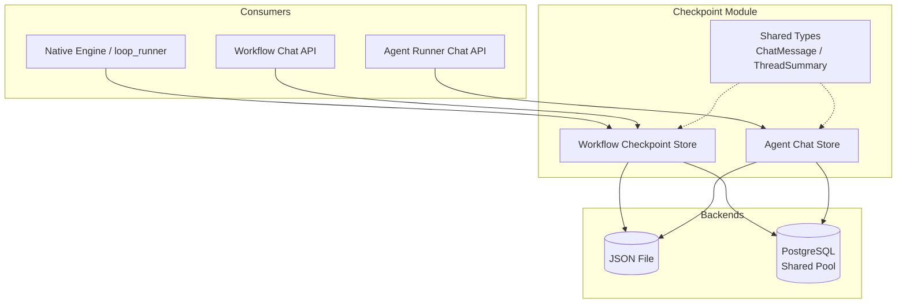
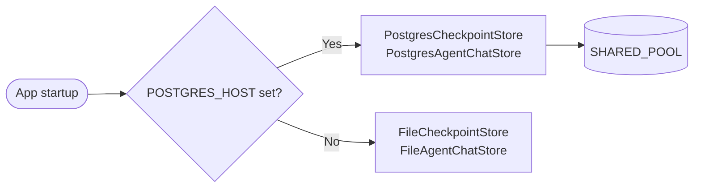
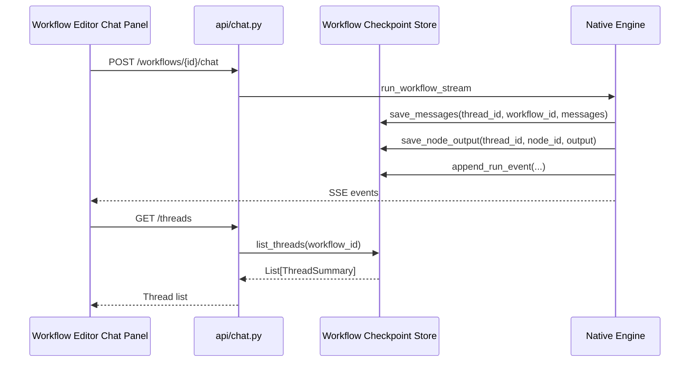
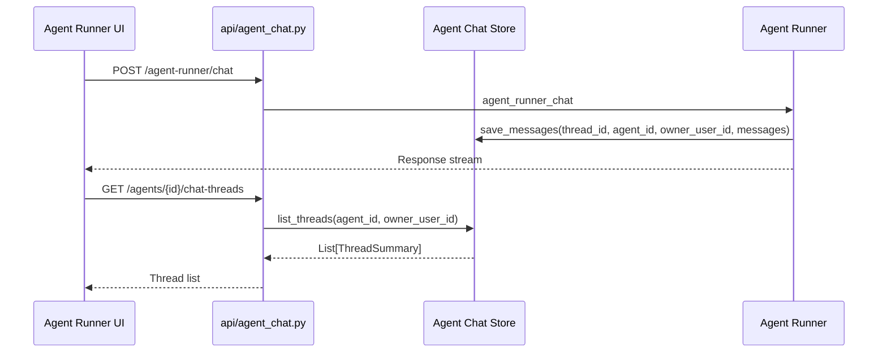

# Checkpoint Module

## Overview

The **Checkpoint** module provides durable persistence for conversational and execution state in the ABStudio backend. It is the storage layer behind workflow chat threads, agent-runner chat threads, Human-in-the-Loop (HITL) interrupts, loop/condition audit trails, and durable run replay. The module is designed to work both in lightweight local deployments (file-backed) and production deployments (PostgreSQL-backed) without changing the consumer interface.

## Purpose

- Persist chat message history for workflow runs and agent-runner conversations.
- Store HITL interrupt snapshots so paused runs can survive disconnects and restarts.
- Cache per-node outputs to power UI features such as the Loop node's connection-aware picker.
- Record loop iterations, condition routings, and HITL decisions for audit and debugging.
- Support cross-run loop memory by persisting reflection "lessons".
- Provide durable run state (`run_steps` / `run_events`) for crash recovery and deterministic replay.

## Architecture

The module exposes two independent storage families, each with the same dual-backend strategy:

1. **Workflow Checkpoint Store** — keyed by `workflow_id` / `thread_id`. Used by the workflow engine (`native_engine.py`) and the workflow chat API (`api_chat`).
2. **Agent Chat Store** — keyed by `agent_id` / `owner_user_id` / `thread_id`. Used by the agent-runner chat API (`api_agent_chat`) to give each user private chat history per deployed agent.

Both families share the same data types (`ChatMessage`, `ThreadSummary`) and the same backend selection logic: PostgreSQL is used when `POSTGRES_HOST` is configured; otherwise a local JSON file is used.

## Backend Selection

Backend selection is performed by `app/main.py` during application startup based on the `POSTGRES_HOST` environment variable:

- **PostgreSQL enabled**: `PostgresCheckpointStore` and `PostgresAgentChatStore` are instantiated. Both borrow the platform's shared connection pool (`app.core.db_pool.SHARED_POOL`) rather than opening their own connections.
- **PostgreSQL disabled**: `FileCheckpointStore` and `FileAgentChatStore` are instantiated, writing to `backend/data/chat_history.json` and `backend/data/agent_chat_history.json` respectively.

## Sub-modules

| Sub-module | File(s) | Responsibility | Documentation |
|------------|---------|----------------|---------------|
| Workflow Checkpoint Store | `store.py`, `postgres_store.py` | Abstract interface, file-backed implementation, and PostgreSQL implementation for workflow chat / run state. | [checkpoint_workflow_store.md](checkpoint_workflow_store.md) |
| Agent Chat Store | `agent_store.py` | Abstract interface and dual backends for per-user, per-agent chat history. | [checkpoint_agent_chat_store.md](checkpoint_agent_chat_store.md) |

## Core Data Types

Both sub-modules reuse the same dataclasses defined in `store.py`:

- **`ChatMessage`** — represents a single chat turn with `role`, `content`, optional `generated_files`, and optional `usage` metadata.
- **`ThreadSummary`** — sidebar-ready metadata for a thread, including title preview, last update, message count, and pending interrupt status/reason.

## Integration with the Rest of the System

- **`app/engine/native_engine.py`** selects and uses the workflow checkpoint store to save/load messages, HITL snapshots, node outputs, loop lessons, and durable run state.
- **`app/api/chat.py`** exposes endpoints to list workflow chat threads, fetch history, and abort pending interrupts; all data is served from the workflow checkpoint store.
- **`app/api/agent_chat.py`** exposes endpoints to list agent chat threads, fetch history, and delete threads; all data is served from the agent chat store.
- **`app/core/db_pool.py`** provides the shared PostgreSQL connection pool consumed by both PostgreSQL-backed stores.
- **`app/core/config.py`** exposes `postgres_enabled()` which gates PostgreSQL backend activation.

## Data Flow: Workflow Chat Thread Lifecycle

## Data Flow: Agent Chat Thread Lifecycle

## Deployment Considerations

- The file-backed stores are suitable only for single-instance, non-HA deployments because the JSON file is read into memory on startup and written atomically on each change.
- The PostgreSQL-backed stores create their tables and indexes automatically on startup (`CREATE TABLE IF NOT EXISTS`).
- PostgreSQL stores never close the shared pool during shutdown; they only drop their reference so the platform lifecycle remains in control.
- Durable run replay (`run_steps` / `run_events`) is only available with PostgreSQL; file-backed stores implement these methods as no-ops.
