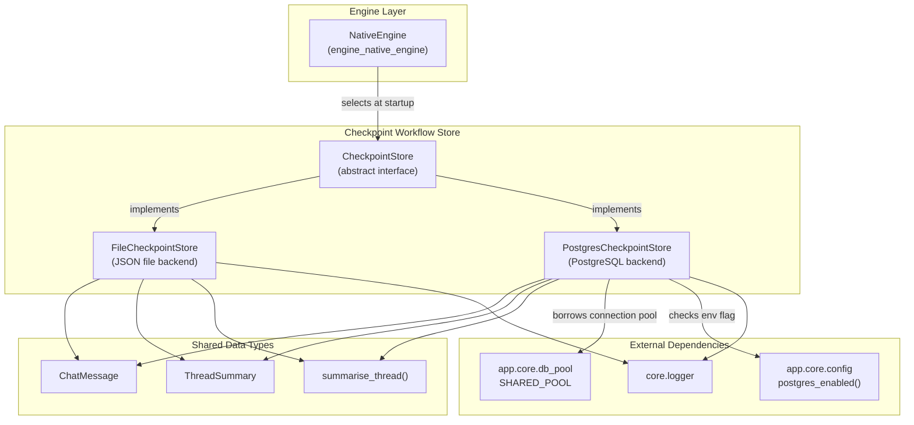
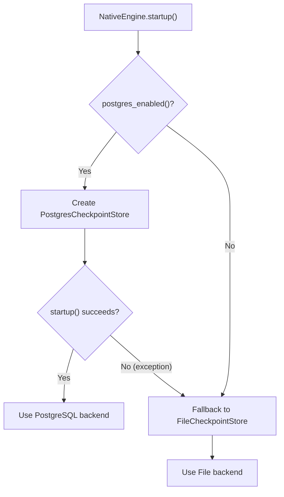
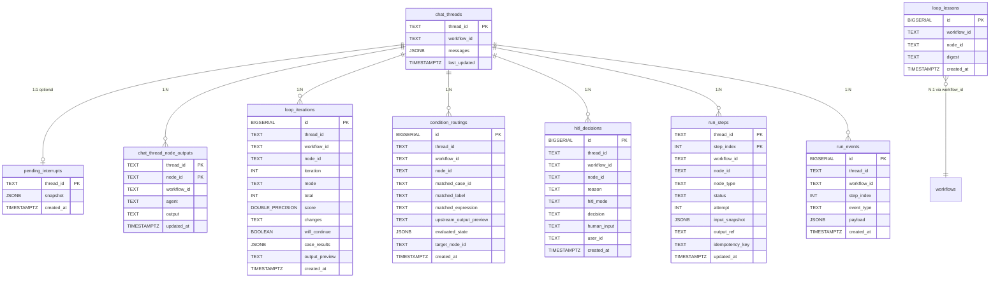
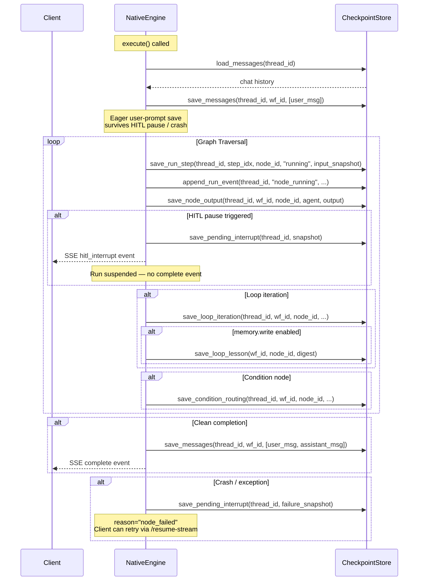
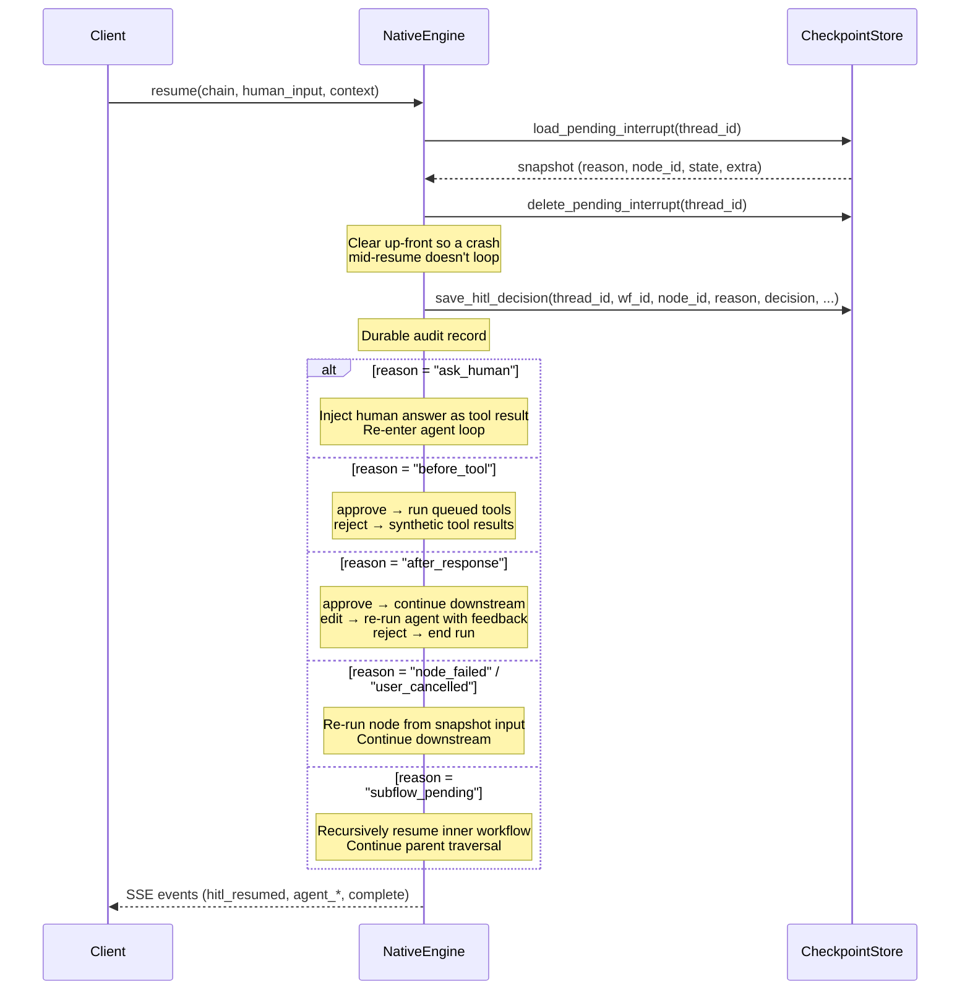
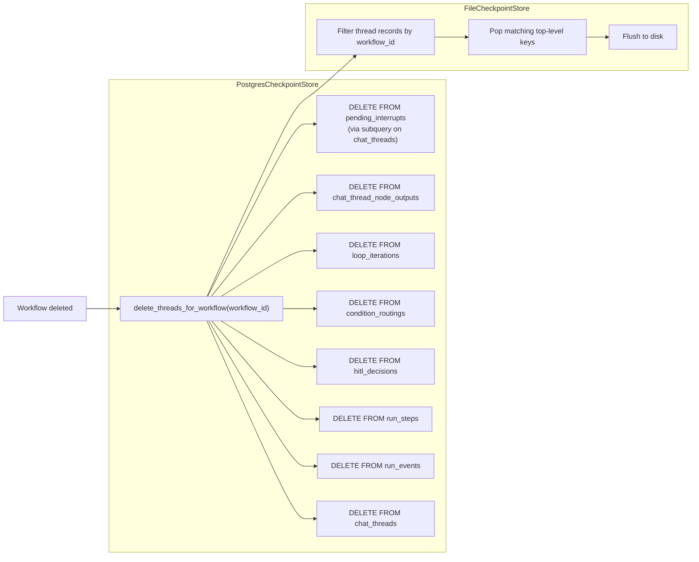
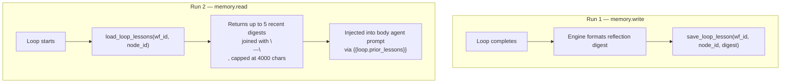

# Checkpoint Workflow Store

## Introduction

The **Checkpoint Workflow Store** module provides the persistence layer for workflow chat history, Human-in-the-Loop (HITL) interrupt snapshots, per-node output caching, audit trails, loop cross-run memory, and durable replay state. It defines an abstract storage contract (`CheckpointStore`) with two concrete implementations — a file-backed JSON store for local development and a PostgreSQL-backed store for production. The module is consumed exclusively by the `NativeEngine` (see [engine_native_engine](engine_native_engine.md)), which selects the appropriate backend at startup based on whether `POSTGRES_HOST` is configured.

---

## Architecture Overview

### Backend Selection Logic

The `NativeEngine.startup()` method determines which backend to use:

---

## Core Components

### 1. `CheckpointStore` (Abstract Base Class)

**File:** `ABStudio/backend/app/checkpoint/store.py`

Defines the complete storage contract that every backend must fulfil. The interface is organized into seven functional groups, each with default no-op implementations so that limited/legacy backends remain functional:

| Group | Methods | Purpose |
|-------|---------|---------|
| **Lifecycle** | `startup()`, `shutdown()` | Initialise / release resources |
| **Chat History** | `save_messages()`, `load_messages()`, `list_threads()`, `delete_thread()`, `delete_threads_for_workflow()` | Persist and retrieve thread message lists |
| **HITL Interrupts** | `save_pending_interrupt()`, `load_pending_interrupt()`, `delete_pending_interrupt()` | Snapshot paused workflow runs for resume |
| **Per-Node Outputs** | `save_node_output()`, `load_node_output()` | Cache latest output per (thread, node) for the Loop picker |
| **Audit Trails** | `save_loop_iteration()`, `save_condition_routing()`, `save_hitl_decision()` | Best-effort persistent records of loop iterations, condition routings, and HITL decisions |
| **Loop Memory** | `save_loop_lesson()`, `load_loop_lessons()` | Cross-run reflection digests keyed by (workflow_id, node_id) |
| **Durable Replay** | `save_run_step()`, `load_run_state()`, `append_run_event()`, `replay_events()` | Authoritative per-step state + append-only event log for crash recovery and deterministic replay |

> **Design principle:** Every method beyond the core lifecycle/chat-history group has a default no-op implementation. This ensures that `FileCheckpointStore` (which only implements chat history, HITL, node outputs, and loop lessons) remains a valid drop-in without needing to stub every audit method.

### 2. `FileCheckpointStore`

**File:** `ABStudio/backend/app/checkpoint/store.py`

A zero-dependency JSON file store ideal for local development and single-instance deployments.

- **Storage:** Single JSON file at `<backend_root>/data/chat_history.json` (configurable via constructor `path=`)
- **Schema:** `{ thread_id: { workflow_id, messages: [{role, content, generated_files?}], last_updated, pending_interrupt?, node_outputs? } }`
- **Concurrency:** Thread-safe via `threading.Lock` with atomic writes (write to `.tmp` then `os.replace`)
- **Loop lessons:** Stored under a synthetic top-level key `__loop_lessons__` to avoid collision with UUID-based thread IDs; capped at 5 most recent digests per (workflow_id, node_id)

**Implemented methods:** All chat history, HITL, per-node output, and loop lesson methods. Audit trail and durable replay methods inherit the default no-ops.

### 3. `PostgresCheckpointStore`

**File:** `ABStudio/backend/app/checkpoint/postgres_store.py`

Production-grade PostgreSQL store that reuses the platform's shared connection pool (see [core_db_pool](core_db_pool.md)).

- **Connection:** Borrows from `app.core.db_pool.SHARED_POOL` — never opens its own pool
- **Schema:** Auto-creates 9 tables on `startup()` with appropriate indexes
- **All methods implemented:** Full support for every interface method including audit trails and durable replay

#### Database Schema

### 4. Shared Data Types

#### `ChatMessage`
A dataclass representing a single chat message:
- `role`: `"user"` or `"assistant"`
- `content`: The message text
- `generated_files`: Optional list of file attachment dicts (`{filename, download_url, format, path}`) — persisted so download chips survive page reload
- `usage`: Optional usage metadata dict (model, tokens_in, tokens_out, cost_usd, latency_ms)

#### `ThreadSummary`
A dataclass representing a sidebar-ready thread summary:
- `thread_id`, `title`, `last_message_preview`, `last_updated`, `message_count`
- `has_pending_interrupt`: Whether the thread has a paused HITL run
- `pending_reason`: The snapshot's `reason` field (`"ask_human"`, `"before_tool"`, `"after_response"`, `"subflow_pending"`, `"node_failed"`, `"user_cancelled"`, or `""`)

#### `summarise_thread()`
Shared helper that derives a `ThreadSummary` from a raw message list. Used by both the workflow chat store and the agent chat store (see [checkpoint_agent_chat_store](checkpoint_agent_chat_store.md)) to keep sidebar heuristics consistent.

---

## Data Flow

### Workflow Execution & Persistence Flow

### HITL Resume Flow

### Durable Replay & Crash Recovery

```mermaid
flowchart TD
    subgraph "During Run (REQ-D1/D2)"
        A["Node execution begins"] --> B["save_run_step(status='running', input_snapshot)"]
        B --> C["append_run_event('node_running')"]
        C --> D["Node executes"]
        D --> E{"Success?"}
        E -->|"Yes"| F["save_run_step(status='completed', output_ref)"]
        E -->|"Crash"| G["Snapshot lost — step stays 'running'"]
        F --> H["append_run_event('node_completed')"]
    end

    subgraph "On Resume / Crash Recovery (REQ-D3/D5)"
        I["load_run_state(thread_id)"] --> J["Find last completed step"]
        J --> K["Read input_snapshot from last step"]
        K --> L["Re-drive from next step"]
    end

    subgraph "Deterministic Replay (REQ-D2/D3)"
        M["replay_events(thread_id)"] --> N["Return events ordered by (step_index, id)"]
        N --> O["Reproduce routing decisions exactly"]
    end
```

---

## Cascade Delete Behaviour

When a workflow is deleted, `delete_threads_for_workflow()` removes all dependent data:

> **Postgres ordering note:** `pending_interrupts` has no `workflow_id` column, so its rows are removed via a subquery on `chat_threads` — this must happen **before** `chat_threads` is emptied, or the subquery matches nothing.

---

## Loop Cross-Run Memory

Loop nodes with `memory.write` enabled persist a compact reflection digest after each run. A later run of the **same loop** with `memory.read` enabled fetches those lessons and injects them into body agents' prompts via `{{loop.prior_lessons}}`.

**File store:** Stored under `__loop_lessons__` synthetic key, capped at 5 entries per (workflow_id, node_id).

**Postgres store:** Append-only `loop_lessons` table, queried with `ORDER BY created_at DESC LIMIT 5`, returned oldest-first for chronological reading.

---

## Relationship to Sibling Module

The checkpoint package contains two sibling sub-modules:

| Module | Scope | Keyed by | See |
|--------|-------|----------|-----|
| **checkpoint_workflow_store** (this module) | Workflow chat threads | `(thread_id, workflow_id)` | — |
| **checkpoint_agent_chat_store** | Standalone agent chat threads | `(thread_id, agent_id, owner_user_id)` | [checkpoint_agent_chat_store](checkpoint_agent_chat_store.md) |

Both modules share the `ChatMessage`, `ThreadSummary`, and `summarise_thread()` types defined in `store.py`. The agent chat store defines its own `AgentChatStore` abstract base (with `owner_user_id` scoping) but reuses the same data structures and the same `summarise_thread()` helper for sidebar consistency.

---

## Integration with NativeEngine

The `NativeEngine` (see [engine_native_engine](engine_native_engine.md)) is the sole consumer of this module. Key integration points:

| Engine Method | Store Method(s) Called | Context |
|---------------|----------------------|---------|
| `startup()` | `startup()` | Backend selection + table creation |
| `shutdown()` | `shutdown()` | Resource cleanup |
| `execute()` | `load_messages()`, `save_messages()`, `save_run_step()`, `append_run_event()`, `save_node_output()`, `save_pending_interrupt()`, `save_loop_iteration()`, `save_condition_routing()`, `save_loop_lesson()` | Full run lifecycle |
| `resume()` | `load_pending_interrupt()`, `delete_pending_interrupt()`, `save_hitl_decision()`, `save_messages()` | HITL resume |
| `get_history()` | `load_messages()` | Chat panel reload |
| `list_threads()` | `list_threads()` | Sidebar thread list |
| `delete_thread()` | `delete_thread()` | Thread deletion |
| `delete_threads_for_workflow()` | `delete_threads_for_workflow()` | Workflow deletion cascade |
| `get_pending_interrupt()` | `load_pending_interrupt()` | HITL card re-render |
| `get_node_last_output()` | `load_node_output()` | Loop node picker |
| `clear_pending_interrupt()` | `load_pending_interrupt()`, `delete_pending_interrupt()` | Abort endpoint |

All store writes from the engine are **best-effort and fire-and-forget** via `_schedule_persist()` — a flaky store never breaks the live SSE stream. The engine maintains a bounded set of strong references to in-flight persist tasks to prevent garbage collection mid-write.

---

## Configuration

| Setting | Source | Effect |
|---------|--------|--------|
| `POSTGRES_HOST` | Environment variable | When set, `postgres_enabled()` returns `True` → `PostgresCheckpointStore` is selected |
| `chat_history.json` path | `FileCheckpointStore(path=)` constructor | Default: `<backend_root>/data/chat_history.json` |

The `agentchain_postgres_uri()` function in [core_config](core_config.md) is a deprecated compatibility shim that returns a non-empty sentinel iff `postgres_enabled()` — retained so any lingering `if agentchain_postgres_uri()` checks keep working.

---

## Summary

The Checkpoint Workflow Store module is the persistence backbone for the ABStudio workflow engine. Its abstract interface design allows seamless switching between a zero-dependency file store (development) and a full-featured PostgreSQL store (production) without any engine-level code changes. The module's seven functional groups — chat history, HITL interrupts, per-node outputs, audit trails, loop memory, and durable replay — collectively ensure that workflow runs are recoverable after crashes, auditable after completion, and resumable after human intervention.
