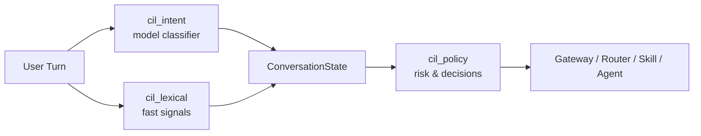
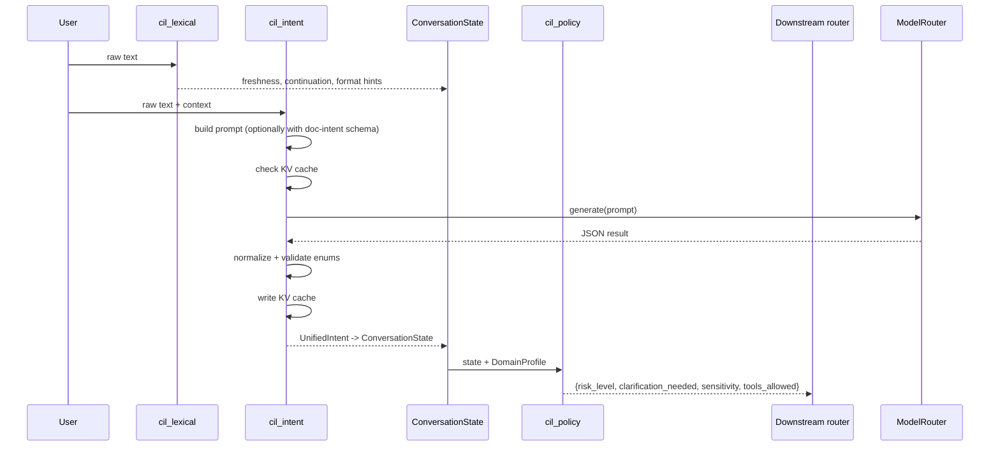

# CIL — Conversation Intelligence Layer

The **Conversation Intelligence Layer (CIL)** is the shared-core semantic-understanding stage of the platform. Its job is to turn a raw user turn into a structured, actionable `ConversationState` that downstream routing, retrieval, tool-use, and response-shaping layers can consume.

CIL is intentionally **regex-free for intent classification**. All high-stakes intent decisions are made by a small, fast model call; deterministic lexical helpers are used only for cheap, low-risk signals such as freshness, continuation, and coarse output-format hints. If the model path fails for any reason, CIL degrades to safe static defaults rather than falling back to keyword matching or crashing.

## What CIL does

1. **Understands** the user turn (complexity, domain, continuation, tone, language, sentiment).
2. **Detects needs** (tools, retrieval/RAG, freshness, output format, document generation).
3. **Suggests routing** (`chat`, `skill`, `agent`, `analyse`) with optional skill/agent hints.
4. **Derives policy decisions** (risk level, sensitivity, whether clarification is required, whether tools are allowed).

## Where CIL fits

CIL sits between the incoming chat/workflow request and the rest of the platform:

- **Upstream**: chat endpoints, workflow chat, agent runner, and any other component that receives natural-language input.
- **Downstream**: the gateway/router, [model_routing](model_routing.md), [context_engine](context_engine.md), tool dispatch, and document-generation pipelines.

CIL depends on:

- [model_routing](model_routing.md) — `models/model_router.py` supplies the model cascade used by `cil/intent.py`.
- [kv_store](kv_store.md) — `core/kv` provides the cache backend for intent classification results.
- [core_infrastructure](core_infrastructure.md) — `core/config.py` and `core/logger.py` for configuration and logging.

## Architecture

### Design tenets

| Tenet | How it is enforced |
|-------|--------------------|
| **Model-only intent** | `cil/intent.py` classifies via a single LLM call; no regex/keyword intent detection. |
| **Fail-safe** | Any failure in classification or policy derivation returns safe defaults and never raises. |
| **Additive intelligence** | Lexical signals are cheap hints; they do not override the model. |
| **Domain = policy** | Domain-specific behavior is expressed through `DomainProfile` knobs, not retrained classifiers. |
| **Observable state** | Every turn produces a single `ConversationState` object with provenance and confidence. |

### Data flow

### Classification cache

`cil/intent.py` caches the full `UnifiedIntent` result in the configured KV store (see [kv_store](kv_store.md)). The cache key is a SHA-256 hash of every input that can change the classification: text, `rag_mode`, `history_summary`, attachment presence, document-memory summary, chat-context flag, the last five recent turns, and whether doc-intent is included. This makes a cache hit provably identical to a fresh model call. The cache is best-effort: failures are logged and the call continues uncached.

## Sub-modules

| Sub-module | Responsibility | Doc |
|------------|----------------|-----|
| `cil_intent` | Model-only turn classification, JSON normalization, and mapping to `ConversationState`. | [cil_intent.md](cil_intent.md) |
| `cil_lexical` | Fast, deterministic lexical signals: freshness, continuation, and coarse output-format hints. | [cil_lexical.md](cil_lexical.md) |
| `cil_policy` | Pure-function policy decisions (risk, clarification, sensitivity, tool allowance) from state + profile. | [cil_policy.md](cil_policy.md) |

## Key concepts

### `ConversationState`

The canonical output shape of CIL. It lives in `cil/state.py` and is populated by `cil_intent` (and optionally enriched by `cil_lexical`). It contains:

- Understanding fields: `task_complexity`, `domain`, `is_continuation`, `ambiguity`.
- Need fields: `output_format`, `tool_need`, `retrieval_need`, `freshness_need`.
- Routing fields: `intent` (`chat`/`skill`/`agent`/`analyse`), `skill_hint`, `agent_hint`.
- Document-generation intent: `doc_intent`, `doc_format`, `doc_source_scope`, etc.
- Style/persona signals: `tone`, `formality`, `language`, `sentiment`, `wants_brief`.
- Provenance: `classifier_conf`, `intent_source`, `signal_sources`.

All fields have safe defaults, so a CIL outage degrades to a plain chat answer.

### `DomainProfile`

A pure-data policy knob set used by `cil_policy`. It lets new verticals (finance, legal, HR, etc.) be supported by adding a new profile rather than retraining a classifier. See [cil_policy.md](cil_policy.md) for the full knob set.

### Document-generation intent

When the gateway has detected an artifact signal, `cil_intent` includes a doc-intent schema in its prompt. This merges the responsibilities of `models/doc_intent.py` (see [model_routing](model_routing.md)) into the same model call, letting the platform decide in one shot whether the user wants a downloadable file, what format, and what source scope.

## Configuration

| Environment variable | Default | Purpose |
|----------------------|---------|---------|
| `CIL_INTENT_MODEL` | `local_mini` | Model hint passed to the model router for intent classification. |
| `CIL_INTENT_CACHE_ENABLED` | `true` | Enable/disable the intent classification cache. |
| `CIL_INTENT_CACHE_TTL` | `3600` | Cache TTL in seconds. |
| `CIL_TONE_DETECT` | `true` | Whether to surface tone/formality/language/sentiment signals on `ConversationState`. |

## Failure modes and degradation

| Failure | Behavior |
|---------|----------|
| Model router unavailable | `classify()` returns `None`; caller uses safe static defaults (`medium` complexity, `general` domain, `chat` intent). |
| Bad JSON / invalid enum | Values are clamped to safe defaults; the call still returns a `UnifiedIntent`. |
| KV cache read/write error | Logged at debug; classification continues uncached or without writing. |
| Policy derivation error | `derive_policy()` returns `low` risk, no clarification, profile default sensitivity, no tools. |

## Related documentation

- [cil_intent.md](cil_intent.md) — model-only classifier details.
- [cil_lexical.md](cil_lexical.md) — fast lexical signal helpers.
- [cil_policy.md](cil_policy.md) — policy derivation and `DomainProfile`.
- [model_routing.md](model_routing.md) — model router and `models/doc_intent.py`.
- [kv_store.md](kv_store.md) — caching backend.
- [core_infrastructure.md](core_infrastructure.md) — logging and configuration.
