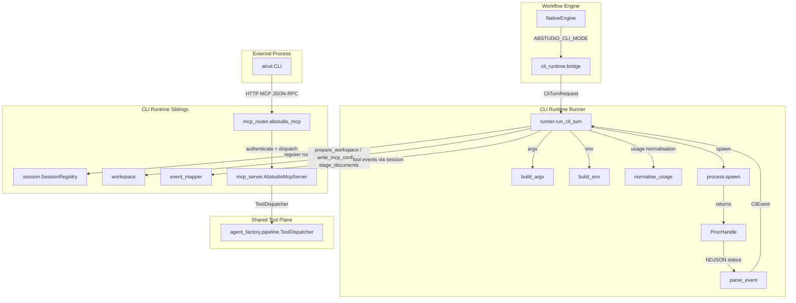
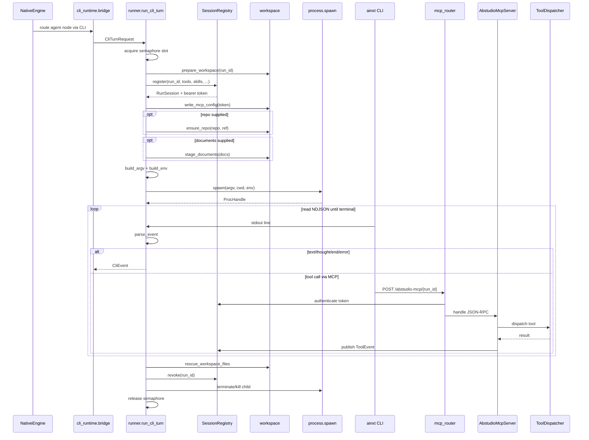
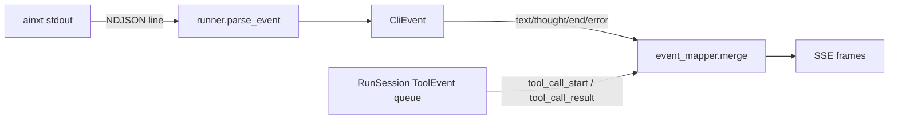
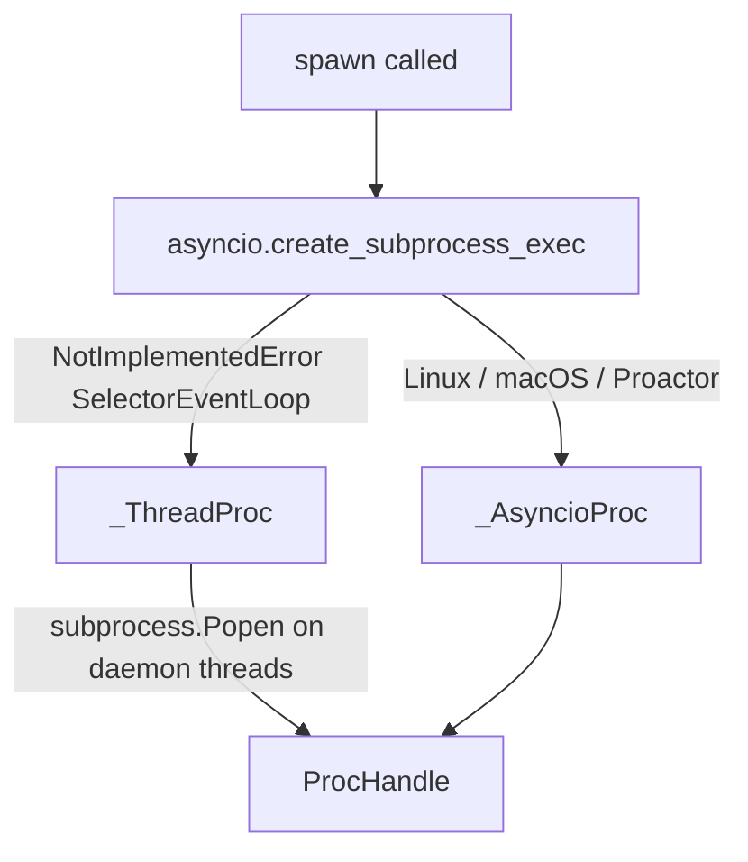
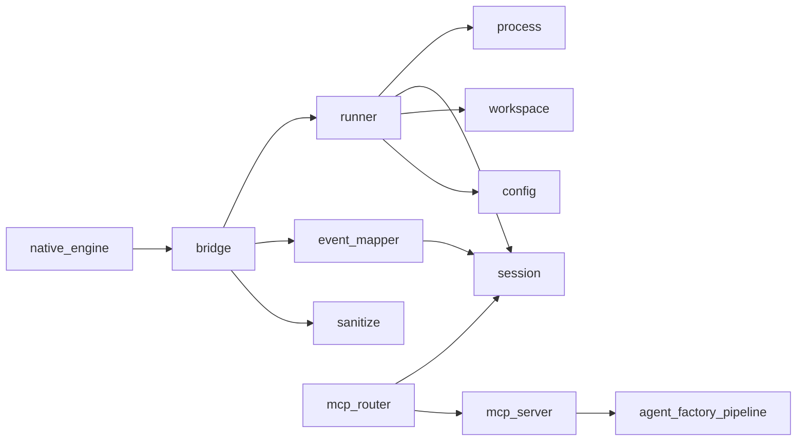
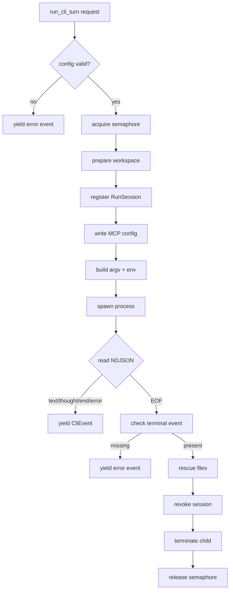

# CLI Runtime Runner

The `cli_runtime_runner` module is the execution core of ABStudio's optional **CLI mode**. It spawns a headless `ainxt` CLI subprocess for each agent turn, negotiates a per-run MCP (Model Context Protocol) session so the CLI can call ABStudio tools, and streams the resulting events back into the native workflow engine's SSE event stream. In short, it lets the platform run agent nodes in an external CLI process while preserving the same tool scope, file handling, and streaming experience that the in-process [native_engine](../reference/engine_native_engine.md) provides.

This module is intentionally narrow: it owns the subprocess lifecycle, argv/env construction, NDJSON event parsing, and process teardown. Tool dispatch, session state, workspace preparation, and event mapping live in sibling modules that the runner coordinates but does not duplicate.

---

## 1. Module Purpose

When `ABSTUDIO_CLI_MODE` is enabled, the [NativeEngine](../reference/engine_native_engine.md) routes individual agent nodes through the CLI runtime instead of its internal ReAct loop. The runner's responsibilities are:

1. **Concurrency control** — cap concurrent CLI subprocesses per worker with a rebuildable semaphore.
2. **Session registration** — create a short-lived, token-authenticated [RunSession](cli_runtime_session.md) before the spawn so the MCP endpoint is ready.
3. **Workspace preparation** — create a private working directory, write the MCP config, optionally clone a git repo, and stage uploaded documents.
4. **Argv / env construction** — build a flag vector verified against the installed `ainxt` binary and an environment that forces folder trust and gateway authentication.
5. **Streaming & parsing** — read NDJSON lines from the CLI and turn them into normalised `CliEvent` objects.
6. **Teardown guarantees** — revoke the session, terminate the child (and its process group), and release the concurrency slot even on cancellation or error.

The runner never raises for expected failures; it yields a terminal `error` event so callers can decide whether to surface the failure or fall back to the native engine.

---

## 2. Architecture

### 2.1 Component Overview

### 2.2 Key Components

| Component | File | Role |
|-----------|------|------|
| `run_cli_turn` | `runner.py` | Public async generator that owns the full turn lifecycle. |
| `build_argv` | `runner.py` | Builds the exact `ainxt` argument vector for the current binary contract. |
| `build_env` | `runner.py` | Builds the child environment, including `AINXT_API_KEY` and `AINXT_FOLDER_TRUST=0`. |
| `parse_event` | `runner.py` | Parses one NDJSON line into a `CliEvent`; ignores unknown/noise lines. |
| `normalise_usage` | `runner.py` | Maps CLI usage keys (`input_tokens`/`output_tokens`) to ABStudio's standard shape. |
| `get_session` | `runner.py` | Looks up a live `RunSession` by `run_id` for the SSE bridge. |
| `spawn` / `ProcHandle` | `process.py` | Cross-platform subprocess abstraction with async + threaded backends. |

---

## 3. Data Flow

### 3.1 Turn Lifecycle

### 3.2 Event Mapping

The CLI emits a small NDJSON event stream (`text`, `thought`, `end`, `error`). The runner parses these into `CliEvent` dataclasses. The [bridge](../cli_runtime_bridge.md) then merges them with tool events from the `RunSession` event queue via [event_mapper.merge](../cli_runtime_events.md), producing the same SSE event names (`agent_token`, `tool_call_start`, `tool_call_result`, `agent_usage`) that the native engine uses.

---

## 4. Process Spawning

`process.py` hides platform differences behind a single `ProcHandle` interface.

### 4.1 Backend Selection

- **`_AsyncioProc`** — preferred on Linux/macOS and Windows ProactorEventLoop. Uses native async I/O and a background stderr drain task to avoid pipe-buffer deadlocks.
- **`_ThreadProc`** — fallback for Windows SelectorEventLoop (installed by `app/main.py`), which cannot create asyncio subprocesses. Two daemon threads pump stdout/stderr; stdout is forwarded into an `asyncio.Queue` via `call_soon_threadsafe`.

### 4.2 Process Group Signalling

On POSIX, `spawn` passes `start_new_session=True`, so the CLI runs in its own process group. `_signal_group` sends `SIGTERM`/`SIGKILL` to the whole group, preventing orphaned helper processes. On Windows it falls back to signalling the direct child.

---

## 5. Argv and Environment

### 5.1 Verified Flag Contract

`build_argv` emits only flags confirmed against the installed `ainxt` binary. The current contract (verified on `0.2.101`) includes:

| Flag | Purpose |
|------|---------|
| `--single <prompt>` / `--prompt-file <path>` | One-turn headless prompt. |
| `--output-format streaming-json` | NDJSON event stream. |
| `--model <model>` | Model override. |
| `--permission-mode <mode>` | `acceptEdits`, `plan`, `auto`, etc. |
| `--max-turns <n>` | Turn cap. |
| `--cwd <workspace>` | Working directory. |
| `--allow MCPTool(server__*)` | Pre-authorise the per-run MCP server. |
| `--verbatim` | Do not rewrite the prompt. |
| `--no-plan` | ABStudio drives orchestration. |
| `--no-subagents` | Sub-agent delegation stays in-process. |
| `--resume <sessionId>` | Continue a prior CLI session. |

### 5.2 Load-Bearing Environment Variables

`build_env` sets:

- `AINXT_API_KEY` — gateway credential for LLM traffic.
- `AINXT_FOLDER_TRUST=0` — required; without it the CLI silently skips repo-local MCP servers.
- `NO_COLOR=1`, `FORCE_COLOR=0`, `TERM=dumb` — keeps ANSI escapes out of NDJSON.

---

## 6. Error Handling and Teardown

`run_cli_turn` guarantees exactly one terminal `end` or `error` event. The teardown order in `finally` is deliberate:

1. Revoke the session (closes the MCP endpoint).
2. Terminate/kill the child if still running.
3. Release the semaphore slot.

Cancellation (`asyncio.CancelledError`) propagates after the child is killed, so a stopped request is not reported as successful. Expected failures (missing binary, bad API key, timeout, non-zero exit) become `error` events rather than exceptions.

### 6.1 Exit-Code Mapping

`_EXIT_REASONS` maps common CLI exit codes to operator-actionable messages:

| Code | Meaning |
|------|---------|
| 1 | General CLI error |
| 2 | Argument mismatch (binary version drift) |
| 3 | Authentication failure |
| 124 | Self-terminated due to lack of progress |
| 130 | Interrupted |

---

## 7. Integration with the Rest of the System

### 7.1 Triggered From the Native Engine

[NativeEngine._run_agent_via_cli](../reference/engine_native_engine.md) decides whether to route an agent node through the CLI. It builds an `AgentTurnSpec` and calls [cli_runtime.bridge.run_agent_turn_via_cli](../cli_runtime_bridge.md). The bridge converts that into a `CliTurnRequest` and invokes `run_cli_turn`.

### 7.2 Tool Plane

The CLI discovers tools through the per-run MCP server configured in the workspace. HTTP MCP requests hit [mcp_router.abstudio_mcp](../cli_runtime_mcp.md), which authenticates the bearer token against [SessionRegistry](cli_runtime_session.md) and dispatches to [AbstudioMcpServer](../cli_runtime_mcp.md). The server calls [agent_factory.pipeline.ToolDispatcher](../agents/agent_factory_pipeline.md), the same dispatcher used by the native engine.

### 7.3 Workspace and File Handling

[workspace.prepare_workspace](../cli_runtime_workspace.md) creates the private directory. The runner may also:

- Clone a git repo into `<workspace>/repo` via [ensure_repo](../cli_runtime_workspace.md).
- Stage uploaded documents into `<workspace>/inputs/` via [stage_documents](../cli_runtime_workspace.md).
- Write large prompts to a file via [write_prompt_file](../cli_runtime_workspace.md).
- Rescue model-written files into the generated-files store via [rescue_workspace_files](../cli_runtime_workspace.md).

### 7.4 Event Streaming

[cli_runtime.bridge](../cli_runtime_bridge.md) and [event_mapper](../cli_runtime_events.md) translate CLI events and tool events into the SSE vocabulary the frontend already understands. The runner itself only exposes raw `CliEvent` objects; normalisation into `agent_token`, `tool_call_start`, `tool_call_result`, etc. happens upstream.

### 7.5 Configuration

All knobs are read from environment variables by [cli_runtime.config](../cli_runtime_config.md) and snapshotted into a `CliRuntimeConfig` at turn start. Key settings include `ABSTUDIO_CLI_PATH`, `ABSTUDIO_CLI_API_KEY`, `ABSTUDIO_CLI_MAX_CONCURRENCY`, `ABSTUDIO_CLI_RUN_TIMEOUT_S`, and `ABSTUDIO_CLI_PROMPT_FILE_THRESHOLD`.

---

## 8. Mermaid Summary Diagrams

### 8.1 Module Dependency Graph

### 8.2 Runner Internal Flow

---

## 9. References

- [cli_runtime_session.md](cli_runtime_session.md) — `RunSession` and `SessionRegistry`.
- [cli_runtime_workspace.md](../cli_runtime_workspace.md) — workspace preparation, MCP config, git clone, document staging.
- [cli_runtime_mcp.md](../cli_runtime_mcp.md) — MCP router and server (`abstudio_mcp`, `AbstudioMcpServer`).
- [cli_runtime_events.md](../cli_runtime_events.md) — event mapping and SSE conversion.
- [cli_runtime_bridge.md](../cli_runtime_bridge.md) — `AgentTurnSpec` and the bridge from `NativeEngine` to the runner.
- [cli_runtime_config.md](../cli_runtime_config.md) — environment-based configuration.
- [engine_native_engine.md](../reference/engine_native_engine.md) — the in-process engine that delegates to this module.
- [agent_factory_pipeline.md](../agents/agent_factory_pipeline.md) — shared `ToolDispatcher` used by the MCP server.
