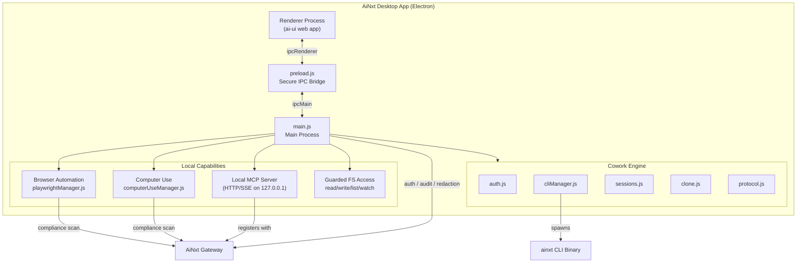
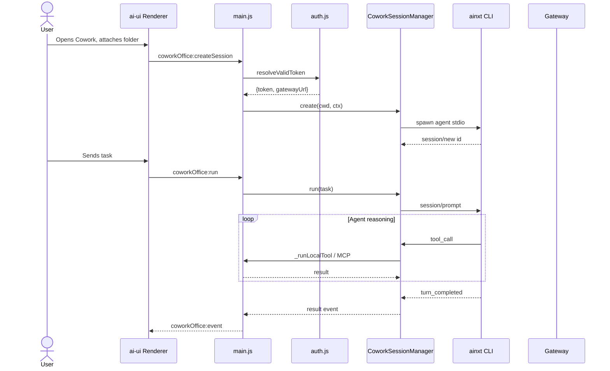
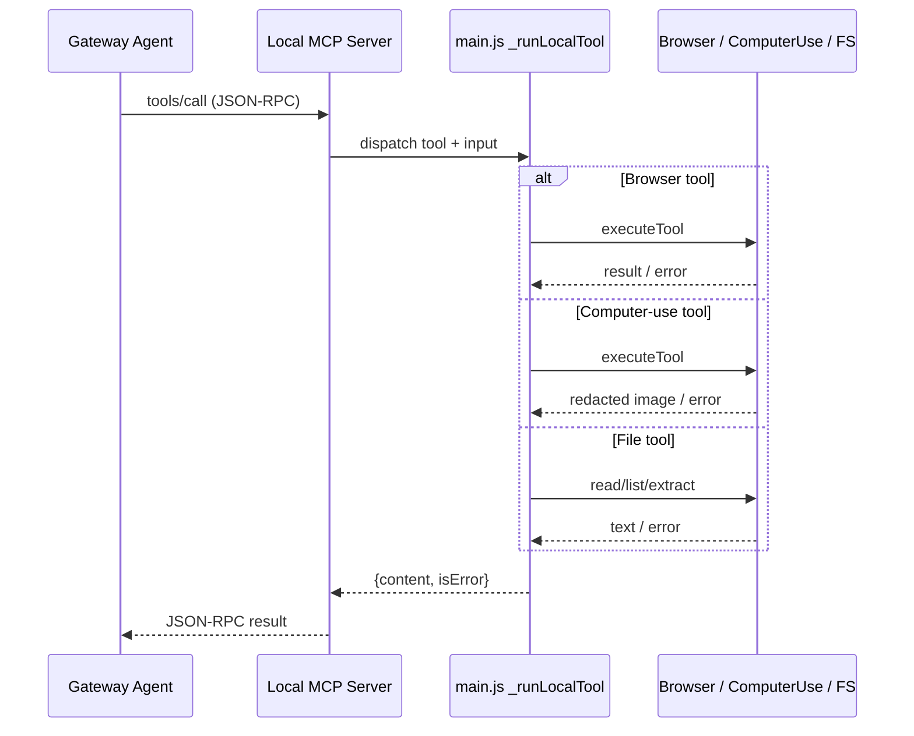

# Desktop App Module

## Overview

The `desktop_app` module is the **Electron-based desktop client** for the AiNxt platform. It wraps the web application in a native window and adds local-only capabilities that a browser cannot provide: direct filesystem access, local agent execution via the AiNxt CLI, browser automation through Playwright, native OS computer-use controls, and a local MCP (Model Context Protocol) server that exposes these capabilities to the gateway-side agent.

The desktop app is designed around two primary usage modes:

1. **Cowork Office** — a local full-agent mode that runs the AiNxt CLI on the user's machine, enabling multi-turn conversations, connector-based office tasks, and (when enabled) browser/computer-use automation.
2. **Code / Dev Agent** — a local coding agent that operates inside an open workspace folder, reading and editing files, running safe terminal commands, and maintaining conversation history.

Security and compliance are central to the design: every mutating local action requires user confirmation, screenshots and extracted text are sent to the gateway for PII/PAN redaction before entering the agent context, and all actions are audited. The app also enforces a strict host allowlist for browser navigation and scopes filesystem access to user-selected workspace folders.

## Architecture

### Key Design Decisions

- **Electron main/renderer split**: The renderer hosts the same `ai-ui` web application served by the gateway, while the main process holds Node/Electron privileges and exposes them through a narrow, typed IPC bridge defined in `preload.js`.
- **Gateway-first auth**: The desktop reuses the user's existing web session or CLI API key. Tokens are validated against the gateway's `/auth/me` endpoint; long-lived API keys are encrypted at rest with the OS keychain/DPAPI via `safeStorage`.
- **Fail-safe / fail-closed redaction**: Text extraction is redacted before entering the agent context, and if redaction fails the original text is still returned (read path). Screenshots, by contrast, are fail-closed: if image redaction is unavailable, the raw screenshot is never returned.
- **Per-action confirmation**: Mutating actions such as clicks, typing, file writes, and terminal commands pop native confirmation dialogs. Native computer-use additionally requires an admin master switch.
- **ESC kill-switch**: While a Cowork office turn is running with computer-use or dev-tools enabled, pressing Escape aborts the agent, closes the browser, and stops native control.

## Sub-modules

| Sub-module | Purpose | File(s) | Documentation |
|------------|---------|---------|---------------|
| `desktop_app_browser_automation` | Drive a real browser on the user's machine for web tasks not covered by connectors. | `desktop/src/browser/playwrightManager.js`, `desktop/playwrightManager.js` | [desktop_app_browser_automation.md](desktop_app_browser_automation.md) |
| `desktop_app_computer_use` | Native OS control (mouse, keyboard, screenshots) for legacy/desktop apps. | `desktop/src/computeruse/computerUseManager.js` | [desktop_app_computer_use.md](desktop_app_computer_use.md) |
| `desktop_app_cowork_engine` | Authentication, CLI session management, protocol selection, Git clone, and session history. | `desktop/src/cowork/auth.js`, `cliManager.js`, `clone.js`, `protocol.js`, `sessions.js` | [desktop_app_cowork_engine.md](../buddy/desktop_app_cowork_engine.md) |
| `desktop_app_main_process` | Electron main process: window, tray, shortcuts, MCP server, IPC handlers, document extraction, and lifecycle. | `desktop/src/main.js` | [desktop_app_main_process.md](desktop_app_main_process.md) |
| `desktop_app_preload_bridge` | Secure context-bridge exposing only the approved API surface to the renderer. | `desktop/src/preload.js` | [desktop_app_preload_bridge.md](../desktop_app_preload_bridge.md) |

## Data Flows

### Cowork Office Turn

### Local MCP Tool Call

## Integration with Other Modules

- **ai_ui_frontend**: The desktop renderer loads the same `ai-ui` SPA. The preload bridge exposes `window.ainxtDesktop` so the web components can detect the desktop surface and call local APIs. See [ai_ui_frontend.md](../ui/ai_ui_frontend.md).
- **gateway**: The desktop depends on the gateway for authentication (`/auth/me`, `/auth/sso/desktop/*`), compliance redaction (`/compliance/scan`, `/compliance/scan-image`), audit logging (`/cowork/computer-use/audit`), and MCP registration (`/desktop/register-mcp`). See [gateway.md](../models/gateway.md).
- **shared_core / shared_integrations**: Local tools such as browser automation and computer-use are conceptually extensions of the agent tool surface documented in [shared_integrations.md](../reference/shared_integrations.md) and [shared_core.md](../reference/shared_core.md), but they execute on the client machine rather than the server.
- **mcp_servers**: The local MCP server implements a subset of the same protocol used by the standalone MCP servers; it is consumed by the gateway agent. See [mcp_servers.md](../mcp/mcp_servers.md).

## Security & Compliance Summary

| Concern | Control |
|---------|---------|
| Browser navigation | Host allowlist (`browserAllowlist`); empty list allows HTTPS/localhost only and audits. |
| Mutating browser actions | Native confirmation dialog per click/type/select. |
| Screenshots | Gateway image redaction; fail-closed if unavailable. |
| Native computer-use | Master switch off by default; per-action confirm; OS Accessibility/Screen-Recording permissions required. |
| Filesystem | Scoped to watched workspace roots; traversal outside roots is rejected. |
| Terminal | Allow-list of safe commands only; disabled for Cowork office surface. |
| Credentials | Long-lived API keys encrypted with OS-backed `safeStorage`; Git clone tokens stripped from persisted remotes. |
| Audit | Every local tool action posts action + target (never values) to the gateway audit endpoint. |
| Quit | `before-quit` defers exit to let the renderer flush the active conversation. |

## Operational Notes

- **Environment overrides**: Several behaviors are controlled by environment variables so portable/SIT builds can be reconfigured without code changes:
  - `AINXT_GATEWAY_URL` — authoritative gateway base URL.
  - `AINXT_API_PREFIX` — gateway API path prefix (default `/ainxt/v1/api`).
  - `AINXT_UI_PATH` — SPA base path (default `/portal/`).
  - `AINXT_TLS_INSECURE` — bypass TLS verification for self-signed certs (SIT only).
  - `AINXT_CLI_PROTOCOL` — select old `streamjson` or new `acp` CLI protocol.
  - `AINXT_CLI_TRACE` — write raw CLI stdin/stdout to `~/.ainxt/cli-trace.log`.
- **Protocol duality**: The Cowork engine supports two CLI wire protocols. `streamjson` is the production default; `acp` is opt-in for testing. See [desktop_app_cowork_engine.md](../buddy/desktop_app_cowork_engine.md).
- **Browser launch strategy**: Playwright prefers the system browser (Edge on Windows, Chrome on macOS/Linux) and falls back to a Playwright-managed Chromium, avoiding bundled browser binaries in the installer.
