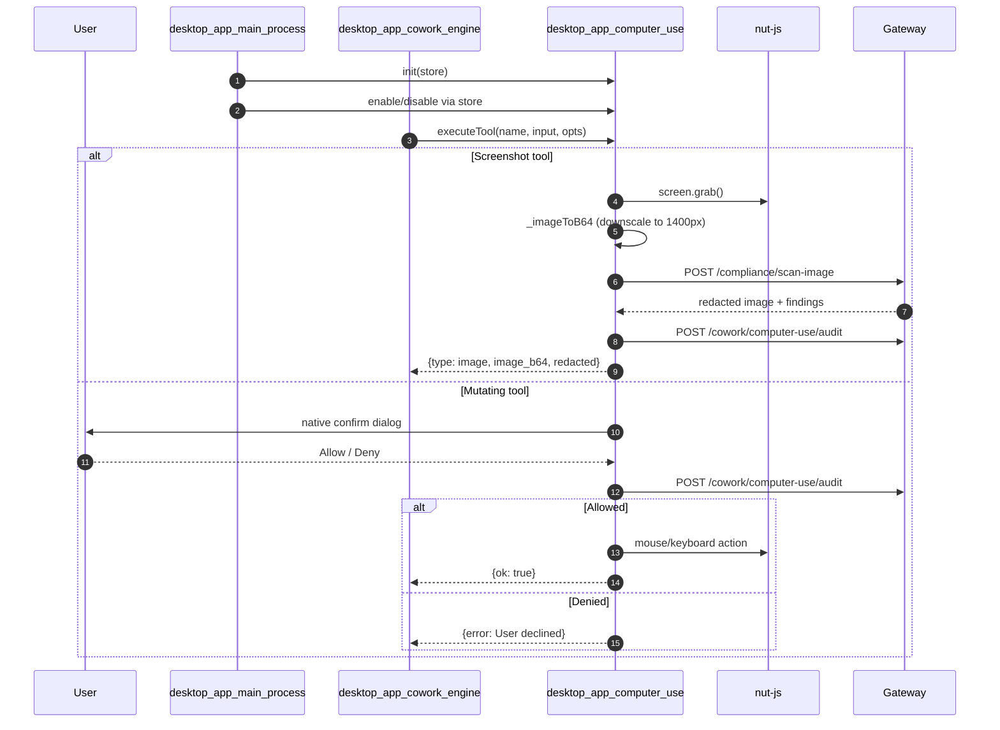
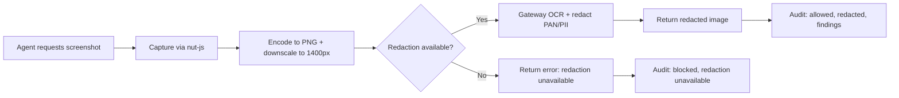
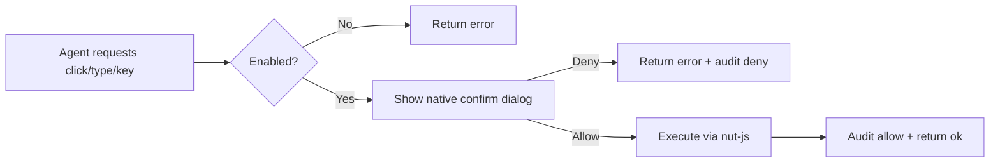

# desktop_app_computer_use

## Brief Introduction

The `desktop_app_computer_use` module provides **native OS-level automation for the AiNxt Cowork desktop agent**. It allows the agent to control the user's machine — move and click the mouse, type text, press keys, and capture screenshots — so it can drive legacy or desktop applications that lack an API or connector.

This module is part of the [desktop_app](desktop_app.md) family and is built for a governed enterprise environment. It enforces strict guardrails to ensure that no sensitive data (such as PAN numbers or PII) leaks into the agent context, and that every mutating action requires explicit user approval.

The module is implemented in `desktop/src/computeruse/computerUseManager.js` and uses the `@nut-tree-fork/nut-js` library for cross-platform mouse, keyboard, and screen control.

---

## Core Responsibilities

| Responsibility | Description |
|----------------|-------------|
| **Native OS automation** | Move/click mouse, type text, press keys, scroll, and capture screenshots. |
| **Tool registration** | Exposes six `computer_*` tools that the Cowork agent can invoke. |
| **User consent** | Requires a native Yes/No dialog for every mutating action. |
| **PII/PAN redaction** | Sends screenshots to the gateway for OCR-based redaction before returning them to the agent. |
| **Audit logging** | Records every action (allow/deny, target, redaction status) to the gateway. |
| **Master switch** | Computer-use is disabled by default and must be explicitly enabled via `electron-store`. |

---

## Architecture

```mermaid
flowchart TB
    subgraph DesktopApp["AiNxt Desktop App"]
        Main[desktop_app_main_process<br/>main.js]
        Cowork[desktop_app_cowork_engine<br/>cliManager.js]
        CompUse[desktop_app_computer_use<br/>computerUseManager.js]
        Browser[desktop_app_browser_automation<br/>playwrightManager.js]
        Store[(electron-store)]
        Nut[(@nut-tree-fork/nut-js)]
        Dialog[(Electron dialog)]
    end

    subgraph Gateway["AiNxt Gateway"]
        Compliance[compliance_scan_router<br/>/compliance/scan-image]
        Audit[cowork_usage_router<br/>/cowork/computer-use/audit]
    end

    Main -->|initializes| CompUse
    Main -->|arms ESC kill-switch| CompUse
    Cowork -->|invokes tool| CompUse
    CompUse -->|reads| Store
    CompUse -->|shows confirm| Dialog
    CompUse -->|drives OS| Nut
    CompUse -->|POST screenshot| Compliance
    CompUse -->|POST audit| Audit
    Browser -.->|similar audit/redact| Compliance
```

### Component Interaction



---

## Core Components

### `init(store)` / `_init`

Initializes the module with an `electron-store` instance. The store is used to read the `computerUseEnabled` master switch.

```javascript
function _init(store) { _store = store; }
```

### `executeTool(name, input, opts)`

The main entry point invoked by the Cowork engine. It validates the master switch, loads the native library, and dispatches to the appropriate tool handler.

**Parameters:**
- `name` — tool name (e.g., `computer_click`)
- `input` — tool arguments (e.g., `{x, y, button}`)
- `opts` — runtime options including `gatewayBase`, `jwt`, `sessionId`, `userDept`

**Returns:**
- `{ok: true}` for successful mutating actions
- `{type: "image", image_b64, redacted, findings}` for screenshots
- `{error: "..."}` on failure, denial, or missing prerequisites

### `isComputerUseTool(name)`

Utility to check whether a given tool name belongs to the computer-use namespace.

### `TOOLS` / `NAMES`

The six exposed tools and their schema definitions. See [Tool Reference](#tool-reference) below.

---

## Tool Reference

| Tool | Description | Requires Confirm | Mutating |
|------|-------------|------------------|----------|
| `computer_screenshot` | Capture the screen. Image is compliance-redacted before return. | No | No |
| `computer_click` | Move mouse to `(x, y)` and click. | Yes | Yes |
| `computer_type` | Type text at the current cursor. | Yes | Yes |
| `computer_key` | Press a key or chord (e.g., `cmd+c`). | Yes | Yes |
| `computer_move` | Move mouse to `(x, y)` without clicking. | No | No |
| `computer_scroll` | Scroll the mouse wheel. | No | Yes |

> **Note:** `computer_type` deliberately never logs the typed text. The audit record uses the placeholder `(text)`.

---

## Security Guardrails

The module implements five NPCI-mandated guardrails, all enforced locally before any action runs:

1. **Master switch** — Computer-use is OFF unless `computerUseEnabled` is set to `true` in `electron-store`.
2. **Per-action confirmation** — Every mutating action (`click`, `type`, `key`) pops a native Yes/No dialog.
3. **Screenshot redaction** — Screenshots are sent to the gateway's `/compliance/scan-image` endpoint for PAN/PII redaction. If redaction is unavailable, the raw screenshot is **never** returned.
4. **Audit trail** — Every action (allow/deny, target, findings count, redaction status) is recorded via `/cowork/computer-use/audit`.
5. **No credential autofill** — Typing into obvious credential fields is left to the user's discretion via the confirmation dialog.

Additionally, the [desktop_app_main_process](desktop_app_main_process.md) arms an **ESC kill-switch** whenever computer-use is enabled, allowing the user to abort the agent instantly.

---

## Data Flow

### Screenshot Flow



### Mutating Action Flow



---

## Dependencies

### Runtime Dependencies

| Dependency | Purpose |
|------------|---------|
| `@nut-tree-fork/nut-js` | Native mouse, keyboard, and screen capture. Loaded lazily; if missing, tools return a clear error. |
| `electron` | `dialog` for confirmation boxes and `Notification` for kill-switch feedback. |
| `electron-store` | Persists the `computerUseEnabled` master switch. |
| `jimp` | Encodes raw screen buffers to PNG and downscales high-DPI screenshots. |

### Module Dependencies

| Module | Relationship |
|--------|--------------|
| [desktop_app_main_process](desktop_app_main_process.md) | Initializes the module, manages the master switch, and arms the ESC kill-switch when computer-use is enabled. |
| [desktop_app_cowork_engine](../buddy/desktop_app_cowork_engine.md) | Invokes `executeTool` on behalf of the Cowork CLI session. |
| [desktop_app_browser_automation](desktop_app_browser_automation.md) | Shares the same audit/redaction gateway endpoints and confirmation patterns. |
| [compliance_scan_router](../api/compliance_scan_router.md) | Provides `/compliance/scan-image` for screenshot PAN/PII redaction. |
| [cowork_usage_router](../api/cowork_usage_router.md) | Provides `/cowork/computer-use/audit` for recording action audit events. |

---

## Integration with Cowork Sessions

The module is consumed by the Cowork engine in `desktop/src/cowork/cliManager.js`. When the ACP CLI sends a `session/request_permission` or `agent/confirm` message for a computer-use tool, the desktop app surfaces the native dialog. The result is routed back through the Cowork session manager.

The [desktop_app_main_process](desktop_app_main_process.md) also registers a global `Escape` shortcut when computer-use is enabled. Pressing ESC disposes all Cowork office sessions and closes the browser automation context, providing an immediate emergency stop.

---

## Error Handling

| Scenario | Behavior |
|----------|----------|
| Computer-use disabled | Returns error and audits the block reason. |
| `nut-js` not installed | Returns installation instructions without crashing. |
| Missing OS permissions | Underlying `nut-js` call throws; caught and returned as a clear error. |
| Redaction service unavailable | Screenshot is **not** returned. Returns error and audits. |
| User denies action | Returns error and audits the denial. |
| Unknown tool name | Returns `Unknown computer-use tool: {name}`. |

All errors are caught inside `executeTool` so that a failed tool does not crash the Cowork session.

---

## Configuration

The module reads a single setting from `electron-store`:

```json
{
  "computerUseEnabled": true
}
```

This is typically toggled through the desktop app's settings UI or via administrator policy. Until the setting is enabled and the user grants macOS Accessibility & Screen-Recording permissions, every tool returns a clear "not available" message.

---

## Related Documentation

- [desktop_app](desktop_app.md) — Parent module overview.
- [desktop_app_main_process](desktop_app_main_process.md) — Electron main process integration.
- [desktop_app_cowork_engine](../buddy/desktop_app_cowork_engine.md) — Cowork CLI session management.
- [desktop_app_browser_automation](desktop_app_browser_automation.md) — Browser automation with shared audit/redaction patterns.
- [compliance_scan_router](../api/compliance_scan_router.md) — Gateway image/text redaction service.
- [cowork_usage_router](../api/cowork_usage_router.md) — Gateway computer-use audit endpoint.
