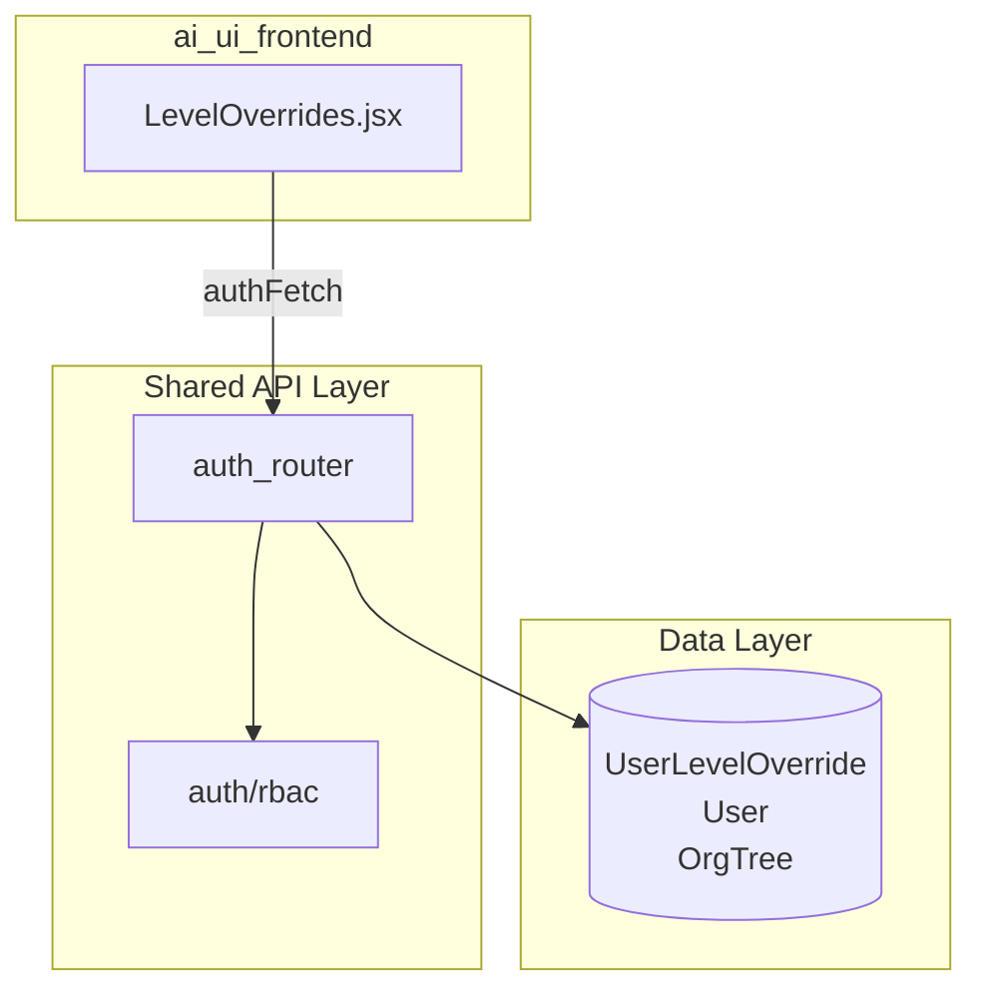
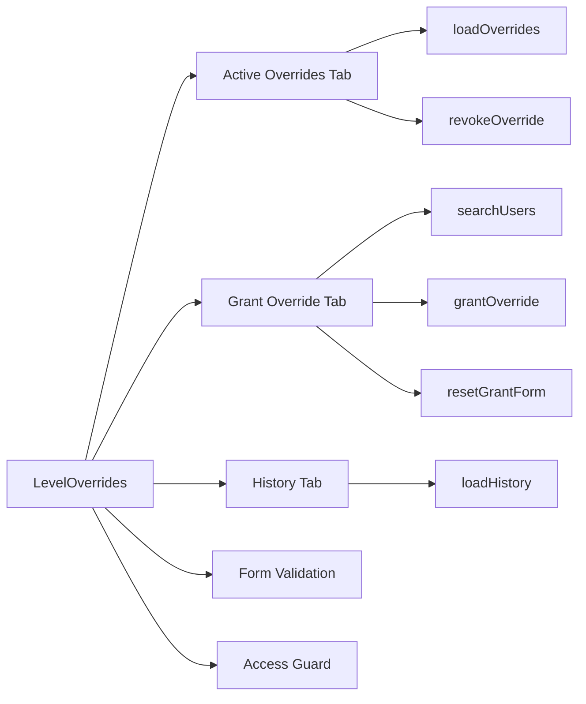
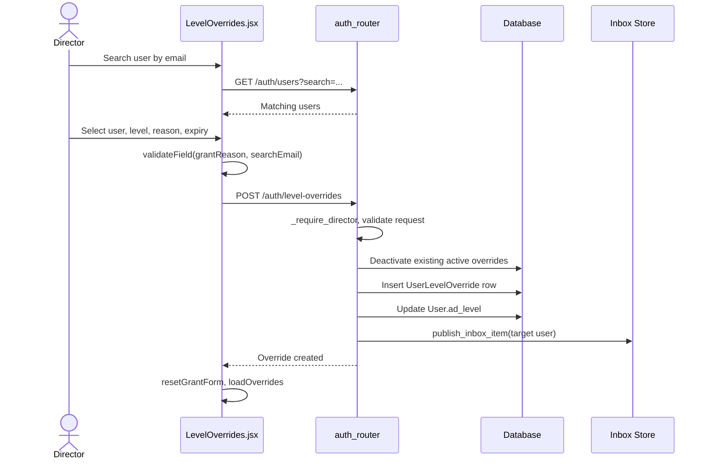
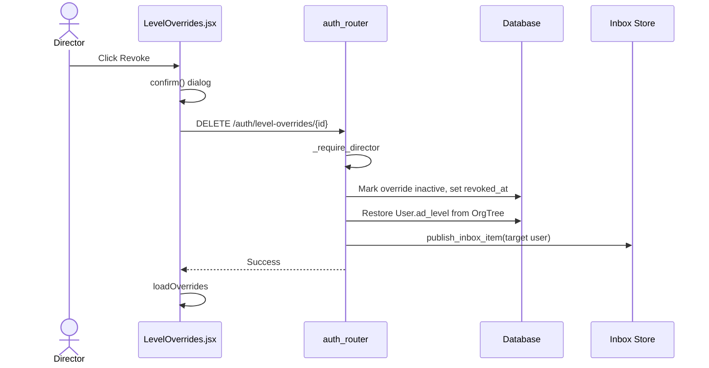
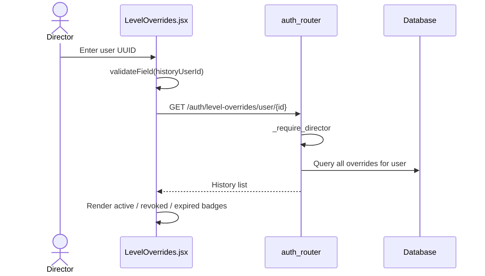
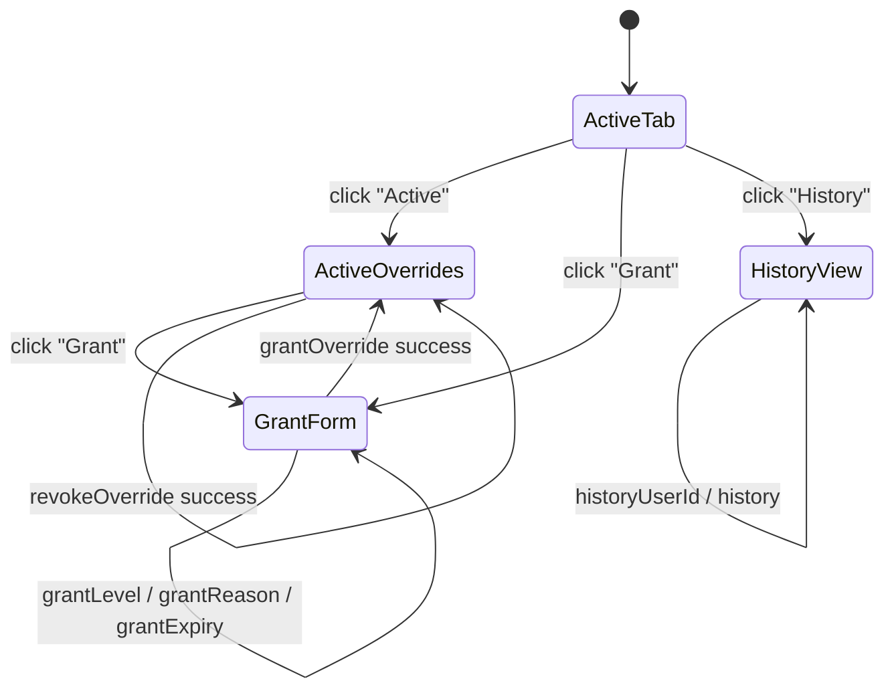
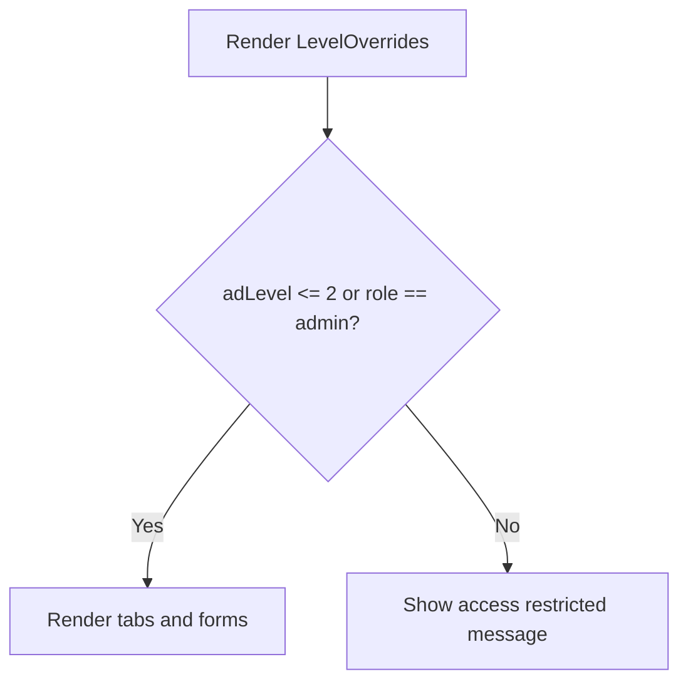
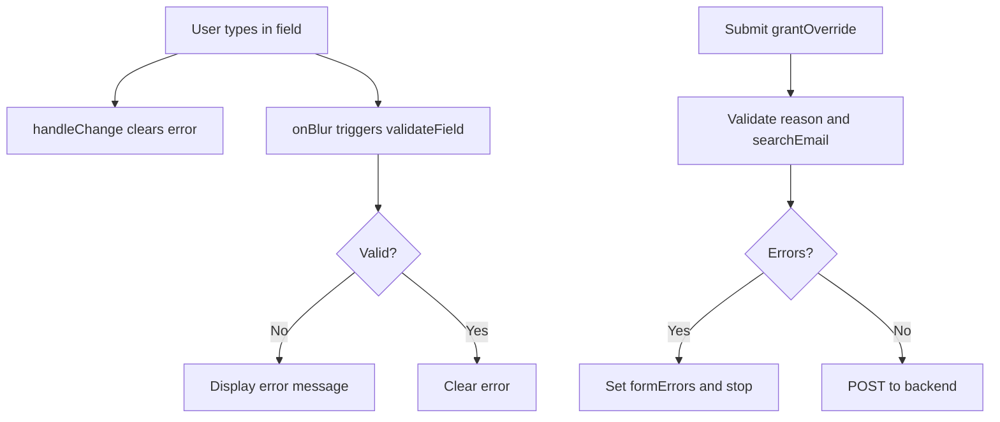
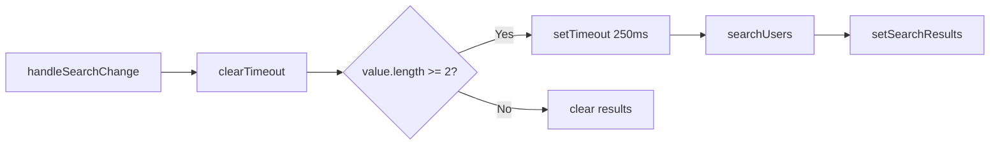

# Level Overrides Module

## Brief Introduction

The **Level Overrides** module provides a self-service UI for directors and administrators to temporarily promote a user's effective AD (Active Directory / org-tree) level. It is implemented as a React component in the `ai-ui` frontend and is backed by the shared `auth_router` API. Overrides are persisted in the `UserLevelOverride` table, survive the nightly `org_tree` sync, and can be revoked at any time to restore the user's original level.

This module is part of the broader [ai_ui_frontend](../ui/ai_ui_frontend.md) application and is closely related to the [auth](../security/auth.md), [user_management](../reference/user_management.md), and [budget_manager](../models/budget_manager.md) modules, all of which rely on AD level for access control and approval workflows.

---

## Core Functionality

### What It Does

1. **Lists active overrides** — Directors and admins can see all currently active level overrides, including the target user, granted level, original level, grantor, reason, and expiry.
2. **Grants a new override** — Search for a user by email, choose a target level (constrained by the granter's own level), provide a reason, and optionally set an expiry.
3. **Revokes an override** — Restore the user's AD level to the value in the org tree and mark the override as inactive.
4. **Views per-user history** — Look up the full override history for a specific user ID, including active, revoked, and expired entries.

### Access Control

- Visible only to users whose `ad_level` is `0`, `1`, or `2` (Director+) **or** users with the `admin` role.
- A non-admin granter can only grant levels **greater than or equal to their own level** (lower numbers are more senior; e.g., an L2 director can grant L2–L6 but not L0 or L1).
- Admins bypass the level constraint and can grant any level `0–6`.

### Level Labels

| Level | Label |
|-------|-------|
| 0 | L0 – Executive |
| 1 | L1 – VP |
| 2 | L2 – Director |
| 3 | L3 – Senior Manager |
| 4 | L4 – Manager |
| 5 | L5 – Senior Engineer |
| 6 | L6 – Engineer |

---

## Architecture

### High-Level Placement

### Component Responsibilities

### Key Files

| File | Responsibility |
|------|----------------|
| `ai-ui/src/components/LevelOverrides.jsx` | Main React component for the level-override UI. |
| `routers/auth_router.py` | Backend endpoints: `list_level_overrides`, `create_level_override`, `revoke_level_override`, `get_user_override_history`. |
| `auth/rbac.py` | `require_level` and `_role_level` helpers used across the platform for level-based access control. |
| `ai-ui/src/config.js` | `authFetch` wrapper used for authenticated API calls. |
| `ai-ui/src/utils/securityValidation.js` | Input validation helpers (`validateDescription`, `validateSecurity`). |
| `ai-ui/src/components/ui/DialogProvider.jsx` | `useConfirm` hook for the revoke confirmation dialog. |

---

## Data Flow

### Granting an Override

### Revoking an Override

### Loading History

---

## Component Interaction

### Internal State

### Dependencies on Other Modules

| Dependency | Module | Usage |
|------------|--------|-------|
| `authFetch` | [config](../infrastructure/config.md) | Authenticated HTTP requests to the backend. |
| `useAuth` / `AuthContext` | [auth](../security/auth.md) | Read current user's `ad_level` and `role` for access guard and level constraints. |
| `useConfirm` | [ui_dialog](../ui/ui_dialog.md) | Confirmation dialog before revoking an override. |
| `validateDescription`, `validateSecurity` | [ai_ui_frontend_utils](../ui/ai_ui_frontend_utils.md) | Client-side input validation for reason, email, and user ID fields. |
| `toISTDate` | [ai_ui_frontend_utils](../ui/ai_ui_frontend_utils.md) | Format timestamps in active and history tables. |
| `_require_director` | [auth_router](../api/auth_router.md) | Backend guard ensuring only director-level users or admins can manage overrides. |
| `UserLevelOverride`, `User`, `OrgTree` | [database](../storage/database.md) | Persistence of overrides and restoration of original levels. |

---

## Process Flows

### Access Guard

### Form Validation

### Search-As-You-Type

---

## Security & Governance

- **Client-side validation**: Reason, email, and user ID fields are validated using `validateDescription` and `validateSecurity` to mitigate XSS and SQL injection. Email validation filters out special-character errors because `@` and `.` are valid.
- **Server-side validation**: The backend re-validates the request with `validate_level_override_request` and enforces the granter-level constraint.
- **Principle of least privilege**: Non-admin users cannot grant a level more senior than their own.
- **Audit trail**: Every override is stored in `UserLevelOverride`, including the original level, grantor, reason, timestamps, and active status.
- **Notifications**: Target users receive an inbox notification when an override is granted or revoked.
- **Survives org sync**: Overrides are designed to survive the nightly `org_tree` TRUNCATE+INSERT operation because the effective level is stored on the `User` record and the override row itself is not tied to the org-tree import.

---

## How It Fits Into the System

The Level Overrides module is a small but critical piece of the platform's authorization model. It enables temporary delegation of seniority without permanently modifying the org tree. Downstream features that rely on `ad_level` — such as budget approvals, HOD allocations, governance actions, and model governance — automatically respect the elevated level because the platform reads the effective `ad_level` from the `User` record.

For more details on how levels are enforced across the platform, see the [auth](../security/auth.md) and [auth_router](../api/auth_router.md) documentation. For the broader user-management surface, see [user_management](../reference/user_management.md).
