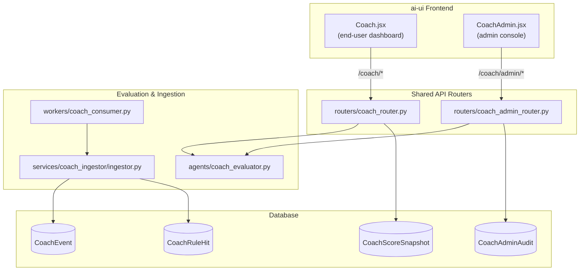
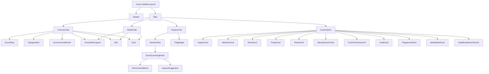
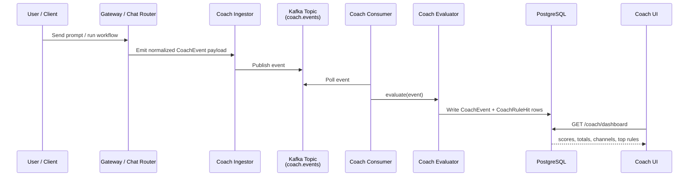
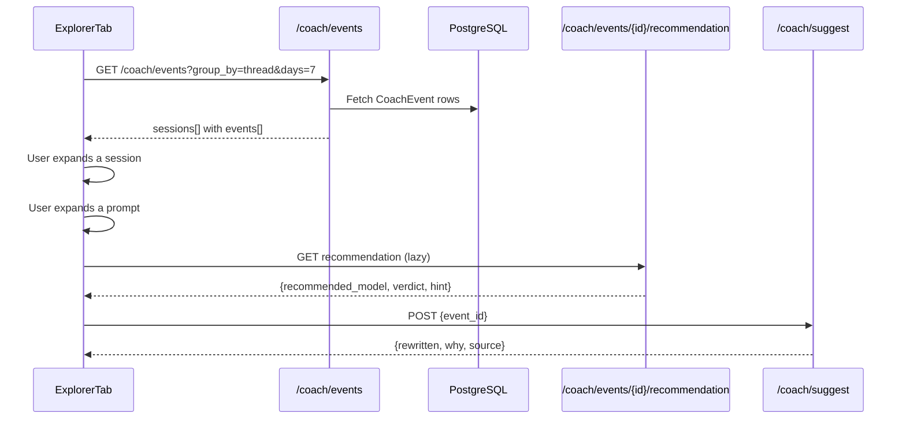
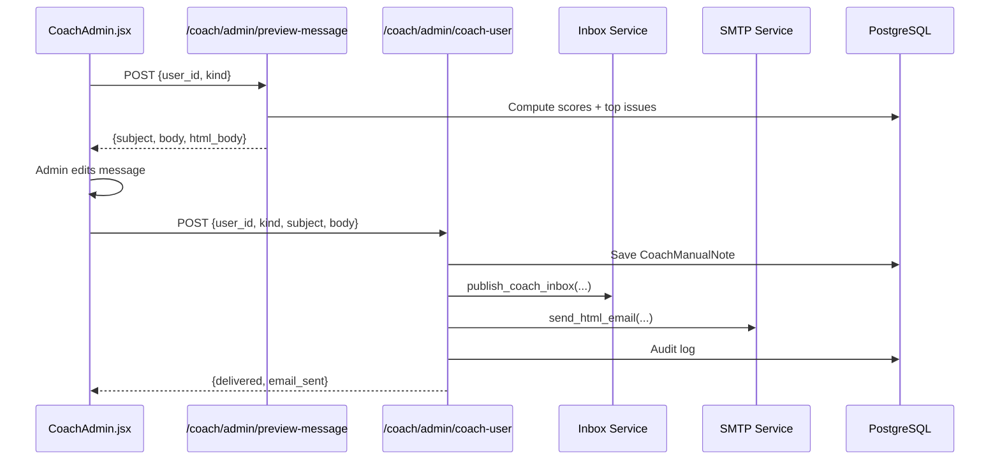
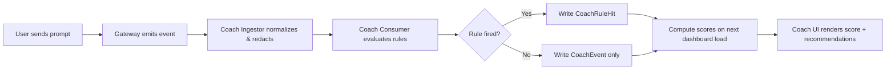
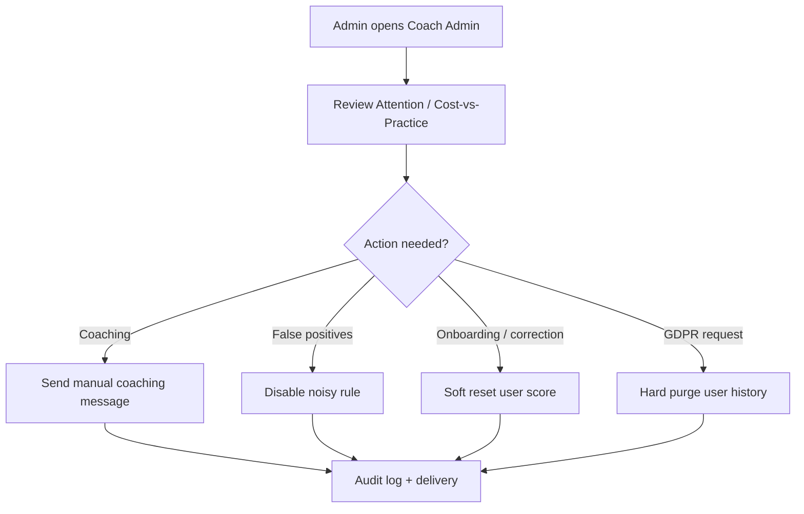

# Coach Module

## Brief Introduction

The **Coach** module is a personal and organizational AI-practice coaching dashboard in the `ai-ui` frontend. It consumes the `/coach/*` REST API to surface how users interact with the platform, flags anti-patterns in prompts and sessions, and gives both end-users and administrators actionable recommendations to improve AI usage. The module is privacy-first: users only see their own prompts, and all scoring is derived from encrypted, redacted event data stored by the backend.

The main entry point is `ai-ui/src/components/Coach.jsx`, which renders a tabbed dashboard. An admin-only companion, `CoachAdmin.jsx`, is embedded inside the **Admin** tab and provides org-wide oversight, rule management, manual coaching, and data governance controls.

---

## Core Functionality

### 1. End-User Dashboard (`Coach.jsx`)

`Coach.jsx` is the single-page Coach UI. It supports four tabs:

| Tab | Purpose | Key Backend Endpoint |
|-----|---------|----------------------|
| **Overview** | Practice score, category scores, channel activity, top anti-patterns | `GET /coach/dashboard` |
| **Models** | Per-model and per-channel usage breakdowns | `GET /coach/usage` |
| **Query Explorer** | Session → prompt → coaching detail drill-down | `GET /coach/events?group_by=thread` |
| **Admin** | Admin-only coaching operations (renders `CoachAdmin`) | Various `/coach/admin/*` |

The component is time-window driven. A pill switcher lets users choose **7, 30, or 90 days**, and every tab re-fetches its data when the window changes.

### 2. Admin Console (`CoachAdmin.jsx`)

`CoachAdmin.jsx` is a composite admin panel made of focused cards:

| Card | Purpose | Key Backend Endpoint |
|------|---------|----------------------|
| **Coach Impact** | Org-wide coaching KPIs | `GET /coach/admin/impact` |
| **Users Needing Attention** | Top rule violators | `GET /coach/admin/attention` |
| **Reset User Score** | Soft/hard reset of a user's score | `POST /coach/admin/reset` |
| **Delete User's Coach History** | GDPR/right-to-erasure purge | `DELETE /coach/admin/purge` |
| **Silence a Coaching Rule** | Disable rules org-wide or per-dept | `GET/POST /coach/admin/rules/*` |
| **Send a Coaching Message** | Generate and send manual coaching | `POST /coach/admin/preview-message`, `POST /coach/admin/coach-user` |
| **Cost vs Practice** | Scatter plot of spend vs. practice score | `GET /coach/admin/cost-vs-practice` |
| **Admin Action History** | Audit log of admin mutations | `GET /coach/admin/audit` |
| **Rule Playground** | Stateless rule evaluator | `POST /coach/rules/test` |
| **Weekly Digest Email** | Manage weekly digest opt-outs | `GET/POST/DELETE /coach/admin/weekly-mail/*` |
| **Department Breakdown** | Org/department rollups | `GET /coach/admin/departments`, `GET /coach/org/rollup` |

---

## Architecture

### High-Level Placement



### Component Hierarchy



---

## Data Flow

### 1. Event Ingestion → Scoring → Dashboard



### 2. Query Explorer Drill-Down



### 3. Admin Coaching Message Flow



---

## Component Reference

### `Coach.jsx` Components

| Component | Responsibility |
|-----------|--------------|
| `Coach` | Top-level shell: header, time-window switcher, tab bar, tab routing. |
| `OverviewTab` | Renders practice score ring, KPIs, category mini-tiles, channel activity, and top anti-patterns. |
| `ModelsTab` | Renders donut charts and a per-model detail table for model/channel usage share. |
| `ExplorerTab` | Lists sessions, expands to prompts, expands to coaching panels. Supports channel filtering. |
| `SessionRow` | One collapsible session row with channel pill, flags, rule-hit badges, and cost/token meta. |
| `EventCoachingPanel` | Expanded prompt view: original prompt, recommendation, fired rules, and LLM rewrite suggestion. |
| `RecommendBlock` / `RecommendCell` | Display model recommendation verdicts (`match`, `over_spent`, `under_spent`, `different_tier`, `good_local`). |
| `ScoreRing` | SVG circular gauge for the overall practice score. |
| `DonutWithLegend` | SVG donut chart with color legend and proportional bars. |
| `CategoryMini` | Compact per-category score tile with penalty derivation. |
| `ScoreFormulaPanel` | Inline explainer for the backend scoring formula. |
| `FlagBadge` | PII / Secret / Compliance flag badge. |
| `Card`, `Stat`, `Skeleton`, `EmptyText`, `ErrorBox` | Shared presentational primitives. |

### `CoachAdmin.jsx` Components

| Component | Responsibility |
|-----------|--------------|
| `CoachAdmin` | Layout container for all admin cards; manages shared `prefillUser` state. |
| `ImpactCard` | Org-wide coaching impact KPIs. |
| `AttentionCard` | Table of users with the most violations; clicking pre-fills action cards. |
| `ResetCard` | Soft or hard reset of a user's score/hits. |
| `PurgeCard` | GDPR-style deletion of a user's coach history with in-card confirmation. |
| `RulesCard` | Disable/enable coaching rules org-wide or per department. |
| `ManualCoachCard` | Generate, preview, edit, and send coaching messages. |
| `CostVsPracticeCard` | SVG scatter plot of cost vs. practice score with quadrant coloring. |
| `AuditCard` | Scrollable admin action audit log. |
| `PlaygroundCard` | Stateless JSON REPL for testing baseline rules. |
| `WeeklyMailCard` | Weekly digest feature status and opt-out management. |
| `DeptBreakdownSection` | Department filter + org/department rollup bar charts. |

---

## Scoring Model

The backend computes practice scores using an exponential decay of cumulative penalties:

```
score = 100 × exp(−Σ penalty / 60)
penalty = min(cap, cap × events / max(events, 10))
```

- **Per-hit caps** by severity: `low=4`, `medium=8`, `high=15`, `critical=25`.
- The divisor floor of `10` dampens single hits on small samples.
- Scores are gated until the user has at least `MIN_EVENTS_FOR_SCORE` events.
- `CategoryMini` inverts the formula to display raw penalty points.

For the authoritative implementation, see [coach_evaluator.md](coach_evaluator.md).

---

## Rule Catalog

Rules live in `agents/coach_evaluator.py`. Each rule has an ID, code, category, severity, title, advice, and predicate. Examples:

| Rule | Category | Severity | Trigger |
|------|----------|----------|---------|
| `prompt.vague` | `prompt-quality` | medium | Very short or generic prompt. |
| `security.pii_in_prompt` | `security` | critical | PII flags present on the event. |
| `security.secret_in_prompt` | `security` | critical | Secret flags present. |
| `prompt.multi_intent` | `prompt-quality` | medium | Multiple `and also` connectors or `?`. |
| `prompt.missing_constraints` | `prompt-quality` | medium | Build task without language/framework/constraint hints. |
| `session.thread_too_long` | `session-hygiene` | medium | Thread has ≥40 messages. |
| `tool.premium_for_trivial` | `tool-mastery` | high | Premium model used for a simple prompt. |
| `review.unreviewed_apply` | `review-discipline` | high | Output accepted with <1.5s review dwell. |

The full catalog and evaluation engine are documented in [coach_evaluator.md](coach_evaluator.md).

---

## Dependencies

### Frontend Dependencies

- `react` — component model and hooks (`useState`, `useEffect`, `useMemo`).
- `lucide-react` — iconography.
- `../config` — `API_BASE` and authenticated `authFetch` helper.
- `../hooks/useToggleSet` — expansion state for sessions and events.
- `../utils/time` — IST timezone formatting helpers.
- `CoachAdmin.jsx` — embedded admin console.

### Backend Dependencies

- `routers/coach_router.py` — public Coach REST endpoints.
- `routers/coach_admin_router.py` — admin-only endpoints.
- `agents/coach_evaluator.py` — rule definitions and score computation.
- `services/coach_ingestor/ingestor.py` — event normalization and persistence.
- `workers/coach_consumer.py` — Kafka consumer that runs evaluation.
- `db/models.py` — `CoachEvent`, `CoachRuleHit`, `CoachScoreSnapshot`, `CoachRuleDisabled`, `CoachManualNote`, `CoachWeeklyMailOptOut`, `CoachAdminAudit`.

For related modules, see:

- [coach_evaluator.md](coach_evaluator.md) — rule engine and scoring.
- [coach_router.md](coach_router.md) — public Coach API.
- [coach_admin_router.md](coach_admin_router.md) — admin Coach API.
- [coach_ingestor.md](coach_ingestor.md) — event ingestion pipeline.
- [coach_consumer.md](coach_consumer.md) — background evaluation worker.

---

## Privacy & Security Notes

- Prompts displayed in the Query Explorer are decrypted from `prompt_redacted` and truncated to 500 characters to avoid huge payloads.
- Users can only access their own events; all endpoints filter by `current_user`.
- Admin endpoints require `require_admin_flag`.
- Hard reset and purge are audited in `CoachAdminAudit`.
- Rule disabling can be scoped org-wide or per-department.

---

## Process Flows

### How a Prompt Becomes a Coaching Insight



### Admin Intervention Flow



---

## Configuration & Environment

The weekly digest and feature toggles are controlled by backend environment variables (e.g., `COACH_WEEKLY_MAIL_ENABLED`, `COACH_WEEKLY_MAIL_WEEKDAY`, `COACH_WEEKLY_MAIL_HOUR_IST`). The frontend reads these through the `/coach/admin/weekly-mail/status` endpoint.

---

## Future Work

- **Org Rollups tab**: The `OrgRollupTab` component was deferred; department breakdown currently lives inside the Admin tab via `DeptBreakdownSection`.
- **Client-source granularity**: `ide-vscode` / `ide-jetbrains` labels are reserved for when a dedicated `client_source` column is added to `CoachEvent`.
