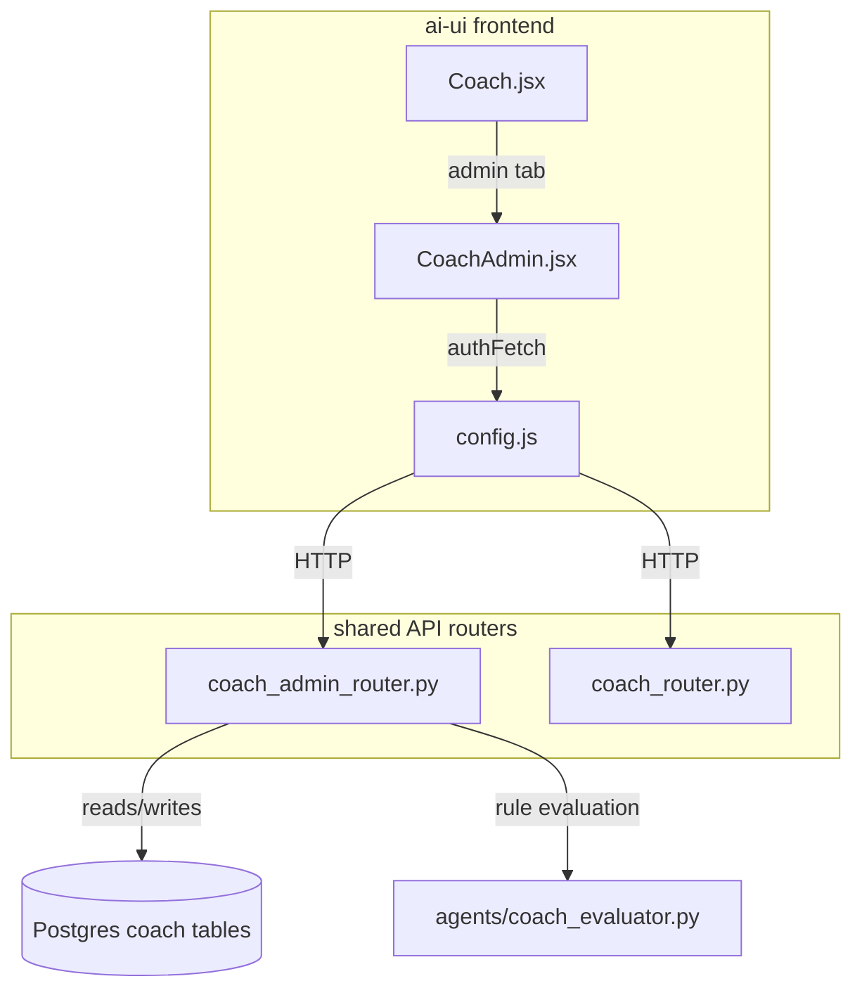
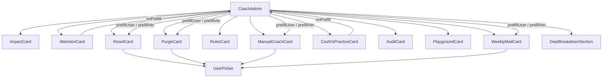
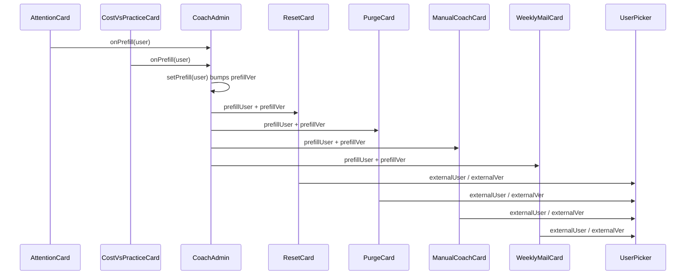
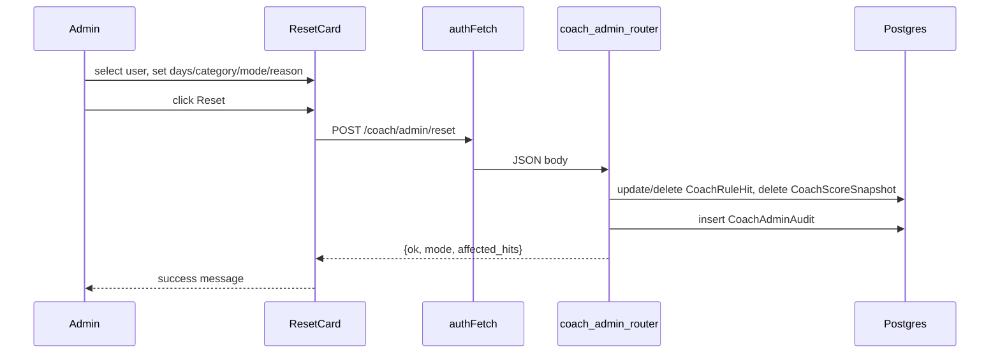

# Coach Admin Module

## Brief Introduction

The **Coach Admin** module provides an admin-only interface for managing the AiNxt coaching system. It is a React component (`CoachAdmin.jsx`) embedded as a tab inside the main [Coach](coach.md) view and backed by the `coach_admin_router.py` API. Administrators use this panel to monitor coaching impact, identify users who need attention, reset scores, purge user data, silence or re-enable coaching rules, send manual coaching messages, manage weekly digest opt-outs, and review an audit trail of all admin actions.

This document describes the frontend module. For the backend API implementation, see [coach_admin_router](coach_admin_router.md). For the end-user coaching experience, see [Coach](coach.md).

---

## Architecture

### High-level placement

### Component hierarchy

---

## Core Components

### `CoachAdmin` (root)

- **Purpose**: Renders the admin panel only when `user.role === "admin"`.
- **State**:
  - `prefillUser` / `prefillVer`: shared user selection propagated to action cards so clicking a user in attention/scatter charts pre-fills user pickers elsewhere.
- **Layout**: responsive two-column grid of cards.

### `UserPicker`

- **Purpose**: debounced autocomplete for selecting a user by name or email.
- **Props**:
  - `externalUser` / `externalVer`: allow parent to push or clear a selection.
  - `onChange`: callback with selected user object or `null`.
- **Behavior**: searches `/auth/users?search=...`, shows avatar + email + department, supports full clear.

### `ImpactCard`

- **Endpoint**: `GET /coach/admin/impact?days={days}`
- **Displays**: events, rule hits, PII leaks blocked, vague prompts coached, total spend, hits by category.

### `AttentionCard`

- **Endpoint**: `GET /coach/admin/attention?days={days}&limit=10`
- **Displays**: table of users with the most rule violations, critical hits, PII events, and top rule.
- **Interaction**: clicking a row calls `onPrefill` to populate action cards.

### `ResetCard`

- **Endpoint**: `POST /coach/admin/reset`
- **Actions**: soft reset (mute hits) or hard reset (delete hits) for a user within a window, optionally filtered by category.

### `PurgeCard`

- **Endpoint**: `DELETE /coach/admin/purge`
- **Actions**: permanently delete a user's coach history older than N days with in-card confirmation.

### `RulesCard`

- **Endpoints**:
  - `GET /coach/admin/rules/disabled`
  - `POST /coach/admin/rules/disable`
  - `POST /coach/admin/rules/enable`
- **Actions**: list disabled rules, disable a rule org-wide or per department, re-enable rules.

### `ManualCoachCard`

- **Endpoints**:
  - `POST /coach/admin/preview-message`
  - `POST /coach/admin/coach-user`
- **Actions**: generate a coaching message from real user data, edit subject/body, preview HTML email, send inbox notification and email.

### `CostVsPracticeCard`

- **Endpoint**: `GET /coach/admin/cost-vs-practice?days={days}&limit=200`
- **Displays**: SVG scatter plot of users by practice score (x) vs cost (y), color-coded by quadrant.
- **Interaction**: clicking a dot pre-fills action cards.

### `AuditCard`

- **Endpoint**: `GET /coach/admin/audit?days={days}&limit=50`
- **Displays**: chronological list of admin actions (resets, purges, rule toggles, manual coaching).

### `PlaygroundCard`

- **Endpoint**: `POST /coach/rules/test`
- **Purpose**: stateless REPL for baseline coaching rules using a synthetic JSON event.

### `WeeklyMailCard`

- **Endpoints**:
  - `GET /coach/admin/weekly-mail/status`
  - `GET /coach/admin/weekly-mail/opt-outs`
  - `POST /coach/admin/weekly-mail/opt-out`
  - `DELETE /coach/admin/weekly-mail/opt-out/{user_id}`
- **Actions**: view feature status, opt users out/in of the weekly digest email.

### `DeptBreakdownSection`

- **Endpoints**:
  - `GET /coach/admin/departments?days=90`
  - `GET /coach/org/rollup?days={days}&department={dept}`
- **Displays**: searchable department filter, events by department, rule violations by category, violations by severity.

---

## Data Flow

### Shared prefill flow

### Admin action flow (example: reset score)

---

## Dependencies

### Frontend dependencies

| Dependency | Module | Purpose |
|------------|--------|---------|
| `authFetch` | [config](../core/config.md) | Authenticated HTTP requests |
| `Coach.jsx` | [coach](coach.md) | Parent component hosting the admin tab |
| Lucide icons | external | UI icons |

### Backend dependencies

| Dependency | Module | Purpose |
|------------|--------|---------|
| `coach_admin_router.py` | [coach_admin_router](coach_admin_router.md) | Admin REST API |
| `coach_router.py` | [coach_router](coach_router.md) | Rule testing endpoint |
| `agents/coach_evaluator.py` | coach_evaluator | Rule definitions, scoring, message generation |
| `db/models.py` | db_models | `CoachEvent`, `CoachRuleHit`, `CoachScoreSnapshot`, `CoachManualNote`, `CoachAdminAudit`, `CoachRuleDisabled`, `CoachWeeklyMailOptOut` |
| `auth/rbac.py` | rbac | `require_admin_flag` |

---

## Key Design Decisions

1. **Admin-only access**: The root component checks `user.role` and renders a shield message for non-admins. The backend router additionally requires `require_admin_flag`.
2. **Shared prefill state**: `prefillVer` increments on every change (including clear) so `UserPicker` effects reliably fire even when the same user is cleared and reselected.
3. **Soft vs hard reset**: Soft reset mutes hits but preserves the audit trail; hard reset permanently deletes them.
4. **In-card confirmation**: `PurgeCard` uses an inline confirmation panel instead of `window.alert` to avoid exposing server details.
5. **Live message preview**: `ManualCoachCard` fetches a generated draft from the backend and lets admins edit before sending.
6. **Stateless rule playground**: `PlaygroundCard` sends synthetic events to `/coach/rules/test` without writing to the database.

---

## Related Documentation

- [Coach](coach.md) — end-user coaching dashboard
- [coach_admin_router](coach_admin_router.md) — backend admin API
- [coach_router](coach_router.md) — rule testing API
- coach_evaluator — rule engine and scoring
- [config](../core/config.md) — `authFetch` configuration
- rbac — admin authorization
