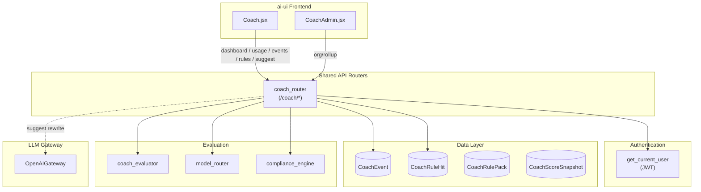
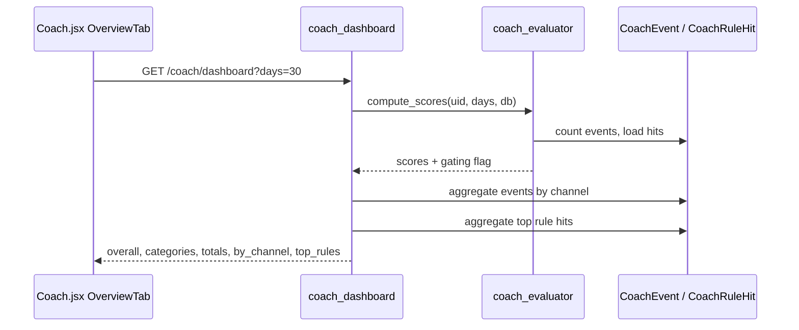
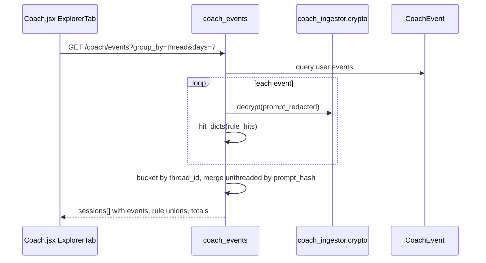
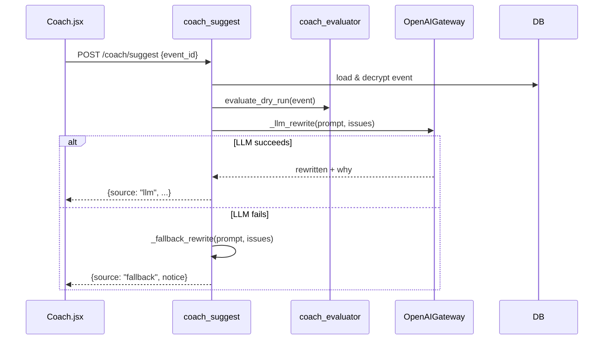

# coach_router

The **coach_router** module exposes the user-facing HTTP API for **AiNxt Coach**, a personal practice-coaching feature that analyzes how users interact with the platform and surfaces actionable recommendations. The router is mounted under `/coach` and is entirely gated by the `ENABLE_COACH` feature flag.

## Brief Introduction

AiNxt Coach helps users improve their AI prompting and platform usage by:

- Scoring recent practice across categories such as prompt quality, session hygiene, tool mastery, context management, and security.
- Surfacing per-interaction rule hits (anti-patterns) with severity, category, and remediation advice.
- Recommending cheaper or more appropriate models for individual prompts via the platform auto-router.
- Offering LLM-powered or deterministic prompt rewrites through the `/suggest` endpoint.
- Providing department-scoped organizational rollups for administrators.

The router is intentionally **read-mostly**. The only non-read operations are a dry-run rule tester (`POST /coach/rules/test`) that persists nothing, and an on-demand prompt rewrite (`POST /coach/suggest`) that may call the LLM gateway.

## Architecture

## Component Responsibilities

### Route Handlers

| Endpoint | Handler | Purpose |
|----------|---------|---------|
| `GET /coach/dashboard` | `coach_dashboard` | Overall practice score, per-category scores, event/hit totals, top rules, and activity by channel. |
| `GET /coach/usage` | `coach_usage` | Token/cost totals and breakdowns by model and channel. |
| `GET /coach/rules` | `coach_rules` | Catalog of coaching rules with metadata, remediation, and example prompts. |
| `GET /coach/events` | `coach_events` | Flat or session-grouped list of recent practice events with rule hits. |
| `GET /coach/events/by-request/{request_id}/hits` | `coach_event_hits_by_request` | Lookup rule hits for a specific upstream request ID. |
| `GET /coach/events/{event_id}/recommendation` | `coach_event_recommendation` | Lazy per-prompt model recommendation. |
| `POST /coach/rules/test` | `coach_rules_test` | Dry-run rule evaluation (no persistence). |
| `POST /coach/suggest` | `coach_suggest` | LLM or fallback prompt rewrite for a single event. |
| `GET /coach/org/rollup` | `coach_org_rollup` | Department-scoped aggregate breakdown. |

### Input Models

- **`RuleTestIn`** — Supports both the Playground card shape (`event: {...}`) and the inline tester shape (flat fields). Optional `rules` restricts evaluation to a subset; `ctx` supplies cross-event aggregates.
- **`SuggestIn`** — Accepts either an `event_id` to fetch the stored prompt or an inline `prompt`/`model` pair.

### Helpers

- **`_recommendation_for`** — Uses the platform `model_router` to choose a model tier for a prompt and compares it against the model actually used, producing verdicts such as `match`, `over_spent`, `under_spent`, or `good_local`.
- **`_hit_dicts`** — Normalizes the `rule_hits` JSONB column into a consistent list of hit objects, tolerating both legacy `dict` shapes and current `str` rule-id lists.
- **`_client_source`** / **`_session_title`** — Group events into sessions and label them for the Query Explorer UI.

## Data Flow

### Dashboard Flow

### Event Explorer Flow

### Suggest Flow

## Security & Privacy

- **Feature gating**: every route calls `_require_enabled()` and returns `404` if `ENABLE_COACH` is false.
- **User scoping**: all reads are filtered by `user_id` extracted from the JWT. Department rollup is scoped to the caller's department unless the caller is an admin.
- **No raw prompts stored**: `CoachEvent` persists only `prompt_hash` and encrypted `prompt_redacted`. The router decrypts and truncates long prompts before returning them.
- **Redaction**: the dry-run tester runs prompts through `compliance_engine.redact_text` before evaluation.

## Dependencies

The coach_router relies on the following modules. Refer to their dedicated documentation for deeper details:

- auth_dependencies — `get_current_user` JWT extraction.
- [core_config](../core/core_config.md) — `ENABLE_COACH` feature flag.
- db_database and db_models — `SessionLocal`, `CoachEvent`, `CoachRuleHit`, `CoachRulePack`, `CoachScoreSnapshot`.
- coach_evaluator — rule definitions, `compute_scores`, `evaluate_dry_run`, `rule_catalog`.
- coach_ingestor — `crypto.decrypt` for redacted prompts.
- model_router — per-prompt model recommendation.
- model_registry — `MODEL_COST_PER_1M` and `OPENAI_SIMPLE_MODEL`.
- compliance_engine — prompt redaction for the dry-run tester.
- gateway_openai — `OpenAIGateway.generate` for LLM rewrites.
- ai_ui_frontend_coach — `Coach.jsx` and `CoachAdmin.jsx` front-end consumers.

## Configuration

| Setting | Source | Description |
|---------|--------|-------------|
| `ENABLE_COACH` | `core.config` | Master feature flag; disables all `/coach` routes when false. |
| `COACH_MIN_EVENTS_FOR_SCORE` | `agents.coach_evaluator` | Minimum events before practice scores are shown. |

## Notes for Maintainers

- The per-prompt recommendation is computed **lazily** (`GET /coach/events/{event_id}/recommendation`) rather than on the list endpoint to avoid up to 200 sequential LLM classifier calls per page load.
- Unthreaded events (e.g., budget-blocked IDE calls) are merged by `prompt_hash` within a 5-minute window so the same prompt does not appear twice in the Query Explorer.
- The `_client_source` mapping intentionally returns a generic `ide` token for all `mcp` channel events because the specific IDE client is not stored on `CoachEvent`.
- The rule catalog examples in `_RULE_EXAMPLE` are maintained in the router so the UX copy can be tuned without changing the evaluator.
