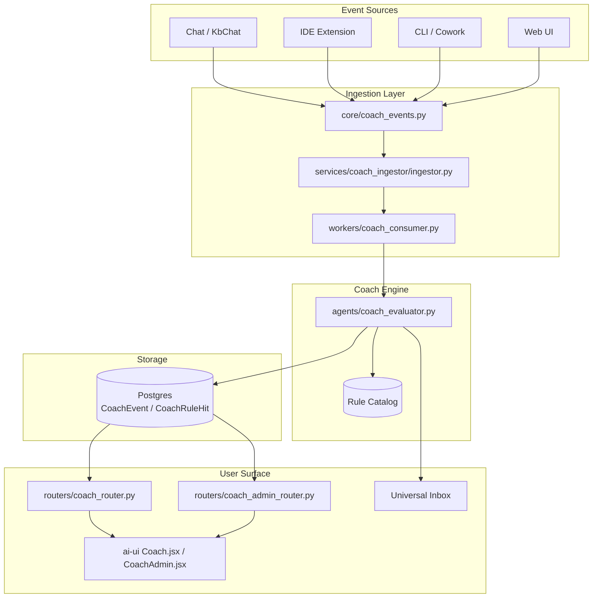
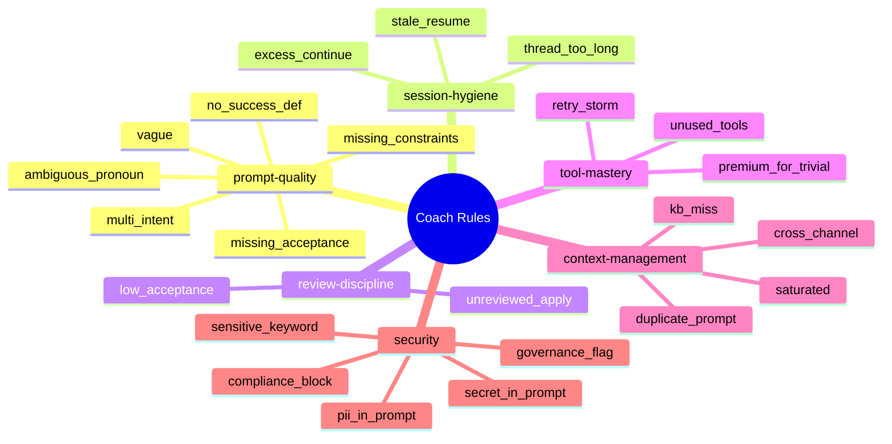
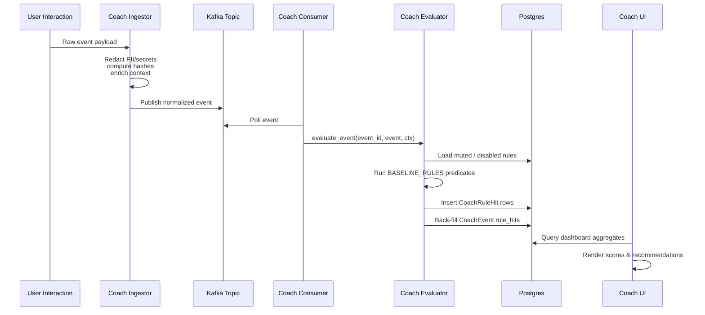
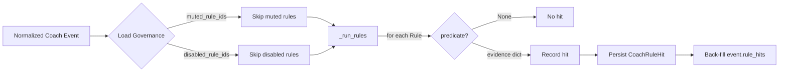
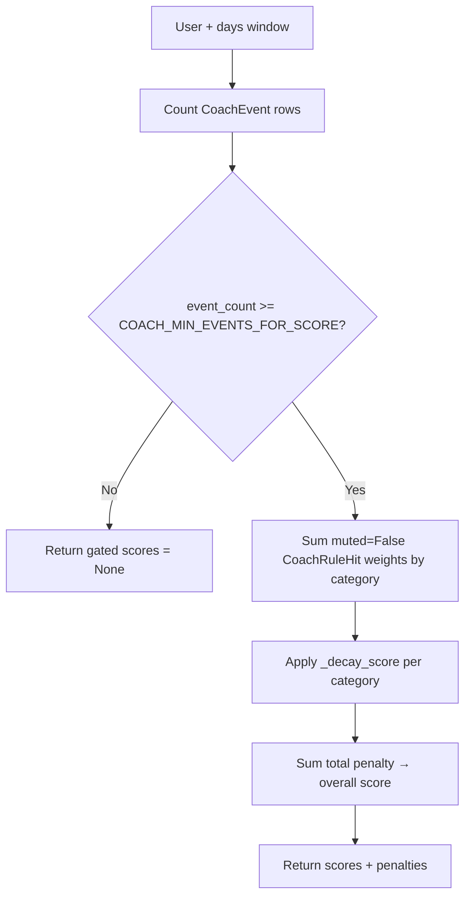
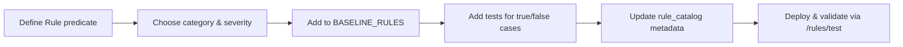

# Coach System

The **Coach System** provides continuous, automated coaching to AiNxt users by analyzing their platform interactions (prompts, sessions, tool usage, and security events) against a baseline rule catalog. It surfaces actionable, explainable feedback through the Coach dashboard and inbox nudges, and computes per-user practice scores that decay over time.

This module is the rule-evaluation and scoring engine at the heart of the Coach feature. It is intentionally deterministic: every rule is a plain Python predicate, with no `eval` or LLM calls inside the evaluator. This makes coaching results auditable, reproducible, and safe to run on redacted data.

---

## Core Responsibilities

1. **Rule Evaluation** — Run every enabled baseline rule against a normalized coach event and produce evidence-backed hits.
2. **Persistence** — Write `CoachRuleHit` rows and back-fill `CoachEvent.rule_hits`.
3. **Scoring** — Compute overall and per-category practice scores using exponential decay of severity-weighted penalties.
4. **Explainability** — Store the exact field values that triggered each rule for drill-down in the UI.
5. **Governance** — Respect user-level mutes and org/department-level disabled rules.
6. **Inbox Integration** — Publish coaching nudges and digests to the user's universal inbox.

---

## Architecture



### Component Breakdown

| Component | File | Role |
|-----------|------|------|
| Coach Evaluator | `agents/coach_evaluator.py` | Rule predicates, evaluation, scoring, and inbox helpers. |
| Coach Events | `core/coach_events.py` | Direct ingest entry point and bounded executor. |
| Coach Ingestor | `services/coach_ingestor/ingestor.py` | Normalizes raw payloads, redacts PII, enriches context. |
| Coach Consumer | `workers/coach_consumer.py` | Kafka consumer that drains events and triggers evaluation. |
| Coach Router | `routers/coach_router.py` | User-facing dashboard, rules catalog, and event recommendations. |
| Coach Admin Router | `routers/coach_admin_router.py` | Admin controls: disable rules, send nudges, view org rollups. |
| Coach UI | `ai-ui/src/components/Coach.jsx` | User dashboard with scores, top rules, and recommendations. |
| Coach Admin UI | `ai-ui/src/components/CoachAdmin.jsx` | Admin dashboard for rule packs, opt-outs, and impact. |

---

## Rule Catalog

Rules are organized into six categories. Each rule has a stable `rule_id`, human-readable `code`, `severity`, `title`, `advice`, and a pure Python `predicate`.



### Severity Weights

| Severity | Weight |
|----------|--------|
| low | 1.0 |
| medium | 1.5 |
| high | 2.5 |
| critical | 4.0 |

Rules never execute arbitrary code or LLM inference. They inspect pre-redacted fields such as `prompt_redacted`, `pii_flags`, `secret_flags`, `context_window_pct`, and pre-computed context aggregates.

---

## Data Flow



---

## Rule Evaluation Flow



### Key Evaluation Functions

- `evaluate_event(event_id, event, ctx)` — Persists hits for a single event. Called by the consumer.
- `evaluate_dry_run(event, ctx, rules)` — Non-persistent evaluation for inline hints and the `/rules/test` endpoint.
- `_run_rules(event, ctx, skip)` — Core loop that runs every non-skipped rule and collects evidence.

---

## Scoring Model

Practice scores are computed from accumulated rule-hit penalties using exponential decay.

```
penalty(category) = Σ severity_weight(hit)  over non-muted hits in window
score(category)   = 100 * exp(-penalty / COACH_SCORE_DECAY_K)
```



| Config | Default | Purpose |
|--------|---------|---------|
| `COACH_MIN_EVENTS_FOR_SCORE` | 5 | Minimum events before scores are shown (avoids noisy early scores). |
| `COACH_SCORE_DECAY_K` | 60.0 | Decay constant; larger values make scores drop more slowly. |

Scores are clamped to `[0, 100]`. A score of `None` means "insufficient data" and is rendered as n/a in the UI.

---

## Integration with the Wider System

### Upstream: Event Production

Coach events originate from many surfaces across the platform. The ingestor normalizes these into a common schema before evaluation. See:

- ai_ui_frontend.md — Chat, KbChat, IDE, and Cowork surfaces that emit events.
- [shared_core.md](../core/shared_core.md) — `core/coach_events.py` and the coach ingestor for normalization and redaction.

### Downstream: Storage & UI

Evaluated hits and scores are consumed by:

- [shared_api_routers.md](../core/shared_api_routers.md) — `coach_router.py` and `coach_admin_router.py` expose dashboard, rules, and admin APIs.
- ai_ui_frontend.md — `Coach.jsx` and `CoachAdmin.jsx` render scores, recommendations, and admin controls.
- [shared_core.md](../core/shared_core.md) — `store/inbox_store.py` receives nudges published by `publish_coach_inbox`.

### Async Processing

The Kafka-based consumer decouples event ingestion from evaluation:

- [workers.md](../workers/workers.md) — `workers/coach_consumer.py` polls the coach topic and calls the evaluator.
- [workers.md](../workers/workers.md) — `workers/broadcast_worker.py` can deliver weekly coaching digests.

---

## Security & Privacy Design

- **No raw PII in predicates**: Rules inspect `prompt_redacted` and flag arrays only. Redaction happens upstream in the ingestor.
- **No `eval` / `exec`**: The rule DSL is a registry of Python callables, not user-supplied strings.
- **RBAC at the router layer**: Department-scoped reads and admin mutations are enforced by the coach routers, not the evaluator.
- **Mute & disable controls**: Users can mute rules; admins can disable rules org-wide or per department. Critical security rules should be marked mandatory in `CoachRulePack`.

---

## Configuration

The evaluator reads the following environment variables when `core.config` imports fail (fallback for standalone tests):

| Variable | Default | Description |
|----------|---------|-------------|
| `COACH_MIN_EVENTS_FOR_SCORE` | `5` | Minimum event threshold for score computation. |
| `COACH_SCORE_DECAY_K` | `60.0` | Exponential decay constant for scoring. |
| `PLATFORM_BASE_URL` | `http://localhost:9001` | Base URL for Coach portal deep links. |

---

## Key Data Models

Defined in [shared_core.md](../core/shared_core.md) (`db/models.py`):

- `CoachEvent` — Normalized user interaction.
- `CoachRuleHit` — One row per fired rule per event.
- `CoachRuleMute` — User-level rule mutes.
- `CoachRuleDisabled` — Org/department disabled rules.
- `CoachRulePack` — Versioned, publishable rule bundles.
- `CoachScoreSnapshot` — Periodic score snapshots.

---

## Process: Adding a New Coaching Rule



Rules are added by decorating a predicate with `@_rule(...)`, assigning a unique `rule_id` and `code`, and appending the resulting `Rule` object to `BASELINE_RULES`. The predicate must return `None` when the rule does not fire, or an evidence `dict` when it does.

---

## References

- ai_ui_frontend.md — Coach user and admin interfaces.
- [shared_api_routers.md](../core/shared_api_routers.md) — Coach REST API endpoints.
- [shared_core.md](../core/shared_core.md) — Coach event ingestion, data models, and inbox store.
- [workers.md](../workers/workers.md) — Coach consumer and broadcast workers.
